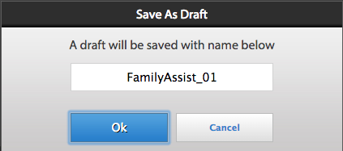

# 使用待办事项列表{#working-with-to-do-lists}

在查看待办事项列表时，您可能会看到业务流程中分配给您、您所属的任何组或其他用户的共享任务的任务。 您可以根据需要打开、处理和完成任务，例如批准或拒绝请求或添加更多信息。 完成任务后，任务会发送给业务流程中的下一个人，

## 关于待办事项列表 {#about-todo-lists}

AEM Forms工作区具有以下三种类型的待办事项列表：

* 单个列表，其中包含直接分配给您的任务。
* 组列表，其中包含分配给组的任务。 组的任何成员都可以打开并完成任务。 要打开任务，组成员必须首先声明该任务。
* 共享列表，其中包含分配给某个用户的任务，该用户已与您或可能的其他用户共享了他们的待办事项列表。 共享列表的任何用户都可以声明、打开并完成共享任务。

通过单击将指针悬停在任务上时显示的图标，可以在不打开任务的情况下执行某些操作。

>[!NOTE]
>
>感叹号图标表示任务具有高优先级。

## 典型任务 {#typical-tasks}

打开和处理任务时，可用的工具取决于该任务。 不同的任务要求您执行不同的操作，因此，某些工具可能可供您使用，也可能不可用。 下面介绍了您可能收到的典型任务。

* **提供信息**：您收到一项要求您完成并提交表单的任务。

* **查看信息**：您收到一项任务，要求您查看信息并签署内容。

* **多用户审核**：您会在其他用户收到任务的同时收到该任务。 您和其他用户必须提供信息或查看内容，或者同时提供两者。 以下工具可能适用于此类型的任务：

   * 查看任务的说明
   * 查看已分配任务的所有用户的完成状态
   * 查看所有分配了任务的用户的注释
   * 自行向任务添加注释

上述任何任务中可用的其他工具包括：

* 转发
* 共享
* 咨询
* 返回
* 注释
* 附件

## 打开任务 {#opening-tasks}

您可以打开和锁定待办事项列表或声明中的任务，也可以打开组或共享待办事项列表中的任务。 打开任务时，该任务将显示在主窗格中。 其他任务显示在“待办事项”列表旁边的任务列表中。

如果存在“任务摘要URL”，则默认情况下会打开“任务摘要”视图，而不是与任务关联的表单。 即使用户在分配任务中启用“在最大化模式下打开表单”选项，表单也不会在最大化模式下打开。

>[!NOTE]
>
>打开任务时，根据任务默认值，关联的表单可能会以完整视图显示。

### 从列表中打开并锁定任务 {#open-and-lock-a-task-from-your-list}

当您从待办事项列表中打开任务时，如果您的列表是共享的，则可以锁定该任务以防止有权访问您的列表的其他用户处理该任务。

1. 在待办事项页面的左侧窗格中，选择您的各个待办事项列表。 所有任务都显示在中间窗格中。

   >[!NOTE]
   >
   >您可以通过在“待办事项”列表中选择进程类型来筛选任务。 您可以选择待办事项列表，以再次查看待办事项列表中的所有任务。

1. 如有必要，请锁定您的任务。 要锁定任务，请单击任务上的“所有选项”图标，然后选择“锁定”。 将指针悬停在任务上以使选项可用。

   >[!NOTE]
   >
   >打开任务时，您还可以锁定或解锁任意选项卡上的任务。

   

   任务的所有选项菜单

1. 单击任务以将其打开。

### 打开任务并从共享或组列表中声明任务 {#open-and-claim-a-task-from-a-shared-or-group-list}

当您打开并从组或共享列表中声明任务时，该任务会从组或共享列表中移入您的个人待办事项列表中。 对列表具有访问权限的其他用户无法处理任务。

1. 在待办事项页面的左侧窗格中，选择一个组或共享的待办事项列表。 所有任务都显示在中间窗格中。
1. 执行以下步骤之一：

   * 要在不打开任务的情况下从组或共享待办事项列表中声明任务，请单击  **声明** 将指针悬停在任务上。 或者，当任务打开时，“声明”按钮在任务窗格下方的操作栏中可用。 申请后，任务将从组或共享的待办事项列表移动到您的列表。
   * 要从组或共享待办事项列表中声明和打开任务，请单击 **声明并打开**.

## 使用任务 {#working-with-tasks}

打开任务后，主窗格中显示的选项卡和可供您使用的工具取决于该任务。 您可能会看到的选项卡如下所述：

* **任务摘要**：打开任务时，任务摘要窗格允许您使用分配任务步骤的流程中指定的URL显示有关任务的信息（如果存在）。 使用“任务摘要”窗格，可以显示任务的其他相关信息，为AEM Forms工作区的最终用户添加更多价值。 如果任务摘要URL不存在，则此选项卡不可用。

* **详细信息**：提供有关当前任务及其所属进程的一些信息。

* **表单**：显示与任务关联的表单。 表单可以包含多种文件类型，包括PDF、HTML、指南和SWF文件。 该表单可以看起来像是一般可打印的表单或基于Web的表单，也可以引导您完成一系列向导样式的面板来收集信息。

* **历史记录**：列出属于流程实例一部分的任务，以及每个任务的关联表单、任务分配和附件。

* **附件**：显示与任务关联的现有附件，并根据需要添加附件。

* **注释**：显示与任务关联的现有注释，并根据需要添加注释。

处理任务时，您可以看到的工具以及可以采取的操作如下所述。

### 转发、共享或查阅任务 {#forward-share-or-consult-on-a-task}

您可以将任务与任何注释或附件一起转发给另一个用户，或者与另一个用户共享任务或查阅任务。 如果更改与任务关联的表单数据，请在转发、共享或查阅任务之前将表单另存为草稿。 否则，将在不更新表单的情况下发送任务。 转发和共享任务后，接收任务的用户可以声明和完成任务或将其返回给您。 如果您查阅任务，则用户只能将任务返回给您。

1. 如果更改与要保留的任务关联的表单，请单击 **保存**. 保存选项在每个选项卡底部的操作栏中可用。 否则，将在不更新表单的情况下发送任务。

   >[!NOTE]
   >
   >根据您正在处理的任务，“保存”按钮不适用于某些表单。

1. 在任意选项卡上，单击以下按钮之一：

   * **转发**
   * **共享**
   * **咨询**

   >[!NOTE]
   >
   >根据任务的不同，您还可以在未打开任务的情况下从待办事项列表中执行这些操作。

1. 在弹出对话框窗口中，搜索并选择要转发、共享或咨询任务的用户的名称。

### 返回任务 {#return-a-task}

1. 在任意选项卡上，单击 **返回**. 任务将返回到先前将任务转发给您的用户的待办事项列表，或者与您共享或咨询该任务。

### 使任务脱机 {#take-a-task-offline}

您可以脱机处理任务，稍后从Adobe®Reader®Adobe®Acrobat®专业版或Adobe® Acrobat® Standard提交表单。 提交表单后，您的电子邮件客户端将使用相应的服务器电子邮件地址启动。 然后，您可以通过电子邮件将填写好的表单发送到服务器。

1. 在任意选项卡上，单击 **离线**.
1. 指定用于保存表单的文件名，然后单击 **保存**. 与任务关联的表单将保存在本地，在提交表单之前，任务将保留在待办事项列表中。

### 使用附件 {#work-with-attachments}

您可以在本地添加、更新、删除或保存任何附件。

**添加附件**

1. 在 **附件** 选项卡，单击 **浏览** 以选择要附加的文件。
1. 选择 **权限** 参与流程的其他用户的附件级别。 如果您选择 **读取**，其他用户可以将文件保存在本地。 如果选择其中一个编辑权限，其他用户也可以上传新文件来替换您的附件。

   >[!NOTE]
   >
   >您还可以在附件旁添加注释。

1. 单击 **上传**. 该文件已附加到表单上。

**查看附件**

1. 在 **附件** 选项卡，单击要查看的附件的文件名。

**本地保存附件**

1. 单击附件以将其打开。 将打开的附件保存在本地。

**更新附件**

1. 单击 **编辑** 用于附件。 通过单击，选择要替换现有附件的文件 **浏览**.

**删除附件**

1. 单击 **删除** 用于附件。

### 保存您的工作而不完成任务 {#save-your-work-without-completing-the-task}

1. 在任意选项卡上，点按 **保存**.

   此时将出现“另存为草稿”对话框。 草稿的默认名称是任务模板中的任务名称。

   

   >[!NOTE]
   >
   >您可以将工作区配置为定期自动将用户输入的信息保存为草稿。 如果启用了自动保存并且用户正在处理草稿，则会定期保存草稿。 在自动保存的情况下，将自动获取任务的默认名称。
   >
   >
   >有关更多信息，请参阅定期保存草稿，位置如下： [管理首选项](/help/forms/using/getting-started-livecycle-html-workspace.md).

1. 在另存为草稿对话框中，为任务指定唯一名称，然后点按 **确定**.

   

   将使用指定的名称保存草稿。 任务仍保留在待办事项列表中，您在表单中所做的任何更改都保存在“草稿”文件夹中。 此外，在“待办事项”列表中，可以使用草稿名称搜索草稿以继续对其进行处理。

   

## 完成任务 {#completing-tasks}

如何完成任务取决于任务本身以及您在流程中的角色。 系统可能会要求您批准或拒绝请求、提供内容、审核和验证信息或表明您采取了行动。

您可以通过多种方式完成任务：

* 使用任何选项卡中可用的操作
* 使用表单本身内置的操作
* 从待办事项列表中，不打开任务

>[!NOTE]
>
>此选项在以下情况下可用 `isMustOpenToComplete` 字段未在 `Assign Task` 步骤（在设计流程时）。

* 通过电子邮件，如果您收到电子邮件通知

完成任务时，根据任务的不同，可能会出现一个确认对话框，以重申您的操作。 例如，您可能会看到一个对话框，提示您证明所提供信息的有效性。

>[!NOTE]
>
>如果您更改了任务但尚未准备好完成，则可以通过单击“保存”将您的工作另存为草稿，稍后再返回到该任务。

### 完成任务 {#complete-a-task}

1. 执行以下步骤之一：

   * 选择任务并单击列表底部流程中所需的下一个步骤的相应按钮。
   * 如果表单没有按钮，并且AEM Forms工作区中的“完成”按钮可用，请单击 **完成**.
   * 如果表单中有按钮，且AEM Forms工作区中的“完成”按钮不可用，请单击表单上的相应按钮，以执行流程中所需的下一个步骤。

   如果表单没有按钮，并且AEM Forms工作区中的“完成”按钮不可用，则会显示一条消息，指示无法提交表单。

1. 如果出现“确认”对话框，请执行下列操作之一：

   * 单击 **确定** 如果您已完成任务并准备好进行签发，请执行以下操作。
   * 单击 **取消** 如果您希望返回任务并且尚未准备好对其进行注销，请执行以下操作。

>[!NOTE]
>
>在表单中使用Process Properties时，您可能会在HTML表单中看到“提交”按钮。 将同一表单渲染为PDF时，此按钮不可见。 要完成任务，请单击AEM Forms工作区底部的“提交”按钮（位于表单外，而不是表单内的“提交”按钮）。

### 批量批准任务 {#bulk-approve-tasks}

您可以从“待办事项”列表中提交多个任务。 只有同一进程、具有相同任务名称和相同路由选项的任务可以一起提交。

>[!NOTE]
>
>在设计流程时，如果未在Workbench的“分配任务”步骤中选中isMustOpenToComplete字段，则此选项可用。

1. 在待办事项页面的左侧窗格中，选择您的各个待办事项列表。 所有任务都显示在中间窗格中。
1. 选择 **启用批量模式**. 复选框显示在列表中的任务前面。

   >[!NOTE]
   >
   >此选项不适用于在设计流程时，在Workbench的“分配任务”步骤中选择了isMustOpenToComplete字段的任务。 待办事项列表中此类任务的复选框始终保持禁用状态。

1. 选择批量审批任务。 可以选择具有相同任务名称和相同路由选项的同一进程的多项任务。 选择一个任务进行审批后，将只启用具有相同流程、相同任务名称和相同路由选项的任务。 其余部分已禁用。

   

1. 单击可用的Submit选项。 将提交选定的任务。

   

## 通过电子邮件参与任务 {#participating-in-tasks-through-email}

您可以通过电子邮件接收并完成任务。 通过电子邮件参与任务，无需定期检查您的待办事项列表以查找新任务或查看“跟踪”页面以查找任务状态。

首先，设置您的AEM Forms工作区首选项以接收电子邮件通知。 AEM Forms工作区可以发送您的待办事项列表或您所属的任何组待办事项列表中任务的电子邮件通知。 管理员可决定电子邮件通知消息的发送时间和接收者。

电子邮件可能包含在AEM Forms工作区中打开任务的链接、用于任务的表单附件，或通过电子邮件完成任务的操作。 如果电子邮件中包含表单，则可以打开该表单并完成任务（如果表单中内置了完成任务的按钮）。 如果完成任务的操作包含在电子邮件中，则可以通过单击电子邮件中的操作或者使用在电子邮件正文中键入的第一行作为操作来回复电子邮件，来完成任务。

>[!NOTE]
>
>* 要配置工作区以使用相应的电子邮件模板，请参阅 [AEM Forms JEE管理员指南](https://help.adobe.com/en_US/AEMForms/6.1/AdminHelp/).
>
>* 如果在AEM Forms工作区中提交任务后转发草稿，则会发送电子邮件通知。 如果从AEM Forms工作区的起始点转发草稿，则不会发送电子邮件通知。

通过电子邮件完成任务时，任务将从AEM Forms工作区中的待办事项列表中删除。

>[!NOTE]
>
>如果用户未登录到浏览器中的AEM Forms工作区，并打开待办事项链接，则直接待办事项链接无法打开并显示异常。 在单击电子邮件中的链接之前，请先登录AEM Forms工作区。

>[!NOTE]
>
>您不能转发电子邮件通知以将任务分配给其他人。 您只能在AEM Forms工作区中将任务转发给其他用户。

### 接收电子邮件通知消息 {#receive-email-notification-messages}

1. 单击 **首选项**.
1. 在 **通过电子邮件通知任务事件** 列表，选择 **是**.
1. 要在电子邮件中包含表单和数据，请在电子邮件的 **在电子邮件中附加Forms** 列表，选择 **是**.

## 通过移动设备参与任务 {#participating-in-tasks-through-mobile-devices}

您可以使用AEM Forms工作区应用程序从移动设备参与任务。 在安装应用程序之前，请与系统管理员联系，确保贵组织支持使用AEM Forms工作区应用程序。

## 关于截止日期和提醒 {#about-deadlines-and-reminders}

A *截止日期* 确定完成任务所必须依据的日期和时间。 当截止日期过去时，服务器会将任务路由到流程中的下一步（可能是另一个用户的待办事项列表），然后任务上会显示截止日期图标。 无论与流程关联的规则如何，都会显示截止日期图标。

A *提醒* 通知您一项需要您注意的任务。 提醒会在预定的时间发生，然后定期发生，直到您完成相关任务为止。 当您收到提醒时，提醒图标会显示在任务上。

业务流程决定了截止日期和提醒的行为和时间。 并非所有进程都有截止日期和提醒。 管理员指定是否发送截止日期和提醒的电子邮件通知。 您可以设置关于是否接收电子邮件通知的首选项。

## 处理组和共享队列中的任务 {#working-with-tasks-from-group-and-shared-queues}

分配给您的所有任务都会显示在待办事项列表（队列）中。

您有权访问的任何组和共享待办事项列表也会出现在待办事项页面的左侧窗格中。 您可以从任何您有权访问的待办事项列表中完成任务。

组待办事项列表可以有多个成员。 管理员根据组织的特定要求设置组待办事项列表。 组待办事项列表提供一种将工作分配给分担类似职责的多个人员的方法。

例如，您的团队的每个成员都会处理贷款申请表。 所有这些任务都会发送到您的组的每个成员都可以访问的组待办事项列表。 您的每个组成员都可以访问该待办事项列表中的任务。

当另一用户与您共享其待办事项列表或明确与您共享任务时，将显示共享的待办事项列表。 然后，您可以查看该用户待办事项列表中的任务，并代表该用户完成这些任务。 例如，如果您正在休假，您可以选择与在休假时完成任务的同事共享您的待办事项列表。

>[!NOTE]
>
>您还可以指定休假设置，以便在您休假时将任务转发给其他用户。

要从组或共享待办事项列表处理任务，请先声明任务。 然后，您成为该任务的所有者，直到您完成该任务或将其转发给其他用户。

### 共享队列 {#sharing-queues}

您可以与另一个用户共享您的待办事项列表，该用户随后可以查看您的待办事项列表中的新任务并根据这些任务执行相应的操作。 如果在共享待办事项列表之前，您的待办事项列表中存在任何任务，则其他用户无法查看这些任务。 在您授予对待办事项列表的访问权限后，用户只能查看和申请进入待办事项列表的任务。

请记住，要使用户查看共享队列中的任务，进程设计者必须在“用户服务”的“任务访问控制列表(ACL)”选项卡上启用“为共享队列添加ACL”选项。

>[!NOTE]
>
>如果您计划不在办公室，您还可以指定不在办公室设置以在您不在办公室时将任务转发给其他用户，而不是共享您的整个待办事项列表。

**共享您的队列**

1. 在 **队列** 在中选项卡 **首选项** 选项卡，单击“当前共享我的队列的用户”的“+”图标。
1. 搜索并选择用户的名称。
1. 单击 **共享** 按钮，以与选定的用户共享队列。
1. 选择用户的名称，然后单击 **共享**.

   >[!NOTE]
   >
   >您可以通过单击从共享待办事项列表中删除用户 **X** 图标（在列出用户的行末尾）。

### 访问其他队列 {#accessing-other-queues}

您可以请求访问另一个用户的待办事项列表，以查看和申请该用户待办事项列表中的任何新任务。

当您请求访问另一个用户的待办事项列表时，该用户会在其待办事项列表中接收任务，以批准或拒绝您的请求。 用户完成任务后，您会在待办事项列表中收到通知。

如果您被授予对其他用户待办事项列表的访问权限，则在授予您访问权限之前，您无法查看该用户待办事项列表中存在的任何任务。 您只能在获得待办事项列表的访问权限后查看进入用户待办事项列表的任务。

**访问其他队列**

1. 在 **首选项** 选项卡，打开 **队列** 选项卡。
1. 单击“+”以查看“我有权访问的用户队列”。 在弹出对话框中搜索用户的名称。
1. 选择用户的名称，然后单击 **请求**.

   >[!NOTE]
   >
   >您可以从我有权访问的用户队列列表中选择用户名，然后单击 **X** 在提及用户名的行末尾。 当访问待办事项列表的请求仍然挂起时，您无法删除对另一个待办事项列表的访问权限。

## 设置外出首选项 {#setting-out-of-office-preferences}

如果您计划不在办公室，则可以指定在该期间分配给您的任务有何变化。

您可以选择指定让休假设置生效的开始日期和时间以及结束日期和时间。 如果您与服务器位于不同的时区，则使用服务器的时区。

您可以设置一个默认的人员，您的所有任务都将发送到该人员。 您还可以为特定流程中的任务指定例外，这些任务将发送给其他用户，或在您返回之前保留在待办事项列表中。 如果指定的人员也在外面，则任务会转到他们指定的用户。 如果任务不能分配给不在办公室中的用户，则任务会保留在待办事项列表中。

>[!NOTE]
>
>当您不在办公室时，先前在待办事项列表中的任何任务将保留在那里，并且不会转发给其他用户。

### 设置外出首选项 {#set-out-of-office-preferences}

1. 单击 **首选项** 并单击 **外出**.
1. 要指定您何时不在办公室，请执行下列步骤之一：

   * 要指定您现在离开办公室无限期，请在 **我当前处于** 列表，选择 **不在办公室** 但不要添加日期范围。
   * 要指定您外出的开始日期和时间，请单击“+” **外出时间表**. 使用日历和时间列表指定开始日期和时间。 如果您未指定结束日期和时间，则从开始日期和时间起，您会无限期地被视为不在办公室，直到您更改首选项为止。

1. 要指定任务的默认处理方式，请从中选择以下选项之一 **外出时：外出任务的默认用户** 列表：

   * 选择 **不分配** 将任务保留在待办事项列表中，直到您返回。
   * 选择 **查找用户** 以搜索要为其分配任务的用户。 选择用户后，您还可以查看其外出计划。

1. 要将例外设置为默认值，请单击+以查看 **处理例外**，选择要为其创建例外的流程，然后选择其他用户或选择 **不分配** 从 **分配给** 列表。

   >[!NOTE]
   >
   >进程设计者可以指定始终将某些进程中的任务保持私有，而不转发给其他用户。 此设置将覆盖您设置的任何设置。

1. 完成设置首选项后，单击 **保存**. 如果您的设置指示您当前不在办公室，则更改会立即生效。 否则，它们将在指定的开始日期和时间生效。 如果您在办公室外时登录，则在更改设置之前，不会将您考虑在办公室内。
