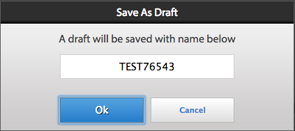

# 使用待办列表{#working-with-to-do-lists}

在视图待办列表时，您可能会看到业务流程中分配给您的任务，或者分配给您所属的任何组，或者您是其他用户的共享任务。 您可以根据需要打开、处理和完成任务，如批准或拒绝请求或添加更多信息。 完成任务后，它将发送给业务流程中的下一个人，

## 关于待办列表{#about-todo-lists}

AEM Forms工作区有以下三种类型的待办列表:

* 单个列表，其中包含直接分配给您的任务。
* 组列表符，其中包含分配给组的任务。 组的任何成员都可以打开并完成任务。 要打开任务，组成员必须首先声明任务。
* 共享列表，其中包含分配给与您（可能还包括其他用户）共享其待办事项列表的用户的任务。 任何共享列表的用户都可以声明、打开和完成共享任务。

单击将指针悬停在任务上时显示的图标，无需打开任务即可执行某些操作。

>[!NOTE]
>
>感叹号图标表示任务具有高优先级。

## 典型任务{#typical-tasks}

在打开和处理任务时，您可用的工具取决于任务。 不同的任务要求您执行不同的操作，因此，某些工具可能对您可用，也可能不可用。 您可能收到的典型任务如下所述。

**提供信息**:您会收到一个任务，要求您填写并提交表单。

**查看信息**:您会收到一个任务，要求您查看信息并注销内容。

**多用户审阅**:您会在其他用户收到任务的同时收到任务。您和其他用户必须提供信息或查看内容，或者同时提供这两个信息。 此类任务可能提供以下工具：

* 查看任务说明
* 查看分配了该任务的所有用户的完成状态
* 查看分配了该任务的所有用户的注释
* 自行为任务添加注释

上述任何任务都可能提供的其他工具包括：

* 转发
* 共享
* 咨询
* 退货
* 注释
* 附件

## 打开任务{#opening-tasks}

您可以打开和锁定来自待办列表的任务，或者声明并打开来自组或共享待办列表的任务。 打开任务时，它显示在主窗格中。 其他任务显示在待办列表旁的任务列表中。

如果任务摘要URL存在，则默认情况下将打开任务摘要视图，而不是与任务关联的表单。 即使用户在分配任务中启用“以最大化模式打开表单”选项，表单也不会以最大化模式打开。

>[!NOTE]
>
>打开任务时，根据任务默认值，关联的表单可能以完整视图显示。

### 从您的任务{#open-and-lock-a-task-from-your-list}打开并锁定列表

当您从待办任务打开列表时，如果列表已共享，则可以锁定任务，以阻止有权访问列表的其他用户处理任务。

1. 在待办事项页面的左侧窗格中，选择您的个别待办事项列表。 您的所有任务都显示在中间窗格中。

   >[!NOTE]
   >
   >您可以在“待办事项”任务中选择流程类型，以过滤列表。 您可以选择待办列表，以再次视图待办列表中的所有任务。

1. 如有必要，锁定任务。 要锁定任务，请单击任务上的“所有选项”图标，然后选择“锁定”。 将指针悬停在任务上，以使选项可用。

   >[!NOTE]
   >
   >打开任务时，还可以在任何选项卡上锁定或解锁任务。

   

   任务上的“所有选项”菜单

1. 通过单击打开任务。

### 从共享或组任务{#open-and-claim-a-task-from-a-shared-or-group-list}打开并声明列表

当您从组或共享任务打开并声明列表时，任务会从组或共享列表移入您的个人待办列表。 禁止有权访问列表的其他用户处理任务。

1. 在待办事项页面的左侧窗格中，选择用户组或共享待办事项列表。 所有任务都显示在中间窗格中。
1. 执行以下步骤之一：

   * 要在组或共享的To-do列表中声明任务（不打开），请将指针悬停在任务上，单击&#x200B;**声明**。 或者，当任务打开时，任务窗格下方的操作栏中会显示“声明”按钮。 在申请时，任务会从组或共享的待办列表移至列表。
   * 要从组或共享的To-do任务声明并打开列表，请单击&#x200B;**声明并打开**。

## 使用任务{#working-with-tasks}

打开任务后，主窗格中显示的选项卡以及可供您使用的工具取决于任务。 您可能看到的选项卡如下所述：

**任务摘要**:当任务打开时，“任务摘要”窗格允许您使用在分配任务步骤的流程中指定的URL来显示任务的相关信息（如果存在）。使用任务摘要窗格可显示任务的附加和相关信息，为AEM Forms工作区的最终用户增加更多价值。 如果任务摘要URL不存在，则此选项卡不可用。

**详细信息**:提供有关当前任务及其所属进程的一些信息。

**表单**:显示与任务关联的表单。表单可以有多种文件类型，包括PDF、HTML、指南和SWF文件。 该表单看起来就像一个常规的可打印或基于Web的表单，或指导您完成一系列向导式面板以收集信息。

**历史**:列表属于流程实例的任务以及每个任务的关联表单、任务分配和附件。

**附件**:显示与任务关联的现有附件，并根据需要添加附件。

**附注**:显示与任务关联的现有附注，并根据需要添加附注。

在处理任务时，您可能看到的工具以及可以执行的操作将在下面进行说明。

### 转发、共享或咨询任务{#forward-share-or-consult-on-a-task}

您可以将任务连同任何附注或附件转发给其他用户，或共享任务或与其他用户咨询任务。 如果更改了与任务关联的表单数据，请在转发、共享或咨询任务之前将表单另存为草稿。 否则，将在不更新表单的情况下发送任务。 转发并共享任务后，接收任务的用户可以声明并完成该或将其返回给您。 如果您咨询任务，用户只能将任务返回给您。

1. 如果更改与要保留的任务关联的表单，请单击&#x200B;**保存**。 保存选项位于每个选项卡底部的操作栏中。 否则，将在不更新表单的情况下发送任务。

   >[!NOTE]
   >
   >根据您正在处理的任务，某些表单的“保存”按钮不可用。

1. 在任何选项卡上，单击以下按钮之一：

   * **转发**
   * **共享**
   * **咨询**

   >[!NOTE]
   >
   >根据任务，您还可以在“待办事项”列表中执行这些操作，而无需打开任务。

1. 在弹出对话框窗口中，搜索并选择要转发、共享或咨询任务的用户的名称。

### 返回任务{#return-a-task}

1. 在任何选项卡上，单击&#x200B;**Return**。 该任务将返回给之前将任务转发给您、与您共享或咨询任务的用户的待办列表。

### 使任务脱机{#take-a-task-offline}

您可以脱机处理任务，稍后从Adobe®Reader®或Adobe®Acrobat®专业版或Adobe®Acrobat®标准版提交其表单。 提交表单后，您的电子邮件客户端将使用相应的服务器电子邮件地址启动。 然后，您可以将填写好的表单通过电子邮件发送给服务器。

1. 在任何选项卡上，单击&#x200B;**脱机**。
1. 指定要保存表单的文件名，然后单击&#x200B;**保存**。 与任务关联的表单将保存在本地，任务将保留在待办列表中，直到提交表单为止。

### 处理附件{#work-with-attachments}

您可以在本地添加、更新、删除或保存任何附件。

**添加附件**

1. 在&#x200B;**附件**&#x200B;选项卡中，单击&#x200B;**浏览**&#x200B;以选择要附加的文件。
1. 为参加该过程的其他用户选择附件的&#x200B;**权限**&#x200B;级别。 如果选择&#x200B;**读取**，则其他用户可以将文件保存在本地。 如果您选择某个编辑权限，其他用户也可以上传新文件以替换您的附件。

   >[!NOTE]
   >
   >您还可以在附件旁边添加注释。

1. 单击&#x200B;**上传**。 文件已附加到表单。

**视图附件**

1. 在&#x200B;**附件**&#x200B;选项卡上，单击视图附件的文件名。

**在本地保存附件**

1. 单击附件以将其打开。 在本地保存打开的附件。

**更新附件**

1. 单击&#x200B;**编辑**&#x200B;以获取附件。 通过单击&#x200B;**浏览**，选择要将现有附件替换为的文件。

**删除附件**

1. 单击&#x200B;**删除**&#x200B;以获取附件。

### 无需完成任务{#save-your-work-without-completing-the-task}即可保存您的工作

1. 在任何选项卡上，点按&#x200B;**保存**。

   出现“另存为草稿”对话框。 草稿的默认名称是任务模板中的任务名称。

   

   >[!NOTE]
   >
   >您可以将工作区配置为定期自动保存用户输入的信息作为草稿。 如果启用自动保存，并且用户正在处理草稿，则会定期保存草稿。 自动保存时，会自动使用任务的默认名称。
   >
   >
   >有关详细信息，请参阅[管理首选项](/help/forms/using/getting-started-livecycle-html-workspace.md)中的定期保存草稿。

1. 在“另存为草稿”对话框中，为任务指定唯一的名称，然后点按&#x200B;**确定**。

   

   将使用指定的名称保存草稿。 任务将保留在待办列表中，您在表单中所做的任何更改都将保存在草稿文件夹中。 此外，在“待办事项”列表中，可以使用草稿名称搜索草稿，以继续处理该草稿。

   

## 正在完成任务{#completing-tasks}

如何完成任务取决于任务本身以及您在过程中的角色。 系统可能会要求您批准或拒绝请求、提供内容、审核和验证信息，或者指明您已采取了相应行动。

您可以通过各种方式完成任务:

* 使用任意选项卡中的可用操作
* 使用表单本身中构建的操作
* 从您的待办列表，无需打开任务

>[!NOTE]
>
>在设计流程时，如果未在Workbench的`Assign Task`步骤中选择`isMustOpenToComplete`字段，则此选项可用。

* 通过电子邮件发送电子邮件通知

完成任务时，根据任务，可能会显示确认对话框重申您的操作。 例如，您可能会看到一个对话框，提示您证明您提供的信息的有效性。

>[!NOTE]
>
>如果您更改了任务，但尚未准备完成，则可以单击“保存”将您的作品另存为草稿，稍后返回至它。

### 完成任务{#complete-a-task}

1. 执行以下步骤之一：

   * 选择任务，然后单击列表底部流程中所需的下一步的相应按钮。
   * 如果表单没有按钮，且AEM Forms工作区中的“完成”按钮可用，请单击&#x200B;**“完成”**。
   * 如果表单具有按钮且AEM Forms工作区中的“完成”按钮不可用，请单击表单上的相应按钮，完成该过程中需要的下一步。

   如果表单没有按钮，且AEM Forms工作区中的“完成”按钮不可用，则会显示一条消息，指示无法提交表单。

1. 如果出现“确认”对话框，请执行下列操作之一：

   * 如果您已完成任务并准备好在其上注销，请单击&#x200B;**确定**。
   * 如果要返回任务，但未准备好在其上注销，请单击&#x200B;**取消**。

>[!NOTE]
>
>在表单中使用进程属性时，HTML表单中可能会显示“提交”按钮。 当同一表单呈现为PDF时，此按钮不可见。 要完成任务，请单击AEM Forms工作区底部的“提交”按钮（位于表单外部），而不是表单内的“提交”按钮。

### 批量批准任务{#bulk-approve-tasks}

您可以从“待办任务”提交多个列表。 只能一起提交具有相同任务名、相同任务名和相同路由选项的同一进程的。

>[!NOTE]
>
>在设计流程时，如果未在Workbench的“分配任务”步骤中选择isMustOpenToComplete字段，则此选项可用。

1. 在待办事项页面的左侧窗格中，选择您的个别待办事项列表。 您的所有任务都显示在中间窗格中。
1. 选择&#x200B;**启用批量模式**。 复选框显示在列表的任务前面。

   >[!NOTE]
   >
   >在设计流程时，此选项不适用于在Workbench的分配任务步骤中选择isMustOpenToComplete字段的任务。 此类任务在TO-DO列表中的复选框始终处于禁用状态。

1. 选择要批量审批的任务。 可以选择多个任务，这些任务具有相同的路由名称，并且路由选项相同。 选择一个任务进行审批后，只有具有相同流程、相同任务名称和相同路由选项的任务仍处于启用状态。 其余部分被禁用。

   

1. 单击可用的提交选项。 将提交所选任务。

   

## 通过电子邮件{#participating-in-tasks-through-email}参与任务

您可以通过电子邮件接收和完成任务。 通过电子邮件参与任务，您无需例行检查待办列表以查找新任务，或检查跟踪页面以查找任务状态。

首先，设置您的AEM Forms工作区首选项以接收电子邮件通知。 AEM Forms工作区可以为您的待办列表或您所属的任何待办列表组中的任务发送电子邮件通知。 管理员确定何时发送电子邮件通知消息以及接收者。

电子邮件可能包含在AEM Forms工作区中打开任务的链接、用于任务的表单的附件或通过电子邮件完成任务的操作。 如果表单包含在电子邮件中，则可以打开表单并完成任务(如果表单中构建了用于完成任务的按钮)。 如果完成任务的操作包括在电子邮件中，则可以通过单击电子邮件中的操作或回复电子邮件来完成任务，操作键入为电子邮件正文中的第一行。

>[!NOTE]
>
>要将工作区配置为使用相应的电子邮件模板，请参阅[《AEM FormsJEE管理员指南》](https://help.adobe.com/en_US/AEMForms/6.1/AdminHelp/)。

通过电子邮件完成任务后，该任务将从AEM Forms工作区的待办列表中删除。

>[!NOTE]
>
>如果用户未登录浏览器中的AEM Forms工作区并打开指向待办事项任务的链接，则直接待办事项链接将无法打开并显示异常。 在单击电子邮件中的链接之前，请先登录AEM Forms工作区。

>[!NOTE]
>
>您无法转发电子邮件通知以将任务分配给其他人。 您只能从AEM Forms工作区将任务转发给其他用户。

### 接收电子邮件通知消息{#receive-email-notification-messages}

1. 单击&#x200B;**首选项**。
1. 在&#x200B;**通过电子邮件**&#x200B;通知任务事件列表中，选择&#x200B;**是**。
1. 要在电子邮件中包含表单和数据，请在&#x200B;**电子邮件**&#x200B;列表的“附加Forms”中，选择&#x200B;**是**。

## 通过移动设备参与任务{#participating-in-tasks-through-mobile-devices}

您可以使用AEM Forms工作区应用程序从移动设备参与任务。 安装应用程序前，请咨询系统管理员，确保您的组织支持使用AEM Forms工作区应用程序。

## 关于截止日期和提醒{#about-deadlines-and-reminders}

*截止日期*&#x200B;决定您必须完成任务的日期和时间。 截止日期过后，服务器将任务路由到流程中的下一步(可以是其他用户的待办列表)，然后任务上会显示截止日期图标。 无论与流程关联的规则如何，都会显示截止日期图标。

*提醒*&#x200B;会通知您有需要您注意的任务。 提醒会在预定时间发生，然后会定期发生，直到您完成相关任务。 当您收到提醒时，提醒图标会显示在任务上。

业务流程决定截止日期和提醒的行为和时间。 并非所有流程都有截止日期和提醒。 管理员指定是否在截止日期和提醒时发送电子邮件通知。 您可以设置是否接收电子邮件通知的偏好。

## 使用组和共享队列中的任务{#working-with-tasks-from-group-and-shared-queues}

分配给您的所有任务都显示在待办列表（队列）中。

您有权访问的任何组和共享的待办事项列表也会显示在待办事项页面的左窗格中。 您可以从您有权访问的任何待办列表完成任务。

组待办事项列表可能有多个成员。 管理员根据您组织的特定要求设置组待办列表。 小组待办列表提供了一种将工作分配给同样职责的若干人的方法。

例如，您的团队的每个成员都处理贷款申请表。 所有这些任务都会发送到组内每个成员都有权访问的待办事项列表。 您组中的每个成员都可以从该待办任务访问列表。

当其他用户与您共享其待办事项列表，或明确与您共享任务时，将显示共享待办事项列表。 然后，您可以在该用户的待办事项视图任务，并代表该用户完成这些列表。 例如，如果您正在休假，您可以选择与同事共享您的待办列表，同事在您离开时完成您的任务。

>[!NOTE]
>
>您还可以指定办公室外设置，在您不在时将任务转发给其他用户。

要处理组或共享的To-do任务的列表，请首先声明任务。 然后，您成为任务的所有者，直到您完成该操作或将其转发给其他用户。

### 共享队列{#sharing-queues}

您可以与其他用户共享您的待办列表，然后，其他用户可以在您的待办列表中视图新任务并为您采取相应行动。 如果您的待办任务中存在任何列表，则您共享待办列表之前，其他用户无法对其进行视图。 在您授予对待办事项视图的访问权限后，用户只能列表并声明到达您待办事项列表的任务。

请记住，如果用户要在共享队列中看到任务，流程设计人员必须在用户服务的“任务访问控制列表”(ACL)选项卡上启用“为共享队列添加ACL”选项。

>[!NOTE]
>
>如果您计划远离办公室，还可以指定离开办公室设置，在您离开时将任务转发给其他用户，而不是共享整个待办列表。

**共享队列**

1. 在&#x200B;**首选项**&#x200B;选项卡的&#x200B;**队列**&#x200B;选项卡中，单击“当前共享我队列的用户”的“+”图标。
1. 搜索并选择用户的名称。
1. 单击&#x200B;**共享**&#x200B;按钮，与选定用户共享您的队列。
1. 选择用户的名称，然后单击&#x200B;**共享**。

   >[!NOTE]
   >
   >单击列出用户的行末尾的&#x200B;**X**&#x200B;图标，可以删除用户共享您的待办列表。

### 访问其他队列{#accessing-other-queues}

您可以请求访问其他用户的待办列表以视图，并在用户的待办列表中声明任何新任务。

当您请求访问其他用户的待办列表时，用户在其待办列表中会收到一个任务，以批准或拒绝您的请求。 用户完成任务后，您将在待办列表中收到通知。

如果您被授予了对其他用户的待办事项列表的访问权限，则在您被授予访问权限之前，不能视图用户待办事项列表中存在的任何任务。 您只能视图在被授予对待办事项列表的访问权限后到达用户待办事项任务的列表。

**访问其他队列**

1. 在&#x200B;**首选项**&#x200B;选项卡中，打开&#x200B;**队列**&#x200B;选项卡。
1. 单击“+”，以显示“我有权访问的用户队列”。 在弹出对话框中搜索用户的名称。
1. 选择用户的名称，然后单击&#x200B;**请求**。

   >[!NOTE]
   >
   >您可以从“我有权访问的列表的用户队列”中选择用户名，然后单击提及用户名的行末尾的&#x200B;**X**，以删除对其他待办事项列表的访问权。 当访问待办事项列表的请求仍处于挂起状态时，您无法删除对其他待办事项列表的访问。

## 设置办公室外首选项{#setting-out-of-office-preferences}

如果您计划不在办公室，您可以指定对分配给您的该期间的任务会发生什么情况。

您可以选择指定开始日期、时间以及结束日期和时间，以使您的离职设置生效。 如果您位于与服务器不同的时区，则使用的时区是服务器的时区。

您可以设置将所有任务发送到的默认人员。 您还可以为特定流程中的任务指定例外，这些流程将发送给其他用户或在您返回之前保留在待办列表。 如果指定人员也不在办公室，任务将转到他们指定的用户。 如果任务无法分配给不在办公室的用户，则任务将保留在待办列表中。

>[!NOTE]
>
>当您离开办公室时，之前在您的待办列表中的任何任务都将保留在该位置，不会转发给其他用户。

### 设置办公室外首选项{#set-out-of-office-preferences}

1. 单击“**首选项**”，然后单击“**退出Office**”。
1. 要指定您何时离开办公室，请执行以下步骤之一：

   * 要指定您现在不在办公室，但时间不确定，在&#x200B;**I当前为**&#x200B;列表中，选择&#x200B;**退出办公室**，但不添加日期范围。
   * 要指定您离开办公室的开始日期和时间，请单击“+”，使用“**退出办公室”计划**。 使用日历和时间列表指定开始日期和时间。 如果您没有指定结束日期和时间，则从开始日期和时间起，您将被无限期地考虑离开办公室，直到您更改首选项。

1. 要指定默认处理任务的方式，请从&#x200B;**外出时选择以下选项之一：Default User for Out of Office任务**&#x200B;列表:

   * 选择&#x200B;**不分配**&#x200B;将任务保留在待办列表中，直到您返回。
   * 选择&#x200B;**查找用户**&#x200B;以搜索要将任务分配给用户的用户。 选择用户时，还可以视图其办公室外计划。

1. 要将异常设置为默认值，请单击“处理异常”**，选择要为其创建异常的流程，然后选择其他用户或选择“不从**&#x200B;中分配&#x200B;**”**&#x200B;列表。****

   >[!NOTE]
   >
   >流程设计者可以指定某些流程的任务始终保持私有，而不转发给其他用户。 此设置将覆盖您所做的任何设置。

1. 完成设置首选项后，单击&#x200B;**保存**。 如果您的设置表明您当前不在办公室，您所做的更改将立即生效。 否则，它们将在指定的开始日期和时间生效。 如果您在离开办公室时登录，则在您更改设置之前，不会考虑在办公室中登录。
