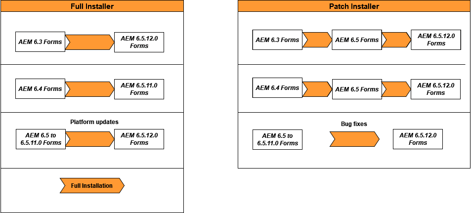

# 在JEE上升级到AEM 6.5 Forms {#upgrade-to-aem-forms-jee}

JEE上的AEM 6.5.18.0 Forms提供两种类型的安装程序：完整安装程序和修补程序安装程序。

**完整安装程序**：您可以使用JEE完整安装程序上的[AEM 6.5.18.0](https://experienceleague.adobe.com/docs/experience-manager-release-information/aem-release-updates/forms-updates/aem-forms-releases.html)来设置新的AEM Forms实例，或执行从JEE上的AEM 6.5.x.x Forms升级到JEE上的AEM 6.5.18.0 Forms的升级。

**修补程序安装程序**： JEE修补程序安装程序](https://experienceleague.adobe.com/docs/experience-manager-release-information/aem-release-updates/forms-updates/aem-forms-releases.html)上的[AEM 6.5.18.0适用于已使用AEM 6.5.x.x版本的客户。 您可以使用修补程序安装程序升级到AEM Forms的最新版本。

下表描述了使用完整安装程序和修补程序安装程序的场景。

执行以下过程，使用完整安装程序将JEE上的现有AEM Forms 6.5.x.x升级到JEE上的AEM 6.5.18.0 Forms：

1. 从[Software Distribution](https://experience.adobe.com/#/downloads/content/software-distribution/en/aem.html)下载AEM 6.5 Forms on JEE安装程序。 您需要有效的维护和支持合同才能使用安装程序。
1. 请参阅[升级核对清单和计划](https://www.adobe.com/go/learn_aemforms_upgrade_checklist_65)，了解为确保成功升级而执行的检查。
1. 请参阅[准备升级到AEM Forms](https://www.adobe.com/go/learn_aemforms_prepareupgrade_65)，了解并执行相关任务以确保升级在最短服务器停机时间下正常运行。
1. 根据您现有的环境和应用程序服务器，选择以下文档之一并按照说明进行操作。

   * [从AEM 6.3或AEM 6.4 Forms升级到适用于JBoss的AEM 6.5 Forms](https://www.adobe.com/go/learn_aemforms_upgradeJBoss_65)
   * [从AEM 6.3或AEM 6.4 Forms升级到适用于WebSphere的AEM 6.5 Forms](https://www.adobe.com/go/learn_aemforms_upgradeWebSphere_65)
   * [从AEM 6.3或AEM 6.4 Forms升级到AEM 6.5 Forms for JBoss Turnkey](https://www.adobe.com/go/learn_aemforms_upgradeTurnkey_65)
   * [为JEE上的AEM Forms将JBoss EAP从7.4.10升级到7.4.23](/help/forms/using/upgrade-jboss-eap-from-7-4-10-to-7-4-23.md)
   * [为JEE上的AEM Forms将JBoss EAP群集从7.4.10升级到7.4.23](/help/forms/using/upgrade-jboss-eap-cluster-from-7-4-10-to-7-4-23.md)

无法从LiveCycle ES2、LiveCycle ES3、AEM 6.0 Forms、AEM 6.1 Forms、AEM 6.2 Forms直接升级到AEM 6.5 Forms。 您可以对一个或多个版本的LiveCycle或AEM Forms执行中间升级，然后升级到AEM 6.5 Forms。 有关中间版本和相应升级说明的列表，请参阅[选择升级路径](upgrade.md)。

