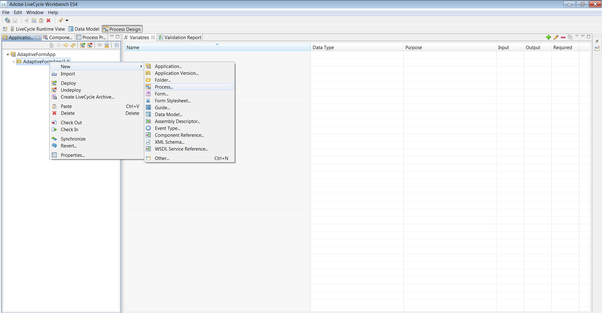

# 在HTMLWorkspace中使用自适应表单{#using-an-adaptive-form-in-html-workspace}

JEE上的AEM Forms提供了在WorkspaceHTML中使用自适应表单的功能。

由于可以在流程设计期间选择XDP，因此添加了从现有自适应表单AEM存储库中浏览的功能。 此功能使Process Designer能够在“起点”和“任务”中配置自适应表单。

## 流程设计经验 {#process-design-experience}

执行以下操作以在流程设计中使用自适应表单：

* 在分配任务和起点中，将表单资源分配给任务时，您可以浏览到CRX存储库中的自适应表单资源。
* 在分配任务/起点工作台属性工作表中，您可以隐藏自适应表单的顶级/全局工具栏。
* 您可以在自适应表单中为渲染和提交操作使用新的操作配置文件。

### LiveCycle应用程序导出和导入 {#livecycle-application-export-and-import}

由于自适应表单位于AEM存储库中，因此LiveCycle应用程序导出仅包含所用自适应表单的引用。 因此，LiveCycle应用程序的导出和导入是一个两步过程。 LiveCycle应用程序包括进程定义等。 包含自适应表单的单独资源包将作为ZIP文件从AEM导出。 导入时，通过Workbench导入LiveCycle应用程序，通过AEM导入自适应表单。

## WorkspaceHTML中自适应表单的用户体验 {#user-experience-of-adaptive-form-in-html-workspace}

除了可用于移动设备表单的控件外，HTMLWorkspace还提供某些特定于表单的自适应控件。 当用户打开任务或起点时，用户可以在HTMLWorkspace中添加附件、保存、签名、提交和导航自适应表单。 具体情况如下：

1. 要附加文件，请使用任务附件，就像在Mobile Forms中一样。 自适应表单的任何文件附件类型按钮都处于隐藏状态。

1. 要保存自适应表单，请单击&#x200B;**保存**，就像在Mobile Forms中一样。 自适应表单的任何“保存类型”按钮都处于隐藏状态。

1. 要提交自适应表单，请使用&#x200B;**提交**&#x200B;按钮或可用的路由操作，如Mobile Forms中的情况。 自适应表单的任何“提交”类型按钮都隐藏。

1. **自适应表单全局工具栏可见性**：如果流程Designer隐藏全局/顶级工具栏，则工具栏和按钮不会显示在自适应表单上。

1. **自适应Forms的Workspace导航控件**：“下一个”/“上一个”按钮与WorkspaceHTML中自适应表单的“保存”、“提交”和“路由操作”按钮一起可用。 单击下一个/上一个按钮，以便在HTMLWorkspace中导航自适应表单的面板。 “下一个”/“上一个”按钮提供深层导航，类似于自适应表单的移动视图中的导航控件。

1. **自适应表单的电子签名服务和摘要组件**：摘要组件在HTMLWorkspace中无法正常工作。 换言之，如果自适应表单具有摘要组件，则它在工作区中不可见。 工作区用户不是在电子签名组件中自动提交，而是在HTMLWorkspace中单击提交或路由操作。 签名文档后，该文档将显示为平面签名文档。 单击&#x200B;**提交**&#x200B;或路由操作，以便关闭/完成任务或起点。\
   从eSign服务服务器收集已签名的文档，并将数据xml文件转发到流程中的下一步。

## 在流程设计中使用自适应表单的步骤 {#steps-to-use-adaptive-forms-in-process-design}

1. 打开Adobe Experience Manager Forms Workbench。

1. 转到&#x200B;**文件>新建>应用程序**&#x200B;或使用现有应用程序创建应用程序。

   

   创建应用程序

1. 创建流程，或使用应用程序中的现有流程。

   

   创建流程

1. 创建“起始点”或“分配任务”，然后双击它。
1. 在&#x200B;**[!UICONTROL 演示和数据]**&#x200B;部分下，选择&#x200B;**[!UICONTROL 使用CRX资源]**，然后单击该资源之前的省略号。

   

   使用CRX资源

1. 选择通过管理Assets UI创建的自适应表单，然后单击&#x200B;**[!UICONTROL 确定]**。

   

   选择自适应表单

   >[!NOTE]
   >
   >有关创建自适应表单的详细信息，请参阅[创建自适应表单](../../forms/using/creating-adaptive-form.md)。
   >
   >
   >有关创建进程的详细信息，请参阅[创建和管理进程](https://help.adobe.com/en_US/AEMForms/6.1/WorkbenchHelp/WS92d06802c76abadb-1cc35bda128261a20dd-7ff7.2.html)。
