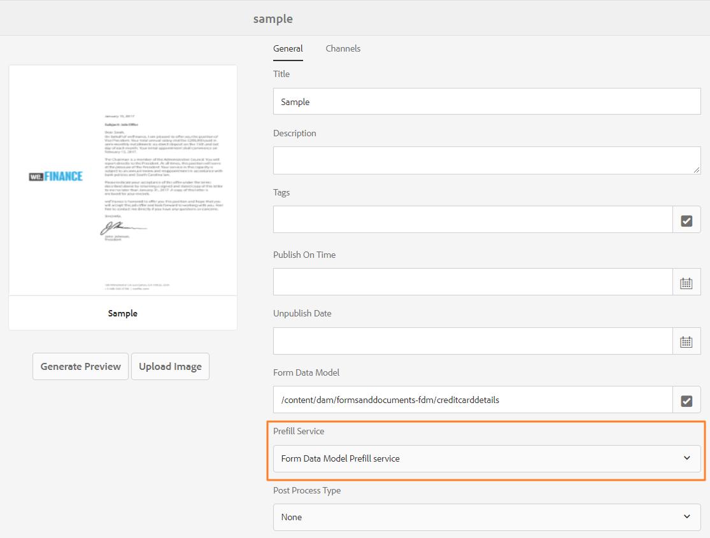

# 使用表单数据模型{#use-form-data-model}

AEM Forms数据集成允许您使用不同的后端数据源来创建表单数据模型，您可以在各种自适应表单和交互式通信工作流程中将其用作架构。 它需要配置数据源并根据数据源中可用的数据模型对象和服务创建表单数据模型。 有关更多信息，请参阅下列主题：

* [AEM Forms数据集成](../../forms/using/data-integration.md)
* [配置数据源](../../forms/using/configure-data-sources.md)
* [创建表单数据模型](../../forms/using/create-form-data-models.md)
* [使用表单数据模型](../../forms/using/work-with-form-data-model.md)

表单数据模型是JSON架构的扩展，您可以使用它：

* [创建自适应表单和片段](#create-af)
* [创建交互式通信和构件块，如文本、列表和条件片段](#create-ic)
* [使用范例数据预览交互式通信](#preview-ic)
* [预填自适应表单和交互式通信](#prefill)
* [将提交的自适应表单数据写入数据源](#write-af)
* [使用自适应表单规则调用服务](#invoke-services)

## 创建自适应表单和片段 {#create-af}

您可以基于 [表单数据模型](../../forms/using/creating-adaptive-form.md)[创建自适应表单和自适应表单片段](../../forms/using/adaptive-form-fragments.md) 。 执行以下操作以在创建自适应表单或自适应表单片段时使用表单数据模型：

1. 在“添加属性”屏幕的“表单模型”选项卡中， **[!UICONTROL 从“从中选择”下拉列]** 表中选择“表 **[!UICONTROL 单数据模型]** ”。

   

1. 点按以展开“选 **[!UICONTROL 择表单数据模型”]**。 列出所有可用的表单数据模型。

   从数据模型中选择。

   

1. (仅&#x200B;**限自适应表单片段**)您可以基于表单数据模型中只有一个数据模型对象来创建自适应表单片段。 展开 **[!UICONTROL “表单数据模型定义]** ”下拉列表。 它列出指定表单数据模型中的所有数据模型对象。 从列表中选择一个数据模型对象。

   

创建基于表单数据模型的自适应表单或自适应表单片段后，表单数据模型对象将显示在内容浏览器的“数据模型对象 **** ”选项卡中自适应表单编辑器中。

>[!NOTE] {graybox=&quot;true&quot;}
>
>对于自适应表单片段，只有创作时选择的数据模型对象及其关联的数据模型对象才会显示在“数据模型对象”选项卡中。

您可以将数据模型对象拖放到自适应表单或片段上以添加表单字段。 添加的表单字段将保留元数据属性并与数据模型对象属性绑定。 绑定可确保在提交表单时在相应的数据源中更新字段值，并在呈现表单时预填。

## 创建交互式通信 {#create-ic}

您可以基于表单数据模型创建交互式通信，您可以使用配置数据源的数据预填充交互式通信。 此外，诸如文本、列表和条件文档片段的交互式通信的构件块可以基于表单数据模型。

在创建交互式通信或文档片段时，您可以选择表单数据模型。 下图显示了“创建交互式通信”对话框的“常规”选项卡。

“创建交互式通信”对话框的“常规”选项卡

有关详细信息，请参阅：

[创建交互式通信](../../forms/using/create-interactive-communication.md)

[交互通信中的文本](/help/forms/using/texts-interactive-communications.md)

[交互通信中的条件](/help/forms/using/conditions-interactive-communications.md)

[列表片段](/help/forms/using/lists.md)

## 使用范例数据预览 {#preview-ic}

表单数据模型编辑器允许您为表单数据模型中的数据模型对象生成和编辑示例数据。 您可以使用这些数据来预览和测试交互式通信和自适应表单。 您必须在预览前生成示例数据，如使用表单数 [据模型中所述](../../forms/using/work-with-form-data-model.md#sample)。

要预览与示例表单数据模型数据的交互式通信，请执行以下操作：

1. 在AEM作者实例中，导航到“表 **[!UICONTROL 单”>“表单和文档”]**。
1. 选择交互式通信并点按工 **[!UICONTROL 具栏]** 中的预览，以选择 **[!UICONTROL Web渠道]**、打印渠道 **[!UICONTROL ，或同时]****** 点按这两个渠道来预览交互式通信。
1. 在“预览 [*渠道*] ”对话框中，确保选 **[!UICONTROL 择“表单数据模型的测试数据]** ”并点按“ **[!UICONTROL 预览”]**。

交互式通信打开时会显示预填充的样本数据。

同样，要预览带有样本数据的自适应表单，请在创作模式下打开自适应表单，然后点按预 **[!UICONTROL 览]**。

## 使用表单数据模型服务预填 {#prefill}

AEM Forms提供现成的表单数据模型预填服务，您可以启用该服务，以便根据表单数据模型实现自适应表单和交互式通信。 预填充服务查询自适应表单和交互式通信中的数据模型对象的数据源，并相应地在呈现表单或通信时预填充数据。

要为自适应表单启用表单数据模型预填服务，请打开自适应表单容器属性，然后从“基本”折叠面板的“预填服务”下拉菜单中选择“表 **[!UICONTROL 单数据模型预填服务]****** ”。 然后，保存属性。

要在交互式通信中配置表单数据模型预填服务，您可以在创建表单数据模型预填服务时在“预填服务”下拉框中选择“表单数据模型预填服务”，或在更高版本中修改属性。

交互式通信的“编辑属性”对话框

## 将提交的自适应表单数据写入数据源 {#write-af}

当用户基于表单数据模型提交表单时，您可以配置表单以将数据模型对象的提交数据写入其数据源。 为了实现此用例，AEM Forms提供了 [Form Data Model提交操作](../../forms/using/configuring-submit-actions.md)，该操作现成仅可用于基于表单数据模型的自适应表单。 它将数据模型对象的提交数据写入其数据源中。

要配置表单数据模型提交操作，请打开自适应表单容器属性，然后从提交折叠面板下的提交操作下拉列表中选择 **[!UICONTROL 使用表单数据模型提交]** 。 然后，从要提交的数据模型对象的“名 **[!UICONTROL 称”(Name]** )下拉列表中浏览并选择数据模型对象。 保存属性。

在表单提交时，将配置的数据模型对象的数据写入到相应的数据源。

您还可以使用二进制数据模型对象属性将表单附件提交到数据源。 执行以下操作以将附件提交到JDBC数据源：

1. 向表单数据模型添加包含二进制属性的数据模型对象。
1. 在自适应表单中，将“文件附 **[!UICONTROL 件”组件从“组件]** ”浏览器拖放到自适应表单上。
1. 点按以选择添加的组件，然  以打开组件的“属性”浏览器。
1. 在“绑定引用”字段中，点  ，然后导航以选择您在表单数据模型中添加的二进制属性。 根据需要配置其他属性。

   点  ，保存属性。 附件字段现在绑定到表单数据模型的二进制属性。

1. 在自适应表单容器属性的“提交”部分，启用“提 **[!UICONTROL 交表单附件”]**。 在提交表单时，它将二进制属性字段中的附件提交到数据源。

## 使用规则调用自适应表单中的服务 {#invoke-services}

在基于表单数据模型的自适应表单中，您可以创 [建规则](../../forms/using/rule-editor.md) ，以调用在表单数据模型中配置的服务。 规则 **[!UICONTROL 中的调用服务]** (Invoke Services)操作列出表单数据模型中的所有可用服务，并允许您为服务选择输入和输出字段。 您还可以使用“设 **置值** ”规则类型调用表单数据模型服务并将字段的值设置为服务返回的输出。

例如，以下规则调用以员工ID为输入的get服务，并在表单中相应的从属ID、姓、名和性别字段中填充返回的值。

此外，您还可以使用 `guidelib.dataIntegrationUtils.executeOperation` API在规则编辑器的代码编辑器中编写JavaScript。 有关API详细信息，请参 [阅调用表单数据模型服务的API](/help/forms/using/invoke-form-data-model-services.md)。
