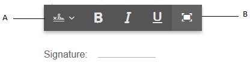

# 在自适应表单中使用[!DNL Adobe Sign]{#using-adobe-sign-in-an-adaptive-form}

Adobe 建议使用现代、可扩展的数据捕获[核心组件](https://experienceleague.adobe.com/docs/experience-manager-core-components/using/adaptive-forms/introduction.html)，以[创建新的自适应表单](/help/forms/using/create-an-adaptive-form-core-components.md)或[将自适应表单添加到 AEM Sites 页面](/help/forms/using/create-or-add-an-adaptive-form-to-aem-sites-page.md)。这些组件代表有关创建自适应表单的重大改进，确保实现令人印象深刻的用户体验。本文介绍了使用基础组件创作自适应表单的旧方法。

| 版本 | 文章链接 |
| -------- | ---------------------------- |
| AEM as a Cloud Service | [单击此处](https://experienceleague.adobe.com/docs/experience-manager-cloud-service/content/forms/adaptive-forms-authoring/authoring-adaptive-forms-foundation-components/use-adobe-sign/working-with-adobe-sign.html) |
| AEM 6.5 | 本文 |

[!DNL Adobe Sign]为自适应表单启用电子签名工作流。 电子签名可改进法律、销售、工资单、人力资源管理和其他领域的文档处理工作流。

在典型的[!DNL Adobe Sign]和自适应表单方案中，用户需填写自适应表单来申请服务。 例如，抵押贷款和信用卡申请需要所有借款人和共同申请人的合法签名。 若要为类似方案启用电子签名工作流，您可以将[!DNL Adobe Sign]与AEM [!DNL Forms]集成。 再举几个例子，您可以使用[!DNL Adobe Sign]来：

* 使用完全自动化的计划书、报价和合同流程从任何设备完成交易。
* 更快地完成人力资源流程，并为员工提供数字体验。
* 缩短合同周期，更快地吸引供应商。
* 创建可自动执行常用流程的数字工作流。

与AEM [!DNL Forms]的[!DNL Adobe Sign]集成支持：

* 单个和多用户签名工作流
* 顺序和同步签名工作流
* 表单内和表单外签名体验
* 以匿名或登录用户身份签署表单
* 动态签名流程(与AEM [!DNL Forms]工作流集成)
* 通过知识库、电话和社交个人资料进行身份验证

了解将Adobe Sign与自适应表单结合使用[的最佳实践](https://medium.com/adobetech/using-adobe-sign-to-e-sign-an-adaptive-form-heres-the-best-way-to-do-it-dc3e15f9b684)以创建更好的签名体验。

## 先决条件 {#prerequisites}

在自适应表单中使用[!DNL Adobe Sign]之前：

* 确保AEM [!DNL Forms]云服务配置为使用[!DNL Adobe Sign]。 有关详细信息，请参阅[将Adobe Sign与AEM Forms集成](../../forms/using/adobe-sign-integration-adaptive-forms.md)。
* 保持签名者列表就绪。 您至少需要每个签名者的电子邮件地址。

## 为自适应表单配置[!DNL Adobe Sign] {#configure-adobe-sign-for-an-adaptive-form}

执行以下步骤为自适应表单配置[!DNL Adobe Sign]：

1. [编辑Adobe签名的自适应表单属性](../../forms/using/working-with-adobe-sign.md#enableadobesign)
1. [将Adobe Sign字段添加到自适应表单](../../forms/using/working-with-adobe-sign.md#addadobesignfieldstoanadaptiveform)
1. [为自适应表单启用Adobe Sign](../../forms/using/working-with-adobe-sign.md#enableadobsignforanadaptiveform)
1. [为自适应表单选择Adobe Sign Cloud Service](../../forms/using/working-with-adobe-sign.md#selectadobesigncloudserviceforanadaptiveform)

1. [将Adobe Sign签名者添加到自适应表单](../../forms/using/working-with-adobe-sign.md#addsignerstoanadaptiveform)
1. [为自适应表单选择提交操作](../../forms/using/working-with-adobe-sign.md#selectsubmitactionforanadaptiveform)

### 编辑[!DNL Adobe Sign]的自适应表单属性 {#enableadobesign}

为现有或新的自适应表单配置[!DNL Adobe Sign]的自适应表单属性。

[创建Adobe Sign自适应表单](../../forms/using/working-with-adobe-sign.md#create-an-adaptive-form-for-adobe-sign)介绍了创建基本自适应表单的步骤。 有关创建自适应表单时可用的其他选项，请参阅[创建自适应表单](../../forms/using/creating-adaptive-form.md)。

#### 为[!DNL Adobe Sign]创建自适应表单 {#create-an-adaptive-form-for-adobe-sign}

执行以下步骤可创建启用Sign的自适应表单：

1. 导航到&#x200B;**[!UICONTROL Adobe Experience Manager]** > **[!UICONTROL Forms]** > **[!UICONTROL Forms和文档]**。
1. 选择&#x200B;**[!UICONTROL 创建]**&#x200B;并选择&#x200B;**[!UICONTROL 自适应表单]**。 此时将显示模板列表。 选择模板并选择&#x200B;**[!UICONTROL 下一步]**。
1. 在&#x200B;**[!UICONTROL 基本]**&#x200B;选项卡中：

   1. 为自适应表单指定&#x200B;**[!UICONTROL 名称]**&#x200B;和&#x200B;**[!UICONTROL 标题]**。

   1. 选择在使用AEM [!DNL Forms]配置[!DNL Adobe Sign]时创建的[配置容器](../../forms/using/adobe-sign-integration-adaptive-forms.md#configure-adobe-sign-with-aem-forms)。

      >[!NOTE]
      >
      >**[!UICONTROL Adobe Sign Cloud Service]**&#x200B;下拉列表显示了在此字段中选择的配置容器中配置的云服务。 当您选择&#x200B;**[!UICONTROL 启用Adobe Sign Cloud Service]**&#x200B;选项时，**[!UICONTROL Adobe Sign]**&#x200B;下拉列表在自适应表单属性的&#x200B;**[!UICONTROL 电子签名]**&#x200B;部分中可用。

1. 在&#x200B;**[!UICONTROL 表单模型]**&#x200B;选项卡中，选择以下选项之一：

   * 选择&#x200B;**[!UICONTROL 将表单模板关联为记录文档模板]**&#x200B;选项，然后选择记录文档模板。 如果您使用基于表单模板的自适应表单，则发送以供签名的文档仅显示基于相关表单模板的字段。 它不会显示自适应表单的所有字段。

   * 选择&#x200B;**[!UICONTROL 生成记录文档]**&#x200B;选项。 如果使用启用了记录文档选项的自适应表单，则发送以供签名的文档显示自适应表单的所有字段。

1. 选择&#x200B;**[!UICONTROL 创建。]**&#x200B;已创建启用签名的自适应表单，该表单可用于添加[!DNL Adobe Sign]字段。

#### 编辑[!DNL Adobe Sign]的自适应表单 {#editafsign}

执行以下步骤以在现有自适应表单中使用[!DNL Adobe Sign]：

1. 导航到&#x200B;**[!UICONTROL Adobe Experience Manager]** > **[!UICONTROL Forms]** > **[!UICONTROL Forms和文档]**。
1. 选择自适应表单并选择&#x200B;**[!UICONTROL 属性]**。
1. 在&#x200B;**[!UICONTROL 基本]**&#x200B;选项卡中，选择使用AEM [!DNL Forms]配置[!DNL Adobe Sign]时创建的[配置容器](../../forms/using/adobe-sign-integration-adaptive-forms.md#configure-adobe-sign-with-aem-forms)。
1. 在&#x200B;**[!UICONTROL 表单模型]**&#x200B;选项卡中，选择以下选项之一：

   * 选择&#x200B;**[!UICONTROL 将表单模板关联为记录文档模板]**&#x200B;选项，然后选择记录文档模板。 如果您使用基于表单模板的自适应表单，则发送以供签名的文档仅显示基于相关表单模板的字段。 它不会显示自适应表单的所有字段。

   * 选择&#x200B;**[!UICONTROL 生成记录文档]**&#x200B;选项。 如果使用启用了记录文档选项的自适应表单，则发送以供签名的文档显示自适应表单的所有字段。

1. 选择&#x200B;**[!UICONTROL 保存并关闭]**。 已为[!DNL Adobe Sign]启用自适应表单。

### 将Adobe Sign字段添加到自适应表单 {#addadobesignfieldstoanadaptiveform}

[!DNL Adobe Sign]包含多个可放置在自适应表单上的字段。 这些字段接受各种类型的数据，如签名、首字母、公司或标题，并帮助收集签名期间的额外信息和签名。 您可以使用[!DNL Adobe Sign]块组件在自适应表单中的各个位置放置[!DNL Adobe Sign]字段。

执行以下步骤以将字段添加到自适应表单并自定义与这些字段相关的各种选项：

1. 将&#x200B;**[!UICONTROL Adobe Sign Block]**&#x200B;组件从组件浏览器拖放到自适应表单中。 [!DNL Adobe Sign]块组件具有所有支持的[!DNL Adobe Sign]字段。 默认情况下，它向自适应表单添加&#x200B;**签名**&#x200B;字段。

   

   默认情况下，[!DNL Adobe Sign]块在发布的自适应表单中不可见。 它仅在签名文档中可见。 您可以从[!DNL Adobe Sign]块组件的属性中更改[!DNL Adobe Sign]块的可见性。

   >[!NOTE]
   >
   >    * 在自适应表单中使用[!DNL Adobe Sign]块不是强制性的。 [!DNL Adobe Sign]如果您没有使用[!DNL Adobe Sign]块并为签名者添加字段，则默认签名字段将显示在签名文档的底部。
   >    * 仅对自动生成记录文档的自适应表单使用[!DNL Adobe Sign]块。 如果您使用自定义XDP生成记录文档或基于表单模板的自适应表单，则不支持[!DNL Adobe Sign]块。
   >
   >

1. 选择&#x200B;**[!UICONTROL Adobe Sign Block]**&#x200B;组件并选择&#x200B;**编辑** 图标。 它显示用于添加字段和设置字段外观格式的选项。

   

   **A.**&#x200B;选择并添加[!DNL Adobe Sign]字段。 **B.**&#x200B;将[!DNL Adobe Sign]块展开为全屏视图

1. 选择&#x200B;**[!UICONTROL Adobe Sign]字段** 图标。 它显示用于选择和添加[!DNL Adobe Sign]字段的选项。

   展开&#x200B;**[!UICONTROL 类型]**&#x200B;下拉字段以选择[!DNL Adobe Sign]字段，然后选择完成图标以将所选字段添加到[!DNL Adobe Sign]块。 **[!UICONTROL 类型]**&#x200B;下拉字段包括签名、签名者信息和数据字段类型。 与AEM [!DNL Forms]的[!DNL Adobe Sign]集成仅支持[!UICONTROL 类型]下拉框中列出的字段。 有关[!DNL Adobe Sign]字段的详细信息，请参阅[Adobe Sign文档](https://helpx.adobe.com/sign/help/field-types.html)。

   

   必须为字段提供唯一名称。 您还可以选择必填选项来标记必填字段。 除了&#x200B;**[!UICONTROL Name]**&#x200B;和&#x200B;**[!UICONTROL Required]**&#x200B;选项外，某些[!DNL Adobe Sign]字段还有更多选项。 例如，蒙版和多行。 此外，为每个[!DNL Adobe Sign]字段指定唯一的名称，无论这些字段位于相同还是不同的[!DNL Adobe Sign]块中。

   如果从下拉列表中选择&#x200B;**[!UICONTROL 数字签名]**，则可以将数字签名应用于自适应表单：

   * 使用云签名在线使用由信任服务提供商托管的[数字ID](https://helpx.adobe.com/sign/kb/digital-certificate-providers.html)签名。
   * 使用Adobe Acrobat下载文档或使用智能卡、USB令牌或基于文件的数字IDReader，即可从本地下载文档。

### 为自适应表单启用[!DNL Adobe Sign] {#enableadobsignforanadaptiveform}

未为自适应表单启用现成的[!DNL Adobe Sign]。 执行以下步骤以启用它：

1. 在内容浏览器中，选择&#x200B;**[!UICONTROL 表单容器]**，然后选择&#x200B;**[!UICONTROL 配置]** 图标。 它可打开属性浏览器并显示自适应表单容器属性。
1. 在属性浏览器中，展开&#x200B;**[!UICONTROL 电子签名]**&#x200B;折叠面板，然后选择&#x200B;**[!UICONTROL 启用Adobe Sign]**&#x200B;选项。 它为自适应表单启用[!DNL Adobe Sign]。

### 选择[!DNL Adobe Sign]Cloud Service和签名顺序 {#selectadobesigncloudserviceforanadaptiveform}

您可以为AEM [!DNL Forms]的实例配置多个[!DNL Adobe Sign]服务。 建议为每个职能（人力资源、财务等）提供单独的一组服务。 它使跟踪和报告已签署文档更加容易。 例如，银行具有多个部门。 您可以为各个部门设置单独的配置，以便更好地跟踪文档。

一个文档也可以有多个签名者。 例如，信用卡申请可以有多个申请人。 在开始处理申请之前，银行需要所有申请人的签名。 对于多签名者方案，您可以选择按顺序或同时顺序对文档进行签名。

执行以下步骤以选择云服务和签名顺序：

1. 在内容浏览器中，选择&#x200B;**[!UICONTROL 表单容器]**，然后选择&#x200B;**[!UICONTROL 配置]** 图标。 它可打开属性浏览器并显示自适应表单容器属性。
1. 在属性浏览器中，展开&#x200B;**[!UICONTROL 电子签名]**&#x200B;折叠面板，然后选择&#x200B;**[!UICONTROL 启用Adobe Sign]**&#x200B;选项。 它为自适应表单启用[!DNL Adobe Sign]。
1. 从已配置的[!DNL Adobe Sign]Cloud Service列表中选择云服务。

   如果&#x200B;**[!UICONTROL Adobe Sign Cloud Service]**&#x200B;列表为空，请按照[使用AEM Forms配置Adobe Sign](../../forms/using/adobe-sign-integration-adaptive-forms.md)文章配置该服务。

   Cloud Service该下拉列表列出了“工具”>“**[!UICONTROL ”>“]**”>“**[!UICONTROL ”Adobe Sign]**”中`global`文件夹中存在的云服务。 此外，该下拉列表还列出了在创建自适应表单时，在&#x200B;**[!UICONTROL 配置容器]**&#x200B;字段中选择的文件夹中存在的云服务。

1. 从&#x200B;**[!UICONTROL 签名者可以签名]**&#x200B;对话框中选择签名顺序。 [!DNL Adobe Sign]个歌手可以按任意顺序依次签署自适应表单&#x200B;**** — 一个接着另一个签名者，或&#x200B;**[!UICONTROL 同时]**。

   一个签名者按顺序一次收到要签名的表单。 签名者完成文档签名后，表单将发送给下一个签名者，依此类推。

   多个签名者可以同时按顺序签署表单。

1. [将签名者添加到自适应表单](../../forms/using/working-with-adobe-sign.md#addsignerstoanadaptiveform)并选择“完成”图标以保存更改。

### 将签名者添加到自适应表单 {#addsignerstoanadaptiveform}

自适应表单只能有一个或多个签名者。 添加签名者时，还可以配置签名者的身份验证详细信息。 您还可以选择表单填写者和歌手是否为同一个人。 执行以下步骤以添加并提供有关签名者的各种详细信息：

1. 在内容浏览器中，选择&#x200B;**[!UICONTROL 表单容器]**，然后选择&#x200B;**[!UICONTROL 配置]** 图标。 它会打开具有自适应表单容器属性的属性浏览器。
1. 在属性浏览器中，展开&#x200B;**[!UICONTROL 电子签名]**&#x200B;折叠面板，然后选择&#x200B;**[!UICONTROL 启用Adobe Sign]**&#x200B;选项。 它为自适应表单启用[!DNL Adobe Sign]。
1. 选择&#x200B;**[!UICONTROL 签名者配置]**&#x200B;下的&#x200B;**[!UICONTROL 添加签名者]**。 它会向自适应表单添加签名者。 您可以将多个[!DNL Adobe Sign]签名者添加到自适应表单。
   

1. 单击&#x200B;**编辑** 图标以指定有关签名者的以下信息：

   * **[!UICONTROL 标题]：**&#x200B;指定用于唯一标识签名者的标题。

   * **[!UICONTROL 签名者与填写表单的人员是否相同？]：**&#x200B;如果表单填写者和第一个签名者是同一个人，请选择&#x200B;**是**。 如果该选项设置为&#x200B;**No，**，则不要在自适应表单中使用签名步骤组件。 如果表单包含签名步骤组件，则字段会自动设置为“是”。

   * **[!UICONTROL 签名者电子邮件地址]：**&#x200B;指定签名者的电子邮件地址。 签名者在指定的电子邮件地址上接收要签名的文档/表单。 您可以选择使用表单字段、登录用户的AEM用户配置文件中提供的电子邮件地址，或者手动输入电子邮件地址。 这是强制步骤。 确保第一个签名者或唯一签名者（如果只有一个签名者）的电子邮件地址与用于配置AEM云服务的[!DNL Adobe Sign]帐户不同。

   * **[!UICONTROL 签名者身份验证方法]：**&#x200B;指定在打开表单进行签名之前对用户进行身份验证的方法。 您可以在电话、知识库和基于社会身份的身份验证之间进行选择。 对于Adobe Acrobat Sign Solutions for Government，仅提供电话和基于知识的身份验证选项。

   >[!NOTE]
   >
   >    * 默认情况下，基于社交身份的身份验证提供使用Facebook、Google和LinkedIn进行身份验证的选项。 您可以联系[!DNL Adobe Sign]支持以启用其他社交身份验证提供程序。
   >
   >

   * 要填写或签名的&#x200B;**[!DNL Adobe Sign]字段：**&#x200B;为签名者选择[!DNL Adobe Sign]字段。 自适应表单可以有多个[!DNL Adobe Sign]字段。 您可以选择为签名者启用特定字段。 字段显示所有可用的[!DNL Adobe Sign]块。 选择块时，将选择该块的所有字段。 您可以使用X图标取消选择字段。

   

   上图有两个示例[!DNL Adobe Sign]块：个人信息和办公室详细信息

   选择完成图标。 签名者已添加并配置。

### 为自适应表单选择提交操作 {#selectsubmitactionforanadaptiveform}

之后，将[!DNL Adobe Sign]字段添加到自适应表单，从表单容器启用[!DNL Adobe Sign]，选择[!DNL Adobe Sign]Cloud Service，添加[!DNL Adobe Sign]签名者，为自适应表单选择适当的提交操作。 有关自适应表单提交操作的详细信息，请参阅[配置提交操作](../../forms/using/configuring-submit-actions.md)。

此外，仅在所有签名者签署表单后才提交启用[!DNL Adobe Sign]的自适应表单。 您可以在表单门户的待处理签名部分中找到部分签名的表单。 [!DNL Adobe Sign]配置服务继续按[定间隔](../../forms/using/adobe-sign-integration-adaptive-forms.md)轮询[!DNL Adobe Sign]服务器以验证签名状态。 如果所有签名者完成表单签名，将启动提交操作服务并提交表单。 如果您正在使用自定义提交操作并且表单使用[!DNL Adobe Sign]，请更新您的自定义提交操作以使用提交操作服务。

<!-- Remove when forms portal goes live
>[!NOTE]
>
>Data of the adaptive form is stored temporarily on Forms Portal. Use [custom storage for Forms Portal](/help/forms/using/configuring-draft-submission-storage.md). It ensures that the PII (personally identifiable information) data is not stored on AEM servers. 
-->

您的表单签名体验已准备就绪。 您可以预览表单以验证签名体验。 在已发布的表单上，签名者通过电子邮件收到签名表单时，将显示[!DNL Adobe Sign]块字段。 此体验也称为窗体外签名体验。 您还可以为第一个签名者配置表单内签名体验，有关详细步骤，请参阅[创建表单内签名体验](../../forms/using/working-with-adobe-sign.md#create-in-form-signing-experience)。

## 为自适应表单配置云签名 {#configure-cloud-signatures-for-an-adaptive-form}

基于云的数字签名或远程签名是新一代的数字签名，可在桌面、移动设备和Web上使用，满足签名者身份验证的最高合规性和保证要求。 您可以使用基于云的数字签名对自适应表单进行签名。

在[编辑Adobe签名的自适应表单属性](../../forms/using/working-with-adobe-sign.md#enableadobesign)后，执行以下步骤以将云签名字段添加到自适应表单：

1. 将&#x200B;**[!UICONTROL Adobe Sign Block]**&#x200B;组件从组件浏览器拖放到自适应表单中。 [!UICONTROL Adobe Sign Block]组件具有所有支持的[!DNL Adobe Sign]字段。 默认情况下，它向自适应表单添加&#x200B;**[!UICONTROL 签名]**&#x200B;字段。

   

1. 选择&#x200B;**[!UICONTROL Adobe Sign Block]**&#x200B;组件并选择&#x200B;**编辑** 图标。 它显示用于添加字段和设置字段外观格式的选项。

   

   **A.**&#x200B;选择并添加[!DNL Adobe Sign]字段。 **B.**&#x200B;将[!DNL Adobe Sign]块展开为全屏视图

1. 选择&#x200B;**[!UICONTROL Adobe Sign字段]** 图标。 它显示用于选择和添加[!DNL Adobe Sign]字段的选项。

   展开&#x200B;**[!UICONTROL 类型]**&#x200B;下拉字段以选择&#x200B;**[!UICONTROL 数字签名]**，然后选择&#x200B;**完成**&#x200B;图标以将所选字段添加到[!DNL Adobe Sign]块。

   

   必须为字段提供唯一名称。

   使用以下方式将数字签名应用于自适应表单：

   * 云签名：使用由信任服务提供商托管的[数字ID](https://helpx.adobe.com/sign/kb/digital-certificate-providers.html)签名。 云签名选项不适用于Adobe Acrobat Sign Solutions政府版。

   * Adobe Acrobat或Reader：使用Adobe Acrobat或Reader下载并打开文档，以使用智能卡、USB令牌或基于文件的数字ID进行签名。

   将云签名字段添加到自适应表单后，执行以下步骤以完成配置过程：

   * [为自适应表单启用Adobe Sign](../../forms/using/working-with-adobe-sign.md#enableadobsignforanadaptiveform)
   * [为自适应表单选择Adobe Sign Cloud Service](../../forms/using/working-with-adobe-sign.md#selectadobesigncloudserviceforanadaptiveform)
   * [将Adobe Sign签名者添加到自适应表单](../../forms/using/working-with-adobe-sign.md#addsignerstoanadaptiveform)
   * [为自适应表单选择提交操作](../../forms/using/working-with-adobe-sign.md#selectsubmitactionforanadaptiveform)

## 创建表单内签名体验 {#create-in-form-signing-experience}

用户还可以在填写表单时签署自适应表单。 此体验也称为表单内签名体验。 表单内签名体验仅适用于多个签名者环境中的第一个歌手。 执行以下步骤可为自适应表单创建表单内签名体验：

1. [添加并配置签名步骤组件](../../forms/using/working-with-adobe-sign.md#add-and-configure-the-signature-step-component)。
1. [添加摘要步骤组件](../../forms/using/working-with-adobe-sign.md#configure-the-thank-you-page-or-summary-step-component)。

### 添加并配置签名步骤组件 {#add-and-configure-the-signature-step-component}

使用签名步骤组件提供一个区域，用于对填写的表单进行电子签名。 呈现包含签名步骤组件的部分时，它显示已填写表单的可签名PDF版本。 签名步骤组件占据表单可用的完整宽度。 建议在包含签名步骤组件的部分中没有任何其他组件。

执行以下步骤以配置签名步骤组件：

1. 将&#x200B;**[!UICONTROL 签名步骤]**&#x200B;组件从组件浏览器拖放到表单中。
1. 选择新添加的签名步骤组件并选择&#x200B;**配置** 图标。 它将打开属性浏览器并显示签名步骤属性。 配置以下属性：

   * **[!UICONTROL 名称]**：指定组件的名称。

   * **[!UICONTROL 标题]：**&#x200B;指定组件的唯一标题。
   * **[!UICONTROL 模板消息]：**&#x200B;指定加载签名PDF时要显示的消息。 [!DNL Adobe Sign]服务需要一些时间来准备和加载签名PDF。
   * **[!UICONTROL 签名服务]：**&#x200B;选择&#x200B;**[!DNL Adobe Sign]**&#x200B;选项。

   * **[!UICONTROL 使用旧版电子签名组件]**：如果您在[AEM Forms Workspace](../../forms/using/introduction-html-workspace.md)、AEM [!DNL Forms]应用程序中使用各自的自适应表单，或者基础自适应表单具有旧版电子签名组件，请选择&#x200B;**使用旧版电子签名组件**&#x200B;选项。

   * **[!UICONTROL 配置]**：选择配置([!DNL Adobe Sign]Cloud Service)。 仅当启用了&#x200B;**使用旧版电子签名组件**&#x200B;选项时，该下拉框才可用。

   * **[!UICONTROL CSS类]**：为组件指定CSS类。

   选择完成图标以保存更改。

   

   >[!NOTE]
   >
   >* 将&#x200B;**[!UICONTROL 签名步骤]**&#x200B;组件拖放到表单时，**[!UICONTROL 签名者和填写表单的人员是否相同？]**&#x200B;选项自动设置为&#x200B;**是**。 需要保持表单正常工作。
   >* 在签名步骤组件后使用摘要步骤组件以获得最佳体验。 在签名步骤组件中完成表单签名后，“摘要”步骤会自动并立即提交表单。 如果不使用摘要步骤，则只有在使用[Adobe Sign配置服务](../../forms/using/adobe-sign-integration-adaptive-forms.md#configure-adobe-sign-scheduler-to-sync-the-signing-status)设置的时间间隔后，才会触发自动提交。
   >
   >一些最佳实践包括：
   >
   >* 包含签名步骤的自适应表单面板始终位于自适应表单的最后一个或第二个面板中。 仅当最后一个面板包含“摘要”步骤时，它才能成为最后一个面板中的第二个面板。
   >* 包含签名或摘要步骤组件的面板不能包含任何其他组件。
   >* 包含签名步骤的自适应表单不能有提交按钮。
   >* 包含签名步骤的自适应表单的提交可通过后台服务或摘要步骤进行处理。 如果有一个已配置的签名者也在填写表单，则使用“摘要”步骤处理自适应表单提交的优点在于，它会立即评估签名者是否已签名表单并调用提交操作。 后台服务需要更多时间来评估所有已配置的签名者是否都已签名表单并延迟提交自适应表单。
   >* 将表单设计为不允许用户从包含“签名”或“摘要”步骤的面板向后导航。

### 配置感谢页面或摘要步骤组件 {#configure-the-thank-you-page-or-summary-step-component}

**摘要步骤**&#x200B;组件自动提交表单，填充自定义摘要页面中的信息，并显示已提交表单的摘要。 它还会获取返回映射中的必需信息。 摘要步骤组件占据表单可用的完整宽度。 建议在包含摘要步骤组件的部分中没有任何其他组件。

现在，表单中的签名体验已准备就绪。 您可以预览表单以验证签名体验。

## 常见问题解答 {#frequently-asked-questions}

**问：**&#x200B;您可以将自适应表单嵌入到其他自适应表单中。 是否可以为嵌入式自适应表单启用[!DNL Adobe Sign]？
**Ans：**&#x200B;否，AEM [!DNL Forms]不支持使用嵌入启用了[!DNL Adobe Sign]的自适应表单以供签名的自适应表单

**问：**当我使用高级模板创建自适应表单并打开它进行编辑时，出现错误消息“电子签名或签名者配置不正确”。 显示。 如何解决错误消息？
使用高级模板创建的**Ans：**&#x200B;自适应表单配置为使用[!DNL Adobe Sign]。 要解决此错误，请创建并选择[!DNL Adobe Sign]云配置并为自适应表单配置[!DNL Adobe Sign]签名者。

**问：**&#x200B;我能否在自适应表单的静态文本组件中使用[!DNL Adobe Sign]文本标记？
**Ans：**&#x200B;是，您可以在文本组件中使用文本标记将[!DNL Adobe Sign]字段添加到启用了[记录文档](../../forms/using/generate-document-of-record-for-non-xfa-based-adaptive-forms.md)（仅自动生成的记录文档选项）的自适应表单。 要了解创建文本标记的过程和规则，请参阅[Adobe Sign文档](https://helpx.adobe.com/sign/using/text-tag.html)。 另请注意，自适应表单对文本标记的支持有限。 您可以使用文本标记仅创建[Adobe Sign Block](../../forms/using/working-with-adobe-sign.md#configure-cloud-signatures-for-an-adaptive-form)支持的字段。

**Q：** AEM [!DNL Forms]提供[!UICONTROL Adobe Sign块]和签名步骤组件。 能否在自适应表单中同时使用这些参数？
**Ans：**&#x200B;您可以在表单中同时使用这两个组件。 以下是有关使用这些组件的几个建议：

**Adobe Sign块：**&#x200B;您可以使用[!UICONTROL Adobe Sign块]在自适应表单上的任意位置添加[!UICONTROL Adobe Sign]字段。 此外，将特定字段分配给签名者也会很有帮助。 默认情况下，预览或发布自适应表单时，[!UICONTROL Adobe Sign]块不可见。 这些块仅在签名文档中启用。 在签名文档中，仅启用分配给签名者的字段。 [!UICONTROL Adobe Sign]块可用于第一个和后续签名者。

**签名步骤组件：**&#x200B;您可以使用签名步骤组件创建表单内签名体验。 它只允许第一个签名者在填写表单时签名。 呈现包含签名步骤组件的部分时，它显示表单的可签名PDF版本。 它通常是表单的最后一个或倒数第二部分，后跟摘要组件。

## 疑难解答 {#troubleshoot}

### [!DNL Adobe Sign]协议失败 {#adobe-sign-agreement-failures}

**问题**
为自适应表单配置[!DNL Adobe Sign]服务时，该服务无法为基础自适应表单创建[!DNL Adobe Sign]协议。

**解决方法**

* 检查自适应表单中使用的Adobe Sign云服务](../../forms/using/adobe-sign-integration-adaptive-forms.md)的[配置。
* 确保[!DNL Adobe Sign]服务器上用于配置[!DNL Adobe Sign]云服务的API应用程序具有所需权限。
* 如果您使用多个[!DNL Adobe Sign]云服务，请将所有服务的&#x200B;**[!UICONTROL oAuth URL]**&#x200B;指向相同的&#x200B;**[!UICONTROL Adobe Sign Shard]**。

* 使用单独的电子邮件地址来配置[!DNL Adobe Sign]帐户，并为第一个签名者和单个签名者配置。 第一个签名者或唯一签名者（如果只有单个签名者）的电子邮件地址不能与用于配置AEM云服务的[!DNL Adobe Sign]帐户相同。

### 为启用了[!DNL Adobe Sign]的自适应表单配置的AEM [!DNL Forms]工作流无法启动 {#adobe-sign-aem-form-workflow-failures}

**问题**
为自适应表单配置[!DNL Adobe Sign]时，使用“调用[!DNL Forms]工作流”选项配置的工作流不会启动。

**解决方法**

* 当您使用[!DNL Adobe Sign]而没有签名步骤或表单需要多个人的签名时，AEM [!DNL Forms]服务器将等待调度程序确认所有人员都已签名表单。 计划程序仅在所有人员完成签名后提交自适应表单，并且仅在自适应表单成功提交后启动工作流。 您可以缩短[计划程序](adobe-sign-integration-adaptive-forms.md)的时间间隔，以快速间隔检查表单签名状态并加快表单提交。

## 相关文章 {#related-articles}

* [将Adobe Sign与AEM Forms集成](../../forms/using/adobe-sign-integration-adaptive-forms.md)
* [将Adobe Sign与自适应表单一起使用的最佳实践](https://medium.com/adobetech/using-adobe-sign-to-e-sign-an-adaptive-form-heres-the-best-way-to-do-it-dc3e15f9b684)
* [将Adobe Sign与AEM Forms结合使用（视频）](https://helpx.adobe.com/experience-manager/kt/forms/using/adobe-sign-integration-feature-video.html)
