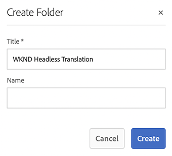
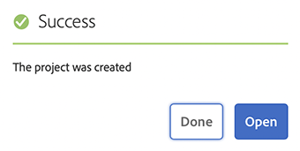
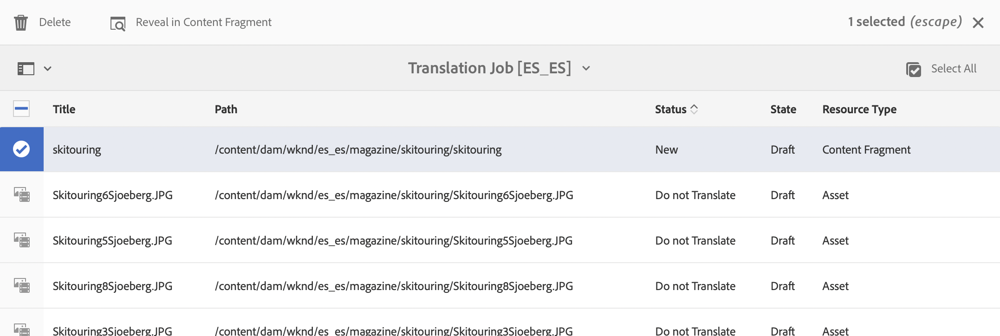
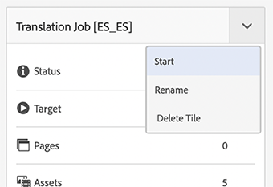
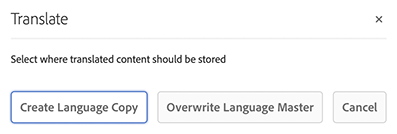

# 翻译内容 {#translate-content}

使用翻译连接器和规则翻译无头内容。

## 迄今为止的故事 {#story-so-far}

在AEM无头翻译历程的上一文档中， [配置翻译规则](translation-rules.md) 您学习了如何使用AEM翻译规则来识别翻译内容。 您现在应该：

* 了解翻译规则的用途。
* 能够定义您自己的翻译规则。

现在，连接器和翻译规则已设置完成，本文将引导您完成翻译无头内容的下一步。

## 目标 {#objective}

本文档可帮助您了解如何使用AEM翻译项目以及连接器和翻译规则来翻译内容。 阅读本文档后，您应：

* 了解翻译项目是什么。
* 能够创建新的翻译项目。
* 使用翻译项目来翻译您的无头内容。

## 创建翻译项目 {#creating-translation-project}

翻译项目使您能够管理无标题AEM内容的翻译。 翻译项目会在一个位置收集要翻译成其他语言的内容，以便集中了解翻译工作。

将内容添加到翻译项目后，将为其创建翻译作业。 作业提供命令和状态信息，您可以使用这些命令和状态信息来管理对资源执行的人工翻译和机器翻译工作流。

翻译项目可通过两种方式创建：

1. 选择内容的语言根目录，并让AEM根据内容路径自动创建翻译项目。
1. 创建空项目并手动选择要添加到翻译项目的内容

这两种方法的有效性通常仅因执行翻译的角色而异：

* 翻译项目管理器(TPM)通常需要灵活地手动选择翻译项目的内容。
* 如果内容所有者还负责翻译，则让AEM根据选定的内容路径自动创建项目通常会比较容易。

以下各节将探讨这两种方法。

### 基于内容路径自动创建翻译项目 {#automatically-creating}

对于同样负责翻译的内容所有者，让AEM自动创建翻译项目通常会更容易。 要让AEM根据您的内容路径自动创建翻译项目，请执行以下操作：

1. 导航到 **导航** -> **资产** -> **文件**. 请记住，AEM中的无标题内容存储为称为内容片段的资产。
1. 选择项目的语言根。 在本例中，我们已选择 `/content/dam/wknd/en`.
1. 点按或单击边栏选择器，并显示 **引用** 的上界。
1. 点按或单击 **语言副本**.
1. 检查 **语言副本** 复选框。
1. 展开部分 **更新语言副本** 的双曲余切值。
1. 在 **项目** 下拉列表，选择 **创建翻译项目**.
1. 为您的翻译项目提供适当的标题。
1. 点按或单击 **开始**.


您会收到一则消息，表明项目已创建。

>[!NOTE]
>
>假定已经为翻译语言创建了必要的语言结构，作为 [内容结构的定义。](getting-started.md#content-structure) 此操作应与内容架构师协作完成。
>
>如果未提前创建语言文件夹，您将无法按照前面步骤中所述创建语言副本。

### 通过选择内容手动创建翻译项目 {#manually-creating}

对于翻译项目经理，通常需要手动选择要包含在翻译项目中的特定内容。 要创建此类手动翻译项目，您必须首先创建一个空项目，然后选择要添加到该项目的内容。

1. 导航到 **导航** -> **项目**.
1. 点按或单击 **创建** -> **文件夹** 创建项目文件夹。
   * 这是可选的，但有助于您组织翻译工作。
1. 在 **创建文件夹** 窗口，添加 **标题** ，然后点按或单击 **创建**.

   

1. 点按或单击文件夹以打开文件夹。
1. 在新项目文件夹中，点按或单击 **创建** -> **项目**.
1. 项目基于模板。 点按或单击 **翻译项目** 模板进行选择，然后点按或单击 **下一个**.

   

1. 在 **基本** 选项卡，输入新项目的名称。

   

1. 在 **高级** 选项卡，使用 **目标语言** 下拉菜单，选择内容应翻译到的语言。 点按或单击&#x200B;**创建**。

   

1. 点按或单击 **打开** 在确认对话框中。

   

项目已创建，但不包含要翻译的内容。 下一部分详细介绍项目的结构以及如何添加内容。

## 使用翻译项目 {#using-translation-project}

翻译项目旨在在一个位置收集与翻译工作相关的所有内容和任务，以便您的翻译过程简单易用。

要查看翻译项目，请执行以下操作：

1. 导航到 **导航** -> **项目**.
1. 点按或单击在上一部分中创建的项目。


项目分为多张卡片。

* **概要**  — 此卡显示项目的基本标题信息，包括所有者、语言和翻译提供商。
* **翻译作业**  — 此卡或这些卡片显示了对实际翻译作业（包括状态、资产数量等）的概述。 通常，每个语言都有一个作业，ISO-2语言代码附加在作业名称后。
* **团队**  — 此卡显示正在协作处理此翻译项目的用户。 此历程不涵盖此主题。
* **任务**  — 与翻译内容相关的其他任务，如执行项目或工作流项目。 此历程不涵盖此主题。

翻译项目的使用方式取决于其创建方式：自动由AEM或手动执行。

### 使用自动创建的翻译项目 {#using-automatic-project}

自动创建翻译项目时，AEM会根据您之前定义的翻译规则来评估您选择的路径下的无标题内容。 根据该评价，将需要翻译的内容提取为新的翻译项目。

要查看此项目中包含的无标题内容的详细信息：

1. 点按或单击位于 **翻译作业** 卡。
1. 的 **翻译作业** 窗口会列出作业中的所有项目。
   
1. 点按或单击某行可查看该行的详细信息，同时请记住，一行可能表示要翻译的多个内容项目。
1. 点按或单击行项目的选择复选框，以查看更多选项，例如从作业中删除行项目或在内容片段或资产控制台中查看行项目的选项。
   

通常，翻译作业的内容会在 **草稿** 状态，如 **州** 列 **翻译作业** 窗口。

要开始翻译作业，请返回到翻译项目概述，然后点按或单击 **翻译作业** 卡片，选择 **开始**.



AEM现在可与您的翻译配置和连接器进行通信，以将内容发送到翻译服务。 您可以通过返回 **翻译作业** 窗口和查看 **州** 列。


机器翻译自动返回，状态为 **已批准**. 人文翻译允许进行更多交互，但超出了此历程的范围。

### 使用手动创建的翻译项目 {#using-manual-project}

手动创建翻译项目时，AEM会创建必要的作业，但不会自动选择要包含的任何内容。 这样翻译项目经理就可以灵活地选择要翻译的内容。

要向翻译作业添加内容，请执行以下操作：

1. 点按或单击其中一个 **翻译作业** 卡片。
1. 查看作业不包含任何内容。 点按或单击 **添加** 按钮，然后 **资产/页面** 从下拉菜单中。

   

1. 此时会打开一个路径浏览器，允许您专门选择要添加的内容。 找到您的内容，然后点按或单击以选择。

   

1. 点按或单击 **选择** 将所选内容添加到作业。
1. 在 **翻译** 对话框，指定您希望 **创建语言副本**.

   

1. 内容现已包含在作业中。

   

1. 点按或单击行项目的选择复选框，以查看更多选项，例如从作业中删除行项目或在内容片段或资产控制台中查看行项目的选项。
   

1. 重复这些步骤以在作业中包含所有必需的内容。

>[!TIP]
>
>路径浏览器是一款功能强大的工具，允许您搜索、过滤和导航内容。 点按或单击 **仅限内容/过滤器** 按钮来切换侧面板并显示高级过滤器，例如 **修改日期** 或 **翻译状态**.
>
>您可以在 [其他资源部分。](#additional-resources)

您可以使用之前的步骤将必要的内容添加到项目的所有语言（作业）中。 选择所有内容后，即可开始翻译。

通常，翻译作业的内容会在 **草稿** 状态，如 **州** 列 **翻译作业** 窗口。

要开始翻译作业，请返回到翻译项目概述，然后点按或单击 **翻译作业** 卡片，选择 **开始**.


AEM现在可与您的翻译配置和连接器进行通信，以将内容发送到翻译服务。 您可以通过返回 **翻译作业** 窗口和查看 **州** 列。


机器翻译自动返回，状态为 **已批准**. 人文翻译允许进行更多交互，但超出了此历程的范围。

## 审核翻译内容 {#reviewing}

[如前所见，](#using-translation-project) 机器翻译的内容将返回到AEM，状态为 **已批准** 因为假设由于使用机器翻译，所以不需要人为干预。 但是，当然仍然可以审阅翻译的内容。

只需转到已完成的翻译作业，然后通过点按或单击复选框来选择行项目。 图标 **在内容片段中显示** 中。


点按或单击该图标可在其编辑器控制台中打开已翻译内容片段，以查看已翻译内容的详细信息。


如果您拥有适当的权限，则可以根据需要进一步修改内容片段，但编辑内容片段不在此历程的涵盖范围内。 请参阅 [其他资源](#additional-resources) 文档末尾的章节，以了解有关此主题的更多信息。

该项目的目的是在一个位置收集与翻译相关的所有资源，以便于访问和查看清晰的概述。 但是，正如您通过查看已翻译项目的详细信息所看到的，翻译本身会流回翻译语言的资产文件夹。 在本例中，文件夹为

```text
/content/dam/wknd/es
```

如果您通过 **导航** -> **资产** -> **文件**，则会看到翻译的内容。


AEM翻译框架从翻译连接器接收翻译，然后基于语言根并使用连接器提供的翻译自动创建内容结构。

请务必了解，此内容尚未发布，因此对您的无头服务不可用。 我们将了解此创作 — 发布结构，并了解如何在翻译历程的下一步中发布我们的翻译内容。

## 人工翻译 {#human-translation}

如果您的翻译服务提供人工翻译，则审阅流程将提供更多选项。 例如，翻译会以状态返回项目 **草稿** 且必须手动审核和批准或拒绝。

人文翻译超出了此本地化历程的范围。 请参阅 [其他资源](#additional-resources) 文档末尾的章节，以了解有关此主题的更多信息。 但是，除了其他批准选项之外，人文翻译的工作流程与此历程中所述的机器翻译工作流程相同。

## 下一步 {#what-is-next}

现在，您已完成此部分无标题翻译历程，您应该：

* 了解翻译项目是什么。
* 能够创建新的翻译项目。
* 使用翻译项目来翻译您的无头内容。

在此知识的基础上，通过下一步审阅文档，继续您的AEM无头翻译历程 [发布翻译内容](publish-content.md) 您将在此处了解如何发布翻译内容，以及如何随着语言根内容的更改更新这些翻译。

## 其他资源 {#additional-resources}

但建议您通过审阅文档来进入无标题翻译历程的下一部分 [发布翻译内容，](publish-content.md) 以下是一些其他可选资源，可更深入地了解本文档中提到的某些概念，但无需继续进行无头历程。

* [管理翻译项目](/help/sites-administering/tc-manage.md)  — 了解翻译项目和其他功能（如人文翻译工作流和多语言项目）的详细信息。
* [创作环境和工具](/help/sites-authoring/author-environment-tools.md##path-selection) - AEM提供了各种可用于组织和编辑内容的机制，包括强大的路径浏览器。
