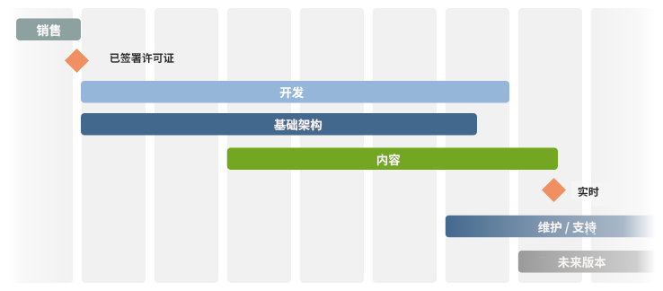
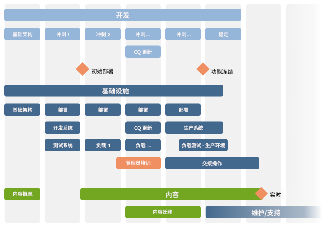

# 清单 - 进一步参考{#the-checklist-further-reference}

本页面提供进一步的详细说明，用于阐述和/或补充[《管理项目 - 最佳做法清单》](/help/managing/best-practices.md)中所涵盖的文档和原则。

## AEM - 您将使用哪些功能？ {#aem-what-will-you-be-using}

>[!CAUTION]
>
>本小节中的列表并不详尽，仅作为入门介绍。

### AEM 内的功能 {#features-within-aem}

在实施 AEM（尤其是首次实施）时，请查看 [AEM 的功能和工作流](https://business.adobe.com/products/experience-manager/adobe-experience-manager.html)，以确保明确您所需要或希望使用的功能领域。

请考虑您正在使用的 AEM 功能，以及它们对设计的影响。例如：

* [Commerce](/help/commerce/cif-classic/administering/ecommerce.md)
* [Screens](https://experienceleague.adobe.com/docs/experience-manager-screens/user-guide/aem-screens-introduction.html?lang=zh-Hans)
* [Assets](/help/assets/assets.md)
* [标记](/help/sites-administering/tags.md)
* [多站点管理和翻译](/help/sites-administering/msm-and-translation.md)
* [Forms](/help/forms/using/introduction-aem-forms.md)
* [Communities](/help/communities/deploy-communities.md)

另外，请查看[发行说明](/help/release-notes/release-notes.md)，了解各个版本的 AEM 中新增功能的时间。

### 集成 {#integrations}

AEM 可以与其他 Adobe 产品、第三方服务，或两者同时集成。这些工作流能够增强您可用的功能和效能。

完整信息请参阅[解决方案集成](/help/sites-administering/integration.md)。

## 迁移还是升级？ {#migrate-or-upgrade}

一个重要的考虑因素是，您是希望：

* 就地升级现有安装。
* 将当前系统中的内容迁移到全新安装的系统中。

从旧版本迁移到当前版本时，有两种选择：

* 使用[包管理器](/help/sites-administering/package-manager.md)将旧系统中的所有内容和应用程序代码导出到新系统。
* 就地[升级](/help/sites-deploying/upgrade.md)旧系统。此方法通常是推荐选择。

## 基本原则 {#basic-ground-rules}

与任何项目一样，尽早确立基本原则至关重要。这些原则包括：

>[!NOTE]
>
>这些要点是通用性的，而[最佳做法清单](/help/managing/best-practices.md)针对 AEM 提供了更具体的说明。

* **角色**

  应明确界定各角色，并让所有项目相关人员知悉。此外，建议重点标明：

   * 决策者
   * 联系人

* **职责**

   * 针对每个角色，清晰界定其在项目中的职责有助于避免混淆。

* **参与度**

  尽早让相关方参与，能促使他们成为项目的&#x200B;*利益相关者*。这样做能够增强他们对项目成功的投入。

   * 在客户方，这一角色包括日常使用系统的作者。
   * 在您自己的项目团队中，这种参与还包括负责质量保证的人员。他们对客户需求理解得越深入，就能更好地规划测试。

* **沟通途径**

   * 虽然不应过度形式化沟通途经，但明确的规定可以确保关键人员始终获得最新信息并保持最新状态。尤其要关注与外部方的沟通。

* **流程**

  所定义的流程取决于您的具体项目。同样地，尽量保持这些流程简单明了，但要考虑：

   * 定义与任何第三方（例如设计代理机构和第三方软件供应商等）交互的流程（以及沟通途经）。
   * 客户通常会有自己的项目管理和报告流程与工具。

* **跟踪工具**

  有许多工具可用于跟踪项目中的错误、任务和其他方面的信息 —— 更多详情请参阅[潜在工具概览](#overview-of-potential-tools)。

   * 此处需要注意的关键点是：仅保留一份信息副本，并共享这些信息（以及所使用工具的访问权限）。这种工作流有助于简化维护并避免出现差异。

* **范围**

  明确界定项目在不同层面上所涵盖的内容：

   * 各个独立版本（如果采用迭代发布流程，且无论这些版本是交付给客户还是您的内部测试团队）。
   * AEM 项目。
   * 整个项目；包括任何第三方软件、它们对测试的影响、组织问题等。
   * 对于某些方面，明确说明哪些内容&#x200B;*不*&#x200B;在项目范围内也是有益的。这种做法有助于避免混淆和错误假设，但应仅限于核心问题。

* **报告**

  明确界定您希望报告的信息、形式、频率以及对象。

* **术语**

   * 定义需要使用的任何缩写和/或特定于客户的术语。

* **假设**

   * 定义所有正在作出的假设。

这些信息可以在《项目手册》中定义；使用 Wiki 也有助于确保高效处理正在进行的变更。无论这些假设在何处定义，关键因素都是：

* 对信息进行定义并维护
* 信息已明确传达给所有相关人员。尽管这是标准的项目管理实践，但有一点必须反复强调：明确的角色定义和良好的沟通能够决定一个项目的成败。
* 对于任何被跟踪的信息，例如错误跟踪和问题跟踪，只保留一个版本。

## 关键绩效指标和目标量度 {#key-performance-indicators-and-target-metrics}

组织使用关键绩效指标（KPI）来评估其达成目标的成功程度。这些指标是可衡量的数值，用于展示特定目标的实现效果。

这些指标可以包括：

* 业务：

   * 用于衡量关键业务目标。
   * 为您的业务/场景选择合适的 KPI 至关重要，并且需要对以下内容作出清晰定义：指标是什么、如何衡量、如何使用以及由谁使用。

* 性能：

   * 定义如何衡量系统的性能。
   * 一些示例包括页面加载时间、服务器响应时间以及数据库查询性能。

部分（但并非全部）指标可以基于您所识别和定义的目标量度来制定。

### 目标量度 {#target-metrics}

量度用于定义网站质量的定量衡量标准。它们本质上是您希望实现的性能目标的定义，并可用于制定 [KPI（关键绩效指标）](#key-performance-indicators-and-target-metrics)。

可定义的量度有很多，但通常您所定义的内容应涵盖性能和并发方面的目标。尤其是那些难以量化、且常常容易受到&#x200B;*情绪化*&#x200B;评估影响的因素：

* “今天网站&#x200B;*太慢*&#x200B;了” —— 何时算作&#x200B;*慢*？

* “我同事一登录，系统就&#x200B;*卡死*” —— 系统到底能支持多少并发用户？
* “我一搜索，系统就&#x200B;*卡死*” —— 哪些搜索请求正在影响系统？
* “下载文件花了&#x200B;*很久*” —— 在正常网络条件下，可接受的下载时间是多少？

目标量度应在项目启动阶段定义，以便：

* 指明您所能提供的网站预期维度
* 指明您希望达到的最低质量标准
* 定义这些因素的衡量方式
* 作为[关键绩效指标](#key-performance-indicators-and-target-metrics)的基础

在定义目标量度时，应谨慎考虑：

* 如果设定过高，可能无法实现
* 如果设定过低，可能无法突出显示波动
* 确保量度能够被反复、一致地衡量
* 在不同被测因素之间保持平衡
* 某些量度与测试环境相关，但部分量度应反映真实场景，因为它们必须在生产网站上可衡量、可复现
* 根据量度对网站的重要性进行优先级排序
* 将量度限定在一个可监控的范围之内

在项目开发过程中，可以根据需要对这些量度进行更新和调整。在项目成功实施后，这些量度可用于帮助您控制安装情况，并在持续运营中监控/维护所需的服务水平。

若使用得当，这些量度可成为有用的工具；若使用不当，则可能成为浪费时间的干扰因素。与往常一样，请明确理解您在衡量什么、如何衡量以及为何要衡量。

>[!NOTE]
>
>本节将讨论基本原则和需要考虑的问题。由于每个安装环境不同，实际需要衡量的数值也会有所差异。

### 一切取决于您的项目设计 {#everything-rests-on-your-project-design}

所有被衡量的量度都会受到项目设计的影响。相反，许多问题也往往可以通过设计变更来解决。

因此，应在确定设计&#x200B;*之前*&#x200B;定义目标量度。这样，您就可以基于这些因素优化设计。在项目开发完成后再去调整基本设计原则将会非常困难。

在为网站创建结构时，请遵循 AEM 网站的推荐结构。确保您理解以下问题和/或原则：

* 如何构建网站内容。
* 模板和组件的工作方式。
* 缓存机制是如何运作的。
* 个性化内容带来的影响。
* 搜索功能的工作原理。
* 如何利用 CSS 及相关技术创建紧凑、无冗余的 HTML 代码。

如果您觉得您的设计没有遵循这些指南，或者您对某些影响不确定，请澄清这些问题。这一点应在进入编程阶段或开始填充内容之前完成。

### 基础架构 {#infrastructure}

在定义或评估基础架构时，最好先设定目标值，例如：

* 每日访客数（平均值和峰值）
* 每日点击数（平均值和峰值）
* 可供访问的网页数量
* 网站内容量

根据您的具体情况以及网站的战略重要性，定义这些基础架构指标有助于您评估并选择合适的基础架构。

* 服务器数量
* AEM 实例数量（创作环境和发布环境）

### 性能 {#performance}

可以评估的性能因素包括：

* 各个页面的响应时间，需考虑：

   * 创作环境的响应时间
   * 发布环境的响应时间

* 搜索请求的响应时间

本节内容可结合[性能优化](/help/sites-deploying/configuring-performance.md)一起阅读，以获取有关实际性能测量的技术细节。

#### 单个页面的响应时间 {#response-times-for-individual-pages}

一个关键问题是网站对访客请求的响应时间。

虽然该数值会因请求而异，但可以定义一个平均目标值。一旦证明该值既可实现又可维持，就可以用它来监控网站性能，并指示潜在问题的发展

创作环境与发布环境的不同目标

您所期望的响应时间在创作环境和发布环境中是不同的，这反映了目标受众的差异：

* **创作环境**

  此环境供作者进行录入和更新内容，因此必须：

   * 能够支持少量用户在更新内容页面及其各个元素时产生的大量请求
   * 保持尽可能快的响应速度，以最大化作者的生产效率，将内容高效发布到网站

* **发布环境**

  此环境包含您向最终用户提供的内容：

   * 速度同样至关重要，但通常会比创作环境稍慢
   * 通常会应用额外的性能优化机制：

      * 对内容进行缓存
      * 应用负载均衡

#### 设定目标响应时间 {#setting-target-response-times}

如何决定可实现的（平均）响应时间？这个问题和答案通常取决于体验：

* 您网站的体验
* 使用 AEM 的体验
* 能识别出响应时间高于平均值的复杂页面（这些页面应尽可能单独优化）

不过，在可控条件下，可以参考以下指南：

* 70% 的页面请求应在 100 毫秒内响应。
* 25% 的页面请求应在 100 – 300 毫秒内响应。
* 4% 的页面请求应在 300 – 500 毫秒内响应。
* 1% 的页面请求应在 500 – 1000 毫秒内响应。
* 不应有任何页面响应时间超过 1 秒。

以上数据假设满足以下条件：

* 在发布环境中测量（不涉及创作环境和/或 CFC 开销）
* 在服务器端测量（无网络开销）
* 不使用缓存（无 AEM 输出缓存、无 Dispatcher 缓存）
* 仅适用于具有大量依赖项的复杂对象（HTML、JS、PDF 等）
* 系统无其他负载

有多种机制可用于监控响应时间：

* **使用 AEM request.log 监控响应时间**

  性能分析的一个良好起点是请求日志。除了其他信息外，您还可以查看单个请求的响应时间。更多详情请参阅[性能优化](/help/sites-deploying/configuring-performance.md)。

* **使用 HTML 评论监控响应时间**

  可以通过 HTML 评论在每个页面源中包含响应时间信息：

  `</body> </html>v <-- Page took 58 milliseconds to be rendered by the server --> Response times for search requests`

#### 搜索请求 {#search-requests}

搜索请求会对网站产生显著影响，主要体现在：

* 实际搜索的响应时间

   * 快速的搜索功能是网站的重要质量目标

* 对整体性能的影响

   * 搜索功能必须扫描（可能相当大的）内容区域，或专门提取的索引，如果未优化，这一过程可能会影响整个系统的性能

为搜索请求设定目标同样依赖于体验，具体取决于：

* AEM 的体验
* 对搜索使用频率与其他目标相比的评估
* 您的持久化管理器
* 您的搜索索引
* 搜索功能的复杂度。只允许输入一个搜索词的基础搜索功能，比允许用户使用 AND/OR/NOT 构建复杂搜索语句的高级搜索更快。

这些搜索请求应从项目一开始就进行规划和集成。可用的监控机制包括：

* **使用 AEM request.log 监控搜索响应时间**

  同样可以使用 request.log 来监控搜索请求的响应时间；更多详情请参阅[性能优化](/help/sites-deploying/configuring-performance.md)。

* **用于测量搜索响应时间的编程机制**

  若要自定义收集的搜索请求及其性能相关信息，建议您在项目源代码中加入信息收集功能；更多详情请参阅[性能优化](/help/sites-deploying/configuring-performance.md)。

### 并发性 {#concurrency}

请确保在创作环境和发布环境中，网站都能供部分用户和访客访问。实际用户数量通常比测试时更多，而且波动较大，难以预测。设计网站时，应确保在平均并发用户和访客数量下，网站不会出现明显的性能下降。同样，可以使用 `request.log` 进行并发测试。更多详情请参阅[性能优化](/help/sites-deploying/configuring-performance.md)。

并发用户数量的目标取决于环境类型：

* **创作环境**

   * 通常可以较为准确地估算并发用户数。您能够知道作者的总人数，尽管（很可能）并非所有作者会同时活跃。

* **发布环境**

   * 发布环境的并发用户数更难预测，因此必须设定一个目标值。同样，这一目标应基于您当前网站的体验，以及对新网站的现实预期。
   * 特殊事件（例如发布新的热门内容时）可能会超出预期，甚至超出系统能力（类似媒体报道中，某些活动门票开售时导致的系统崩溃）。

### 容量与数量 {#capacity-and-volume}

在讨论相关量度之前，先对术语进行简要定义：

* **数量**

   * 系统所处理并交付的输出总量。

* **容量**

   * 系统交付数量的能力。
   * 在每个步骤中，容量和数量的衡量方式不同，如下表所示。为获得最佳性能，请确保各步骤中的容量与数量相匹配，并在所有步骤之间合理分配容量和数量。例如，您可以在客户端计算导航，或将其放入缓存，而不是让服务器为每个请求进行计算。

* **容量与数量**

  | 环节 / 位置 | 容量 | 数量 |
  |---|---|---|
  | 客户端 | 用户计算机的计算能力。 | 页面布局的复杂度。 |
  | 网络 | 网络带宽。 | 页面的大小（代码、图像等）。 |
  | Dispatcher 缓存 | Web 服务器的内存（主内存和硬盘）。 | Web 服务器（主内存和硬盘）。缓存页面的数量和大小。 |
  | 输出缓存 | AEM 服务器的内存（主内存和硬盘） | 输出缓存中的页面数量与大小、每个页面的依赖项数量。Dispatcher 缓存可降低该数量。 |
  | Web 服务器 | Web 服务器的计算能力。 | 请求数量。缓存可降低该数量。 |
  | 模板 | Web 服务器的计算能力。 | 模板的复杂度。 |
  | 存储库 | 存储库性能。 | 从存储库加载的页面数量。 |

### 其他量度 {#other-metrics}

前文详细介绍了需要定义的主要量度。

根据您的具体需求，您也可以定义其他附加量度，可以单独设定，也可以结合上述分类来考虑。

然而，最好是建立一小组准确、核心的量度，使其能够简单、可靠地发挥作用，而不是试图去衡量和定义网站的所有方面。从本质上讲，当网站交付给用户后，它就会不断变化和发展。

## 安全性 {#security}

安全性至关重要，并且是日益严峻的挑战。在项目的最早阶段，就&#x200B;***必须***&#x200B;将其纳入考虑和规划。

[安全清单](/help/sites-administering/security-checklist.md)详细说明了确保 AEM 安装在部署时保持安全所需的步骤。其他与安全性相关的方面请参阅[开发中的安全性](/help/sites-developing/security.md)和[用户管理与安全性](/help/sites-administering/security.md)。

## 并行与迭代任务 {#parallel-and-iterative-tasks}

>[!NOTE]
>
>以下内容：
>
>* 提供了与 AEM 项目&#x200B;*首次*&#x200B;实施相关的概述。
>* 作为抽象性的概述；具体的阶段/里程碑/任务请参阅[项目清单](/help/managing/best-practices.md)。
>* 任何时标均为理论值。
>

对于标准 AEM 项目的新实施，请考虑以下任务：

* 从销售流程移交。
* 客户应用程序的实施（**开发**）。
* 在客户现场安装和配置基础架构（及相关流程）（**基础架构**）。
* 内容的创建（或迁移）（**内容**）。
* 向运维团队移交（**维护/支持**）。
* 后续版本发布。

对于所有环节，建议采用迭代的方法：

>[!NOTE]
>
>为便于在生产环境的真实条件下进行调优、优化和用户培训，应将项目上线分为&#x200B;**软启动**（有限可用性，多次迭代）和&#x200B;**硬启动**（全面可用 — 正式上线）。

>[!NOTE]
>
>请参阅[项目清单](/help/managing/best-practices.md)，其中提供了在项目生命周期内应执行（或评估）的任务示例。

各类别的一些注意事项如下：

* **开发**

   * 首先定义基础架构。
   * 使用多个迭代（冲刺）进行开发：

      * 第一个冲刺等同于第一个完整的开发周期。
      * 第一个冲刺的成果是首次部署到测试环境。
      * 每个冲刺都应产出可运行的结果。
      * 每个冲刺都需经过客户签核（至少包含结构化测试和反馈）。

   * 为项目期间可能更新的可用 AEM 版本做好计划。
   * 在冲刺中安排测试和优化。
   * 规划稳定与优化阶段。
   * 创建后续版本需要计划的事项清单。
   * 规划合作伙伴参与和移交。

* **基础架构**

   * 首先定义基础架构：

      * 定义性能要求。
      * 定义性能目标（即明确定义期望值）。
      * 定义硬件和基础架构，包括规模规划。
      * 定义部署方案。

   * 使用多个迭代；在第一个冲刺和初始配置阶段准备：

      * 开发环境。
      * 开发流程。
      * 测试环境。
      * 部署流程（包括配置管理）。

   * 规划多轮负载测试。
   * 在冲刺中规划测试和优化。
   * 规划一个稳定与优化阶段。
   * 尽早部署到生产环境（让运维团队设置系统以积累经验）。
   * 尽早使用命名用户和已定义的角色。
   * 规划培训（例如管理员培训）。
   * 规划向运维团队的移交。

* **内容**

   * 基础架构：
      * 驱动内容层级结构。
      * 有助于定义内容概念。
      * 定义 MSM 的使用和布局。
      * 定义角色、群组、工作流和权限。
   * 考虑离线页面创建是否有用。
   * 规划尽早创建首批页面和内容（用于测试和反馈）。
   * 规划现有内容的迁移。
   * 规划重构后的“冲刺内迁移”。
   * 规划 “内容燃尽表”（上线内容的 Sitemap）。

## 时间与工作量估算 {#estimating-time-and-effort}

根据最终的任务列表，您可以对（高层级的）任务定义进行初步的时间和工作量估算。这些估算应包含谁来完成（客户或合作伙伴）哪些事项、何时完成的说明。

以下列表展示了涉及的标准近似工作量和相互关系，从而推导出成本：

>[!CAUTION]
>
>这些数据仅适用于初步估算。详细分析必须由有经验的 AEM 开发人员完成。

| 阶段 | 工作量 |
|---|---|
| 开发 | 每个组件节点的粗略估算为 2 – 4 小时，这些节点涵盖所有开发需求。 |
| 开发人员测试 | 约占开发工作量的 15% |
| 后续工作 | 约占开发工作量的 10% |
| 文档 | 约占开发工作量的 15% |
| JavaDoc 文档 | 约占开发工作量的 10% |
| 错误修复 | 约占开发工作量的 15% |
| 项目管理 | 持续项目管理和治理所需项目成本的 20% |

随后，详细规划可将可用或所需资源与截止日期和成本对应起来。

## 参考架构 {#reference-architecture}

参考架构为 AEM 架构提供模板化方案。参考架构解决了企业级系统中常见的扩展性、可靠性与安全性问题。

应定义以下网站量度：

| 分类 | 定义 |
|---|---|
| 互联网网站数量 |  |
| 内部网网站数量 |  |
| 代码库数量（例如互联网与内部网是否不同） |  |
| 单独页面数量 |  |
| 每日网站访问次数 |  |
| 每日页面浏览量 |  |
| 每日数据传输量（GB） |  |
| 并发用户数量（闭合用户组） |  |
| 并发访客数量（发布环境） |  |
| 并发作者数量 |  |
| 已注册作者数量 |  |
| 每个工作日的页面激活次数 |  |
| 部署期间的页面激活次数 |  |

## 潜在工具概述 {#overview-of-potential-tools}

以下列表旨在为您介绍可使用的工具。此列表仅作为入门说明，并非完整的推荐清单，也不应限制您使用其他工具。

<table>
 <tbody>
  <tr>
   <td><strong>产品</strong></td>
   <td><strong>描述</strong></td>
  </tr>
  <tr>
   <td>AEM</td>
   <td>
AEM 本身提供了一系列机制，以帮助您监控、测试、调查和调试应用程序，其中包括：

    <ul>
     <li><a href="/help/sites-developing/developer-mode.md">开发人员模式</a></li>
     <li><a href="/help/sites-developing/hobbes.md">测试控制台</a></li>
     <li><a href="/help/sites-administering/operations-dashboard.md">操作仪表板</a></li>
     <li><a href="/help/sites-authoring/content-insights.md">内容洞察</a></li>
     <li><a href="/help/sites-authoring/author-environment-tools.md#content-tree">内容树</a></li>
    </ul> </td>
  </tr>
  <tr>
   <td> </td>
   <td> </td>
  </tr>
  <tr>
   <td>Selenium</td>
   <td><a href="https://www.selenium.dev/">Selenium</a> 是一款开源测试工具。测试直接在浏览器中运行，模拟用户的实际操作方式。</td>
  </tr>
  <tr>
   <td>Microsoft® Project</td>
   <td>常用的项目管理工具。</td>
  </tr>
  <tr>
   <td>Jira</td>
   <td><a href="https://www.atlassian.com/software/jira">Jira</a> 是一款开源工具，用于跟踪和管理软件错误的详细信息。可根据需要将工作流应用到错误处理流程中。</td>
  </tr>
  <tr>
   <td>Git</td>
   <td><a href="https://git-scm.com/">Git</a> 是一款版本控制软件。</td>
  </tr>
  <tr>
   <td>Eclipse</td>
   <td>
Eclipse 是一款开源 IDE，由多个项目组成。其重点在于构建一个开放的开发平台，该平台由可扩展的框架、工具和运行时组成，用于在整个生命周期内构建、部署和管理软件。
 
更多信息请参阅<a href="/help/sites-developing/howto-projects-eclipse.md">如何使用 Eclipse 开发 AEM 项目</a>。
 </td>
  </tr>
  <tr>
   <td>IntelliJ</td>
   <td>
专业级 IDE（因此需要支付许可费用），提供全面的功能。 
 
更多信息请参阅<a href="/help/sites-developing/ht-intellij.md">如何使用 IntelliJ IDEA 开发 AEM 项目</a>。
 </td>
  </tr>
  <tr>
   <td>Maven</td>
   <td><a href="https://maven.apache.org/">Maven</a> 是一款软件项目管理与理解工具，可用于管理项目的构建过程（软件与文档）。</td>
  </tr>
 </tbody>
</table>

## 深入阅读 {#further-reading}

此外，下列部分尤为重要：

* [快速入门](/help/sites-deploying/deploy.md#getting-started)
* [技术要求](/help/sites-deploying/technical-requirements.md)
* [实例的监控与维护](/help/sites-deploying/monitoring-and-maintaining.md)

### 最佳做法 {#best-practices}

Adobe 在所有阶段、面向不同受众均提供了最佳做法：

* [部署](/help/sites-deploying/best-practices.md)
* [创作](/help/sites-authoring/best-practices.md)
* [管理 ](/help/sites-administering/administer-best-practices.md)
* [开发](/help/sites-developing/best-practices.md)
* [项目管理](/help/managing/best-practices.md)
