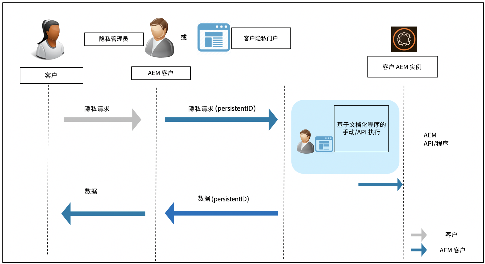

# Adobe Experience Manager 对数据保护与数据隐私法规的合规性准备 {#aem-readiness-for-data-protection-and-data-privacy-regulations}

>[!WARNING]
>
>本文档的内容不构成法律建议，也不会代替法律建议。
>
>请咨询您公司的法律部门，以获取关于数据保护和数据隐私条例的建议。

>[!NOTE]
>
>要详细了解 Adobe 对隐私问题的响应以及这对于您这样的 Adobe 客户的意义，请参阅 [Adobe 隐私中心。](https://www.adobe.com/cn/privacy.html)

Adobe 提供了相关文档和操作流程（在可用时还包括 API），供客户的隐私管理员或 AEM 管理员处理数据保护和隐私请求。这些内容可帮助您符合相关法规。文档中记录的流程允许客户手动执行合规请求，或在可用时通过外部门户或服务调用 API 来完成。

>[!CAUTION]
>
>此处记录的细节仅适用于 Adobe Experience Manager。
>
>其他 Adobe 按需插件的服务以及任何相关隐私请求需要在该服务上采取操作。
>
>有关更多信息，请参阅 [Adobe 隐私中心。](https://www.adobe.com/cn/privacy.html)

## 简介 {#introduction}

Adobe Experience Manager 的实例以及其上运行的应用程序由 Adobe 客户拥有并运营。

因此，GDPR、CCPA 及其他数据保护条例在很大程度上由客户负责。

作为一个简单的介绍，数据隐私和保护条例包括下列各方需要遵守的新规则：

* 业务实体（CCPA）和/或数据控制方（GDPR）

* 服务提供商（CCPA）和/或数据处理商（GDPR）

此类条例中的主要条款：

1. 扩展了个人数据的定义，以包括唯一 ID（在可直接和间接识别身份的数据中）。

2. 强化了对同意书的要求。

3. 增加了对删除权利的关注（数据清除）。

4. 数据销售的选择退出。

对于 Adobe Experience Manager：

* 实例以及其上运行的应用程序由客户拥有并运营。

   * 客户负责管理合规相关角色，包括企业实体与服务提供商、数据控制者和数据处理者等。

   * Adobe Experience Platform Privacy Service 不在 AEM 的工作流中，如下图所述。

* AEM 包括面向客户隐私管理员和/或 AEM 管理员的文档和过程，可手动或通过 API（在可用时）执行隐私监管请求。

* 未添加新的服务或 UI。

   * 而是记载了由处理隐私监管请求的客户 UI/门户使用的过程和 API。

* AEM 不包括任何现成的工具来支持隐私请求工作流。

   * Adobe 为客户的隐私管理员和 AEM 管理员提供文档和操作程序，使其能够手动执行与隐私法规相关的请求。

Adobe 提供了在 Adobe Experience Manager 中处理与访问、删除和退出相关的隐私请求的操作程序。在某些情况下，可以使用客户自建的门户或脚本调用 API，以协助实现自动化。

下图说明了隐私请求工作流可能的样子（使用 Adobe Experience Manager 6.5 说明）：

## Adobe Experience Manager 与监管准备工作 {#aem-and-regulatory-readiness}

请参阅以下各部分，了解 AEM 产品领域的合规文档。

## AEM 基础 {#aem-foundation}

参见[处理 AEM 基础的数据保护和隐私请求](/help/sites-administering/handling-gdpr-requests-for-aem-platform.md)。

## AEM 加入汇总使用统计数据收集 {#aem-opting-into-aggregate-usage-statistics-collection}

请参阅[汇总使用统计数据收集](/help/sites-deploying/opt-in-aggregated-usage-statistics.md)。

## AEM Sites {#aem-sites}

请参阅 [AEM Sites - 数据保护和隐私准备工作](/help/sites-administering/gdpr-compliance-sites.md)。

## AEM Commerce {#aem-commerce}

请参阅 [AEM Commerce - 数据保护和隐私准备工作](/help/sites-administering/gdpr-compliance-commerce.md)。

## AEM Mobile {#aem-mobile}

请参阅 [AEM Mobile - 数据保护和隐私准备工作](/help/mobile/aem-mobile-gdpr-compliance.md)。

## AEM 与 Adobe Target 和 Adobe Analytics 的集成 {#aem-integration-with-adobe-target-adobe-analytics}

这些 Adobe Experience Manager 集成都依托已符合数据保护和隐私（如 GDPR 或 CCPA）的服务。在这些集成过程中，Adobe Target 或 Adobe Analytics 的个人数据不会存储在 AEM 中。

有关更多信息，请参阅以下内容：

* [Adobe Target - 隐私概述](https://developer.adobe.com/target/before-implement/privacy/cmp-privacy-and-general-data-protection-regulation/?lang=en)

* [Adobe Analytics 数据隐私工作流](https://experienceleague.adobe.com/docs/analytics/admin/admin-tools/data-governance/an-gdpr-workflow.html)

## AEM Communities {#aem-communities}

AEM Communities 通过[开箱即用的 API](/help/communities/user-ugc-management-service.md)，赋予数据主体数据可携带权、访问权和被遗忘权。这些 API 支持批量删除与批量导出用户生成的内容，并可禁用通过授权 ID 识别的用户帐户。但是，要永久删除用户帐户，则需要在 CRXDE Lite 中删除用户节点，以满足从系统中便捷退出的需求。

此外，AEM Communities 通过其批量审核控制台实现了“隐私保护即设计”的理念，该控制台允许具备权限的成员查找并删除用户的贡献和详细信息。成员管理控制台可对用户进行限制，直至禁止其继续贡献。同时，它还赋予数据主体删除自己所贡献的内容的权限。

## AEM Forms {#aem-forms}

AEM Forms 包含可捕获、处理和存储数据的组件与工作流，以用于编排业务流程并完成数字化交易。不同的组件会使用不同的数据存储，同时也支持与自定义数据存储集成。以下文档说明了访问和处理用户数据的程序与指南，以支持组件级的数据保护与隐私（例如 GDPR 或 CCPA）工作流。

* [表单门户](/help/forms/using/forms-portal-handling-user-data.md)
* [通信管理](/help/forms/using/correspondence-management-handling-user-data.md)
* [与 Adobe Sign 集成](/help/forms/using/integration-adobe-sign-handling-user-data.md)
* [OSGi 上以表单为中心的工作流](/help/forms/using/forms-workflow-osgi-handling-user-data.md)
* [Forms JEE 工作流](/help/forms/using/forms-workflow-jee-handling-user-data.md)（仅限 AEM Forms JEE）
* [文档安全](/help/forms/using/document-security-handling-user-data.md)（仅限 AEM Forms JEE）
* [用户管理](/help/forms/using/user-management-handling-user-data.md)（仅限 AEM Forms JEE）
