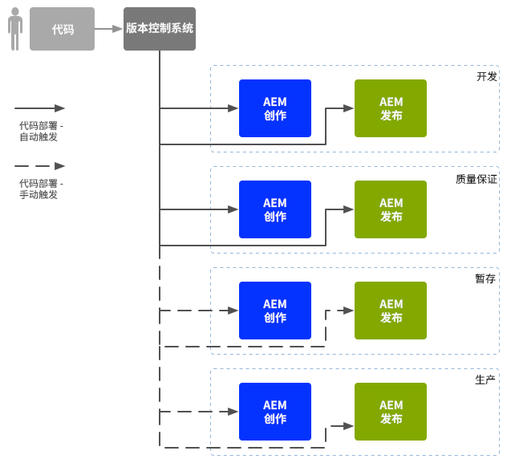

# 企业 DevOps{#enterprise-devops}

DevOps 涵盖了执行以下操作所需的流程、方法和通信：

* 轻松在各种环境中部署软件。
* 简化开发、测试和部署团队之间的协作。

DevOps 旨在避免出现以下问题：

* 手动错误。
* 被遗忘的元素；例如，文件、配置详细信息。
* 不一致的情况；例如，开发人员的本地环境与其他环境之间的不一致。

## 环境 {#environments}

Adobe Experience Manager（AEM）部署通常包含多个环境，用于在不同级别实现不同目的：

* [开发](#development)
* [质量保证](#quality-assurance)
* [暂存](#staging)
* [生产](#production-author-and-publish)

>[!NOTE]
>
>生产环境必须至少有一个创作环境和一个发布环境。
>
>建议所有其他环境也包含创作和发布环境，以反映生产环境并提前进行测试。

### 开发 {#development}

开发人员负责开发和定制提议的项目（网站、移动应用程序、DAM 实施等），包括所有必需的功能。他们：

* 开发和定制必要的元素；例如，模板、组件、工作流、应用程序
* 实现设计
* 开发必要的服务和脚本以实施所需的功能

[开发](/help/sites-developing/best-practices.md)环境的配置可能取决于多种因素，但通常包括：

* 具有版本控制的集成开发系统，可提供集成代码库。它可用于合并和强化每个开发人员使用的各个开发环境中的代码。
* 每个开发人员的个人环境；通常驻留在其本地计算机上。在适当的时间间隔将代码与版本控制系统同步

根据系统的规模，开发环境可以同时具有创作实例和发布实例。

### 质量保证 {#quality-assurance}

该环境由质量保证团队使用，用于全面[测试](/help/sites-developing/test-plan.md)新系统的设计和功能。它应同时具有创作和发布环境（包含适当的内容），并提供所有必要的服务以启用完整的测试套件。

### 暂存 {#staging}

暂存环境应该是生产环境的镜像 - 配置、代码和内容：

* 可以将该环境用于测试用于实施实际部署的脚本。
* 在部署到生产环境之前，可将该环境用于最终测试（设计、功能和界面）。
* 尽管暂存环境并不总是能够与生产环境相同，但应该使其尽可能的接近生产环境，以便启用性能和负载测试。

### 生产 - 创作和发布 {#production-author-and-publish}

生产环境包括实际[创作和发布](/help/sites-authoring/author.md#concept-of-authoring-and-publishing)您的实施所需的环境。

生产环境至少包含一个作者实例和一个发布实例：

* 用于内容输入的[创作](#author)实例。
* 向访客/用户提供内容的[发布](#publish)实例。

根据项目规模，它通常包括多个创作实例，或多个发布实例，或两者兼有。在较低的级别上，存储库也可群集到多个实例。

#### 创作 {#author}

创作实例通常位于内部防火墙之后。这是您和您的同事将在其中执行创作任务的环境，例如：

* 管理整个系统
* 输入内容
* 配置内容的布局和设计
* 激活内容以将其传输到发布环境

已激活的内容将打包，并被放置在创作环境的复制队列中。然后，复制流程会将该内容传输到发布环境。

为了将发布环境中生成的数据反向复制到创作环境中，创作环境中的复制侦听器会轮询发布环境，并会从发布环境的反向复制发件箱中检索相关内容。

#### 发布 {#publish}

发布环境位于“隔离区”（DMZ）。这是访客访问和交互内容的环境（例如通过网站或移动应用程序），无论是面向公众，还是在企业内网中均是如此。发布环境：

* 拥有从创作环境复制的内容
* 向访客提供该内容
* 存储由访客生成的用户数据，例如评论或其他表单提交
* 可以配置为将此类用户数据添加到发件箱，以便反向复制回创作环境

发布环境可实时动态生成内容，并且可以针对每位用户提供个性化内容。

## 代码移动 {#code-movement}

代码始终应自下而上传播：

* 代码最初是在本地环境开发，然后是在集成的开发环境中开发
* 随后在 QA 环境中进行全面测试
* 接着在暂存环境中再次进行测试
* 直到那时才能将代码部署到生产环境

代码（例如自定义的 Web 应用程序功能和设计模板）通过在不同内容存储库之间导出和导入包的方式进行传输。在需要的地方，可以将此复制配置为一个自动流程。

AEM 项目通常会触发代码部署：

* 自动：用于传输到开发和 QA 环境。
* 手动：以更加可控的方式部署到暂存和生产环境，通常手动进行；但如果需要，也可以配置为自动。

## 内容移动 {#content-movement}

为生产创建的内容应&#x200B;**始终**&#x200B;在生产创作实例上进行创作。

内容不应仿效代码从较低级别环境移动到较高级别环境，因为让作者在本地计算机上或在较低级别环境中创建内容，然后将该内容移动到生产环境，这并不是一种好的做法，而且还可能会导致错误和不一致。

应将生产内容从生产环境移动到暂存环境，以确保暂存环境可提供高效、准确的测试环境。

>[!NOTE]
>
>这并不意味着暂存内容必须持续与生产环境保持同步，定期更新即可，但尤其是在测试新一轮代码迭代之前进行更新。QA 和开发环境中的内容无需频繁更新，应能良好地代表生产环境的内容。

内容可以通过以下方式进行传输：

* 在不同环境之间——通过导出和导入包。
* 在不同实例之间：直接复制内容（[AEM 复制](/help/sites-deploying/replication.md)），通过 HTTP 或 HTTPS 连接完成。

