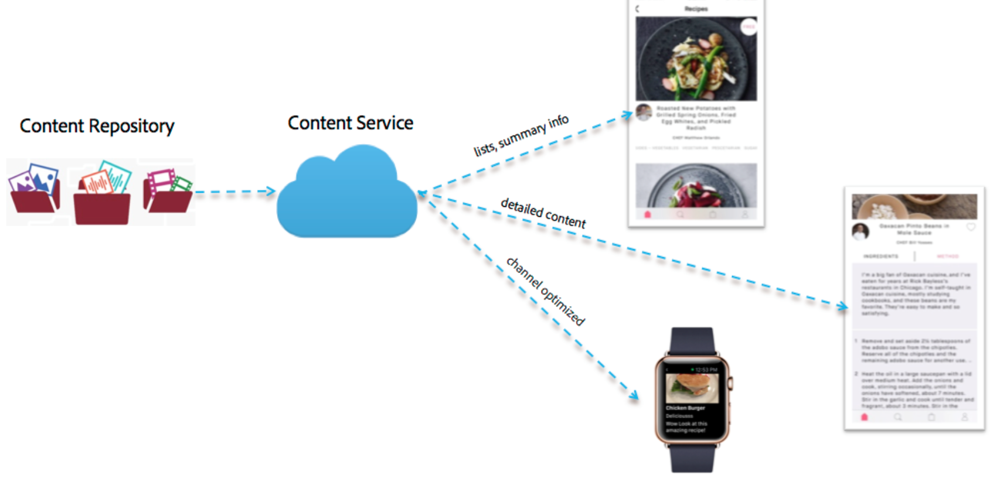

# 内容交付{#content-delivery}

{{ue-over-mobile}}

移动设备应用程序应当能够根据需要使用AEM中的所有内容来提供有针对性的应用程序体验。

这包括使用资产、网站内容、CaaS内容（空中）内容以及可能具有自身结构的自定义内容。

>[!NOTE]
>
>**无线内容**&#x200B;可以通过ContentSync处理程序从以上任何内容获得。 它可用于通过ZIP对包进行批处理并投放，以及维护这些包的更新。

Content Services提供了三种主要类型的资料：

1. **Assets**
1. **打包的HTML内容(HTML/CSS/JS)**
1. **独立于渠道的内容**

## 资源 {#assets}

资源收藏集是包含对其他收藏集的引用的AEM构造。

资产收藏集可以通过Content Services公开。 在请求中调用资产收藏集，会返回一个对象，该对象是资产的列表 — 包括其URL。 可通过URL访问Assets。 URL在对象中提供。 例如：

* 页面实体返回包含图像引用的JSON（页面对象）。 图像引用是用于获取图像的资产二进制文件的URL。
* 请求文件夹中的资产列表会返回JSON，其中包含有关该文件夹中所有实体的详细信息。 该列表是一个对象。 JSON具有一些URL引用，用于获取该文件夹中每个资产的二进制文件。

### 资产优化 {#asset-optimization}

Content Services的一个关键价值是能够返回针对设备优化的资产。 这减少了本地设备存储需求，并提高了应用程序性能。

资产优化是一种服务器端函数，它基于API请求中提供的信息。 应尽可能缓存资产演绎版，以便类似的请求不需要重新生成资产演绎版。

### Assets工作流程 {#assets-workflow}

资源工作流如下所示：

1. AEM中现成可用的资源参考
1. 创建给定模型的资产引用实体
1. 编辑实体

   1. 选择资源或资源收藏集
   1. 自定义JSON渲染

下图显示了&#x200B;**Assets引用工作流**：

### 管理Assets {#managing-assets}

Content Services提供对AEM管理的资源的访问权限，这些资源可能无法通过其他AEM内容引用。

#### 现有的托管Assets {#existing-managed-assets}

AEM Sites和Assets的用户正在使用AEM Assets管理其所有渠道的所有数字材料。 他们正在开发本机移动设备应用程序，并且必须使用AEM Assets管理的多个资源。 例如，徽标、背景图像和按钮图标。

目前，这些资源分布在Assets存储库中。 应用程序必须引用的文件如下：

* /content/dam/geometrixx-outdoors/brand/logo_light.png
* /content/dam/geometrixx-outdoors/brand/logo_dark.png
* /content/dam/geometrixx-outdoors/styles/backgrounds/grey_blue.jpg
* /content/dam/geometrixx-outdoors/brand/icons/app/cart.png
* /content/dam/geometrixx-outdoors/brand/icons/app/home.png

#### 访问CS资产实体 {#accessing-cs-asset-entities}

现在，让我们暂且将通过API提供页面的步骤放在一边(AEM UI描述涵盖了该页面)，并假定已完成此操作。 已创建资产实体并将其添加到“appImages”空间。 出于组织目的，在该空间下创建了其他文件夹。 因此，资产实体在AEM JCR中存储为：

* /content/entities/appImages/logos/logo_light
* /content/entities/appImages/logos/logo_dark
* /content/entities/appImages/bkgnd/gray_blue
* /content/entities/appImages/icons/cart
* /content/entities/appImages/icons/home

#### 获取可用资源实体的列表 {#getting-a-list-of-available-asset-entities}

应用程序开发人员可以通过检索资产实体来获取可用资产列表。 内容服务空间端点可以通过Web服务API SDK提供该信息。

结果将会是JSON格式的对象，该对象将提供“图标”文件夹中的资产列表。

#### 获取图像 {#getting-an-image}

JSON为Content Services生成的每个图像向图像提供一个URL。

要获取“cart”图像的二进制文件，请再次使用客户端库。

## 打包HTML内容 {#packaged-html-content}

必须维护内容布局的客户需要HTML内容。 这对于使用Web容器（如Cordova Webview）显示内容的本机应用程序非常有用。

AEM Content Services通过API向移动设备应用程序提供HTML内容。 希望将AEM内容作为HTML公开的客户可以创建指向AEM内容源的HTML页面实体。

考虑以下选项：

* **Zip文件：**&#x200B;为了有最好的机会在设备上正确显示，页面引用的材料 — css、JavaScript、资源等将包含在带有响应的单个压缩文件中。 可以调整“HTML”页面中的引用，以使用这些文件的相对路径。
* **流：**&#x200B;从AEM获取所需文件的清单。 然后使用该清单通过后续请求来请求所有文件(HTML、CSS、JS等)。

## 独立于渠道的内容 {#channel-independent-content}

与渠道无关的内容是一种无需担心布局、组件或其他特定于渠道的信息即可公开AEM内容构建（如页面）的方法。

这些内容实体是使用内容模型生成的，用于将AEM结构转换为JSON格式。 生成的JSON数据包含有关与AEM存储库分离的内容数据的信息。 这包括返回指向资源的元数据和AEM引用链接，以及内容结构（包括实体层次结构）之间的关系。

### 管理独立于渠道的内容 {#managing-channel-independent-content}

内容可以通过多种方式访问应用程序。

1. 通过AEM Over-The-AirGET内容ZIP

   * 内容同步处理程序可以直接更新zip包，也可以通过调用现有的内容渲染器来更新

      * 平台处理程序
      * AEM处理程序
      * 自定义处理程序

1. 通过内容渲染器直接GET内容

   * 开箱即用的默认Sling渲染器
   * AEM Mobile/Content Services内容渲染器
   * 自定义渲染
