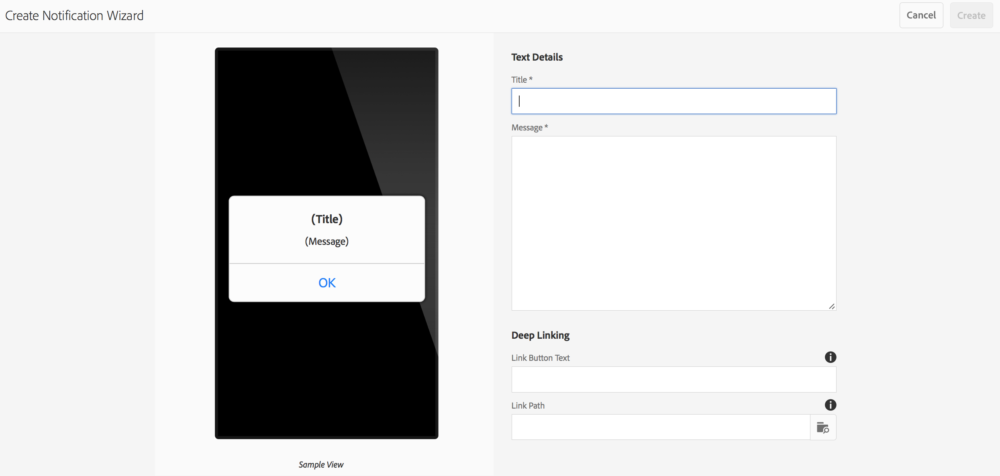

# 推送通知{#push-notifications}

>[!NOTE]
>
>Adobe建议对需要基于单页应用程序框架的客户端渲染（例如React）的项目使用SPA编辑器。 [了解详情](/help/sites-developing/spa-overview.md)。

能够使用重要通知即时提醒Adobe Experience Manager (AEM)移动应用程序用户，这对于移动应用程序的价值及其营销活动至关重要。 此处描述了要让应用程序接收推送通知所必须执行的步骤。 您还将了解如何配置推送，并将其从AEM Mobile发送到手机上安装的应用程序。 此外，本节还介绍如何配置 [深层链接](#deeplinking) 功能添加到推送通知。

>[!NOTE]
>
>*推送通知不保证会传送；它们更像公告。 尽最大努力确保每个人都收到这些邮件，但它们不是保证的投放机制。 此外，推送时间从不到一秒到最多半个小时不等。*

在AEM中使用推送通知需要一些不同的技术。 首先，必须使用推送通知服务提供商来管理ethenotifications和设备(AEM尚未执行此操作)。 使用AEM现成配置了两个提供程序： [Amazon Simple Notification Service](https://aws.amazon.com/sns/) （或SNS），以及 [Pushwoosh](https://www.pushwoosh.com/). 其次，给定移动操作系统的推送技术必须通过适当的服务 — 适用于iOS设备的Apple推送通知服务（或APNS）；以及适用于Android™设备的Google云消息（或GCM）。 虽然AEM不会直接与这些平台特定的服务进行通信，但AEM必须提供一些相关的配置信息，以及这些服务执行推送的通知。

安装和配置后（如下所述），其工作方式如下：

1. 推送通知在AEM中创建，并发送到服务提供商(Amazon SNS或Pushwoosh)。
1. 服务提供商接收该请求并将其发送到核心提供商（APNS或GCM）。
1. 核心提供商将通知推送到为该推送注册的所有设备。 对于每个设备，它会使用蜂窝数据网络或WiFi（设备上的任何可用项）。
1. 如果为其注册的应用程序未运行，则会在设备上显示通知。 用户点击通知会启动应用程序并在应用程序中显示通知。 如果应用程序已在运行，则仅显示应用程序内通知。

此版本的AEM支持iOS和Android™移动设备。

## 概述和程序 {#overview-and-procedure}

要在AEM Mobile应用程序中使用推送通知，必须执行以下高级步骤。

通常，Experience Manager开发人员会执行以下操作：

1. 注册Apple和Google报文传送服务
1. 注册并配置推送消息服务
1. 向应用程序添加推送支持
1. 准备电话以进行测试

当Experience Manager管理员执行以下操作时：

1. 在AEM应用程序上配置推送
1. 构建和部署应用程序
1. 发送推送通知
1. 配置深层链接 *（可选）*

### 步骤1：注册Apple和Google消息服务 {#step-register-with-apple-and-google-messaging-services}

#### 使用Apple推送通知服务(APNS) {#using-the-apple-push-notification-service-apns}

转到Apple页面 [此处](https://developer.apple.com/documentation/usernotifications#//apple_ref/doc/uid/TP40008194-CH8-SW1) 以熟悉Apple推送通知服务。

要使用APN，您需要 **证书** 文件（ .cer文件），推送 **私钥** （a .p12文件）和 **私钥密码** 来自Apple的。 有关如何执行此操作的说明，请参见 [此处](https://developer.apple.com/library/archive/documentation/NetworkingInternet/Conceptual/RemoteNotificationsPG/).

#### 使用Google Cloud Messaging (GCM)服务 {#using-the-google-cloud-messaging-gcm-service}

>[!NOTE]
>
>Google正在将GCM替换为名为Firebase Cloud Messaging (FCM)的类似服务。 有关FCM的详细信息，请单击 [此处](https://firebase.google.com/docs/cloud-messaging/).

转到Google页面 [此处](https://developer.android.com/google/gcm/index.html) 以熟悉Google Cloud Messaging for Android™。

[请按照以下步骤操作](https://developer.android.com/google/gcm/gs.html) 到 **创建Google API项目**， **启用GCM服务**、和 **获取API密钥**. 您需要 **API密钥** 将推送通知发送到Android™设备。 此外，请录制您的 **项目编号**，有时也称为 **GCM发件人ID**.

以下步骤显示了创建GCM API密钥的不同方法：

1. 登录google并转到 [Google的“开发人员”页面](https://developers.google.com/mobile/add?platform=android&amp;cntapi=gcm).
1. 从列表中选择您的应用程序（或创建一个）。
1. 在Android™包名称下，输入您的应用程序ID，即， `com.adobe.cq.mobile.weretail.outdoorsapp`. （如果上述方法不起作用，请使用“test.test”重试。）
1. 单击 **继续选择并配置服务**
1. 选择云消息，然后单击 **启用Google云消息**.
1. 随后将显示新的服务器API密钥和（新的或现有的）发件人ID。

>[!NOTE]
>
>记录服务器API密钥。 在推送提供商的网站上输入此值。

### 步骤2：注册并配置推送消息服务 {#step-register-and-configure-a-push-messaging-service}

AEM配置为使用下列三种推送通知服务之一：

* Amazon SNS
* Pushwoosh
* Adobe Mobile Services

*AMAZON SNS* 和 *Pushwoosh* 配置允许您从AEM屏幕内部发送推送消息。

*Adobe移动服务* 配置允许您使用Adobe Analytics帐户在Adobe Mobile Services中配置和发送推送通知（但必须使用此配置集构建应用程序才能启用AMS推送通知）。

#### 使用Amazon SNS消息服务 {#using-the-amazon-sns-messaging-service}

>[!NOTE]
>
>*此处可找到有关Amazon SNS的信息以及创建AWS帐户的链接 [此处](https://aws.amazon.com/sns/). 你可以免费登记一年。*

如果您不想使用Amazon SNS，则可以跳过这些步骤。

请按照以下步骤为推送通知设置Amazon SNS：

1. **注册Amazon SNS**

   1. 记录您的帐户ID。 格式应为12位数，且不含空格或破折号，即“123456789012”。
   1. 确保您位于“美国东部”或“欧盟”地区，因为后续步骤（创建身份池）需要其中一个。
   1. 注册后，登录到管理控制台并选择 [SNS](https://console.aws.amazon.com/sns/) （推送通知服务）。 如果出现，请单击“Get Started（开始）”。

1. **创建访问密钥和ID**

   1. 单击屏幕右上方的登录名，然后从菜单中选择“安全凭据”。
   1. 单击“Access Keys（访问密钥）” ，然后在下面的空白处单击 **创建新的访问密钥**.
   1. 单击 **显示访问密钥**，并复制和保存显示的访问密钥ID和访问密钥。 如果选择用于下载密钥的选项，您将获得一个包含这些相同值的csv文件。
   1. 可以在此页面上管理其他与安全相关的证书以及某些其他证书。

   >[!NOTE]
   >
   >访问密钥可用于多个应用程序。

   对于使用“AWS沙盒”帐户的组织，这些步骤相似，并概述如下：

   1. 单击屏幕右上方的登录名，然后从菜单中选择“我的安全凭据”。
   1. 单击左侧操作列表中的用户，然后选择您的用户名。
   1. 单击“安全身份证明”选项卡。
   1. 在此处，您可以查看自己的密钥并创建新密钥。 保存密钥供以后使用。

1. **创建主题**

   1. 单击 **创建主题** 并选择主题名称。 记录所有字段，如“主题ARN”、“主题所有者”、“区域”、“显示名称”。
   1. 单击 **其他主题操作** > **编辑主题策略**. 下 **允许这些用户订阅此主题**，选择 **每个人。**
   1. 单击 **更新策略**.

   >[!NOTE]
   >
   >您可以为不同的场景（如开发、测试和演示）创建多个主题。 SNS配置的其余部分可以保持不变。 使用其他主题构建应用程序；发送到该主题的推送通知将仅由使用该主题构建的应用程序接收。

1. **创建平台应用程序**

   1. 单击应用程序，然后单击创建平台应用程序。 选择一个名称并选择一个平台(APNS for iOS、GCM for Android™)。 取决于平台。 必须填写其他字段：

      1. 对于APNS，必须输入P12文件、密码、证书和私钥。 这些应该已在步骤中获得 *使用Apple推送通知服务(APNS)* 以上。
      1. 对于GCM，必须输入API密钥。 这应在步骤中获得 *使用Google Cloud Messaging (GCM)服务* 以上。

   1. 为您支持的每个平台重复上述步骤一次。 要同时推送到iOS和Android™，必须创建两个平台应用程序。

1. **创建身份池**

   1. 使用 [Cognito](https://console.aws.amazon.com/cognito) 创建身份池，用于存储未经身份验证的用户的基本数据。 请注意，Amazon Cognito当前仅支持“美国东部”和“欧盟”地区。
   1. 为其命名，并选中“启用对未经身份验证的标识的访问”复选框。
   1. 在下一页(&quot;*您的Cognito身份需要访问您的资源*“)单击“允许”。
   1. 在页面的右上角，单击链接»*编辑身份池”*. 将显示身份池ID。 保存此文本供以后使用。
   1. 在同一页面上，选择“Unauthenticated role”旁边的下拉菜单，并确保它具有Cognito_角色&lt;pool name=&quot;&quot;>已选择UnauthRole。 保存更改。

1. **配置访问权限**

   1. 登录 [身份和访问管理](https://console.aws.amazon.com/iam/home) (IAM)。
   1. 选择角色。
   1. 单击在上一步中创建的角色，称为Cognito_&lt;youridentitypoolname>Unauth_Role。 记录显示的“角色ARN”。
   1. 打开“内联策略”（如果尚未打开）。 您应该会看到一个名为oneClick_Cognito_的策略&lt;youridentitypoolname>Unauth_Role_1234567890123。
   1. 单击“编辑策略”。 将策略文档的内容替换为以下JSON代码片段：

   <table>
    <tbody>
     <tr>
     <td>
 
 
{
 
 “版本”：“2012-10-17”，
 
 "语句": [
 
 {
 
 "操作": [
 
 "mobileanalytics：PutEvents"，
 
 “cognito-sync：*”，
 
 "SNS：CreatePlatformEndpoint"，
 
 "SNS：Subscribe"
 
 ],
 
 "Effect"： "Allow"，
 
 "资源": [
 
 "*"
 
 ]
 
 }
 
 ]
 
}
 
 
 </td>
     </tr>
    </tbody>
    </table>

   1. 单击 **应用策略**.

#### 使用Pushwoosh消息服务 {#using-the-pushwoosh-messaging-service}

如果您不想使用Pushwoosh，则可以跳过此步骤。

要使用Pushwoosh，请执行以下操作：

1. **注册Pushwoosh**

   1. 转到pushwoosh.com并创建帐户。

1. **创建API访问令牌**

   1. 在Pushwoosh网站上，转到API访问菜单项以生成API访问令牌。 安全地记录此令牌。

1. **创建应用程序**

   1. 要支持Android™，您必须提供GCM API密钥。
   1. 配置应用程序时，选择Cordova作为框架。
   1. 对于iOS支持，您必须提供证书文件(.cer)、推送证书(.p12)和私钥密码；这些密码应该已从Apple的APNS站点中获取。 对于“框架”，请选择“Cordova”。
   1. Pushwoosh将为该应用程序生成一个应用程序ID，格式为“XXXXX-XXXXX”，其中每个X都是一个十六进制值（0到F）。

>[!NOTE]
>
>*如果在AEM中使用相同的应用程序ID（和其他相关值： API访问令牌和GCM ID）配置了第二个应用程序，则通过AEM上的第二个应用程序发送的任何推送通知都将发送到使用该应用程序ID的任何其他应用程序。*

### 步骤3：向应用程序添加推送支持 {#step-add-push-support-to-the-app}

#### 添加ContentSync配置 {#add-contentsync-configuration}

创建两个名为notificationsConfig的内容节点（一个在app-config中，一个在app-config-dev中）：

* /content/`<your app>`/shell/jcr：content/pge-app/app-config-dev/notificationsConfig
* /content/`<your app>`/shell/jcr：content/page-app/app-config/notificationsConfig

使用以下属性（.content.xml文件）：
&lt;jcr:root xmlns:jcr=&quot; &lt;span id=&quot; translate=&quot;no&quot; />https://developer.adobe.com/experience-manager/reference-materials/spec/jcr/1.0/index.html](https://developer.adobe.com/experience-manager/reference-materials/spec/jcr/1.0/index.html)&quot; xmlns：nt=&quot; [https://developer.adobe.com/experience-manager/reference-materials/spec/jcr/1.0/index.html](https://developer.adobe.com/experience-manager/reference-materials/spec/jcr/1.0/index.html)&quot; jcr：primaryType=&quot;nt：unstructured&quot; excludeProperties=&quot;[appAPIAccessToken]&quot; path=&quot;。./../../...&quot;
[targetRootDirectory=&quot;www&quot; type=&quot;notificationsconfig&quot;/>

>[!NOTE]
>
>内容同步处理程序将查找这些节点，如果它们不存在，则不会写出page-notifications-config.json文件。

#### 添加客户端库 {#add-client-libraries}

必须按照以下步骤将推送通知客户端库添加到应用程序中：

CRXDE Lite：

1. 导航到 */etc/designs/phonegap/&lt;app name=&quot;&quot;>/clientlibsall。*
1. 在属性窗格中双击嵌入部分。
1. 在出现的对话框中，单击+按钮以添加客户端库。
1. 在新文本字段中，添加“cq.mobile.push”，然后单击“确定”。
1. 再添加一个名为cq.mobile.push.amazon的文件，然后单击“确定”。
1. 保存更改。

>[!NOTE]
>
>出于应用程序上空间考虑以及避免控制台错误消息的考虑，如果删除或未使用推送通知，请从您的应用程序中删除这些clientlibs。

### 步骤4：准备电话以进行测试 {#step-prepare-a-phone-for-testing}

>[!NOTE]
>
>*对于推送通知，您必须在实际设备上测试，因为模拟器无法接收推送通知。*

#### iOS {#ios}

对于iOS，请使用macOS计算机并加入 [iOS开发人员计划](https://developer.apple.com/programs/ios/). 有些公司拥有公司许可证，可供所有开发人员使用。

使用XCode 8.1时，在使用推送通知之前，您必须转到项目中的功能选项卡，并将推送通知切换为打开状态。

#### Android™ {#android}

要使用CLI在Android™手机上安装应用程序，请执行以下操作(请参阅以下内容： **步骤6 — 构建和部署应用程序**)，您首先必须将手机置于“开发人员模式”。 请参阅 [启用设备上开发人员选项](https://developer.android.com/tools/device.html#developer-device-options) 以了解有关执行此操作的详细信息。

### 步骤5：在AEM应用程序上配置推送 {#step-configure-push-on-aem-apps}

在构建并部署到您配置的移动设备之前，必须为决定使用的消息服务配置通知设置。

1. 为推送通知创建相应的授权组。
1. 以相应的用户身份登录AEM，然后单击“应用程序”选项卡。
1. 单击应用程序。
1. 找到管理Cloud Service图块，然后单击铅笔图标以修改云配置。
1. 选择Amazon SNS连接、Pushwoosh连接或AdobeMobile Services作为通知配置。
1. 输入提供程序属性，单击提交以保存它们，然后单击完成。 除非有AMS，否则在此阶段不会对其进行远程验证。
1. 此时，您应该会看到刚才在“管理Cloud Service”拼贴上输入的配置。

### 步骤6：构建和部署应用程序 {#step-build-and-deploy-the-app}

**注意：** 请参阅相关说明 [此处](/help/mobile/building-app-mobile-phonegap.md) 构建PhoneGap应用程序时。

使用PhoneGap构建和部署应用程序的方法有两种。

**注意：** 对于推送通知测试，模拟器不够，因为推送通知在推送提供程序(Apple或Google)和设备之间使用不同的协议。 当前的Mac/PC硬件和模拟器不支持此功能。

1. *PhoneGap Build* 是PhoneGap提供的一种服务，可以在他们的服务器上为您构建应用程序，并允许您将其直接下载到设备。 请参阅PhoneGap Build文档，网址为 `https://build.phonegap.com/` 了解如何设置和使用PhoneGap Build。

1. *PhoneGap命令行界面* (CLI)允许您在命令行中使用一组丰富的PhoneGap命令来构建、调试和部署应用程序。 请参阅PhoneGap开发人员文档(`https://docs.phonegap.com/en/edge/guide_cli_index.md.html#The%20Command-Line%20Interface`)，了解如何设置和使用PhoneGap CLI。

### 步骤7：发送推送通知 {#step-send-a-push-notification}

要创建并发送通知，请执行以下步骤。

1. 创建通知

   * 在AEM Mobile应用程序的仪表板中，找到“推送通知”拼贴。
   * 在右上角的菜单中，选择“创建”。 在首次设置云配置之前，此按钮不可用。
   * 在创建通知向导中，输入标题和消息，然后单击“创建”按钮。 您的通知现在可以立即发送或稍后发送。 可以对其进行编辑，并且可以更改和保存消息和/或标题。

1. 发送通知

   * 在应用程序仪表板中，找到推送通知拼贴。
   * 选择通知，或单击右下方的详细信息按钮( )。..)，显示通知列表。 此列表还指示通知是否已准备好发送、已发送，或者在发送过程中是否出现错误。
   * 选中一个通知的复选框（仅限），然后单击列表上方的“发送通知”按钮。 在出现的对话框中，您有机会“取消”或“发送”通知。

1. 处理结果

   * 如果推送通知服务(Amazon SNS或Pushwoosh)收到发送请求，确认该请求有效，然后将其成功发送给本机提供程序（APNS和GCM），“发送”对话框会关闭，但不显示任何消息。 在通知列表中，该通知的状态将列为“已发送”。
   * 如果推送发送失败，则对话框会显示一条消息，指示问题。 在通知列表中，该通知的状态列为“错误”，但如果问题已解决，则可再次发送通知。 如果出现错误，则服务器错误日志中应显示其他错误信息。
   * 请注意，iOS与Android™推送通知之间存在一些平台差异。 其中包括：

      * 在Android™上部署应用程序后，使用CLI构建将会启动该应用程序。 在iOS上，您必须手动启动它。 由于推送注册步骤在启动时执行，因此Android™应用程序可以立即接收推送通知（因为它已启动并注册），而iOS应用程序则无法接收推送通知。
      * 在Android™上，“确定”按钮文本全部为大写字母（以及在应用程序内通知中添加的任何其他按钮中均为大写字母），而在iOS中则否。

对于AMS推送通知，必须从AMS服务器编写并发送通知。 AMS提供了其他推送通知功能，这些功能超出了使用AWS和Pushwoosh发送AEM通知时提供的功能。

>[!NOTE]
>
>*推送通知不保证会传送；它们更像公告。 我们尽最大努力确保每个人都能听到，但它们不是保证的交付机制。 此外，推送时间从不到一秒到最多半个小时不等。*

### 配置与推送通知的深层链接 {#configuring-deep-linking-with-push-notifications}

什么是深层链接？ 在推送通知的上下文中，它是一种允许将应用程序打开或定向（如果打开）到应用程序内的指定位置的方法。

它是如何工作的？ 推送通知的作者可以选择添加按钮标签（即“向我显示！”） ，并通过可视路径浏览器选择要在通知中链接的页面。 发送后，推送将正常发生，只不过在应用程序内消息中，“确定”按钮将被替换为“解除”按钮，并且新按钮已指定（“向我显示！”） 也会显示。 单击“新建”按钮可让应用程序转到应用程序内的指定页面。 单击关闭可清除消息。

如果应用程序未打开，则阴影会正常显示。 在阴影下对通知执行操作会打开应用程序，然后根据推送通知中的配置向用户显示深层链接按钮。

创建通知，为可选深层链接添加按钮文本和链接路径：

>[!CAUTION]
>
>要访问仪表板中的“推送通知”拼贴，请执行以下步骤。

1. 单击右上角的编辑 **管理Cloud Service** 磁贴。

   

1. 选择 **Pushwoosh连接**. 单击&#x200B;**下一步**。

   

1. 输入属性的详细信息，然后单击 **提交**.

   

   提交配置后， **推送通知** 图块显示在功能板中。

   

### 创建通知向导 {#create-notification-wizard}

一旦 **推送通知** 图块显示在您的仪表板中，使用创建通知向导添加内容：

1. 单击右上角的添加符号 **推送通知** 用于打开 **创建通知向导**.

   

1. 单击链接路径中的浏览图标，将为用户显示应用程序的内容结构。

   选择路径后，单击复选图标。

   

   >[!NOTE]
   >
   >链接按钮文本限制为20个字符。
   >
   >如果最终用户没有应用程序的最新版本，并且链接的路径不可用，则确认深层链接的操作会将用户引导至应用程序的主页。

1. 输入 **文本详细信息** 在 **创建通知向导** 并单击 **创建**.

   

   单击您从创建的推送通知以打开详细信息 **推送通知** 磁贴。

   您可以编辑属性、发送通知或删除通知。

   

>[!NOTE]
>
>**附加信息**:
>
>6.4版本之后不支持Pushwoosh和Amazon SNS，它们将作为一个加载项从包共享中提供。

### 后续步骤 {#the-next-steps}

了解应用程序推送通知的详细信息后，请参阅 [AEM Mobile内容个性化](/help/mobile/phonegap-aem-mobile-content-personalization.md).
