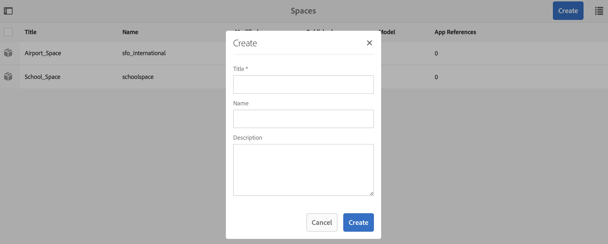

# 空间和实体{#spaces-and-entities}

>[!NOTE]
>
>Adobe建议对需要基于单页应用程序框架的客户端渲染（例如React）的项目使用SPA编辑器。 [了解更多](/help/sites-developing/spa-overview.md)。

空间是存储通过Content Services REST API公开的实体的便利位置。 这尤其有用，因为应用程序（或任何渠道）可以与许多实体相关联。 强制实体位于空间内会强制将应用程序要求分组的最佳实践。 或者，您可以将AEM中的应用程序与少量空间关联。

>[!NOTE]
>
>要使内容服务中的任何渠道都可以使用该内容，内容必须位于空格下方。

## 创建空间 {#creating-a-space}

如果用户希望向移动设备应用程序公开大量内容和资产，则可以使用AEM Mobile仪表板创建空间。

如果用户首次未将Content Services配置为使用空间，则AEM Mobile功能板在选中后仅显示应用程序 **内容服务**.

>[!CAUTION]
>
>**添加空间的先决条件**
>
>查看 **启用AEM内容服务** 使用空间并在AEM Mobile应用程序仪表板中启用它。
>
>参见 [管理内容服务](/help/mobile/developing-content-services.md) 了解更多详细信息。

在仪表板中配置空间后，请按照以下步骤创建空间：

1. 选择 **空间** 来自Content Services。

   

1. 选择 **创建** 创建空间。 输入 **标题**， **名称**、和 **描述** 为空间而战。

   单击&#x200B;**创建**。

   

## 管理空间 {#managing-a-space}

创建空间后，单击左侧以管理列表中的空间。

您可以查看空间的属性、删除空间或将空间及其内容发布到AEM发布实例。

**查看和编辑空间的属性**

1. 从列表中选择空间
1. 选择 **属性** 工具栏中的
1. 单击 **关闭** 完成时

**发布空间** 发布空间时，也会发布该空间中的所有文件夹和实体。

1. 通过单击“空间控制台”列表中的空间图标来选择空间
1. 选择 **发布树**

>[!NOTE]
>
>您可以 **取消发布** 空间，用于从发布实例中删除空间。
>
>下图说明了发布空间后可以执行的操作。

## 使用空间中的文件夹 {#working-with-folders-in-a-space}

空间可以包括文件夹，以帮助进一步组织空间的内容和资源。 用户可以在空间下创建自己的层次结构。

### 创建文件夹 {#creating-a-folder}

1. 在空间控制台的列表中单击空间，然后单击 **创建文件夹**

   

1. 输入 **标题**， **名称，** 和 **描述** （对于文件夹）

   

1. 单击 **创建** 在空间中创建文件夹

## 语言复制 {#language-copy}

>[!CAUTION]
>
>此版本的语言副本功能不足。 它只设置结构。

此 **语言副本** 该功能允许作者复制其主控的语言副本，然后创建项目和工作流程以自动翻译内容。 语言副本创建正确的结构。 在共享空间中添加文件夹后，可以向共享空间中添加语言副本。

>[!NOTE]
>
>建议任何可能翻译的内容都应放置在语言副本节点下。

### 添加语言副本 {#adding-language-copy}

1. 创建空间后，单击该空间以创建语言副本。

   单击 **创建** 并选择 **语言副本**.

   

   >[!NOTE]
   >
   >语言副本节点只能作为空间的直接子节点存在。

1. 选择 **内容包语言(&amp;A)；** 并输入 **标题(&amp;A)；** 在 **创建语言副本** 对话框。

   单击&#x200B;**创建**。

   

1. 创建语言副本后，它将显示在你的共享空间中 **语言母版**.

   

   >[!NOTE]
   >
   >选择 **语言母版** 查看语言副本文件夹。

### 从空间中删除文件夹 {#removing-a-folder-from-the-space}

1. 从空间内容列表中选择文件夹
1. 单击 **删除** 工具栏中的

   >[!NOTE]
   >
   >要导航到文件夹中并查看其内容或添加子文件夹或实体，请单击空间内容列表中的文件夹标题。

## 使用空间中的实体 {#working-with-entities-in-a-space}

实体表示通过Web服务端点公开的内容。 实体存储在空间中，以便可以轻松地找到并保持独立于保存其相关内容的AEM存储库结构。

您可能希望将实体分组到某个逻辑集合中。 为此，您可以创建任意数量的文件夹。

如果为数据建模而收集了图元子项（即其他图元），则开发人员用户可以从“图元组”模型类型创建特定的“组模型”（现成可用）。

>[!NOTE]
>
>实体始终与空间相关联，因此可通过空间控制台访问大多数实体用户界面。

### 创建实体 {#creating-an-entity}

1. 打开共享空间控制台，然后单击共享空间的标题。

   （可选）您可以通过单击列表中的文件夹标题导航到该文件夹。

   

1. 为图元选择模型。 这是要创建的实体类型。 单击下一步。

   

   >[!NOTE]
   >
   >您可以选择使用 **资产模型**， **页面模型**&#x200B;或之前创建的图元类型的模型。
   >
   >参见 [创建模型](/help/mobile/administer-mobile-apps.md)，以创建自定义实体。

1. 输入 **标题**， **名称**， **描述**、和 **标记** 实体的。 单击&#x200B;**创建**。

   

   完成后，实体将显示在空间的子项中。

### 编辑实体 {#editing-an-entity}

1. 创建实体后，转到文件夹或共享空间，然后从共享空间控制台中选择要编辑的实体。

   

1. 选择要编辑的实体，然后单击 **编辑**.

   

   >[!CAUTION]
   >
   >根据您选择创建实体的模板，用于编辑和查看实体属性的UI将有所不同。 有关更多详细信息，请参阅以下步骤。

   ***如果选择用于创建实体作为资产模型的模板***，单击 **编辑** 允许您添加资产，如下图所示：

   

   或者，您可以单击 **预览** 以查看json链接。

   

   ***如果选择用于创建实体作为页面模型的模板***，单击 **编辑** 允许您添加资产，如下图所示：

   

   单击 **路径** 添加资产

   

   >[!NOTE]
   >
   >添加实体后，必须保存该实体才能使“预览”链接正常工作。 要查看预览，请单击 **保存**. 单击 **预览** 显示添加的资产的json，如下图所示：

   

   >[!NOTE]
   >
   >在将资产添加到实体后，您可以选择 **保存** 保存更改或选择 **保存并关闭** 保存并重定向到在其中定义实体的空间控制台列表。

   此外，从空间控制台列表中选择一个实体，然后单击 **属性** 查看和编辑已定义实体的属性。

   

   您可以编辑标题、描述、标记并将资产添加到实体。

   

### 删除实体 {#removing-an-entity}

1. 从空间内容列表中选择实体

   

1. 单击 **删除** 从工具栏中移除特定实体

### 发布实体 {#publishing-an-entity}

您可以选择以下选项 **发布树** 或 **快速发布** 以发布您的实体。

1. 从空间控制台列表中选择一个实体，然后单击**发布树**以发布该实体及其子项。

   

   **或者**,

   单击 **快速发布** 以发布该特定实体。
