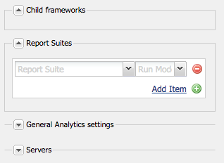

# 连接到Adobe Analytics并创建框架 {#connecting-to-adobe-analytics-and-creating-frameworks}

要在Adobe Analytics中跟踪AEM页面中的Web数据，请创建Adobe Analytics Cloud Services配置和Adobe Analytics框架：

* **Adobe Analytics配置：**&#x200B;有关您的Adobe Analytics帐户的信息。 通过Adobe Analytics配置，AEM可以连接到Adobe Analytics。 为您使用的每个帐户创建一个Adobe Analytics配置。
* **Adobe Analytics Framework：** Adobe Analytics报表包属性与CQ变量之间的一组映射。 使用框架配置网站数据如何填充Adobe Analytics报表。 框架与Adobe Analytics配置相关联。 您可以为每个配置创建多个框架。

将网页与框架关联时，该框架将对该页面以及该页面的后代执行跟踪。 然后，可以从Adobe Analytics中检索页面查看并显示在站点控制台中。

## 先决条件 {#prerequisites}

### Adobe Analytics帐户 {#adobe-analytics-account}

要在Adobe Analytics中跟踪AEM数据，您必须拥有有效的Adobe Experience Cloud Adobe Analytics帐户。

Adobe Analytics帐户必须：

* 具有&#x200B;**管理员**&#x200B;权限
* 已分配给&#x200B;**Web服务访问**&#x200B;用户组。

>[!CAUTION]
>
>提供&#x200B;**管理员**&#x200B;权限(在Adobe Analytics中)不足以允许用户从AEM连接到Adobe Analytics。 帐户还必须具有&#x200B;**Web服务访问**&#x200B;权限。

在继续之前，请确保您的凭据允许您登录到Adobe Analytics。 通过下列任一方式：

* [Adobe Experience Cloud登录](https://experience.adobe.com/#/@login/home)

* [Adobe Analytics登录](https://sc.omniture.com/login/)

### 配置AEM以使用您的Adobe Analytics数据中心 {#configuring-aem-to-use-your-adobe-analytics-data-centers}

Adobe Analytics [数据中心](https://experienceleague.adobe.com/docs/analytics/analyze/reports-analytics/reporting-interface/overview-data-collection.html)收集、处理和存储与您的Adobe Analytics报表包关联的数据。 配置AEM以使用托管Adobe Analytics报表包的数据中心。 您的合同中提到了数据中心。 请联系您组织中的管理员以了解此信息。

如有必要，请使用以下内容路由到正确的数据中心： `https://api.omniture.com/`。

如果您的组织需要从特定数据中心收集或检索数据，请使用以下内容：

| 数据中心 | URL |
|---|---|
| 伦敦 | `https://api3.omniture.com/` |
| 新加坡 | `https://api4.omniture.com/` |
| 俄勒冈州 | `https://api5.omniture.com/` |

使用[Web控制台配置OSGi捆绑包](/help/sites-deploying/configuring-osgi.md#osgi-configuration-with-the-web-console) **AdobeAEM Analytics HTTP客户端**。 为托管报表包的数据中心添加&#x200B;**数据中心URL**，您的AEM页面将为该报表包收集数据。

1. 在Web浏览器中打开Web控制台。 ([https://localhost:4502/system/console/configMgr](https://localhost:4502/system/console/configMgr))
1. 要访问该控制台，请输入您的凭据。

   >[!NOTE]
   >
   >要了解您是否具有此控制台的访问权限，请与您的站点管理员联系。

1. 选择名为&#x200B;**AdobeAEM Analytics HTTP客户端**&#x200B;的配置项。
1. 要添加数据中心的URL，请按&#x200B;**数据中心URL**&#x200B;列表旁边的+按钮，然后在框中键入该URL。

1. 要从列表中删除URL，请单击该URL旁边的 — 按钮。
1. 单击“保存”。

## 配置与Adobe Analytics的连接 {#configuring-the-connection-to-adobe-analytics}

>[!CAUTION]
>
>由于Adobe Analytics API中的安全性更改，无法再使用AEM中包含的Activity Map版本。
>
>现在应使用Adobe Analytics[&#128279;](https://experienceleague.adobe.com/docs/analytics/analyze/activity-map/getting-started/get-started-users/activitymap-install.html)提供的ActivityMap插件。

## 为Activity Map配置 {#configuring-for-the-activity-map}

>[!CAUTION]
>
>由于Adobe Analytics API中的安全性更改，无法再使用AEM中包含的Activity Map版本。
>
>现在应使用Adobe Analytics[&#128279;](https://experienceleague.adobe.com/docs/analytics/analyze/activity-map/getting-started/get-started-users/activitymap-install.html)提供的ActivityMap插件。

## 创建Adobe Analytics框架 {#creating-a-adobe-analytics-framework}

对于您正在使用的报表包ID (RSID)，您可以控制哪些服务器实例（创作、发布或两者）向报表包贡献数据：

* **全部**：来自作者实例和发布实例的信息会填充报表包。
* **作者**：只有来自作者实例的信息会填充报表包。
* **Publish**：仅发布实例中的信息填充报表包。

>[!NOTE]
>
>选择服务器实例的类型不会限制对Adobe Analytics的调用，它仅控制哪些调用包含RSID。
>
>例如，框架配置为使用&#x200B;*diiweretail*&#x200B;报表包，而作者是选定的服务器实例。 当页面与框架一起发布时，仍会对Adobe Analytics进行调用，但这些调用不包含RSID。 只有来自创作实例的调用包含RSID。

1. 使用&#x200B;**导航**，选择&#x200B;**工具**、**Cloud Service**，然后选择&#x200B;**旧版Cloud Service**。
1. 滚动到&#x200B;**Adobe Analytics**&#x200B;并选择&#x200B;**显示配置**。
1. 单击Adobe Analytics配置旁边的&#x200B;**[+]**&#x200B;链接。

1. 在&#x200B;**创建框架**&#x200B;对话框中：

   * 指定&#x200B;**标题**。
   * 或者，您可以为将框架详细信息存储在存储库中的节点指定&#x200B;**名称**。
   * 选择&#x200B;**Adobe Analytics Framework**

   然后单击&#x200B;**创建**。

   此时将打开框架进行编辑。

1. 在主面板右侧，单击侧面板的&#x200B;**报表包**&#x200B;部分中的&#x200B;**添加项**。 然后，使用下拉菜单选择与框架交互的报表包ID（例如`geometrixxauth`）。

   >[!NOTE]
   >
   >当您选择报表包ID时，左侧的SiteCatalyst查找器中会填充Adobe Analytics变量（内容变量）。

1. 要选择要将信息发送到报表包的服务器实例，请使用&#x200B;**运行模式**&#x200B;下拉列表（在报表包ID旁边）。

   

1. 要使框架在网站的发布实例上可用，请在sidekick的&#x200B;**页面**&#x200B;选项卡上单击&#x200B;**激活框架。**

### 配置Adobe Analytics的服务器设置 {#configuring-server-settings-for-adobe-analytics}

使用框架系统，您可以更改每个Adobe Analytics框架中的服务器设置。

>[!CAUTION]
>
>这些设置决定发送数据的位置以及方式，因此您&#x200B;*切勿篡改这些设置*，而让您的Adobe Analytics代表进行设置。

首先打开面板。 按&#x200B;**服务器**&#x200B;旁边的向下箭头：

* **跟踪服务器**

   * 包含用于发送Adobe Analytics调用的URL

      * `cname` — 默认为Adobe Analytics帐户的&#x200B;*公司名称*
      * `d1` — 对应于将信息发送到的数据中心（`d1`、`d2`或`d3`）
      * `sc.omtrdc.net` — 域名

* **安全跟踪服务器**

   * 具有与跟踪服务器相同的区段
   * 用于从安全页面(`https://`)发送数据

* **访客命名空间**

   * 命名空间可确定跟踪URL的第一部分。
   * 例如，将命名空间更改为&#x200B;**CNAME**&#x200B;会导致对Adobe Analytics进行的调用类似于&#x200B;**CNAME.d1.omtrdc.net**，而不是默认调用。

## 将页面与Adobe Analytics框架关联 {#associating-a-page-with-a-adobe-analytics-framework}

将页面与Adobe Analytics框架关联后，页面会在加载时向Adobe Analytics发送数据。 页面填充的变量将从框架中的Adobe Analytics变量中进行映射和检索。 例如，从Adobe Analytics中检索页面查看次数。

页面的后代将继承与框架的关联。 例如，将站点的根页面与框架关联时，站点的所有页面都将与框架关联。

1. 从&#x200B;**站点**&#x200B;控制台中，选择要使用跟踪设置的页面。
1. 直接从控制台或页面编辑器打开&#x200B;**[页面属性](/help/sites-authoring/editing-page-properties.md)**。
1. 打开&#x200B;**Cloud Service**&#x200B;选项卡。

1. 使用&#x200B;**添加配置**&#x200B;下拉菜单从可用选项中选择&#x200B;**Adobe Analytics**。 如果存在继承，请在选择器可用之前禁用继承。

1. **Adobe Analytics**&#x200B;的下拉选择器已附加到可用选项。 选择所需的框架配置。

1. 选择&#x200B;**保存并关闭**。
1. 要激活该页面和任何连接的配置/文件，请&#x200B;**[Publish](/help/sites-authoring/publishing-pages.md)**&#x200B;该页面。
1. 最后一步是访问发布实例上的页面，并使用&#x200B;**搜索**&#x200B;组件搜索关键字（例如，茄子）。
1. 然后，您可以使用适当的工具检查对Adobe Analytics进行的调用；例如[Adobe Experience Cloud Debugger](https://experienceleague.adobe.com/docs/experience-platform/debugger/home.html)。
1. 根据提供的示例，调用应包含在eVar7中输入的值（即，eggplant），事件列表应包含event3。

### 页面视图 {#page-views}

当页面与Adobe Analytics框架关联时，站点控制台的列表视图中可显示页面查看次数。

有关详细信息，请参阅[查看页面分析数据](/help/sites-authoring/page-analytics-using.md)。

### 配置导入间隔 {#configuring-the-import-interval}

配置&#x200B;**AdobeAEM Analytics报表Sling导入程序**&#x200B;服务的相应实例：

* **获取尝试**：
尝试获取已排队报告的次数。
默认为 `6`。

* **获取延迟**：
尝试获取已排队报告的间隔毫秒数。
默认值为`10000`。 由于这是以毫秒为单位的，因此它对应于10秒。

* **提取频率**：
用于确定提取Analytics报告的频率的`cron`表达式。
默认值为`0 0 0/12 * * ?`；这对应于每小时12次提取。

要配置此OSGi服务，您可以使用存储库[&#128279;](/help/sites-deploying/configuring-osgi.md#osgi-configuration-in-the-repository)中的[Web控制台](/help/sites-deploying/configuring-osgi.md#osgi-configuration-with-the-web-console)或osgiConfig节点（服务PID为`com.day.cq.analytics.sitecatalyst.impl.importer.ReportImporterScheduler`）。

## 编辑Adobe Analytics配置和/或框架 {#editing-adobe-analytics-configurations-and-or-frameworks}

创建Adobe Analytics配置或框架时，导航到（旧版） **Cloud Service**&#x200B;屏幕。 选择&#x200B;**显示配置**，然后单击要更新的特定配置的链接。

编辑Adobe Analytics配置时，在配置页面本身时按&#x200B;**编辑**&#x200B;以打开&#x200B;**编辑组件**&#x200B;对话框。

## 删除Adobe Analytics Framework {#deleting-adobe-analytics-frameworks}

要删除Adobe Analytics框架，请先[打开它进行编辑](#editing-adobe-analytics-configurations-and-or-frameworks)。

然后，从sidekick的&#x200B;**页面**&#x200B;选项卡中选择&#x200B;**删除框架**。
