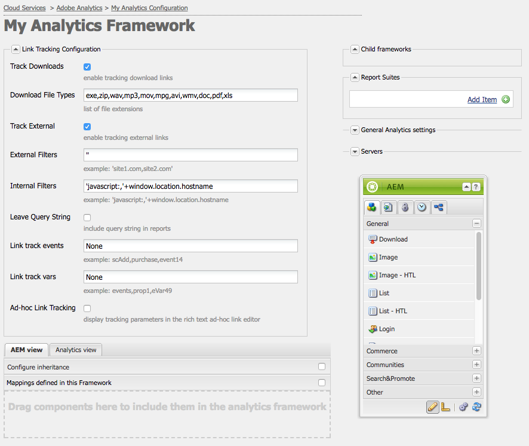
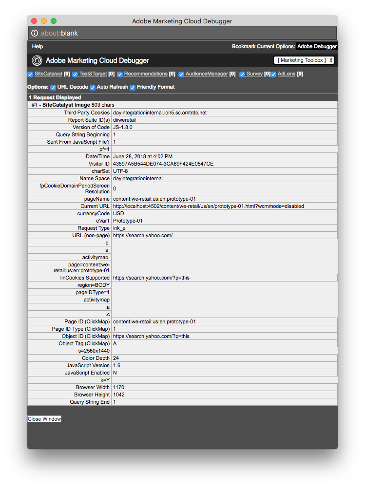

# 为Adobe Analytics配置链接跟踪{#configuring-link-tracking-for-adobe-analytics}

当用户单击网站页面上的链接时，您可以在Adobe Analytics中捕获相关信息。 例如，使用链接跟踪功能了解用户如何与您的网站进行交互、跟踪文件下载以及跟踪退出链接。

## 为Adobe Analytics Framework配置链接跟踪 {#configuring-link-tracking-for-an-adobe-analytics-framework}

1. 使用&#x200B;**导航**，通过&#x200B;**部署**，**Cloud Service**&#x200B;转到&#x200B;**Adobe Analytics**&#x200B;部分。

1. 使用&#x200B;**显示配置**，打开所需的Adobe Analytics框架。
1. 展开&#x200B;**链接跟踪配置**&#x200B;部分并根据需要进行配置（此页面提供了更多详细信息）：

   

## 跟踪文件下载 {#tracking-file-downloads}

配置Adobe Analytics Framework，以便在Adobe Analytics中将从关联页面下载的文件自动作为下载内容进行跟踪。 启用下载跟踪后，将仅跟踪您指定的文件类型。

默认情况下，将跟踪以下文件类型的下载：

* exe
* zip
* wav
* mp3
* mov
* mpg
* avi
* wmv
* 文档
* pdf
* xls

例如，为PDF文件启用下载跟踪后，每当用户单击指向PDF文件的链接时，就会跟踪PDF的下载。

框架的下载跟踪属性作为针对页面生成的`analytics.sitecatalyst.js`文件中的代码实施。 以下代码示例表示默认的下载跟踪配置：

```
s.trackDownloadLinks= true;
s.linkDownloadFileTypes= 'exe,zip,wav,mp3,mov,mpg,avi,wmv,doc,pdf,xls';
```

要为Adobe Analytics框架启用下载跟踪，请执行以下操作：

1. [打开Adobe Analytics框架并展开“链接跟踪配置”部分](#configuring-link-tracking-for-an-adobe-analytics-framework)。
1. 启用&#x200B;**跟踪下载**。
1. 在&#x200B;**下载文件类型**&#x200B;框中，键入要跟踪的文件类型的文件扩展名。

## 跟踪外部链接 {#tracking-external-links}

您可以跟踪页面上的外部链接（退出链接）点击次数。

要跟踪Adobe Analytics框架的外部链接，请执行以下操作：

1. [打开Adobe Analytics框架并展开&#x200B;**链接跟踪配置**&#x200B;部分](#configuring-link-tracking-for-an-adobe-analytics-framework)。
1. 根据您的要求配置以下属性。

单击外部链接时跟踪的属性：

* **跟踪外部**
启用外部链接跟踪。

* **外部筛选器**
（可选）定义过滤器以匹配链接目标的外部URL。 当链接目标与过滤器匹配时，将跟踪该链接。 外部过滤器仅可用于跟踪页面上的某些外部链接。

  要指定要跟踪的外部链接，请键入链接目标的全部或部分URL。 用逗号分隔多个过滤器。 将字符串文字括在单引号中。 没有值（默认值为`''`，两个单引号）会导致跟踪所有外部链接。

* **内部筛选器**
定义用于匹配内部链接URL的过滤器。 当链接定向与此过滤器匹配的URL时，不会跟踪该链接。 默认值是一个javascript命令，该命令返回当前窗口地址的URL的主机名。

  要指定未跟踪的内部链接，请键入链接目标的全部或部分内部URL。 用逗号分隔多个过滤器。 将字符串文字括在单引号中。

  默认值为`'javascript:,'+window.location.hostname`

* **保留查询字符串**
在计算与内部和外部过滤器的匹配项时包含URL参数。

  如果要在根据外部和内部过滤器评估链接目标URL时包含URL参数，请启用。

外部链接跟踪属性作为为页面生成的`analytics.sitecatalyst.js`文件中的代码实施。 为与通过以下配置启用外部链接跟踪的框架关联的页面生成以下示例代码：

* 外部筛选器为`'google.com'`
* 内部筛选器是默认值`'javascript:,'+window.location.hostname`
* 根据过滤器评估链接目标时不包括查询字符串。

```
s.trackExternalLinks= false;
s.linkExternalFilters= 'google.com';
s.linkInternalFilters= 'javascript:,'+window.location.hostname;
s.linkLeaveQueryString= false;
```

## 通过链接点击发送变量数据 {#sending-variable-data-with-link-clicks}

您可以将AEM配置为当用户单击链接时，将事件和变量数据发送到Adobe Analytics。 通过&#x200B;**链接跟踪配置**&#x200B;属性，可指定要在发生链接点击时跟踪的Adobe Analytics事件和变量。

框架映射确定事件和变量值。 您可以将Adobe Analytics变量映射到内容组件的变量，这些变量存储着您希望在单击链接时跟踪的数据。

要通过链接点击发送变量数据：

1. [打开Adobe Analytics框架并展开“链接跟踪配置”部分](#configuring-link-tracking-for-an-adobe-analytics-framework)。
1. 根据您的要求配置以下属性。

通过链接点击发送变量数据的属性：

* **链接跟踪事件**
输入要用于对链接点击次数进行计数的Adobe Analytics事件变量。

  用逗号分隔多个变量名称。

  默认值`None`导致无事件跟踪。

* **链接跟踪变量**
输入您希望在单击链接时发送到Adobe Analytics的Adobe Analytics变量。 用逗号分隔多个变量名称。

  默认值`None`导致不发送任何变量数据。

在指定要发送的事件和变量时，该配置将作为为页面生成的`analytics.sitecatalyst.js`文件中的代码实施。 当框架跟踪`event10`事件和`prop4`属性时，为页面生成以下示例代码：

```
s.linkTrackEvents= 'event10';
s.linkTrackVars= 'prop4';
```

## 链接跟踪配置示例 {#example-link-tracking-configuration}

执行以下过程以探索Adobe Analytics集成的链接跟踪行为。 过程显示来自[Adobe Marketing Cloud Debugger](https://experienceleague.adobe.com/docs/debugger/using/experience-cloud-debugger.html)的结果。

### 常规配置 {#general-configuration}

此示例说明了映射在跟踪和调试器上下文中如何工作：

1. 打开与网页关联的框架。
1. 将&#x200B;**Page**&#x200B;组件拖动到框架的映射区域。 **页面**&#x200B;组件属于Sidekick中的&#x200B;**常规**&#x200B;组件组。

   >[!NOTE]
   >
   >应在现实场景中使用的组件取决于继承自的组件（如果有的话）。
   >
   >如果您不该在其中公开自己的组件（通过在其页面组件中定义Analytics子节点），

   通过从左侧面板拖动Analytics(SiteCatalyst)变量，根据下表配置映射：

<table>
 <tbody>
  <tr>
   <th>CQ变量<br /> </th>
   <th>变量浏览器<br />中的条目 </th>
   <th>Adobe Analytics变量</th>
  </tr>
  <tr>
   <td>pagedata.title</td>
   <td>自定义eVar1 (eVar1)</td>
   <td>EVAR1</td>
  </tr>
  <tr>
   <td>eventdata.events.pageView</td>
   <td>自定义1(event1)</td>
   <td>event1</td>
  </tr>
 </tbody>
</table>

1. 将搜索组件拖动到框架的映射区域。 搜索组件属于Sidekick中的常规组件组。 通过从左侧面板拖动Analytics(SiteCatalyst)变量，根据下表配置映射：

<table>
 <tbody>
  <tr>
   <th>CQ变量<br /> </th>
   <th>变量浏览器中的条目</th>
   <th>Adobe Analytics变量</th>
  </tr>
  <tr>
   <td>eventdata.keyword</td>
   <td>自定义eVar2 (eVar2)</td>
   <td>EVAR2</td>
  </tr>
  <tr>
   <td>eventdata.results</td>
   <td>自定义eVar3 (eVar3)</td>
   <td>EVAR3</td>
  </tr>
  <tr>
   <td>eventdata.events.search</td>
   <td>自定义2(event2)</td>
   <td>event2</td>
  </tr>
 </tbody>
</table>

### 配置外部链接跟踪 {#configure-external-link-tracking}

1. 在框架中，展开&#x200B;**链接跟踪配置**&#x200B;区域。
1. 取消选择&#x200B;**跟踪下载**。

1. 选择&#x200B;**跟踪外部**。
1. 取消选择&#x200B;**保留查询字符串**。
1. 对&#x200B;**外部筛选器**&#x200B;列表使用以下值将其标识为外部URL：

   `'yahoo.com'`

1. 将以下值添加到&#x200B;**链接跟踪事件**&#x200B;字段：

   ```
       event1,event2
   ```

1. 将以下值添加到&#x200B;**链接跟踪vars**&#x200B;字段：

   ```
       eVar1,eVar2
   ```

1. 在与框架关联的页面上，添加&#x200B;**Text**&#x200B;组件。 在&#x200B;**Text**&#x200B;组件内，添加指向以下地址的超链接：

   `https://search.yahoo.com/?p=this`

1. 切换到&#x200B;**预览模式**&#x200B;并单击链接。

使用Adobe Marketing Cloud Debugger查看时，发出的调用将如下所示：



>[!NOTE]
>
>URL不包含查询字符串： `?p=this`

### 包含URL参数 {#include-the-url-parameter}

1. 在框架中，展开&#x200B;**链接跟踪配置**&#x200B;区域。
1. 启用&#x200B;**保留查询字符串**。
1. 重新加载页面预览，然后单击链接。

Adobe Marketing Cloud Debugger中显示的调用详细信息类似于以下示例：


>[!NOTE]
>
>这次URL包含查询字符串： `?p=this`

## 随机链接跟踪 {#ad-hoc-link-tracking}

通过随机链接跟踪，内容作者可以为组件配置链接跟踪。 组件的配置将覆盖框架的&#x200B;**链接跟踪配置**，因此在与框架关联的页面上，可以配置&#x200B;**文本**&#x200B;组件以进行URL的链接跟踪。

通过随机链接跟踪，您可以跟踪下载链接、外部链接以及事件和变量数据。

要启用随机链接跟踪，您需要：

* [将包含&#x200B;**Text**&#x200B;组件的页面与框架](/help/sites-administering/adobeanalytics-connect.md#associating-a-page-with-a-adobe-analytics-framework)关联。
* [配置Adobe Analytics框架以启用临时链接跟踪](#enabling-ad-hoc-link-tracking)。
* [为文本组件配置链接跟踪](#configuring-link-tracking-for-a-text-component)。

### 启用随机链接跟踪 {#enabling-ad-hoc-link-tracking}

配置Adobe Analytics框架以启用临时链接跟踪。

1. 打开Adobe Analytics框架并展开&#x200B;**链接跟踪配置**&#x200B;部分。

1. 启用&#x200B;**个人链接跟踪**。

   >[!NOTE]
   >
   >并非所有用户类型都可以访问此复选框。 如果您需要访问权限，请联系您的站点管理员。

>[!NOTE]
>
>XSS Antisamy配置现在位于路径&#x200B;**/libs/sling/xss.config.xml**&#x200B;下的SLING中，并且需要将以下规则添加到临时以便关联正常工作：

#### 锚点标记规则扩展 {#anchor-tag-rule-extension}

```xml
<attribute name="onclick">
    <literal-list>
        <literal value="CQ_Analytics.Sitecatalyst.customTrack(this)"/>
    </literal-list>
</attribute>
<attribute name="adhocenable">
    <literal-list>
        <literal value="true"/>
        <literal value="false"/>
    </literal-list>
</attribute>
<attribute name="adhocevents">
    <regexp-list>
        <regexp name="anything"/>
    </regexp-list>
</attribute>
<attribute name="adhocevars">
    <regexp-list>
        <regexp name="anything"/>
    </regexp-list>
</attribute>
```

### 为文本组件配置链接跟踪 {#configuring-link-tracking-for-a-text-component}

在为&#x200B;**Text**&#x200B;组件本身配置随机链接跟踪之前，必须已经实施了以下配置：

* [Adobe Analytics框架配置为启用临时链接跟踪](#enabling-ad-hoc-link-tracking)。
* 包含&#x200B;**Text**&#x200B;组件的[页与框架](/help/sites-administering/adobeanalytics-connect.md#associating-a-page-with-a-adobe-analytics-framework)相关联。

使用以下过程配置&#x200B;**Text**&#x200B;组件的链接跟踪：

1. 在编辑模式下打开页面并编辑&#x200B;**文本**&#x200B;组件。

1. 选择要用作超文本的文本，然后单击“超链接”按钮。

   

1. 在链接至框中添加目标URL，然后展开链接跟踪区域。

   >[!NOTE]
   >
   >自定义链接跟踪作为单独的操作显示，位于链接/取消链接操作（Analytics图标）旁边。
   >
   >仅当您在RTE中选择了有效的链接时，才会启用它。

   

1. 启用&#x200B;**自定义链接跟踪**&#x200B;以覆盖Adobe Analytics Framework的链接跟踪配置，并为当前链接启用链接跟踪。

1. （可选）要跟踪点击链接的事件，请在&#x200B;**包含Adobe Analytics变量**&#x200B;字段中添加Adobe Analytics事件名称。 用逗号分隔多个事件名称，例如

   `event1, event22`。

1. （可选）要通过单击链接跟踪变量数据，请在&#x200B;**包含Adobe Analytics变量**&#x200B;字段中添加Adobe Analytics变量。 使用以下任一格式：

   * *`<Variable-name>`*：*`<Dynamic Value>`*
   * *`<Variable-name>`*：*`'CONSTANT'`*

   以下示例说明了每种格式：

   * `eVar10:pagedata.title`
   * `prop1: 'Aubergine'`

   用逗号分隔多个值。

1. 选择&#x200B;**确定**。
