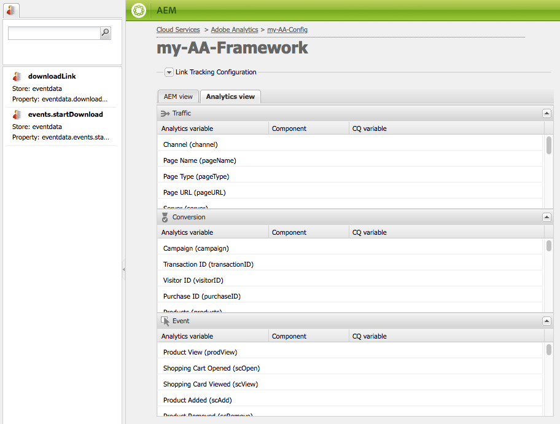

# 将组件数据映射到Adobe Analytics属性{#mapping-component-data-with-adobe-analytics-properties}

将组件添加到框架中以收集要发送到Adobe Analytics的数据。 用于收集Analytics数据的组件将数据存储在相应的&#x200B;**CQ变量**&#x200B;中。 将此类组件添加到框架时，该框架会显示CQ变量列表，以便您可以将每个变量添加到相应的&#x200B;**Analytics变量**。

当&#x200B;**AEM视图**&#x200B;打开时，Analytics变量会出现在内容查找器中。

您可以使用同一&#x200B;**CQ变量**&#x200B;映射多个Analytics变量。

在页面加载并满足以下条件时，映射的数据将被发送到Adobe Analytics：

* 该页面与框架关联。
* 该页面使用添加到框架的组件。

使用以下过程可将CQ组件变量映射到Adobe Analytics报表属性。

1. 在&#x200B;**AEM视图**&#x200B;中，将跟踪组件从sidekick拖动到框架上。 例如，从&#x200B;**常规**&#x200B;类别中拖动&#x200B;**页面**&#x200B;组件。

   

   有几个默认组件组：**常规**、**Commerce**、**社区**&#x200B;和&#x200B;**其他**。 您的AEM实例可以配置为显示不同的组和组件。

1. 若要使用组件中定义的变量来映射Adobe Analytics变量，请将&#x200B;**Analytics变量**&#x200B;从内容查找器拖动到跟踪组件上的字段。 例如，将`Page Name (pageName)`拖动到`pagedata.title`。

   

   >[!NOTE]
   >
   >为框架选择的报表包ID (RSID)决定了显示在内容查找器中的Adobe Analytics变量。

1. 对其他组件和变量重复前两个步骤。

   >[!NOTE]
   >
   >您可以将多个Analytics变量（例如，`props`、`eVars`、`events`）映射到同一CQ变量（例如，`pagedata.title`）

   >[!CAUTION]
   >
   >强烈建议：
   >
   >* `eVars`和`props`映射到以`pagedata.X`或`eventdata.X`开头的CQ变量
   >* 而事件应映射到以`eventdata.events.X`开头的变量

1. 若要使框架在网站的发布实例上可用，请打开sidekick的&#x200B;**页面**&#x200B;选项卡，然后单击&#x200B;**激活框架。**

## 映射产品相关的变量 {#mapping-product-related-variables}

AEM使用命名产品相关变量和事件的约定来命名这些要映射到Adobe Analytics产品相关属性的变量和事件：

| CQ变量 | Analytics变量 | 描述 |
|--- |--- |--- |
| `product.category` | `product.category` （转化变量） | 产品类别。 |
| `product.sku` | `product.sku` （转化变量） | 产品sku。 |
| `product.quantity` | `product.quantity` （转化变量） | 正在购买的产品数。 |
| `product.price` | `product.price` （转化变量） | 产品价格。 |
| `product.events.<eventName>` | 要与报表中的产品关联的成功事件。 | `product.events`是名为&#x200B;*eventName.*&#x200B;的事件的前缀 |
| `product.evars.<eVarName>` | 要与产品关联的转化变量(`eVar`)。 | `product.evars`是名为&#x200B;*eVarName.*&#x200B;的eVar变量的前缀 |

多个AEM Commerce组件会使用这些变量名称。

>[!NOTE]
>
>请勿将Adobe Analytics Products资产映射到CQ变量。 配置产品相关映射（如表所述）实际上等同于映射Products变量。

### 在Adobe Analytics中检查报告 {#checking-reports-on-adobe-analytics}

1. 使用提供给AEM的相同凭据登录Adobe Analytics网站。
1. 确保选定的RSID是前面步骤中使用的RSID。
1. 在&#x200B;**报表**（页面左侧）中，选择&#x200B;**自定义转化**，然后选择&#x200B;**自定义转化1-10**，并选择与`eVar7`对应的变量

1. 根据您使用的Adobe Analytics版本，您平均需要等待45分钟，以便使用使用的搜索词来更新报表；例如，示例中的茄子

## 在Adobe Analytics框架中使用内容查找器(cf#) {#using-the-content-finder-cf-with-adobe-analytics-frameworks}

最初，在打开Adobe Analytics框架时，内容查找器在下包含预定义的Analytics变量：

* 流量
* 转化
* 事件

选择一个RSID后，属于该RSID的所有变量都会添加到列表中。\
需要`cf#`才能将Analytics变量映射到不同跟踪组件上存在的CQ变量。 请参阅为基本跟踪设置框架。

根据为框架选择的视图，内容查找器将由Analytics变量(在AEM视图中)或CQ变量（在Analytics视图中）填充。

可通过以下方式操作列表：

1. 在&#x200B;**AEM视图**&#x200B;中，可以使用以下三个筛选按钮根据选择的变量类型对列表进行筛选：

   * 如果未选择&#x200B;*按钮*，列表将显示完整列表。
   * 如果选择&#x200B;**流量**&#x200B;按钮，列表将仅显示属于流量部分的变量。
   * 如果选择&#x200B;**转化**&#x200B;按钮，列表将仅显示属于转化部分的变量。
   * 如果选择&#x200B;**事件**&#x200B;按钮，列表将仅显示属于事件部分的变量。

   >[!NOTE]
   >
   >一次只能激活一个筛选器按钮。

   1. 该列表还具有搜索功能，该功能根据在搜索字段中输入的文本筛选元素。
   1. 如果在搜索列表中的元素时激活了筛选器选项，则显示的结果也将根据活动按钮进行筛选。
   1. 列表可随时使用旋转箭头按钮重新加载。
   1. 如果在框架中选择了多个RSID，则列表中的所有变量将使用所选RSID内使用的所有标签显示。

1. 在Adobe Analytics视图中时，内容查找器显示属于CQ视图中拖动的跟踪组件的所有CQ变量。

   * 例如，如果&#x200B;**Download组件**&#x200B;是CQ视图中唯一拖动的&#x200B;*组件*（具有两个可映射变量&#x200B;*eventdata.downloadLink*&#x200B;和&#x200B;*eventdata.events.startDownload*），则在切换到Adobe Analytics视图时，内容查找器将如下所示：

   

   * 可将变量拖放到属于三个变量部分（**流量**、**转化**&#x200B;和&#x200B;**事件**）之一的任何Adobe Analytics变量上(&amp;D)。

   * 在将新的跟踪组件拖到CQ视图中的框架上时，属于该组件的CQ变量会自动添加到Adobe Analytics视图中的内容查找器(cf#)。

   >[!NOTE]
   >
   >在任意给定时间，只能将一个CQ变量映射到Adobe Analytics变量。

## 使用AEM视图和Analytics视图 {#using-aem-view-and-analytics-view}

在指定时间，用户可以在框架页面上通过两种方式查看Adobe Analytics映射。 从两个不同的角度来看，这两个视图提供了框架中映射的更好概述。

### AEM视图 {#aem-view}

以上图为例，**AEM视图**&#x200B;具有以下属性：

1. 这是打开框架时的默认视图。
1. 左侧：内容查找器(cf#)由基于所选RSID的Adobe Analytics变量填充。
1. Tab标头(**AEM视图**&#x200B;和&#x200B;**Analytics视图**)：使用这些标头在两个视图之间切换。

1. **AEM视图**：

   1. 如果框架具有从其父框架继承的组件，则在此处列出这些组件，以及映射到这些组件的变量。

      1. 继承的组件将被锁定。
      1. 要解锁继承的组件，请双击该组件名称旁边的挂锁
      1. 要恢复继承，请删除已解锁的组件；之后，该组件将重新获得其锁定状态。

   1. **将组件拖动到此处以包括在Analytics框架中**：可以将组件从Sidekick拖动到此处。
   1. 您可以找到当前包含在分析框架中的所有组件：

      1. 要添加组件，请从sidekick的“组件”选项卡拖动一个组件
      1. 要删除组件及其所有映射，请从组件的上下文菜单中选择删除，然后在确认对话框上接受删除。
      1. 请记住，组件只能从在其中创建的框架中删除，而不能从传统意义上的子框架中删除（它们只能被覆盖）。

### Analytics视图 {#analytics-view}

1. 通过切换到框架上的&#x200B;**Analytics视图**&#x200B;选项卡，可以访问此视图。
1. 左侧：内容查找器(cf#)由CQ变量填充，该变量基于CQ视图中拖放到框架上的组件。
1. Tab标头(**AEM视图**&#x200B;和&#x200B;**Analytics视图**)：使用这些标头在两个视图之间切换。

1. 三个表（流量、转化、事件）列出了所有可用的Adobe Analytics变量。 属于选定的RSID。 此处显示的映射应该与AEM视图中的映射相同：

   * **流量**：

      * 流量变量(`prop1`)已映射到CQ变量(`eventdata.downloadLink`)

      * 当组件旁边有挂锁时，这意味着该组件继承自父框架，因此无法编辑

   * **转换**：

      * 转化变量(`eVar1`)映射到CQ变量(`pagedata.title`)

      * 通过双击CQ变量字段并手动输入代码，映射到内联添加的JavaScript表达式的转化变量(`eVar3`)

   * **事件**：

      * 事件变量(`event1`)映射到CQ事件(`eventdata.events.pageView`)

>[!NOTE]
>
>任何表的CQ变量列也可以内联填充，方法是双击该字段并向其添加文本。 这些字段接受JavaScript作为输入。
>
>例如，在`prop3`旁边，您可以添加：
>     `'`* `Adobe:'+pagedata.title+':'+pagedata.sitesection`\
>使用&#x200B;*：* （冒号）发送与其&#x200B;*sitesection*&#x200B;连接且以&#x200B;*Adobe*&#x200B;为前缀的页面的&#x200B;*title*&#x200B;作为`prop3`
>

>[!CAUTION]
>
>在任意给定时间，只能将一个CQ变量映射到Adobe Analytics变量。
