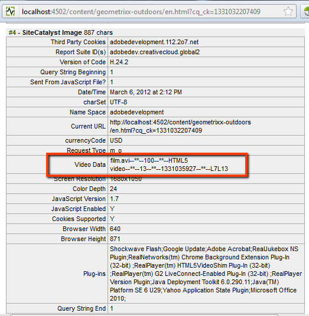

# 为 Adobe Analytics 配置视频跟踪{#configuring-video-tracking-for-adobe-analytics}

有多种方法可用于跟踪视频事件，其中2种是旧版Adobe Analytics的旧版选项。 这些旧版选项包括：旧版里程碑和旧版秒数。

>[!NOTE]
>
>在继续之前，请确保您具有 **播放视频** 上传到AEM。
>
>要确保您的视频在页面上播放，请查阅 **[本教程](/help/sites-authoring/default-components-foundation.md#video)** 有关如何在AEM中转码视频文件的信息。

请按照以下过程使用每个方法设置视频跟踪框架。

>[!NOTE]
>
>对于新实施，建议您 **不使用** 用于视频跟踪的旧版选项。 请使用 **里程碑** 方法。

## 常见步骤 {#common-steps}

1. 通过拖动 **视频组件** 从sidekick并添加可播放项 **视频作为资产** 对于组件

1. [创建Adobe Analytics配置和框架](/help/sites-administering/adobeanalytics.md).

   * 以下部分中的示例使用名称 **my-sc-configuration** 对于配置和 **videow** 框架。

1. 在框架页面上，选择一个RSID并将用法设置为all。 ([https://localhost:4502/cf#/etc/cloudservices/sitecatalyst/videoconf/videofw.html](https://localhost:4502/cf#/etc/cloudservices/sitecatalyst/videoconf/videofw.html))
1. 从Sidekick中的“常规”组件类别中，将视频组件拖动到框架上。
1. 选择跟踪方法：

   * [里程碑](/help/sites-administering/adobeanalytics.md)
   * [非旧版里程碑](/help/sites-administering/adobeanalytics.md)
   * [旧版里程碑](/help/sites-administering/adobeanalytics.md)
   * [旧版秒数](/help/sites-administering/adobeanalytics.md)

1. 选择跟踪方法时，CQ变量列表会相应地发生更改。 使用下面的部分了解有关如何进一步配置组件以及如何将CQ变量映射到Adobe Analytics属性的信息。

## 里程碑 {#milestones}

里程碑方法可跟踪有关视频的最多信息，并且高度可自定义且易于配置。

要使用里程碑方法，请指定基于时间的跟踪偏移以定义里程碑。 当视频播放超过里程碑时，页面会调用Adobe Analytics以跟踪事件。 对于您定义的每个里程碑，组件会创建一个CQ变量，您可以将其映射到Adobe Analytics属性。 这些CQ变量的名称使用以下格式：

```shell
eventdata.events.milestoneXX
```

XX后缀是定义里程碑的跟踪偏移。 例如，指定4、8、16、20和28秒的跟踪偏移，会生成以下CQ变量：

* `eventdata.events.milestone4`
* `eventdata.events.milestone8`
* `eventdata.events.milestone16`
* `eventdata.events.milestone20`
* `eventdata.events.milestone28`

下表介绍了为里程碑方法提供的默认CQ变量：

<table>
 <tbody>
  <tr>
   <th>CQ变量</th>
   <th>Adobe Analytics资产</th>
  </tr>
  <tr>
   <td>eventdata.videoName </td>
   <td>映射到此变量的变量将包含 <strong>用户友好</strong> 名称(<strong>标题</strong>);如果未设置此设置，则视频 <strong>文件名</strong> 将被发送。 在播放视频开始时，只发送一次。</td>
  </tr>
  <tr>
   <td>eventdata.videoFileName </td>
   <td>映射到此变量的变量将包含文件名。 仅与eventdata.events.a.media.view一起发送 </td>
  </tr>
  <tr>
   <td>eventdata.videoFilePath </td>
   <td>映射到此变量的变量将在服务器上包含文件的路径。 仅与eventdata.events.a.media.view一起发送 </td>
  </tr>
  <tr>
   <td>eventdata.events.a.media.segmentView </td>
   <td>每次传递区段里程碑时发送 </td>
  </tr>
  <tr>
   <td>eventdata.events.a.media.timePlayed</td>
   <td>每次触发里程碑时发送，用户在观看给定区段时所花费的秒数也会随此事件一起发送。 例如eventX=21<br /> </td>
  </tr>
  <tr>
   <td>eventdata.events.a.media.view </td>
   <td>在初始化视频查看时发送</td>
  </tr>
  <tr>
   <td>eventdata.events.a.media.complete </td>
   <td>视频播放完后发送<br /> </td>
  </tr>
  <tr>
   <td>eventdata.events.milestoneX </td>
   <td>当给定的里程碑通过时，X表示在<br /> </td>
  </tr>
  <tr>
   <td>eventdata.a.contentType </td>
   <td>在每个里程碑时发送；在Adobe Analytics调用中显示为pev3，通常作为“视频”发送。<br /> </td>
  </tr>
  <tr>
   <td>eventdata.a.media.name </td>
   <td>完全匹配eventdata.videoName </td>
  </tr>
  <tr>
   <td>eventdata.a.media.segment </td>
   <td>包含有关已查看的区段的信息，例如2:O:4-8 </td>
  </tr>
 </tbody>
</table>

>[!NOTE]
>
>您可以设置视频的 **用户友好** 名称，方法是在DAM中打开要编辑的视频，然后设置 **标题** 元数据字段。

1. 选择里程碑作为跟踪方法后，在“跟踪偏移”框中，输入以逗号分隔的跟踪偏移列表（以秒为单位）。 例如，以下值定义了视频开始后4、8、16、20和28秒的里程碑：

   ```xml
   4,8,16,20,24
   ```

   偏移值必须是大于0的整数。 默认值为 `10,25,50,75`。

1. 要将CQ变量映射到Adobe Analytics属性，请将Adobe Analytics属性从ContentFinder拖动到组件上CQ变量旁边。

   有关优化映射的信息，请参阅 [在Adobe Analytics中测量视频](https://experienceleague.adobe.com/docs/media-analytics/using/media-overview.html) 的双曲余切值。

1. [添加框架](/help/sites-administering/adobeanalytics.md) 到页面。
1. 在中测试设置 **预览模式**，请播放视频以触发Adobe Analytics调用。

以下Adobe Analytics跟踪数据示例适用于使用4,8,16,20和24的跟踪偏移量进行的里程碑跟踪，以及CQ变量的以下映射：

<table>
 <tbody>
  <tr>
   <th>CQ 变量</th>
   <th>Adobe Analytics资产</th>
  </tr>
  <tr>
   <td>eventdata.videoName </td>
   <td>prop2</td>
  </tr>
  <tr>
   <td>eventdata.videoFileName </td>
   <td>prop3 </td>
  </tr>
  <tr>
   <td>eventdata.videoFilePath </td>
   <td>prop4</td>
  </tr>
  <tr>
   <td>eventdata.events.a.media.segmentView </td>
   <td>event1</td>
  </tr>
  <tr>
   <td>eventdata.events.a.media.timePlayed</td>
   <td>event2<br /> </td>
  </tr>
  <tr>
   <td>eventdata.events.a.media.view </td>
   <td>event3</td>
  </tr>
  <tr>
   <td>eventdata.events.a.media.complete </td>
   <td>event4<br /> </td>
  </tr>
  <tr>
   <td>eventdata.events.milestone4</td>
   <td>event10</td>
  </tr>
  <tr>
   <td>eventdata.events.milestone8</td>
   <td>event11</td>
  </tr>
  <tr>
   <td>eventdata.events.milestone16</td>
   <td>event12</td>
  </tr>
  <tr>
   <td>eventdata.events.milestone20</td>
   <td>event13</td>
  </tr>
  <tr>
   <td>eventdata.events.milestone24</td>
   <td>event14</td>
  </tr>
  <tr>
   <td>eventdata.a.contentType </td>
   <td>eVar3</td>
  </tr>
  <tr>
   <td>eventdata.a.media.name </td>
   <td>eVar1、prop1 </td>
  </tr>
  <tr>
   <td>eventdata.a.media.segment </td>
   <td>eVar2</td>
  </tr>
 </tbody>
</table>

在此示例中，视频组件在框架页面上如下所示：


>[!NOTE]
>
>要查看对Adobe Analytics发出的调用，请使用适当的工具，如DigitalPulse Debugger或Fiddler。

使用提供的示例调用Adobe Analytics时，使用DigitalPulse Debugger查看时，应如下所示：


*这是&#x200B;**首次呼叫**的次数，其中包含以下值：*

* *eventdata.a.media.name的prop1和eVar1,*
* *prop2-4，以及包含contentType（视频）和segment(1)的eVar2和eVar3:O:1-4)*
* *event3，该事件已映射到eventdata.events.a.media.view。*


*这是&#x200B;**第三次呼叫**Adobe Analytics:*

* *prop1和eVar1包含a.media.name;*
* *event1，因为已查看区段*
* *通过播放时间发送的事件2 = 4*
* *event11已发送，因为已到达eventdata.events.milestone8*
* *prop2至4未发送（因为未触发eventdata.events.a.media.view）*

## 非旧版里程碑 {#non-legacy-milestones}

非旧版里程碑方法与里程碑方法类似，不同之处在于里程碑是使用跟踪长度的百分比来定义的。 共性如下：

* 当视频播放超过里程碑时，页面会调用Adobe Analytics以跟踪事件。
* 的 [CQ变量的静态集](#cqvars) 定义用于映射的Adobe Analytics属性。
* 对于您定义的每个里程碑，组件会创建一个CQ变量，您可以将其映射到Adobe Analytics属性。

这些CQ变量的名称使用以下格式：

XX后缀是定义里程碑的跟踪长度的百分比。 例如，指定10、25、50和75的百分比会生成以下CQ变量：

* `eventdata.events.milestone10`
* `eventdata.events.milestone25`
* `eventdata.events.milestone50`
* `eventdata.events.milestone75`

```shell
eventdata.events.milestoneXX
```

1. 选择非旧版里程碑作为跟踪方法后，在“跟踪偏移”框中，输入以逗号分隔的跟踪长度百分比列表。 例如，以下默认值定义的里程碑长度为跟踪长度的10%、25%、50%和75%:

   ```xml
   10,25,50,75
   ```

   偏移值必须是大于0的整数。

1. 要将CQ变量映射到Adobe Analytics属性，请将Adobe Analytics属性从ContentFinder拖动到组件上CQ变量旁边。

   有关优化映射的信息，请参阅 [在Adobe Analytics中测量视频](https://experienceleague.adobe.com/docs/media-analytics/using/media-overview.html) 的双曲余切值。

1. [添加框架](/help/sites-administering/adobeanalytics.md) 到页面。
1. 在中测试设置 **预览模式**，请播放视频以触发Adobe Analytics调用。

## 旧版里程碑 {#legacy-milestones}

此方法与Milestones方法类似，其中的里程碑与 *跟踪偏移* 字段是百分比，而不是视频中的设置点。

>[!NOTE]
>
>“跟踪偏移”字段仅接受以逗号分隔的列表，其中包含1到100之间的整数。

1. 设置“跟踪偏移”。

   * e.g.10,50,75,100

   此外，发送到Adobe Analytics的信息不太可定制；只有3个变量可用于映射：

<table>
 <tbody>
  <tr>
   <td>eventdata.videoName <br /> </td>
   <td>映射到此变量的变量将包含 <strong>用户友好</strong> 名称(<strong>标题</strong>);如果未设置标题，则视频将 <strong>文件名</strong> 将被发送。 在播放视频开始时，只发送一次。<br /> </td>
  </tr>
  <tr>
   <td>eventdata.videoFileName </td>
   <td>映射到此变量的变量将包含文件名。 在播放视频开始时，只发送一次。</td>
  </tr>
  <tr>
   <td>eventdata.videoFilePath </td>
   <td>映射到此变量的变量将在服务器上包含文件的路径。 在播放视频开始时，只发送一次。</td>
  </tr>
 </tbody>
</table>

>[!NOTE]
>
>您可以设置视频的 **用户友好** 名称，方法是在DAM中打开要编辑的视频，然后设置 **标题** 元数据字段。 您还需要保存完成后所做的更改。

1. 将这些变量映射到prop 1到3

   的 **其余相关信息** 在调用中，将被连接到 **one** 变量已命名 **pev3**.

   **示例调用** 使用提供的示例查看Adobe Analytics时，使用DigitalPulse Debugger查看时，应如下所示：

   

   *的&#x200B;**pev3**变量在调用中发送时包含以下信息：*

   * *名称*  — 视频文件的名称(*film.avi*)

   * *长度*  — 视频文件的长度，以秒为单位(*100*)

   * *播放器名称*  — 用于播放视频文件的视频播放器(*HTML5视频*)

   * *播放总秒数*  — 视频播放的总秒数(*25*)

   * *开始时间戳*  — 标识视频播放开始时间的时间戳(*1331035567*)

   * *播放会话*  — 播放会话的详细信息。 此字段指示用户如何与视频交互。 这可能包括以下数据：用户开始播放视频的位置、用户是否使用视频滑块来推进视频，以及用户停止播放视频的位置(*L10E24S58L58 — 视频在秒处停止。 L10节的25秒，然后跳到秒。 48*)

## 旧版秒数 {#legacy-seconds}

使用**旧版秒数**方法时，每第N秒触发一次Adobe Analytics调用，其中N是在“跟踪偏移”字段中指定的。

1. 将“跟踪偏移”设置为任意秒数，

   * 例如6
   >[!NOTE]
   >
   >“跟踪偏移”字段仅接受大于0的整数

   发送到Adobe Analytics的信息不太可自定义。 只有3个变量可用于映射：

<table>
 <tbody>
  <tr>
   <td>eventdata.videoName <br /> </td>
   <td>映射到此变量的变量将包含 <strong>用户友好</strong> 名称(<strong>标题</strong>);如果未设置标题，则视频将 <strong>文件名</strong> 将被发送。 在播放视频开始时，只发送一次。<br /> </td>
  </tr>
  <tr>
   <td>eventdata.videoFileName </td>
   <td>映射到此变量的变量将包含文件名。 在播放视频开始时，只发送一次。</td>
  </tr>
  <tr>
   <td>eventdata.videoFilePath </td>
   <td>映射到此变量的变量将在服务器上包含文件的路径。 在播放视频开始时，只发送一次。</td>
  </tr>
 </tbody>
</table>

>[!NOTE]
>
>您可以设置视频的 **用户友好** 名称，方法是在DAM中打开要编辑的视频，然后设置 **标题** 元数据字段。 您还需要保存完成后所做的更改。

1. 将这些变量映射到prop1、prop2和prop3

   的 **其余相关信息** 中的调用将被连接到 **one** 变量已命名 **pev3**.

   使用提供的示例调用Adobe Analytics时，使用DigitalPulse Debugger查看时，应如下所示：

   

   *该调用与上述旧版里程碑调用类似。 请参阅pev3上的信息&#x200B;**[提供](/help/sites-administering/adobeanalytics.md)**.*

**本教程中使用的引用：**

[0] [https://experienceleague.adobe.com/docs/media-analytics/using/media-overview.html](https://experienceleague.adobe.com/docs/media-analytics/using/media-overview.html)
