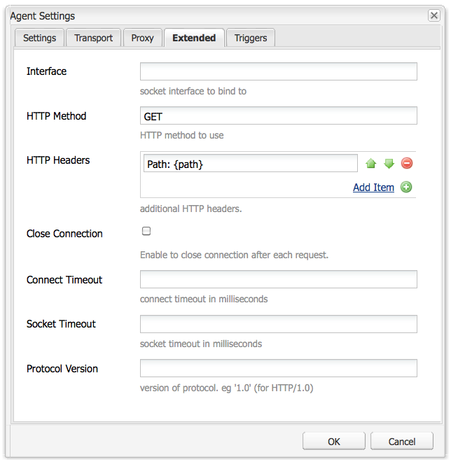

# AEM Portals和Portlet{#aem-portals-and-portlets}

本文档将介绍以下内容：

* AEM Portal架构
* 管理和配置AEM as a portal
* 使用AEM作为门户
* 在Portlet（例如Web服务器）中安装、配置和显示AEM内容

## AEM Portal架构 {#aem-portal-architecture}

AEM portal体系结构包括portal和portlet的定义。

### 什么是门户？ {#what-is-a-portal}

门户是一种Web应用程序，它提供个性化、单点登录、来自不同来源的内容集成，并承载信息系统的表示层。

您可以在AEM中运行符合JSR 286标准的Portlet。 利用portlet组件，可在页面上嵌入portlet。 请参阅[管理AEM内容Portlet](#administeringthecqcontentportlet)。

### 什么是portlet？ {#what-is-a-portlet}

Portlet是部署在生成动态内容的容器中的Web组件。 Portlet接口打包并部署为Portlet容器中的.war文件。 如果您将AEM作为门户运行，则需要Portlet的.war文件才能运行Portlet。

要将AEM内容配置为显示在门户中，请参阅[在Portlet中安装、配置和使用AEM](#installingconfiguringandusingcqinaportlet)。

### AEM Portal Director {#aem-portal-director}

>[!CAUTION]
>
>AEM Portal Director自AEM 6.4起已弃用。请参阅[已弃用和已删除的功能](https://helpx.adobe.com/experience-manager/6-4/release-notes/deprecated-removed-features.html)。

## 管理AEM内容Portlet {#administering-the-aem-content-portlet}

AEM内容Portlet允许您在门户中显示AEM内容。 该Portlet在`/crx-quickstart/opt/portal`上可用，并且可以通过多种方式进行自定义。 例如，您可以通过部署自己的身份验证服务来自定义SSO/身份验证处理，从而为AEM生成覆盖默认行为所需的身份验证信息。 这些插件使用定义的API，允许您通过根据API构建插件来添加自己的功能。 可以将插件部署到正在运行的Portlet中。 为了正常运行，它需要在启动时显示AEM创作和发布实例的配置以及内容路径。

某些配置可通过portlet首选项更改，而其他配置可通过OSGi服务配置更改。 您可以使用&#x200B;**配置**&#x200B;文件或OSGi Web控制台更改这些配置。

### Portlet首选项 {#portlet-preferences}

在部署portlet web应用程序之前，可以在门户服务器中进行部署时配置Porlet首选项，也可以编辑&#x200B;**WEB-INF/portlet.xml**&#x200B;文件来进行配置。 默认情况下，portlet.xml文件显示如下：

```xml
<?xml version="1.0" encoding="UTF-8"?>
<portlet-app xmlns="https://java.sun.com/xml/ns/portlet/portlet-app_1_0.xsd"
             xmlns:xsi="https://www.w3.org/2001/XMLSchema-instance"
             xsi:schemaLocation="https://java.sun.com/xml/ns/portlet/portlet-app_1_0.xsd /opt/SUNWps/dtd/portlet.xsd"
             version="1.0">
   <portlet>
      <portlet-name>RSSWeatherPortlet</portlet-name>
      <portlet-class>org.jboss.portlet.weather.WeatherPortlet</portlet-class>
      <init-param>
         <name>default_zipcode</name>
         <value>05673</value>
      </init-param>
      <init-param>
         <name>RSS_XSL</name>
         <value>/WEB-INF/Rss.xsl</value>
      </init-param>
      <init-param>
         <name>base_url</name>
         <value>https://xml.weather.yahoo.com/forecastrss?p=</value>
      </init-param>
      <expiration-cache>180</expiration-cache>
      <supports>
         <mime-type>text/html</mime-type>
         <portlet-mode>VIEW</portlet-mode>
         <portlet-mode>EDIT</portlet-mode>
      </supports>
      <portlet-info>
         <title>Weather Portlet</title>
      </portlet-info>
      <portlet-preferences>
         <preference>
            <name>expires</name>
            <value>180</value>
         </preference>
         <preference>
            <name>RssXml</name>
            <value>https://xml.weather.yahoo.com/forecastrss?p=33145</value>
            <read-only>false</read-only>
         </preference>
      </portlet-preferences>
   </portlet>
</portlet-app>
```

可以使用以下首选项配置Portlet：

<table>
 <tbody>
  <tr>
   <td>start路径</td>
   <td><p>这是Portlet的开始路径：它定义最初显示的内容。</p> <p><strong>重要信息</strong>：如果将Portlet配置为连接到在<strong> /</strong>以外的上下文路径上运行的AEM创作和发布实例，则需要在这些AEM实例的Html库管理器配置（例如，通过Felix Webconsole）中启用强制<strong>CQUrlInfo</strong>，否则将无法进行编辑，并且不会显示首选项对话框。</p> </td>
  </tr>
  <tr>
   <td>html选择器</td>
   <td>附加到每个url的选择器。 默认情况下，这是<strong>portlet</strong>，因此对html页面的所有请求都使用以<strong>.portlet.html结尾的url。</strong>这允许在AEM中使用自定义脚本来渲染portlet。</td>
  </tr>
  <tr>
   <td>addCssToPortalHeader</td>
   <td><p>默认情况下，AEM的HTML页中包含的css文件包含在portlet中。 禁用此选项将排除默认的css文件。</p> <p>如果启用此选项，则会将CSS文件添加到html页面的头部，或嵌入到html页面中，具体取决于门户的行为。</p> </td>
  </tr>
  <tr>
   <td>includeToolbar</td>
   <td>默认情况下，工具栏在内容Portlet中呈现，以便执行管理功能。 通过禁用此选项，不会呈现任何工具栏。</td>
  </tr>
  <tr>
   <td>urlParameterName</td>
   <td><p>可能包含为Portlet显示的新内容URL的替代URL参数名称列表。 从上到下处理列表，使用包含值的第一个参数。 如果未找到URL，则使用默认的URL参数。 提供的URL按原样使用，无需进一步修改。</p> <p>此设置是按部署的Portlet进行设置的 — 它还可以在OSGi配置中为“Day Portal Director Portlet Bridge”全局配置一些url参数。</p> </td>
  </tr>
  <tr>
   <td>首选项对话框</td>
   <td>AEM中首选项对话框的路径 — 如果留空，则使用内置的首选项对话框。 默认值为/libs/portal/content/prefs.html。</td>
  </tr>
  <tr>
   <td>initialRedirect</td>
   <td>默认情况下， portlet会在第一次调用时对整个门户页面执行javascript重定向。 这是为了支持现代门户服务器的拖放方案。 在生产环境中，很少需要此重定向，因此可以将此首选项设置为<em>false</em>来将其关闭。</td>
  </tr>
 </tbody>
</table>

#### OSGi Web控制台 {#osgi-web-console}

假定门户服务器在主机localhost（端口8080）上运行，并且AEM portlet web应用程序装载在Web应用程序上下文&#x200B;*cqportlet*&#x200B;中，则Web控制台的URL为`https://localhost:8080/cqportlet/cqbridge/system/console`。 默认用户和密码为&#x200B;**admin**。

打开&#x200B;**配置**&#x200B;选项卡并选择&#x200B;**门户目录CQ服务器配置**。 您可以在此处指定作者和发布实例的基本URL。 [配置Portlet](#configuring-the-portlet)中介绍了此过程。

>[!NOTE]
>
>OSGi Web控制台仅用于在开发（或测试）期间更改配置。 确保阻止对生产系统的控制台的请求。

### 提供配置 {#providing-configurations}

为了支持自动部署和配置预配， AEM content portlet具有内置的配置支持，它尝试从提供给portlet应用程序的类路径中读取配置。

启动时，读取系统属性&#x200B;**com.day.cq.portet.config**&#x200B;以检测当前环境。 通常，此属性的值类似于&#x200B;**dev**、**prod**、**test**&#x200B;等。 如果未设置环境，则不会读取任何配置。

如果设置了环境，则会在at* ***com/day/cq/portlet/{env}.config**&#x200B;的类路径中搜索配置文件，其中&#x200B;**env**&#x200B;被替换为环境的实际值。 此文件应列出此环境的所有配置文件。 这些文件将相对于配置文件的位置进行搜索。 例如，如果文件包含一行`my.service.xml,`，则此文件将从位于`com/day/cq/portlet/my.service.config.`的类路径中读取。文件的名称由服务的持久性ID组成，后跟&#x200B;**.config**。 在上一个示例中，持久性ID是&#x200B;**my.service**。 配置文件的格式，是Apache Sling OSGi安装程序使用的格式。

这意味着，对于每个环境，需要添加相应的配置文件。 应应用于所有环境的配置需要在所有这些文件中输入 — 如果仅用于单个环境，则只需在该文件中输入。 此机制可确保完全控制在哪个环境中读取哪个配置。

可以使用其他系统属性来检测环境。 指定包含要使用的系统属性名称的系统属性&#x200B;**com.day.cq.portet.configproperty**，而不是&#x200B;**com.day.cq.portet.config**。

#### 缓存和缓存失效 {#caching-and-caching-invalidation}

Portlet在其默认配置中将从AEM WCM收到的响应缓存在用户特定的缓存中。 当发布实例的内容发生更改时，缓存需要失效。 为此，在AEM WCM中，必须在创作实例上配置复制代理。 也可以手动刷新缓存。 本节将介绍这两个过程。

Portlet可以配置自己的缓存，以便显示Portlet中的内容而不需要访问AEM。 该门户可作为/libs/portal/director中的内容使用。 要访问内容，请启动AEM实例，并使用CRXDE Lite或Webdav从该位置下载文件。

您可以在运行时部署此捆绑包，或者在部署之前将其添加到位于`WEB-INF/lib/resources/bundles`的Portlet Web应用程序。

部署缓存后，portlet将缓存发布实例中的内容。 可以通过AEM中的Dispatcher刷新使Portlet缓存失效。 要将Portlet配置为使用自己的缓存，请执行以下操作：

1. 在作者中配置以门户服务器为目标的复制代理。
1. 假定门户服务器在主机&#x200B;**localhost** **port 8080 **上运行，并且上下文&#x200B;**cqportlet**&#x200B;中装载了AEM portlet Web应用程序，则用于刷新缓存的URL为`https://localhost:8080/cqportlet/cqbridge/cqpcache?Path=$(path)`。 使用GET作为方法。
   **注意：**&#x200B;您可以发送名为&#x200B;**Path**&#x200B;的http标头，而不使用请求参数。

#### 通过复制代理刷新缓存 {#flushing-the-cache-via-replication-agent}

与普通的Dispatcher失效一样，复制代理也可以配置为定向门户的AEM portlet缓存。 配置复制代理后，每次常规页面激活都会刷新门户缓存。

如果运行多个运行AEM portlet的门户节点，则需要按照本过程所述为每个节点创建一个代理。

要为入口配置复制代理，请执行以下操作：

1. 登录到创作实例。
1. 在“网站”选项卡中，单击&#x200B;*工具*&#x200B;选项卡。
1. 在复制代理&#x200B;**新建……**&#x200B;菜单中单击&#x200B;**新建页面……**。

   

1. 在&#x200B;*模板*&#x200B;中，选择&#x200B;*复制代理*，然后输入代理的名称。 单击&#x200B;*创建*。

   

1. 双击创建的复制代理。 它显示为无效，因为尚未对其进行配置。

   

1. 单击&#x200B;**编辑。**
1. 在&#x200B;**设置**&#x200B;选项卡中，选中&#x200B;**已启用**&#x200B;复选框，选择&#x200B;**Dispatcher刷新**&#x200B;作为序列化类型，并输入重试超时(例如，60000)。

   

1. 单击“**传输**”选项卡。
1. 在&#x200B;**URI**&#x200B;字段中，输入Portlet的刷新URI (URL)。 URI的格式如下：

   ```xml
   https://<wps-host>:<port>/<wps-context>/<cq5-portlet-context>/cqbridge/cqpcache
   ```

   

1. 单击&#x200B;**扩展**&#x200B;选项卡。

   

1. 在&#x200B;**HTTP方法**&#x200B;字段中，键入&#x200B;**GET**。
1. 在&#x200B;**HTTP标头**&#x200B;字段中，单击&#x200B;**+**&#x200B;以添加新条目并键入&#x200B;**路径： {path}**。
1. 如有必要，请单击&#x200B;**代理**&#x200B;选项卡，然后输入代理的代理信息。
1. 单击&#x200B;**确定**&#x200B;以保存更改。
1. 要测试连接，请单击&#x200B;**测试连接**&#x200B;链接。 将显示一条日志消息，指示复制测试是否成功。 例如：

   

#### 手动刷新Portlet缓存 {#manually-flushing-the-portlet-cache}

您可以通过访问为复制代理配置的相同URL来手动刷新Portlet缓存。 有关URL的形式，请参阅[刷新缓存](#flushing-the-cache-via-replication-agent)。 此外，需要使用URL参数Path=&lt;path>来扩展URL以指示要刷新的内容。

例如：

`https://10.0.20.99:10040/wps/PA_CQ5_Portlet/cqbridge/cqpcache?Path=*`刷新完整的缓存。 `https://10.0.20.99:10040/wps/PA_CQ5_Portlet/cqbridge/cqpcache?Path=/content/mypage/xyz`从缓存中刷新`/content/mypage/xyz`。

### 门户安全 {#portal-security}

门户是驱动身份验证机制。 您可以通过技术用户、门户用户、群组等登录AEM。 Portlet无法访问门户中用户的密码，因此，如果Portlet不知道成功登录用户的所有凭据，则必须使用SSO解决方案。 在这种情况下， AEM portlet将所有必需的信息转发到AEM ，再将此信息转发到底层AEM存储库。 此行为是可插拔的，并且可以自定义。

### Publish上的身份验证 {#authentication-on-publish}

本节介绍Portlet在与基础AEM WCM实例通信时可以使用的可用身份验证模式。

默认情况下，不会向AEM的发布实例发送任何用户信息；内容始终显示为匿名用户。 如果应当从AEM提供用户特定信息，或者需要发布的用户身份验证，则必须启用此功能。

#### 访问Portlet的身份验证配置 {#accessing-the-portlet-s-authentication-configuration}

Portlet在AEM WCM实例中使用的身份验证配置选项在Web控制台（OSGi配置）中可用。

>[!NOTE]
>
>使用AEM时，可通过多种方法管理OSGi服务的配置设置（控制台或存储库节点）。
>
>有关完整详细信息，请参阅[配置OSGi](/help/sites-deploying/configuring-osgi.md)。

要访问Portlet的身份验证配置：

1. 通过以下URL访问Web控制台：

   `https://localhost:8080/cqportlet/cqbridge/system/console`

   例如，在其默认配置中：

   `https://wps-host:10040/wps/PA_CQ5_Portlet/cqbridge/system/console`

1. 登录到Web控制台。 默认凭据为`admin/admin`。
1. 在控制台中选择&#x200B;**配置**。
1. 在&#x200B;**配置**&#x200B;菜单中，选择要配置的特定服务。 服务由Portlet在OSGi框架中提供。

   | 服务名称 | 描述 |
   |---|---|
   | Day Portal Director Authenticator | 配置用于AEM WCM实例的身份验证模式。 根据所选模式，可以指定技术用户或SSO Cookie的名称。 此外，可以启用AEM WCM发布实例的身份验证。 |
   | Day Portal Director文件缓存 | 配置Portlet如何缓存其从AEM WCM实例接收的响应的参数。 |
   | Day Portal Director HTTP客户端服务 | 配置Portlet如何通过HTTP连接到底层AEM WCM实例。 例如，您可以指定代理服务器。 |
   | Day Portal Director区域设置处理程序 | 配置portlet支持的区域设置。 对AEM WCM实例的请求基于用户区域设置；例如，用户语言*德语*将请求`/content/geometrixx/de/`.... |
   | Day Portal Director权限管理器 | 配置portlet是否应该根据当前登录的用户来测试Websites选项卡。 |
   | Day Portal Director工具栏渲染器 | 自定义Portlet工具栏的呈现。 |

1. 此外，您还可以配置Web控制台和日志记录服务。 例如，您可以通过单击Apache Felix OSGi Management Console链接来更改Web控制台的管理凭据。

#### 技术用户模式 {#technical-user-mode}

在默认模式下，由Portlet针对AEM WCM创作实例发出的所有请求都使用同一技术用户进行验证，而不管当前是Portal用户。 默认情况下，“技术用户”模式处于启用状态。 您可以在OSGi管理控制台的相应配置屏幕中启用/禁用此模式：

如果启用了Publish **上的**&#x200B;身份验证，指定的技术用户必须存在于AEM WCM创作实例和发布实例上。 请确保授予用户足够的访问权限以进行创作工作。

#### SSO {#sso}

Portlet支持开箱即用的AEM的SSO。 验证器服务可以配置为使用SSO并将格式为&#x200B;**Basic**&#x200B;的当前门户用户作为名为`cqpsso`的Cookie传输到AEM。 应将AEM配置为对路径/使用SSO身份验证处理程序。 还需要在此处配置Cookie名称。

需要相应地配置AEM存储库的`crx-quickstart/repository/repository.xml`：

```xml
<LoginModule class="com.day.crx.security.authentication.CRXLoginModule">
  ...
  <param name="trust_credentials_attribute" value="TrustedInfo"/>
  <param name="anonymous_principal" value="anonymous"/>
</LoginModule>
```

#### SSO身份验证模式 {#sso-authentication-mode}

Portlet可以使用单点登录(SSO)方案为AEM WCM进行身份验证。 在此模式下，当前登录到门户的用户将以SSO Cookie的形式转发到AEM WCM。 如果使用SSO模式，则底层AEM WCM实例必须知道所有有权访问AEM Portlet的门户用户，最常见的方式是将AEM WCM连接到LDAP，或事先手动创建用户。 此外，在Portlet中启用SSO之前，需要将基础AEM WCM创作实例(和发布实例，如果在Publish **上启用了**&#x200B;身份验证)配置为接受基于SSO的请求。

要将Portlet配置为使用SSO身份验证模式，请完成以下步骤（以下各节中详述）：

* 启用AEM WCM的存储库以接受可信凭据。
* 在AEM WCM中启用SSO身份验证。
* 在AEM Portlet中启用SSO身份验证。

#### 启用AEM WCM的存储库以接受可信凭据 {#enabling-aem-wcm-s-repository-to-accept-trusted-credentials}

在为AEM WCM启用SSO之前，需要将基础存储库配置为接受AEM WCM提供的可信凭据。 为此，您需要配置AEM repository.xml。

1. 在安装了AEM WCM的文件系统中，打开以下文件：

   `//crx-quickstart/repository/repository.xml`

1. 在XML文件中，找到&#x200B;**LoginModule**&#x200B;的条目，并将trust_credentials_attribute添加到其配置中：

   ```xml
   <LoginModule class="com.day.crx.security.authentication.CRXLoginModule">
     ...
     <param name="trust_credentials_attribute" value="TrustedInfo"/>
     <param name="anonymous_principal" value="anonymous"/>
   </LoginModule>
   ```

1. 重新启动AEM WCM以使更改生效。

#### 在AEM WCM中启用SSO身份验证 {#enabling-sso-authentication-in-the-aem-wcm}

要在AEM WCM中启用SSO，请在AEM WCM的Apache Felix Web管理控制台(OSGi)中访问相关的配置条目：

1. 通过其URI访问该控制台，该URI位于https://&lt;AEM-host>：&lt;port>/system/console。
1. 在配置菜单中，选择SSO身份验证处理程序。 在此示例中，SSO处理程序根据AEM Portlet提供的Cookie接受所有路径的SSO请求。 您的配置可能有所不同。

   | 路径 | / | 为所有请求启用SSO处理程序 |
   |---|---|---|
   | Cookie名称 | cqpsso | 由Portlet提供的Cookie的名称，如Portlet的OSGi控制台中所配置。 |

1. 单击&#x200B;**保存**&#x200B;以启用SSO。 SSO现在是主要的身份验证方案。

对于AEM WCM收到的每个请求，首先会尝试基于SSO的身份验证。 失败时，执行对常规基本身份验证方案的回退。 因此，与没有SSO的AEM WCM的正常连接仍然可用。

#### 在AEM Portlet中启用SSO身份验证 {#enabling-sso-authentication-in-a-aem-portlet}

为了使基础AEM WCM实例接受SSO请求，必须将Portlet的身份验证模式从&#x200B;**技术**&#x200B;切换到&#x200B;**SSO**。

要在AEM Portlet中启用SSO身份验证，请执行以下操作：

1. 通过其URI访问该控制台，该URI位于https://&lt;aem-host>：&lt;port>/system/console。
1. 在配置菜单中，从可用配置列表中选择Day Portal Director Authenticator 。
1. 在模式中，选择SSO。 将其他参数保留为其默认值。

   

1. 单击保存为Portlet启用SSO。

   出于测试目的，在AEM WCM中创建具有管理员权限的相同用户后，使用您门户的管理用户访问portlet。

执行此过程后，使用SSO对请求进行身份验证。 HTTP通信中的典型代码片段显示存在以下SSO和Portlet特定标头：

```xml
C-12-#001898 -> [GET /mynet/en/_jcr_content/par/textimage/image.img.png HTTP/1.1 ]
C-12-#001963 -> [cq5:locale: en ]
C-12-#001979 -> [cq5:used-locale: en ]
C-12-#002000 -> [cq5:locales: en,en_US ]
C-12-#002023 -> [cqp:user: wpadmin ]
C-12-#002042 -> [cqp:portal: IBM WebSphere Portal/6.1 ]
C-12-#002080 -> [cqp:windowid: 7_CGAH47L000CE302V2KFNOG0084 ]
C-12-#002124 -> [cqp:windowstate: normal ]
C-12-#002149 -> [cqp:portletmode: view ]
C-12-#002172 -> [User-Agent: Jakarta Commons-HttpClient/3.1 ]
C-12-#002216 -> [Host: 10.0.0.68:4502 ]
C-12-#002238 -> [Cookie: $Version=0; cqpsso=Basic+d3BhZG1pbg%3D%3D ]
C-12-#002289 -> [ ]
```

### 启用PIN身份验证 {#enabling-pin-authentication}

如果您未使用AEM内容portlet的默认内联编辑功能，但希望在AEM创作实例中直接在门户之外的门户之外使用portlet的创作和管理部分，则应启用PIN身份验证。 您还需要更改管理按钮的配置。

要打开网站管理页面或从Portlet编辑页面，AEM内容Portlet使用新的pin身份验证。 默认情况下，pin身份验证处于禁用状态，因此，必须在AEM中进行以下配置更改：

1. 通过在repository.xml文件中添加受信任信息，在AEM中启用受信任的身份验证：

   ```xml
   <LoginModule class="com.day.crx.security.authentication.CRXLoginModule">
     ...
     <param name="trust_credentials_attribute" value="TrustedInfo"/>
   </LoginModule>
   ```

1. 在OSGi配置控制台中，默认位于https://localhost:4502/system/console/configMgr，从下拉菜单中选择&#x200B;**CQ PIN身份验证处理程序**。
1. 编辑&#x200B;**URL根路径**&#x200B;参数以仅包含单个值&#x200B;**/**。

### 特权 {#privileges}

portlet的某些功能受权限保护。 当前用户需要具有此权限才能访问此功能。 预定义了以下权限：

* “工具栏”：这是查看/使用Portlet中的工具栏的常规权限。
* “首选项” ：如果用户具有此权限，则允许用户查看/更改Portlet的首选项。
* &quot;cq-author：edit&quot; ：凭借此权限，用户可以调用内容的编辑视图。
* &quot;cq-author：preview&quot; ：凭借此权限，用户可以查看预览。
* &quot;cq-author：siteadmin&quot; ：凭借此权限，用户可以在AEM中打开siteadmin。

管理权限的最佳方法是使用门户角色并将角色分配给这些权限。 这可以通过OSGi配置完成。 可以为“Day Portal Director Privilege Manager”配置每个权限的一组角色。 如果用户具有其中一个角色，则用户具有相应的权限。

此外，还可以基于每个Portlet实例基础定义此角色。 Portlet的首选项对话框包含上述每个权限的输入字段。 对于每个权限，可以配置以逗号分隔的portlet角色列表。 如果配置了值，这将覆盖“Day Portal Director Privilege Manager”服务的全局配置，并且可能需要从此全局设置添加相同的角色，因为这些角色不会合并！ 如果未指定值，则使用全局配置。

### 自定义AEM portlet应用程序 {#customizing-the-aem-portlet-application}

提供的AEM portlet应用程序在Web应用程序中启动OSGi容器，与AEM一样。 此架构允许您使用OSGi的所有优势：

* 易于更新和扩展
* 提供Portlet的热更新，无需门户服务器进行任何交互
* 易于自定义portlet

### 工具栏按钮 {#toolbar-buttons}

工具栏及其按钮是可配置的，并且可以对其进行自定义。 您可以将自己的按钮添加到工具栏中，或者定义在哪种模式下显示哪些按钮。 每个按钮都是可通过OSGi配置配置的OSGi服务。

OSGi Web控制台列出了&#x200B;**配置**&#x200B;选项卡上的所有按钮配置。 对于每个按钮，您可以定义此按钮在何种模式下显示。 例如，通过删除所有模式，可禁用按钮。

默认情况下， AEM内容Portlet使用内联编辑功能。 但是，如果您希望切换到AEM创作实例进行编辑，请启用&#x200B;**SiteAdmin按钮**&#x200B;和&#x200B;**ContentFinder按钮**，但禁用&#x200B;**编辑按钮**。 在这种情况下，请确保在AEM中正确配置PIN身份验证。

通过通过portlet的Felix Web控制台(在预定义位置包含自定义CSS/HTML)安装捆绑包，可以自定义portlet的工具栏布局。

#### 捆绑包结构 {#bundle-structure}

以下是示例包结构：

```xml
$ jar tvf target/toolbarlayout-0.0.1-SNAPSHOT.jar | awk '{print $8}'
META-INF/
META-INF/MANIFEST.MF
/com/day/cq/portlet/toolbar/layout/
/com/day/cq/portlet/toolbar/layout/author.gif
/com/day/cq/portlet/toolbar/layout/back.gif
/com/day/cq/portlet/toolbar/layout/button.html
/com/day/cq/portlet/toolbar/layout/edit.gif
/com/day/cq/portlet/toolbar/layout/manage.html
/com/day/cq/portlet/toolbar/layout/publish.html
/com/day/cq/portlet/toolbar/layout/refresh.gif
/com/day/cq/portlet/toolbar/layout/siteadmin.gif
/com/day/cq/portlet/toolbar/layout/toolbar.css
```

META-INF文件夹包含OSGi将其标识为捆绑包所需的MANIFEST.MF文件。 它显示如下：

```xml
Manifest-Version: 1.0
Built-By: djaeggi
Created-By: Apache Maven Bundle Plugin
Import-Package: com.day.cq.portlet.toolbar.layout
Bnd-LastModified: 1234178347159
Export-Package: com.day.cq.portlet.toolbar.layout
Bundle-Version: 0.0.1.SNAPSHOT
Bundle-Name: Company CQ5 Portal Director Portlet Toolbar Layout
Bundle-Description: This bundle provides a custom layout for the CQ5 P
 ortal Director Portlet Toolbar.
Build-Jdk: 1.5.0_16
Bundle-ManifestVersion: 2
Bundle-SymbolicName: com.day.cq.portlet.company.toolbarlayout
Tool: Bnd-0.0.255
```

HTML/CSS/图像位于/com/day/cq/portlet/toolbar/layout文件夹中的事实是portlet强制规定的，无法更改。 按照相同的思路，MANIFEST.MF中的Import-Package和Export-Package标头也必须命名为/com/day/cq/portlet/toolbar/layout。 Bundle-SymbolicName必须是唯一的完全限定的包名称。

您可以使用maven等工具构建它，或手动创建具有相关标题集的jar文件，如本节所示。

#### Portlet工具栏视图 {#portlet-toolbar-views}

Portlet的工具栏基本上有两种视图状态。 每个视图和相关的按钮可以用相应的HTML文件定制。

#### Publish视图 {#publish-view}

发布视图只有一个按钮，可用于将工具栏切换到“管理”视图。 发布视图由[上一个包](/help/sites-deploying/configuring-osgi.md#bundles)中的publish.html文件表示。 在HTML中，您可以使用以下占位符，在呈现时，这些占位符将被Portlet替换为相应的内容：

#### Publish视图占位符 {#publish-view-placeholders}

| 占位符字符串 | 描述 |
|---|---|
| {buttonManage} | 占位符由&#x200B;**管理**&#x200B;按钮替换，该按钮会将Portlet状态转换为管理状态。 |

#### 管理视图 {#manage-view}

“管理”视图包含四个按钮：“编辑”、“网站”选项卡、“刷新”和“上一步”。 管理视图由[上一个包](/help/sites-deploying/configuring-osgi.md#bundles)中的manage.html文件表示。 在HTML中，您可以使用以下占位符，在呈现时，这些占位符将被Portlet替换为相应的内容：

#### 管理视图占位符 {#manage-view-placeholders}

| 占位符字符串 | 描述 |
|---|---|
| {buttonEdit} | 占位符已被&#x200B;**编辑**&#x200B;按钮替换，该按钮将在AEM编辑模式下打开一个包含当前页面的新窗口。 |
| {buttonWebsites选项卡} | 占位符，替换为打开AEM WCM的“网站”选项卡的按钮。 |
| {buttonRefresh} | 刷新当前视图。 |
| {buttonBack} | 将portlet切换回发布视图。 |

#### 按钮 {#buttons}

无论按钮出现在哪个视图中，它们都使用相同的常用HTML（在button.html中定义）。

在HTML中，您可以使用以下占位符，在呈现时，这些占位符将被Portlet替换为相应的内容：

#### “管理”和“Publish查看”按钮 {#manage-and-publish-view-buttons}

| 占位符字符串 | 描述 |
|---|---|
| {name} | 按钮的名称，例如，**author、back、refresh**&#x200B;等。 |
| {id} | 按钮的CSS id。 |
| {url} | 按钮目标的URL。 |
| {text} | 按钮的标签。 |
| {onclick} | JavaScript **onclick**&#x200B;函数（包含{url}）。 |

button.html文件示例：

```xml
<div class="cqp_button">

 <a href="#" onclick="{onclick}">

 

 </a>
</div>
```

#### 安装自定义布局 {#installing-a-custom-layout}

要安装自定义布局，请访问portlet的OSGI Web控制台**捆绑包**部分，并上传捆绑包。

#### 包 {#packages}

如果需要上载或创建用于安装的包，请参阅AEM文档中的包管理器，以了解详细说明。

### 链接处理 {#link-handling}

所有链接都将被重写，以便在门户上下文中工作。 默认情况下，使用带有渲染参数的链接。 可以将门户DirectorHTML重写器配置为使用操作链接。

您还可以定义要查询以显示内容路径的其他请求参数。 这很有用，例如，当存在从外部到特定内容的链接时。

此外，可以使用为链接重写定义的排除正则表达式列表来配置门户DirectorHTML重写器。 例如，如果您有外部系统的相对链接，则应将它们添加到此排除列表中。

### 本地化 {#localization}

AEM内容Portlet具有内置的本地化功能，可确保AEM中的内容使用正确的语言。

此过程分两步完成：

1. 门户目录区域设置检测器通过从门户获取区域设置来检测门户用户的区域设置。 必须使用AEM中的可用语言列表配置此服务。
1. 门户Director区域设置处理程序处理当前请求的本地化。 它采用所请求内容的路径，例如`/content/geometrixx/en/company.html`，并根据配置，使用用户的实际区域设置重写&#x200B;**en**。

可以为Portal Director区域设置处理程序配置检查区域设置信息的路径 — 通常这包括`/content`下的所有内容以及路径中区域设置信息的位置。 默认情况下，区域设置处理程序遵循AEM中结构化多语言站点的重新通用方式。

如果您的站点对于处理路径中的区域设置信息没有严格的规则，则可以使用您自己的实施替换区域设置处理程序。

### 可选OSGi服务 {#optional-osgi-services}

可以实施可选的OSGi服务来自定义portlet的各个部分。 每个服务都对应一个Java接口。 此接口可以通过捆绑包实施并部署到portlet中。

<table>
 <tbody>
  <tr>
   <td>RequestTracker</td>
   <td>每当portlet显示内容时，都会通知请求跟踪器。 这使您可以跟踪portlet的调用情况。</td>
  </tr>
  <tr>
   <td>InvocationContextListener</td>
   <td>在对portlet的每个请求的开始和结束处调用的监听程序。 侦听器可用于更改或添加当前请求的信息。<br /> </td>
  </tr>
  <tr>
   <td>错误处理程序</td>
   <td>呈现阶段错误的自定义错误处理程序。</td>
  </tr>
  <tr>
   <td>HttpProcessor</td>
   <td>此服务可用于向AEM的每个http调用添加信息。</td>
  </tr>
  <tr>
   <td>PortletAction</td>
   <td>向Portlet添加自己的操作 — 可以通过Portlet操作链接调用此操作。</td>
  </tr>
  <tr>
   <td>PortletDecoratorService</td>
   <td>此服务可用于装饰Portlet的内容。</td>
  </tr>
  <tr>
   <td>ResourceProvider</td>
   <td>添加您自己的资源提供程序，以通过指向客户端的portlet资源链接提供某些资源。</td>
  </tr>
  <tr>
   <td>TextMapper</td>
   <td>允许您发布处理HTML、CSS和JavaScript文件。</td>
  </tr>
  <tr>
   <td>工具栏按钮</td>
   <td>将您自己的按钮添加到工具栏。</td>
  </tr>
  <tr>
   <td>UrlMapper</td>
   <td>添加服务以应用自定义url映射或重写。</td>
  </tr>
  <tr>
   <td>UserInfoProvider</td>
   <td>添加您自己的用户信息。 此服务可用于将信息从门户获取到portlet。</td>
  </tr>
 </tbody>
</table>

#### 替换默认服务 {#replacing-default-services}

以下服务在内容portlet中具有默认实施（具有相应的Java接口）。 要进行自定义，需要将包含新服务实施的捆绑部署到portlet应用程序中。

实施此类服务时，请确保将该服务的&#x200B;**service.ranking**&#x200B;属性设置为正值。 默认实施使用排名**0**，而Portlet使用排名最高的服务。

| **名称** | **描述** | **默认行为** |
|---|---|---|
| 验证者 | 向AEM提供身份验证信息 | 对创作和发布使用可配置的技术用户。 或者可以使用SSO。 |
| HTMLRewriter | 重写链接和图像 | 将AEM链接重写为门户链接，这些链接可以由UrlMapper和TextMapper扩展 |
| HttpClientService | 处理所有http连接 | 标准实施 |
| LocaleHandler | 处理区域设置信息 | 重写与区域设置有关的指向内容的链接。 |
| LocaleDetector | 检测用户的区域设置。 | 使用门户提供的区域设置。 |
| PrivilegeManager | 检查用户权限 | 检查对创作实例的访问权限（如果允许用户编辑内容） |
| ToolbarRender | 呈现工具栏 | 添加工具栏功能 |

### Portlet事件 {#portlet-events}

Portlet API (JSR-286)指定Portlet事件。 AEM内容Portlet具有集成的网桥，可将AEM Portlet的Portlet事件作为OSGi事件分发 — 这使得处理Portlet事件变得可插拔。

如果要处理特定事件，请在部署描述符中声明这些事件作为接收事件（或通过门户服务器进行配置），并实施声明EventHandler接口的OSGi服务（请参阅OSGi EventAdmin规范）。

每当portlet事件发生时，都会发送一个特定的OSGi事件，以调用您的处理程序。 该处理程序获取所有上下文信息，并可相应地更新Portlet的状态或发送新事件。 基本上，在handle方法内可以使用portlet事件阶段的所有功能。

## 将AEM用作门户 {#using-aem-as-a-portal}

使用Portlet组件将Portlet窗口添加到AEM页中。 您安装到应用程序服务器的共享库使Portlet组件能够检测已部署的Portlet应用程序。

要使用AEM作为门户，请执行以下任务：

1. 安装Portlet组件和共享库。
1. 将Portlet组件添加到Sidekick。
1. 配置并部署包含要在Portal组件中显示的Portlet的Web应用程序。
1. 将Portlet组件添加到页面中，然后选择要显示的Portlet。

>[!NOTE]
>
>仅当AEM部署为Web应用程序时才可以使用Portlet组件。 ([请参阅将AEM与应用程序服务器一起安装](/help/sites-deploying/application-server-install.md)。)

### 安装portlet组件 {#installing-the-portlet-component}

AEM快速入门JAR文件包含Portlet组件文件。 要获取文件(cq-portlet-components.zip)，您可以执行“快速入门”或提取内容。

1. 执行或提取快速入门JAR文件的内容，并相应地找到cq-portlet-components.zip文件：

   * 执行快速启动：crx-quickstart/opt/portal
   * 提取快速入门内容：static/opt/portal

1. 打开部署到应用程序服务器的CQ5创作实例的包管理器。 (https://*appserverhost*：*端口*/cq5author/crx/packmgr)

1. 使用包管理器[上载并安装](/help/sites-administering/package-manager.md#uploading-packages-from-your-file-system) cq-portlets-components.zip包。

   该软件包将cq-portlet-director-sharedlibs-x.x.x.jar安装在存储库的/libs/portal/director文件夹中。

1. 将cq-portlet-director-sharedlibs-x.x.x.jar复制到硬盘。 使用任何方法获取文件，例如FileVault或WebDAV客户端。
1. 将cq-portlet-director-sharedlibs.x.x.x.jar文件移动到应用程序服务器的共享库文件夹中，以便这些类可用于已部署的portlet应用程序。

### 将Portlet组件添加到Sidekick {#adding-the-portlet-component-to-sidekick}

将portlet组件添加到段落系统中，以便作者可以使用。

1. 在Sidekick中，单击标尺图标以进入设计模式。
1. 在第一段上方的`Design of par`标题旁边，单击&#x200B;**编辑**。

1. 在&#x200B;**常规**&#x200B;组件类别中，选中Portlet组件旁边的复选框，然后单击确定。


### 配置和部署Portlet应用程序 {#configuring-and-deploying-your-portlet-applications}

将Portlet部署到应用程序服务器Web容器，以便它们可用于Portal组件。 在部署portlet应用程序之前，需要配置应用程序，以便加载AEM portal容器servlet。 此配置使Portlet组件能够访问portlet。

1. 提取portlet应用程序WAR文件的内容。

   **提示：** jar xf *nameofapp*.war命令将提取文件。

1. 在文本编辑器中打开web.xml文件。
1. 在Web应用程序元素中添加以下servlet配置：

   ```xml
   <servlet>
           <servlet-name>slingportal</servlet-name>
           <servlet-class>org.apache.sling.portal.container.api.ContainerServlet</servlet-class>
           <load-on-startup>1</load-on-startup>
   </servlet>
   <servlet-mapping>
           <servlet-name>slingportal</servlet-name>
           <url-pattern>/SlingPortletInvoker</url-pattern>
   </servlet-mapping>
   ```

1. 保存web.xml文件并重新封装WAR文件。

   **提示：** `jar cvf nameofapp.war *`命令将当前目录的内容添加到nameofapp.war文件中。

1. 将portlet应用程序部署到应用程序服务器。 有关信息，请参阅应用程序服务器的文档。

### 向AEM页面添加Portlet {#adding-portlets-to-your-aem-page}

使用门户组件向网页添加Portlet窗口。 使用组件属性指定要显示的portlet。

1. 在网页上，将&#x200B;**Portlet**&#x200B;组件从Sidekick中的General组拖到网页上。

   >[!NOTE]
   >
   >将组件拖动到页面后，请重新加载页面以确保它正常工作。

1. 双击组件以打开Portlet属性。
1. 在&#x200B;**Portlet实体**&#x200B;下拉菜单中，从列表中选择Portlet。
1. 选择或清除**隐藏标题栏**复选框，具体取决于您是否希望看到Portlet的标题栏。
1. 如果需要，在&#x200B;**Portlet窗口**&#x200B;字段中输入唯一的Portlet窗口ID。

   >[!NOTE]
   >
   >如果计划在同一页面上多次使用同一Portlet ，请为每个Portlet指定不同的窗口ID。

1. 单击&#x200B;**确定**。 Portlet将显示在您的AEM页面上。

   

## 在Portlet中安装、配置和使用AEM {#installing-configuring-and-using-aem-in-a-portlet}

要访问AEM WCM提供的内容，门户服务器需要安装AEM Portal Director Portlet。 要执行此操作，请使用本节中提供的步骤安装、配置Portlet并将其添加到门户页面。

默认情况下，portlet连接到localhost：4503上的发布实例，并连接到localhost：4502上的创作实例。 这些值可以在部署portlet的过程中更改。 门户控制器可在存储库的/libs/portal/directory下作为内容使用。 下载应用程序war文件，然后再使用它。

### 正在下载war文件 {#downloading-the-war-file}

1. 使用Webdav或CRXDE Lite，导航到/libs/portal/director。

1. 下载&#x200B;*cq-portlet-webapp.war*。

>[!NOTE]
>
>这些过程使用Websphere门户作为示例，尽管它们尽可能通用；对于其他Web门户，过程有所不同。 尽管这些步骤对于所有Web门户基本上相同，但您需要为特定Web门户重新调整这些步骤的用途。

#### 安装portlet {#installing-the-portlet}

要安装portlet ，请执行以下操作：

1. 使用管理员权限登录到门户。
1. 导航到Web门户的Portlet管理部分。
1. 单击安装并浏览到您下载的AEM portlet应用程序(cq-portlet-webapp.war)，然后输入有关该portlet的其他重要信息。

   对于其他重要的portlet信息，您可以接受默认值或更改值。 如果接受默认值，则可在https://&lt;wps-host>：&lt;port>/wps/PA_CQ5_Portlet上找到Portlet。 通过Portlet提供的OSGi管理控制台位于https://&lt;wps-host>：&lt;port>/wps/ PA_CQ5_Portlet/cqbridge/system/console （默认的用户名/密码为admin/admin）。

1. 通过选择该选项或复选框并保存更改，确保Portlet应用程序自动启动。 您会看到一条消息，指出您的安装已成功。

#### 配置Portlet {#configuring-the-portlet}

安装Portlet后，您需要对其进行配置，以便它知道底层AEM实例（创作和发布）的URL。 您还可以配置其他选项。

要配置portlet ，请执行以下操作：

1. 在应用程序服务器的门户管理窗口中，导航到portlet管理（其中列出了所有portlet），然后选择AEM Portal Director portlet。
1. 根据需要配置portlet。 例如，您可能需要更改创作和发布实例的URL以及起始路径的URL。 默认配置在[Portlet首选项](/help/sites-administering/aem-as-portal.md#portlet-preferences)中说明。

   >[!NOTE]
   >
   >如果Portlet配置为连接到在非&#x200B;**/**&#x200B;的上下文路径上运行的AEM创作和发布实例，则需要在这些AEM实例的Html库管理器配置（例如，通过Felix Webconsole）中启用强制&#x200B;**CQUrlInfo**，否则将无法进行编辑，并且不会显示首选项对话框。

1. 将配置更改保存在应用程序服务器中。

1. 导航到portlet的OSGI管理控制台。 默认位置为`https://<wps-host>:<port>/wps/PA_CQ5_Portlet/cqbridge/system/console/configMgr`。 默认的用户名/密码为&#x200B;**admin/admin**。

1. 选择&#x200B;**Day Portal Director CQ Server配置**&#x200B;配置并编辑以下值：

   * **作者基本URL**： AEM作者实例的基本URL。
   * **Publish基本URL**： AEM发布实例的基本URL。
   * **Author用作Publish**：是否将Author实例用作发布
实例（用于开发）？

   

1. 单击&#x200B;**保存**。您现在可以将portlet添加到门户页面并使用门户。

### 内容URL {#content-urls}

从AEM请求内容时， portlet使用当前显示模式（发布或创作）和当前路径来组合完整的URL。 使用默认值，第一个URL为`https://localhost:4503/content/geometrixx/en.portlet.html`。 `htmlSelector`的值会自动添加到扩展之前的URL中。

如果portlet切换到帮助模式并且选择了`appendHelpViewModeAsSelector`，则还将附加`help`选择器，例如`https://localhost:4503/content/geometrixx/en.portlet.html.help`。 如果最大化了Portlet窗口并选择`appendMaxWindowStateAsSelector`，则也会附加选择器，例如`https://localhost:4503/content/geometrixx/en.portlet.max.help`。

可以在AEM中评估选择器，并且不同的模板可用于不同的选择器。

### 在AEM中使用内容Url映射 {#using-a-content-url-map-in-aem}

通常，起始路径直接指向AEM中的内容。 但是，如果要在AEM中而不是在portlet首选项中维护开始路径，则可以在AEM中指向内容映射的开始路径，如`/var/portlets`。 在这种情况下，在AEM中运行的脚本可以使用portlet中提交的信息来确定哪个url是起始URL。 它应该发布到正确URL的重定向。

#### 将Portlet添加到门户页 {#adding-the-portlet-to-the-portal-page}

要将portlet添加到门户页面，请执行以下操作：

1. 确保您位于应用程序服务器的管理窗口中，并导航到您管理页面的位置。 （例如，在WebSphere 6.1中，单击&#x200B;**管理页面**）。
1. 选择Portlet的名称，然后选择现有页面或创建页面。
1. 编辑页面布局。
1. 选择Portlet并将其添加到容器中。
1. 保存更改。

#### 使用Portlet {#using-the-portlet}

要访问添加到Portlet的页面，请执行以下操作：

1. 在Portlet的个性化菜单中，按照您在门户中配置的Portlet对其进行配置。
1. 打开配置（Portlet显示在Portlet的配置中配置的发布开始URL）并根据需要进行编辑，然后保存。
