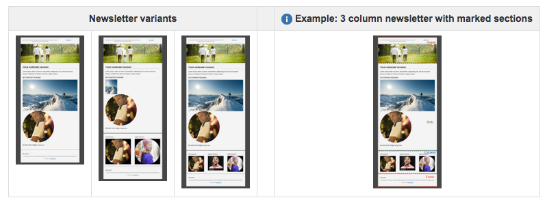

# 电子邮件模板的最佳实践 {#best-practices-for-email-templates}

>[!CAUTION]
>
>本文适用于已弃用的基于Foundation Components的AEM电子邮件组件。
>
>建议用户使用新版[核心组件电子邮件组件。](https://experienceleague.adobe.com/docs/experience-manager-core-components/using/email/introduction.html?lang=zh-Hans)

本文档介绍了一些有关电子邮件设计的最佳实践，这些实践最终形成了开发良好的电子邮件营销活动模板。

AEM中提供的演示活动遵循所有这些最佳实践。 对于每种最佳实践，都介绍了如何在演示活动中实施最佳实践。

创建您自己的新闻稿时，请遵循这些最佳实践。

>[!NOTE]
>
>应在类型为`master`的`cq/personalization/components/ambitpage`页面下创建所有营销活动内容。
>
>例如，如果您的计划促销活动结构类似于
>
>`/content/campaigns/teasers/en/campaign-promotion-global`
>
>确保它位于`master`页面下
>
>`/content/campaigns/teasers/master/en/campaign-promotion-global`

>[!NOTE]
>
>为Adobe Campaign创建邮件模板时，必须在模板的&#x200B;**jcr**&#x200B;节点中包含值为&#x200B;**mapRecipient**&#x200B;的属性&#x200B;**acMapping:content**。 如果不这样做，则无法在Experience Manager的&#x200B;**页面属性**&#x200B;中选择Adobe Campaign模板（字段已禁用）。

## 模板/页面组件 {#template-page-component}

***/libs/mcm/campaign/components/campaign_newsletterpage***

<table>
 <tbody>
  <tr>
   <td><strong>最佳实践</strong></td>
   <td><strong>实施</strong></td>
  </tr>
  <tr>
   <td>
指定文档类型，以确保一致的呈现。
 
在开头添加DOCTYPE(HTML或XHTML)
 </td>
   <td>
可通过设计更改<i>"/etc/designs/default/jcr：content/campaign_newsletterpage"</i>中的<i>cq：doctype</i>属性进行配置
 
默认值为“XHTML”：
 
&lt;！DOCTYPE html PUBLIC "-//W3C//DTD XHTML 1.0 Transitional/EN" "https://www.w3.org/TR/xhtml1/DTD/xhtml1-transitional.dtd"&gt;
 
可更改为“HTML_5”：
 
&lt;！DOCTYPE HTML&gt;
 </td>
  </tr>
  <tr>
   <td>
指定字符定义，以确保正确呈现特殊字符。
 
将CHARSET声明（例如，iso-8859-15、UTF-8）添加到&lt;head&gt;
 </td>
   <td>
设置为UTF-8。
 
&lt;meta http-equiv="content-type" content="text/html； charset=UTF-8"&gt;
 </td>
  </tr>
  <tr>
   <td>
使用&lt;table&gt;元素编码所有结构。 对于更复杂的布局，应嵌套表以构建复杂的结构。
 
即使没有CSS，电子邮件也应看起来不错。
 </td>
   <td>
在整个模板中使用表来结构化内容。 当前最多使用四个嵌套表（1个基表+最大值）。 3个嵌套级别)
 
&lt;div&gt;标记仅用于创作模式，以确保正确编辑组件。
 </td>
  </tr>
  <tr>
   <td>使用元素属性（如单元格内边距、有效值和宽度）来设置表格尺寸。 此方法强制使用盒模型结构。</td>
   <td>
所有表都包含必需属性，如<i>border</i>、<i>cellpadding</i>、<i>cellspacing</i>和<i>width</i>。
 
为了协调表内的元素位置，所有表单元格都设置了属性<i>valign="top"</i>。
 </td>
  </tr>
  <tr>
   <td>
尽可能考虑使用方便移动设备。 使用媒体查询可增加小屏幕上的文本大小，为链接提供缩略图大小的点击区域。
 
如果设计允许，则使电子邮件具有响应性。
 </td>
   <td>就CSS样式用于说明演示设计而言，媒体查询用于提供对移动设备友好的版本。</td>
  </tr>
  <tr>
   <td>内联CSS比将所有CSS放在开头要好。</td>
   <td>
为了更好地演示底层HTML结构并便于自定义新闻稿结构，仅内联了一些CSS定义。
 
基本样式和模板变体已提取到页面&lt;head&gt;中的样式块。 在新闻稿最终提交时，这些CSS定义将内联到HTML中。 已计划使用自动内联机制，但目前不可用。
 </td>
  </tr>
  <tr>
   <td>保持CSS简单。 避免使用复合样式声明、简写代码、CSS布局属性、复杂选择器和伪元素。</td>
   <td>就用于说明演示设计的CSS样式而言，遵循CSS建议。</td>
  </tr>
  <tr>
   <td>电子邮件的最大宽度应为600-800像素。 这种大小调整使它们在许多客户端提供的预览窗格大小范围内表现得更好。</td>
   <td>内容表的<i>宽度</i>在演示设计中限制为600像素。</td>
  </tr>
 </tbody>
</table>

### 图像 {#images}

/libs/mcm/campaign/components/image

| **最佳实践** | **实施** |
|---|---|
| 将&#x200B;*alt*&#x200B;属性添加到图像 | *alt*&#x200B;属性已定义为图像组件的必需属性。 |
| 对图像使用&#x200B;*jpg*&#x200B;而不是&#x200B;*png*&#x200B;格式 | 图像始终由图像组件用作JPG。 |
| 在表中使用``元素而不是背景图像。 | 模板中不使用背景图像数据。 |
| 在图片上添加attribute style=&quot;display block&quot;。 这样一来，它们就能在Gmail上正常显示。 | 所有图像默认包含&#x200B;*style=&quot;display block&quot;*&#x200B;属性。 |

### 文本和链接 {#text-and-links}

/libs/mcm/campaign/components/heading， /libs/mcm/campaign/components/textimage

<table>
 <tbody>
  <tr>
   <td><strong>最佳实践</strong></td>
   <td><strong>实施</strong></td>
  </tr>
  <tr>
   <td>使用html &lt;font&gt;而不是CSS中的样式(font-family)</td>
   <td>RtfEditor（例如，在文本组件中）现在支持选择字体系列和字体大小并将其应用到所选文本。 它们呈现为&lt;font&gt;标记。</td>
  </tr>
  <tr>
   <td>使用基本跨平台字体，如<i>Arial®、Verdana、Georgia</i>和<i>Times New Roman®</i>。</td>
   <td>
取决于新闻稿的设计。
 
对于演示设计，使用“Helvetica®”字体，但它会回退到通用无衬线字体（如果不存在）。
 </td>
  </tr>
 </tbody>
</table>

### 通用 {#generic}

| **最佳实践** | **实施** |
|---|---|
| 使用W3C验证器更正HTML代码。 确保所有打开的标记均已正确关闭。 | 代码已验证。 仅对于XHTML过渡Doctype，缺少`<html>`元素的xmlns属性。 |
| 避免使用JavaScript或Flash — 电子邮件客户端通常不支持这些技术。 | 新闻稿模板中未使用JavaScript或Flash。 |
| 为多部分发送添加纯文本版本。 | 在页面属性中内置了一个新构件，以便轻松地从页面内容中提取纯文本版本。 您可以将其用作最终纯文本版本的起点。 |

## 营销活动新闻稿模板和示例 {#campaign-newsletter-templates-and-examples}

AEM提供了多个现成的模板和组件供您创建Campaign新闻稿。 您可以使用这些模板和组件创建自定义新闻稿。

### 模板 {#templates}

为了提供坚实的基础并拓宽内容流可能性，提供了三种略有不同的现成模板类型。 您可以轻松使用这三种类型来构建自定义新闻稿。

所有文件都有&#x200B;**页眉**、**页脚**&#x200B;和&#x200B;**正文**&#x200B;节。 在正文部分下方，每个模板在&#x200B;**列设计**（一列、两列或三列）中不同。

可能的新闻稿的

### 组件 {#components}

当前有[七个组件可在营销活动模板](/help/sites-authoring/adobe-campaign-components.md)中使用。 这些组件都基于Adobe标记语言&#x200B;**HTL**。

| **组件名称** | **组件路径** |
|---|---|
| 标题 | /libs/mcm/campaign/components/heading |
| 图像 | /libs/mcm/campaign/components/image |
| 文本&amp;Personalization | /libs/mcm/campaign/components/personalization |
| Textimage | /libs/mcm/campaign/components/textimage |
| 链接 | /libs/mcm/campaign/components/reference |
| Dynamic Media Classic（以前为Scene7）图像模板 | /libs/mcm/campaign/s7image |
| 目标引用 | /libs/mcm/campaign/components/reference |

>[!NOTE]
>
>这些组件针对邮件内容进行了优化；也就是说，它们遵循了本文档中概述的最佳实践。 使用其他现成的组件通常违反这些规则。

这些组件在[Adobe Campaign组件](/help/sites-authoring/adobe-campaign-components.md)中有详细介绍。
