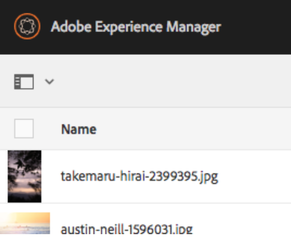

# 批量处理操作 {#bulk-processing-operations}

## 简介 {#introduction}

使用最新版本的Adobe Experience Manager (AEM)时，“全选”按钮已扩展到所有视图：“列表”、“列”和“卡片”视图。 现在，全选按钮可选择给定文件夹或收藏集中的所有内容，而不仅仅是客户端浏览器中加载和可见的Assets和页面。

已为批量操作启用关键操作： **移动**、**删除**&#x200B;和&#x200B;**复制**。 新的对话框让客户知道哪些操作不适用于批量处理。

## 使用方法 {#how-to-use}

名为“**全选**”的新按钮已添加到“卡片”、“列表”或“列”视图中。 此按钮可用于任何视图，以选择数据集中的所有元素。

在早期版本的AEM中，对客户端浏览器中加载的内容进行了限制。 引入此新更改是为了避免在执行批量操作的元素数量方面出现混淆。

目前，已向批量处理添加了三个操作：

* 移动
* 复制
* 删除

未来将添加对更多操作的支持。
要使用此功能，请导航到要在页面或Assets上执行批量操作的文件夹或收藏集。

然后，选择其中一个视图，如下所示：

### 信息卡视图 {#card-view}

### 在卡片视图中批量选择 {#bulk-selection-in-card-view}

可以使用右上角的&#x200B;**全选**&#x200B;按钮批量选择Assets或页面：

 

### 列表视图 {#list-view}

列表视图也是如此：

### 在列表视图中批量选择 {#bulk-selection-in-list-view}

在“列表视图”中，使用&#x200B;**全选**&#x200B;按钮，或使用左侧的复选框进行批量选择。

 

### 列视图 {#column-view}

### 列视图中的批量选择 {#bulk-selection-in-column-view}

## 批量启用的操作 {#bulk-enabled-operations}

选择后，可以执行三个批量启用的操作之一： **移动**、**复制**&#x200B;或&#x200B;**删除**。

在此，对上述选定的Assets执行&#x200B;**移动**&#x200B;操作。 在任何视图中，这都会导致所有Assets被移动到所选位置，而不仅仅是屏幕上加载的位置。

对于未批量启用的其他操作，如&#x200B;**Download，**，将显示一条警告，说明该操作只包含浏览器中加载的元素。

