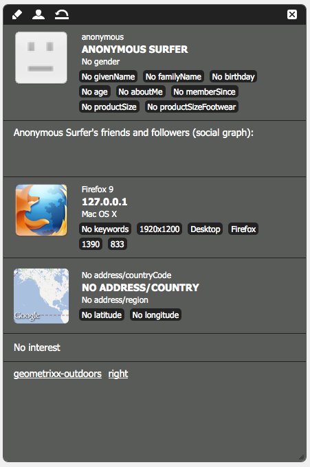

# 配置分段 {#configuring-segmentation}

>[!NOTE]
>
>本文档介绍与Client Context一起使用的区段的配置。 要使用Touch UI在ContextHub中配置区段，请参阅[使用ContextHub配置分段](/help/sites-administering/segmentation.md)。

分段是创建营销活动时的主要考虑事项。有关分段的工作方式和关键术语的信息，请参阅[分段术语表](/help/sites-authoring/segmentation-overview.md)。

根据您收集到的有关网站访客的信息以及要实现的目标，必须定义目标内容所需的区段和策略。

之后，这些区段可用于为访客提供具体的目标内容。此内容在网站的[营销活动](/help/sites-classic-ui-authoring/classic-personalization-campaigns.md)部分中维护。 此处定义的Teaser页面可以包含在任何页面上作为Teaser段落，并定义专用内容适用于的访客区段。

AEM可让您轻松创建和更新区段、Teaser和营销活动。 它还允许您验证定义的结果。

通过&#x200B;**区段编辑器**，可轻松定义区段：

您可以&#x200B;**编辑**&#x200B;每个区段以指定&#x200B;**标题**、**描述**&#x200B;和&#x200B;**提升**&#x200B;系数。 使用Sidekick，您可以添加&#x200B;**AND**&#x200B;和&#x200B;**OR**&#x200B;容器来定义&#x200B;**区段逻辑**，然后添加所需的&#x200B;**区段特征**&#x200B;来定义选择标准。

## 提升因子 {#boost-factor}

每个区段都有一个&#x200B;**Boost**&#x200B;参数，该参数用作加权因素；数字越大，越优先选择数字较低的区段。

* 最小值：`0`
* 最大值：`1000000`

## 区段逻辑 {#segment-logic}

以下逻辑容器是现成可用的，可让您构建区段选择的逻辑。 他们可以被从副手拖到主编：

<table>
 <tbody>
  <tr>
   <td> AND容器  </td>
   <td> 布尔AND运算符。  </td>
  </tr>
  <tr>
   <td> OR容器  </td>
   <td> 布尔OR运算符。</td>
  </tr>
 </tbody>
</table>

## 区段特征 {#segment-traits}

以下区段特征是现成可用的；它们可以从Sidekick拖到编辑器中：

<table>
 <tbody>
  <tr>
   <td> IP范围  </td>
   <td>定义访客可以拥有的IP地址范围。  </td>
  </tr>
  <tr>
   <td> 页面点击  </td>
   <td>请求页面的频率。  </td>
  </tr>
  <tr>
   <td> 页面属性  </td>
   <td>所访问页面的任意属性。  </td>
  </tr>
  <tr>
   <td> 引用关键字  </td>
   <td>与引用网站中的信息匹配的关键字。  </td>
  </tr>
  <tr>
   <td> 脚本</td>
   <td>要计算的JavaScript表达式。  </td>
  </tr>
  <tr>
   <td> 区段引用  </td>
   <td>引用另一个区段定义。  </td>
  </tr>
  <tr>
   <td> 标记云  </td>
   <td>要与所访问页面中的标记匹配的标记。  </td>
  </tr>
  <tr>
   <td> 用户年龄  </td>
   <td>从用户配置文件中获取。  </td>
  </tr>
  <tr>
   <td> 用户属性  </td>
   <td>用户配置文件中可用的任何其他信息。 </td>
  </tr>
 </tbody>
</table>

您可以使用布尔运算符OR和AND（请参阅[创建新区段](#creating-a-new-segment)）来组合这些特征，以定义选择此区段的确切场景。

当整个语句的计算结果为true时，表示该区段已解析。 如果有多个适用的区段，则还会使用&#x200B;**[Boost](/help/sites-administering/campaign-segmentation.md#boost-factor)**&#x200B;因子。

>[!CAUTION]
>
>区段编辑器不检查任何循环引用。例如，区段A引用另一个区段B，而后者又引用区段A。请确保您的区段不包含任何循环引用。

>[!NOTE]
>
>具有&#x200B;**_i18n**&#x200B;后缀的属性由脚本设置，该脚本是个性化的UI clientlib的一部分。 所有与UI相关的clientlib仅加载到作者上，因为发布时不需要用户界面。
>
>因此，在创建具有此类属性的区段时，通常需要依赖&#x200B;**browserFamily**&#x200B;而不是&#x200B;**browserFamily_i18n**&#x200B;来执行实例。

### 创建新区段 {#creating-a-new-segment}

要定义新区段，请执行以下操作：

1. 在边栏中，选择&#x200B;**工具>操作>配置**。
1. 单击左窗格中的&#x200B;**分段**&#x200B;页面，然后导航到所需的位置。
1. 使用&#x200B;**区段**&#x200B;模板创建[新页面](/help/sites-authoring/editing-content.md#creatinganewpage)。
1. 打开新页面以查看区段编辑器：

   

1. 使用Sidekick或上下文菜单（通常是单击鼠标右键，然后选择&#x200B;**新建……**&#x200B;以打开“插入新组件”窗口）来查找所需的区段特征。 然后将其拖动到&#x200B;**区段编辑器**，它将显示在默认的&#x200B;**AND**&#x200B;容器中。
1. 双击新特征以编辑特定参数；例如，鼠标位置：

   

1. 单击&#x200B;**确定**&#x200B;保存您的定义：
1. 您可以&#x200B;**编辑**&#x200B;区段定义以赋予它&#x200B;**标题**、**描述**&#x200B;和&#x200B;**[提升](#boost-factor)**&#x200B;系数：

   

1. 根据需要添加更多特征。 您可以使用&#x200B;**区段逻辑**&#x200B;下的&#x200B;**AND容器**&#x200B;和&#x200B;**OR容器**&#x200B;组件来制定布尔表达式。 通过区段编辑器，您可以删除不再需要的特征或容器，或将它们拖到语句中的新位置。

### 使用 AND 和 OR 容器 {#using-and-and-or-containers}

您可以在AEM中构建复杂区段。 了解一些基本要点会有所帮助：

* 定义的顶级始终是最初创建的AND容器；此操作无法更改，但不会影响区段定义的其余部分。
* 确保容器的嵌套有意义。可以将容器视为布尔表达式的括号。

以下示例用于选择符合以下条件的访客：

男性和16至65岁

OR

女性和16至62岁

由于主运算符为OR，因此您需要以&#x200B;**OR容器**&#x200B;开头。 您有2个AND语句，对于每个语句，您都需要一个&#x200B;**AND容器**，您可以在其中添加各个特征。

## 测试区段的应用程序 {#testing-the-application-of-a-segment}

定义区段后，可以在&#x200B;**[客户端上下文](/help/sites-administering/client-context.md)**&#x200B;的帮助下测试潜在结果：

1. 选择要测试的区段。
1. 按&#x200B;**[Ctrl-Alt-C](/help/sites-authoring/page-authoring.md#keyboardshortcuts)**&#x200B;打开&#x200B;**[客户端上下文](/help/sites-administering/client-context.md)**，其中显示已收集的数据。 出于测试目的，您可以&#x200B;**编辑**&#x200B;某些值，或&#x200B;**加载**&#x200B;其他配置文件以查看其影响。

1. 根据定义的特征，当前页面的可用数据可能与区段定义匹配，也可能不匹配。 匹配状态显示在定义下方。

例如，简单的区段定义可以基于用户的年龄和性别。 加载特定配置文件会显示已成功解析该区段：

或者不是：

>[!NOTE]
>
>所有特征都会立即解析，但大多数特征仅在页面重新加载时发生变化。 对鼠标位置的更改会立即可见，因此可用于测试目的。

此类测试还可以在内容页面上执行，并与&#x200B;**Teaser**&#x200B;组件结合使用。

将鼠标悬停在Teaser段落上将显示应用的区段，无论它们当前是否解析，因此也会显示选择当前Teaser实例的原因：

### 使用区段 {#using-your-segment}

区段当前在[营销活动](/help/sites-classic-ui-authoring/classic-personalization-campaigns.md)中使用。 它们用于控制特定目标受众看到的实际内容。 有关详细信息，请参阅[了解区段](/help/sites-authoring/segmentation-overview.md)。
