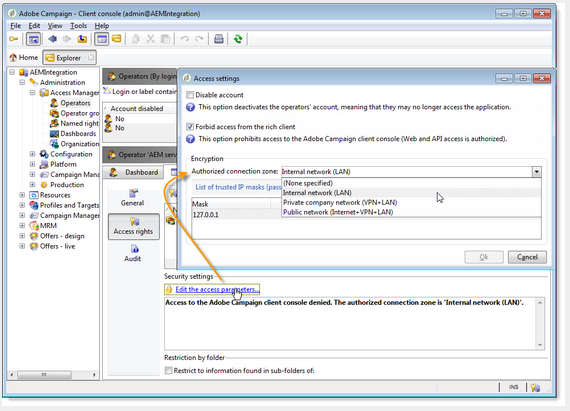
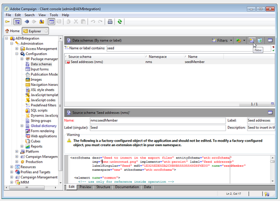
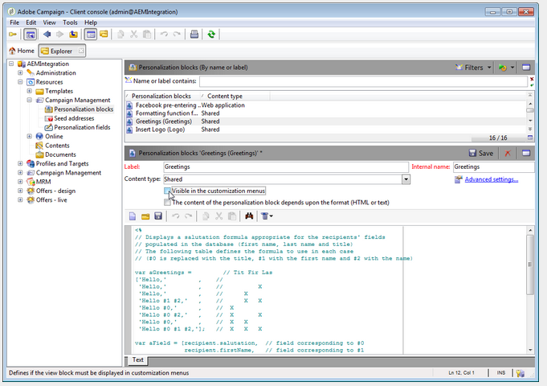

# 与 Adobe Campaign Classic 集成{#integrating-with-adobe-campaign-classic}

>[!NOTE]
>
>本文档介绍如何将AEM与内部部署解决方案Adobe Campaign Classic集成。 如果您使用的是Adobe Campaign Standard，请参阅 [与Adobe Campaign Standard集成](/help/sites-administering/campaignstandard.md) 的说明。

Adobe Campaign允许您直接在Adobe Experience Manager中管理电子邮件投放内容和表单。

要同时使用两个解决方案，您必须首先将它们配置为彼此连接。 这涉及在Adobe Campaign和Adobe Experience Manager中执行配置步骤。 本文档详细介绍了这些步骤。

在AEM中使用Adobe Campaign包括通过Adobe Campaign发送电子邮件的功能，有关该功能的介绍请参阅 [使用Adobe Campaign](/help/sites-authoring/campaign.md). 它还包括在AEM页面上使用表单来处理数据。

此外，将AEM与集成时，可能会关注以下主题 [Adobe Campaign](https://helpx.adobe.com/support/campaign/classic.html):

* [电子邮件模板最佳实践](/help/sites-administering/best-practices-for-email-templates.md)
* [Adobe Campaign集成故障诊断](/help/sites-administering/troubleshooting-campaignintegration.md)

如果您扩展了与Adobe Campaign的集成，则可能希望看到以下页面：

* [创建自定义扩展](/help/sites-developing/extending-campaign-extensions.md)
* [创建自定义表单映射](/help/sites-developing/extending-campaign-form-mapping.md)

## AEM和Adobe Campaign集成工作流程 {#aem-and-adobe-campaign-integration-workflow}

本节介绍创建营销活动和投放内容时AEM和Adobe Campaign之间的典型工作流程。

典型的工作流涉及以下内容，并对其进行了详细描述：

1. 开始构建您的营销活动(在Adobe Campaign和AEM中)。
1. 在链接内容和交付之前，请先在AEM中个性化您的内容，并在Adobe Campaign中创建交付。
1. 在Adobe Campaign中链接内容和交付。

### 开始构建营销活动 {#start-building-your-campaign}

您可以随时开始构建营销活动。 在链接内容之前，AEM和AC是独立的。这意味着营销人员可以在Adobe Campaign中开始创建他们的营销活动和定位，而内容创建者则在AEM中处理设计。

### 在链接内容和交付之前 {#before-linking-content-and-delivery}

在链接内容并创建投放机制之前，您需要执行以下操作：

**在AEM中**

* 使用 **文本与个性化** 组件

**在 Adobe Campaign 中：**

* 创建类型的投放 **aemContent**

### 链接内容并设置投放 {#linking-content-and-setting-delivery}

准备好内容以进行链接和交付后，您可以准确确定链接内容的方式和位置。

所有这些步骤均在Adobe Campaign中完成。

1. 指定要使用的AEM实例。
1. 单击同步按钮以同步内容。
1. 打开内容选取器以选取您的内容。

### 如果您是初次使用AEM {#if-you-are-new-to-aem}

如果您是初次使用AEM，可能会发现以下链接有助于您了解AEM:

* [启动AEM](/help/sites-deploying/deploy.md)
* [了解复制代理](/help/sites-deploying/replication.md)
* [查找和使用日志文件](/help/sites-deploying/monitoring-and-maintaining.md#working-with-audit-records-and-log-files)
* [AEM平台简介](/help/sites-deploying/platform.md)

## 配置Adobe Campaign {#configuring-adobe-campaign}

配置Adobe Campaign涉及以下事项：

1. 在Adobe Campaign中安装AEM集成包。
1. 配置外部帐户。
1. 验证AEMResourceTypeFilter是否正确配置。

此外，您还可以进行一些高级配置，包括：

* 管理内容块
* 管理个性化字段

请参阅 [高级配置](#advanced-configurations).

>[!NOTE]
>
>要执行这些操作，您必须具有 **管理** 在Adobe Campaign中的角色。

### 前提条件 {#prerequisites}

请事先确保您具有以下元素：

* [AEM创作实例](/help/sites-deploying/deploy.md#getting-started)
* [AEM发布实例](/help/sites-deploying/deploy.md#author-and-publish-installs)
* [Adobe Campaign Classic实例](https://helpx.adobe.com/support/campaign/classic.html)  — 包括客户端和服务器
* Internet Explorer 11

>[!NOTE]
>
>如果您运行的版本低于Adobe Campaign Classic内部版本8640，请参阅 [升级文档](https://docs.campaign.adobe.com/doc/AC6.1/en/PRO_Updating_Adobe_Campaign_Upgrading.html) 以了解更多信息。 请注意，必须将客户端和数据库都升级到同一内部版本。

>[!CAUTION]
>
>操作详见 [配置Adobe Campaign](#configuring-adobe-campaign) 和 [配置Adobe Experience Manager](#configuring-adobe-experience-manager) 要使AEM和Adobe Campaign之间的集成功能正常工作，需要部分内容。

### 安装AEM集成包 {#installing-the-aem-integration-package}

您必须安装 **AEM集成** 包在Adobe Campaign中。 要执行此操作：

1. 转到要与AEM链接的Adobe Campaign实例。
1. 选择&#x200B;*“工具”*>*“高级”*>*“导入软件包...”*。

   

1. 单击 **安装标准包**，然后选择 **AEM集成** 包。

   

1. 单击 **下一个**，然后 **开始**.

   此包包含 **aemserver** 运算符，用于将AEM服务器连接到Adobe Campaign。

   >[!CAUTION]
   >
   >默认情况下，不会为此运算符配置安全区域。 要通过AEM连接到Adobe Campaign，必须选择一个。
   >
   >在 **serverConf.xml** 文件， **allowUserPassword** 必须将所选安全区域的属性设置为 **true** 授权AEM通过登录名/密码连接Adobe Campaign。
   >
   >我们强烈建议创建一个专用于AEM的安全区，以避免出现任何安全问题。 有关更多信息，请参阅 [安装指南](https://docs.campaign.adobe.com/doc/AC/en/INS_Additional_configurations_Configuring_Campaign_server.html).

   

### 配置AEM外部帐户 {#configuring-an-aem-external-account}

您必须配置一个外部帐户，以便将Adobe Campaign连接到AEM实例。

>[!NOTE]
>
>* 安装 **AEM集成** 包中，将创建外部AEM帐户。 您可以通过该实例配置与AEM实例的连接，也可以创建一个新实例。
>* 在AEM中，确保为campaign-remote用户设置密码。 您需要设置此密码才能将Adobe Campaign与AEM连接。 以管理员身份登录，在用户管理控制台中，搜索campaign-remote用户并单击 **设置密码**.
>


要配置外部AEM帐户，请执行以下操作：

1. 转到 **管理** > **平台** > **外部帐户** 节点。
1. 创建新的外部帐户，然后选择 **AEM** 类型。
1. 输入AEM创作实例的访问参数：用于连接到此实例的服务器地址以及ID和密码。 campaign-api用户帐户密码与您在AEM中为设置密码的campaign-remote用户相同。

   >[!NOTE]
   >
   >确保服务器地址为 **not** 以尾随斜杠结尾。 例如，输入 `https://yourserver:4502` 而不是 `https://yourserver:4502/`

    

1. 确保 **已启用** 复选框。

### 验证AEMResourceTypeFilter选项 {#verifying-the-aemresourcetypefilter-option}

的 **AEMResourceTypeFilter** 选项用于筛选可在Adobe Campaign中使用的AEM资源类型。 这允许Adobe Campaign检索专门设计为仅在Adobe Campaign中使用的AEM内容。

此选项应进行预配置；但是，如果更改此选项，可能会导致集成无法正常运行。

验证 **AEMResourceTypeFilter** 选项：

1. 转到 **平台** >**选项**.
1. 在 **AEMResourceTypeFilter** 选项，检查路径是否正确。 此字段必须包含值：

   **mcm/campaign/components/newsletter，mcm/campaign/components/campaign_newsletterpage，mcm/neolane/components/newsletter**

   或者在某些情况下，该值如下所示：

   **mcm/campaign/components/newsletter**

   

## 配置Adobe Experience Manager {#configuring-adobe-experience-manager}

要配置AEM，您必须执行以下操作：

* 配置实例之间的复制。
* 通过AEM将Cloud Services连接到Adobe Campaign。
* 配置外部器。

### 在AEM实例之间配置复制 {#configuring-replication-between-aem-instances}

首先，从AEM创作实例创建的内容会发送到发布实例。 您需要进行发布，以便新闻稿中的图像可在发布实例上和新闻稿的收件人获得。 因此，必须将复制代理配置为从AEM创作实例复制到AEM发布实例。

>[!NOTE]
>
>如果您不想使用复制URL，而是使用面向公众的URL，则可以将 **公共URL** 在OSGi的以下配置设置中(**AEM徽标** >  **工具** 图标>  **操作** > **Web控制台** > **OSGi配置** > **AEM Campaign集成 — 配置**):
**公共URL:** com.day.cq.mcm.campaign.impl.IntegrationConfigImpl#aem.mcm.campaign.publicUrl

要将某些创作实例配置复制到发布实例中，还需要执行此步骤。

要在AEM实例之间配置复制，请执行以下操作：

1. 在创作实例中，选择 **AEM徽标**> **工具** 图标> **部署** > **复制** > **作者代理**，然后单击 **默认代理**.

   

   >[!NOTE]
   配置与Adobe Campaign的集成时，请避免使用localhost(AEM的本地副本)，除非发布和创作实例都位于同一台计算机上。

1. 点按或单击 **编辑** 然后选择 **运输** 选项卡。
1. 通过替换 **localhost** 的IP地址或AEM发布实例的地址。

   

### 将AEM连接到Adobe Campaign {#connecting-aem-to-adobe-campaign}

在将AEM和Adobe Campaign结合使用之前，您必须在两个解决方案之间建立链接，以便它们能够进行通信。

1. 连接到AEM创作实例。
1. 选择 **AEM徽标** > **工具** 图标> **部署** > **Cloud Services**，则 **立即配置** 在Adobe Campaign部分。

   

1. 通过输入 **标题** 单击 **创建**，或选择要与Adobe Campaign实例链接的现有配置。
1. 编辑配置，使其与Adobe Campaign实例的参数匹配。

   * **用户名**: **aemserver**，使用Adobe Campaign AEM集成包运算符在两个解决方案之间建立链接。
   * **密码**:Adobe Campaign aemserver操作员密码。 您可能需要直接在Adobe Campaign中为此运算符重新指定密码。
   * **API端点**:Adobe Campaign实例URL。

1. 选择 **连接到Adobe Campaign** 单击 **确定**.

   

   >[!NOTE]
   在 [创建电子邮件并发布](/help/sites-authoring/campaign.md)，则需要将配置重新发布到发布实例。

   

>[!NOTE]
如果连接失败，请确保检查以下内容：
* 使用到Adobe Campaign实例(https)的安全连接时，您可能会遇到证书问题。 您必须将Adobe Campaign实例证书添加到 **缓存** AEM实例JDK的文件。
* 必须为 [aemserver运算符](#connecting-aem-to-adobe-campaign) 在Adobe Campaign。 此外，在 **serverConf.xml** 文件， **allowUserPassword** 必须将安全区域的属性设置为 **true** 使用登录/密码模式授权AEM与Adobe Campaign的连接。
>
此外，请参阅 [AEM/Adobe Campaign集成故障诊断](/help/sites-administering/troubleshooting-campaignintegration.md).

### 配置外部器 {#configuring-the-externalizer}

您需要 [配置外部器](/help/sites-developing/externalizer.md) 在AEM中。 外部器是一种OSGi服务，它允许您将资源路径转换为外部URL和绝对URL。 此服务提供了一个配置和构建这些外部URL的中心位置。

请参阅 [配置外部器](/help/sites-developing/externalizer.md) 常规说明。 对于Adobe Campaign集成，请确保在 `https://<host>:<port>/system/console/configMgr/com.day.cq.commons.impl.ExternalizerImpl`未指向 `localhost:4503` 但可以连接到可通过Adobe Campaign控制台访问的服务器。

如果它指向 `localhost:4503` 或Adobe Campaign无法访问的其他服务器上，您的图像将不会显示在Adobe Campaign控制台中。


## 高级配置 {#advanced-configurations}

您还可以执行一些高级配置，即：

* 管理个性化字段和块。
* 停用个性化块。
* 管理Target扩展数据。

### 管理个性化字段和块 {#managing-personalization-fields-and-blocks}

用于在AEM中向电子邮件内容添加个性化的字段和块由Adobe Campaign管理。

提供了默认列表，但可以修改。 您还可以添加或隐藏个性化字段和块。

#### 添加个性化字段 {#adding-a-personalization-field}

要向已可用的个性化字段添加新的个性化字段，您必须扩展Adobe Campaign **nms:seedMember** 架构如下所示：

>[!CAUTION]
您需要添加的字段必须已通过收件人模式扩展(**nms:recipient**)。 有关更多信息，请参阅 [配置](https://docs.campaign.adobe.com/doc/AC6.1/en/CFG_Editing_schemas_Editing_schemas.html) 的双曲余切值。

1. 转到 **管理** > **配置** > **数据模式** 节点。
1. 选择 **新建**.

   

1. 在弹出窗口中，选择 **使用扩展模式扩展表中的数据** 单击 **下一个**.

   

1. 输入扩展架构的不同参数：

   * **架构**:选择 **nms:seedMember** 架构。 窗口中的其他字段会自动填写。
   * **命名空间**:个性化扩展架构的命名空间。

1. 编辑架构的XML代码，以指定要添加到该架构的字段。 有关在Adobe Campaign中扩展模式的更多信息，请参阅 [配置指南](https://docs.campaign.adobe.com/doc/AC6.1/en/CFG_Editing_schemas_Extending_a_schema.html).
1. 保存您的架构，然后通过 **工具** > **高级** > **更新数据库结构** 菜单。
1. 断开连接，然后重新连接到Adobe Campaign控制台以保存更改。 现在，新字段会显示在AEM中可用的个性化字段列表中。

#### 示例 {#example}

添加 **注册编号** 字段，则必须具有以下元素：

* 的 **nms:recipient** 模式扩展名为 **cus:recipient** 包含：

```xml
<element desc="Recipient table (profiles)" img="nms:recipient.png" label="Recipients" labelSingular="Recipient" name="recipient">

  <attribute dataPolicy="smartCase" desc="Recipient registration number"
  label="Registration Number"
  length="50" name="registrationNumber" type="string"/>

</element>
```

的 **nms:seedMember** 模式扩展名为 **cus:seedMember** 包含：

```xml
<element desc="Seed to insert in the export files" img="nms:unknownad.png" label="Seed addresses" labelSingular="Seed" name="seedMember">

  <element name="custom_nms_recipient">
    <attribute name="registrationNumber"
    template="cus:recipient:recipient/@registrationNumber"/>
  </element>

</element>
```

的 **注册编号** 字段现在是可用个性化字段的一部分：


#### 隐藏个性化字段 {#hiding-a-personalization-field}

要在已有可用的个性化字段中隐藏个性化字段，您必须扩展Adobe Campaign **nms:seedMember** 架构(详见 [添加个性化字段](#adding-a-personalization-field) 中。 应用以下步骤：

1. 复制要从 **nms:seedMember** 扩展模式(**cus:seedMember** 例如)。
1. 添加 **advanced=&quot;true&quot;** 字段的XML属性。 它不再显示在AEM中可用的个性化字段列表中。

   例如，要隐藏 **中间名** 字段， **cud:seedMember** 架构必须包含以下元素：

   ```xml
   <element desc="Seed to insert in the export files" img="nms:unknownad.png" label="Seed addresses" labelSingular="Seed" name="seedMember">
   
     <element name="custom_nms_recipient">
       <attribute advanced="true" name="middleName"/>
     </element>
   
   </element>
   ```

### 停用个性化块 {#deactivating-a-personalization-block}

要取消激活可用个性化块中的个性化块，请执行以下操作：

1. 转到 **资源** > **Campaign Management** > **个性化块** 节点。
1. 选择要在AEM中停用的个性化块。
1. 清除 **在自定义菜单中可见** 复选框并保存更改。 块不再显示在Adobe Campaign中可用的个性化块列表中。

   

### 管理目标扩展数据 {#managing-target-extension-data}

您还可以插入Target扩展数据以进行个性化。 Target扩展数据（也称为“Target数据”）来自于例如在营销活动工作流中扩充查询或在查询中添加数据。 有关更多信息，请参阅 [创建查询](https://docs.campaign.adobe.com/doc/AC/en/PTF_Creating_queries_About_queries_in_Campaign.html) 和 [扩充数据](https://docs.campaign.adobe.com/doc/AC/en/WKF_Use_cases_Enriching_data.html) 中。

>[!NOTE]
只有将AEM内容与Adobe Campaign交付同步时，目标中的数据才可用。 请参阅 [将在AEM中创建的内容与来自Adobe Campaign的投放同步](/help/sites-authoring/campaign.md#synchronizing-content-created-in-aem-with-a-delivery-from-adobe-campaign-classic).


