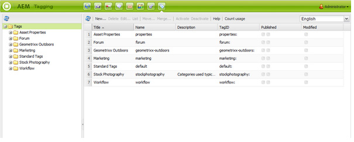

# 经典UI标记控制台{#classic-ui-tagging-console}

本节适用于经典UI标记控制台。

触控优化的UI标记控制台位于[此处](/help/sites-administering/tags.md#tagging-console)。

要访问经典UI标记控制台，请执行以下操作：

* 在作者上
* 使用管理权限登录
* 浏览到控制台
例如，[https://localhost:4502/tagging](https://localhost:4502/tagging)

## 创建标记和命名空间 {#creating-tags-and-namespaces}

1. 根据您从开始的级别，可以使用&#x200B;**新建**&#x200B;创建标记或命名空间：

   如果选择&#x200B;**标记**，则可以创建命名空间：

   

   如果选择命名空间（例如&#x200B;**Demo**），则可以在该命名空间中创建标记：

   

1. 在这两种情况下，输入

   * **标题**
（*必需*）标记的显示标题。 虽然可以输入任何字符，
建议不要使用以下特殊字符：

      * `colon (:)` — 命名空间分隔符
      * `forward slash (/)` — 子标记分隔符

     如果输入，将不显示这些字符。

   * **名称**
（*必需*）标记的节点名称。

   * **描述**
（*可选*）标记的说明。

   * 选择&#x200B;**创建**

## 编辑标记 {#editing-tags}

1. 在右侧窗格中，选择要编辑的标记。
1. 单击&#x200B;**编辑**。
1. 您可以修改&#x200B;**标题**&#x200B;和&#x200B;**描述**。
1. 单击&#x200B;**保存**&#x200B;以关闭对话框。

## 删除标记 {#deleting-tags}

1. 在右侧窗格中，选择要删除的标记。
1. 单击&#x200B;**删除**。
1. 单击&#x200B;**是**&#x200B;关闭对话框。

   标记不应再列出。

## 激活和停用标记 {#activating-and-deactivating-tags}

1. 在右侧窗格中，选择要激活（发布）或停用（取消发布）的命名空间或标记。
1. 根据需要单击&#x200B;**激活**&#x200B;或&#x200B;**停用**。

## 列表 — 显示引用标记的位置 {#list-showing-where-tags-are-referenced}

**列表**&#x200B;将打开一个新窗口，显示使用高亮显示的标记的所有页面的路径：

## 移动标记 {#moving-tags}

为帮助标记管理员和开发人员清理分类或重命名标记ID，可以将标记移动到新位置：

1. 打开&#x200B;**标记**&#x200B;控制台。
1. 选择标记并单击顶部工具栏（或上下文菜单中）中的&#x200B;**移动……**。
1. 在&#x200B;**移动标记**&#x200B;对话框中，定义：

   * **到**，目标节点。
   * **将新节点名称重命名为**。

1. 单击&#x200B;**移动**。

**移动标记**&#x200B;对话框如下所示：

>[!NOTE]
>
>作者不应移动标记或重命名标记ID。 必要时，作者应仅[更改标记标题](#editing-tags)。

## 合并标记 {#merging-tags}

当分类具有重复项时，可以使用合并标记。 当标记A合并到标记B时，所有使用标记A标记的页面都将使用标记B标记，并且标记A不再可用于作者。

要将标记合并到另一个标记中，请执行以下操作：

1. 打开&#x200B;**标记**&#x200B;控制台。
1. 选择标记并单击顶部工具栏（或上下文菜单中）中的&#x200B;**合并……**。
1. 在&#x200B;**合并标记**&#x200B;对话框中，定义：

   * **到**，目标节点。

1. 单击&#x200B;**合并**。

**合并标记**&#x200B;对话框如下所示：

## 对标记的使用进行计数 {#counting-usage-of-tags}

要查看标记的使用次数，请执行以下操作：

1. 打开&#x200B;**标记**&#x200B;控制台。
1. 单击顶部工具栏中的&#x200B;**计数用法**：列“计数”显示结果。

## 管理不同语言的标记 {#managing-tags-in-different-languages}

标记的可选`title`属性可以翻译成多种语言。 然后，可以根据用户语言或页面语言显示标记`titles`。

### 定义多种语言的标记标题 {#defining-tag-titles-in-multiple-languages}

以下过程说明如何将标记&#x200B;**Animals**&#x200B;的`title`翻译成英语、德语和法语：

1. 转到&#x200B;**标记**&#x200B;控制台。
1. 编辑&#x200B;**标记** > **Stock Photography**&#x200B;下的标记&#x200B;**Animals**。
1. 添加以下语言的翻译：

   * **英语**：动物
   * **德语**： Tiere
   * **法语**： Animaux

1. 保存更改。

该对话框如下所示：

“标记”控制台使用用户语言设置，因此对于Animal标记，对于在用户属性中将语言设置为法语的用户，将显示“Animaux”。

要向对话框添加新语言，请参阅&#x200B;**为开发人员添加标记**&#x200B;部分中的[将新语言添加到编辑标记对话框](/help/sites-developing/building.md#adding-a-new-language-to-the-edit-tag-dialog)部分。

### 以指定语言在页面属性中显示标记标题 {#displaying-tag-titles-in-page-properties-in-a-specified-language}

默认情况下，页面属性中的标记`titles`以页面语言显示。 页面属性中的标记对话框有一个语言字段，该字段允许以其他语言显示标记`titles`。 以下过程说明如何以法语显示标记`titles`：

1. 请参阅上一节以向&#x200B;**标记** > **Stock摄影**&#x200B;下方的&#x200B;**Animals**&#x200B;添加法语翻译。
1. 在&#x200B;**Geometrixx**&#x200B;网站的英语分支中打开&#x200B;**产品**&#x200B;页面的页面属性。
1. 打开&#x200B;**标记/关键字**&#x200B;对话框（通过选择标记/关键字显示区域右侧的下拉菜单），然后从右下角的下拉菜单中选择&#x200B;**法语**&#x200B;语言。
1. 使用左右箭头滚动，直到能够选择&#x200B;**Stock摄影**&#x200B;选项卡

   选择&#x200B;**Animaux** (**Animaux**)标记，然后在对话框外部选择以关闭该标记并将其添加到页面属性。

   

默认情况下，“页面属性”对话框会根据页面语言显示标记`titles`。

通常，如果页面语言可用，则从页面语言中获取标记的语言。 在其他情况下（例如，在表单或对话框中）使用[`tag`小组件](/help/sites-developing/building.md#tagging-on-the-client-side)时，标记语言取决于上下文。

>[!NOTE]
>
>标准页面组件中的标记云和meta关键字根据页面语言使用本地化的标记`titles`（如果可用）。
