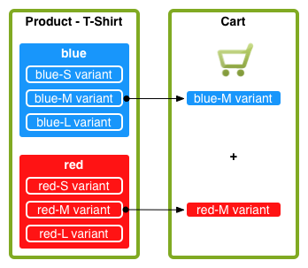
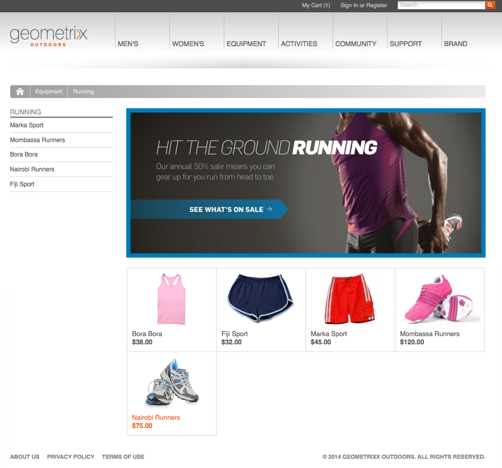
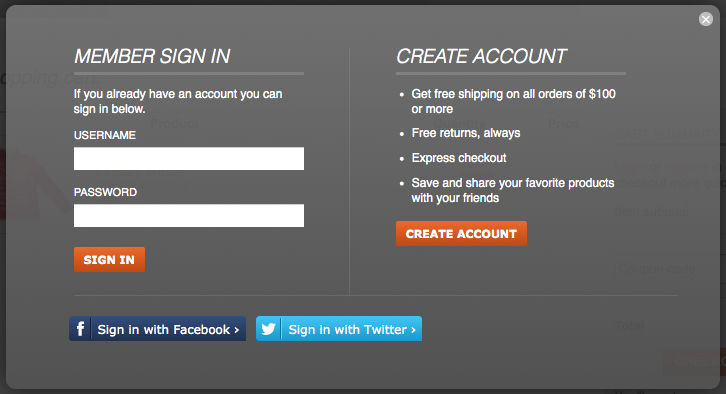
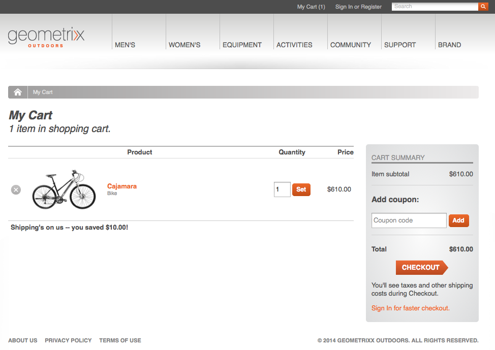

# 概念{#concepts}

集成框架提供了以下机制和组件：

* 连接到电子商务引擎
* 将数据导入AEM
* 显示该数据并收集购物者的答复
* 返回事务详细信息
* 从两个系统中搜索数据

这意味着：

* 购物者无需等待即可注册和购物。
* 购物者将毫不迟疑地看到价格变化。
* 可以根据需要添加产品。

>[!NOTE]
>
>电子商务框架可与以下对象一起使用：
>
>* [马根托](https://www.adobe.io/apis/experiencecloud/commerce-integration-framework/integrations.html#!AdobeDocs/commerce-cif-documentation/master/integrations/02-AEM-Magento.md)
>* [SAP Commerce Cloud](/help/sites-administering/sap-commerce-cloud.md)
>* [Salesforce商务云](https://github.com/adobe/commerce-salesforce)
>

>[!CAUTION]
>
>电子 [商务集成框架](https://www.adobe.com/solutions/web-experience-management/commerce.html) 是AEM Add-On。
>
>您的销售代表可以根据相应的引擎提供完整的详细信息。

>[!CAUTION]
>
>该框架为您自己的项目提供了基本要求。
>
>总是需要一定数量的开发工作来调整框架以符合您的规范。

>[!CAUTION]
>
>标准AEM安装包括通用AEM(JCR)电子商务实施。
>
>这目前用于演示目的，或根据您的要求作为自定义实施的基本基础。

要优化操作，AEM和电子商务引擎都将精力集中在自己的专业知识领域。 信息在两者之间实时传输；例如：

* AEM可以：

   * 请求：

      * 电子商务引擎中的产品信息。
   * 提供：

      * 产品信息、购物车和结帐的用户视图。
      * 购物车和结帐信息到eCommerce引擎。
      * 搜索引擎优化(SEO)。
      * 社区功能。
      * 非结构化的营销互动。

* 电子商务引擎可以：

   * 提供：

      * 数据库中的产品信息。
      * 产品变体管理。
      * 订单管理。
      * ERP(Enterprise Resource Planning)。
      * 在产品信息中搜索。
   * 进程:

      * 购物车。
      * 结帐。
      * 订单履行。

>[!NOTE]
>
>具体详细信息取决于电子商务引擎和项目实施。

为使用集成层提供了许多现成的AEM组件。 目前包括：

* 产品信息
* 购物车
* 结帐
* 我的帐户

还提供各种搜索选项。

## 架构 {#architecture}

集成框架提供API、用于说明功能的一系列组件以及提供连接方法示例的若干扩展：

该框架允许您访问以下功能：

### 实施 {#implementations}

AEM eCommerce is implemented with an eCommerce engine:

* 构建电子商务集成框架后，您可以将电子商务引擎轻松集成到AEM。 用途生成的电子商务引擎控制产品数据、购物车、结帐和订单履行，而AEM控制数据显示和营销活动。

>[!NOTE]
>
>标准AEM安装包括通用AEM(JCR)电子商务实施。
>
>这目前用于演示目的，或根据您的要求作为自定义实施的基本基础。
>
>在AEM中使用基于JCR的通用开发实现的AEM eCommerce是：
>
>* 用于说明API使用的独立AEM本机电子商务示例。 这可用于控制产品数据、购物车和结帐以及现有数据显示和营销活动。 在这种情况下，产品数据库存储在AEM的本机存储库(Adobe的 [JCR实施](https://docs.adobe.com/content/docs/en/spec/jcr/2.0/index.html))中。
   >  标准AEM安装包含通用电子商务实 [施的基础知识](/help/sites-administering/generic.md)。
>

### 商务提供商 {#commerce-providers}

将数据从商务引擎导入AEM eCommerce站点时，将使用商务提供者为导入者提供数据。 一个商务提供商可支持多个导入器。

商务提供商是自定义为以下任一项的AEM代码：

* 后端商务引擎的接口
* 在JCR存储库顶部实施商务系统

AEM当前提供两个商务提供者示例：

* one for geometrixx-hybris
* geometrixx-generic(JCR)的另一个

尽管通常情况下，项目需要开发自己的自定义商务提供商，特定于其PIM和产品数据架构。

>[!NOTE]
>
>geometrixx导入器使用CSV文件；在架构的实现上方的注释中有接受的架构描述（允许自定义属性）。

ProductServicesManager [维护(通过](https://helpx.adobe.com/experience-manager/6-5/sites/developing/using/reference-materials/javadoc/com/adobe/cq/commerce/pim/api/ProductServicesManager.html) OSGi [)](/help/sites-deploying/configuring.md#osgi-configuration-settings)ProductImporter和 [CatalogBlueprintImporterInterrefts接口的列表](https://helpx.adobe.com/experience-manager/6-5/sites/developing/using/reference-materials/javadoc/com/adobe/cq/commerce/pim/api/ProductImporter.html) 。 这些属性列在导入程 **序向导的“导入程序／商务提供程序** ”下拉字段中(使用 `commerceProvider` 属性作为名称)。

当特定的导入程序／商务提供程序从下拉菜单中可用时，必须在以下任一位置定义它需要的任何补充数据（取决于导入程序类型）:

* `/apps/commerce/gui/content/catalogs/importblueprintswizard/importers`
* `/apps/commerce/gui/content/products/importproductswizard/importers`

相应文件夹下的文 `importers` 件夹必须与导入程序名称匹配；例如：

* `.../importproductswizard/importers/geometrixx/.content.xml`

源导入文件的格式由导入程序定义。 或者，导入程序可以建立到商务引擎的连接（例如WebDAV或http）。

## 角色 {#roles}

集成系统满足以下角色以维护数据：

* 产品信息管理(PIM)维护者：

   * 产品信息。
   * 分类、分类、批准。
   * 与数字资产管理交互。
   * 定价——通常这来自ERP系统，并且不在商务系统中明确维护。

* 作者／负责维护的营销经理：

   * 适用于所有渠道的营销内容。
   * 促销活动.
   * 优惠券.
   * 营销活动.

* Surfer / Shopper who:

   * 查看您的产品信息。
   * 将物品放入购物车。
   * 检查他们的订单。
   * 预计订单履行。

尽管实际位置取决于您的实施；例如，通用或与eCommerce引擎一起使用：

## 产品 {#products}

### 产品数据与营销数据 {#product-data-versus-marketing-data}

#### 结构性与营销类别 {#structural-versus-marketing-categories}

如果可以区分以下两个类别，则这允许您使用有意义的结构（节点树）创建清晰的URL，因此，这非常接近经典的AEM内容管理): `cq:Page`

* *结构*类别

   定义产品 *的类别树*;例如：

   `/products/mens/shoes/sneakers`

* *营销类别*

   产品可属于的 *所有其他类别*;例如：

   `/special-offers/christmas/shoes`)

### 产品数据 {#product-data}

要描绘和管理您的产品，您需要保留一系列相关信息。

产品数据可以是：

* maintained directly in AEM(generic)。
* maintained in eCommerce engine and mave available in AEM.

   根据数据类型，它会根据需要 [进行同步](#catalog-maintenance-data-synchronization) ，或直接访问；例如，在每个页面请求中从电子商务引擎检索产品价格等高度波动和关键数据，以确保它们始终处于最新状态。

在任一情况下，当产品数据输入／导入到AEM时，都可以从产品控制台中 **查看** 。 此处显示产品的卡片视图和列表视图，这些信息包括：

* 图像
* SKU代码
* 上次修改时间

### 产品的系列品种 {#product-variants}

对于相应的产品，也可以保留有关变体的信息。 例如，对于可用颜色不同的服装，它们以变体形式存在：

### 产品属性 {#product-attributes}

每个产品的各个属性可能取决于所使用的电子商务引擎和您的AEM实施。 在查看产品页面和／或编辑产品信息时，这些选项（视情况而定）可用，并且可以包括：

* **图像**

   产品的图像。

* **标题**

   产品名称。

* **描述**

   产品的文本说明。

* **标记**

   用于对相关产品进行分组的标记。

* **默认资产类别**

   资产的默认类别。

* **ERP 数据**

   企业资源规划(ERP)信息。

   * **SKU**

      库存单位(SKU)信息。

   * **颜色**
   * **大小**
   * **价格**

      产品的单价。

* **摘要**

   产品功能摘要。

* **功能**

   更完整的产品功能详细信息。

### 产品资产 {#product-assets}

可为单个产品保留一系列资产。 通常包括图像和视频。

## 目录 {#catalogs}

目录将产品数据组合在一起，以便于管理和向购物者展示产品数据。 通常，目录根据语言、地理区域、品牌、季节、爱好、体育等属性进行结构化。

### 目录结构 {#catalog-structure}

#### 多语言目录 {#catalogs-in-multiple-languages}

AEM支持多语言产品内容。 在请求数据时，集成框架从当前树中检索语言(例如，对 `en_US` 于下的页面 `/content/geometrixx-outdoors/en_US`)。

对于多语言商店，您可以单独导入每个语言树的目录(或通过 [MSM](/help/sites-administering/msm.md))。

#### 多品牌目录 {#catalogs-for-multiple-brands}

与语言一样，大型跨国公司可能需要满足多个品牌的需求。

#### 按标记排列的目录 {#catalogs-by-tags}

还可以使用标记将产品组合到目录中。 这些目录可用于更动态的目录，如季节性推广信息。

### 目录设置（初始导入） {#catalog-setup-initial-import}

根据您的实施，您可以从以下位置将基本目录所需的产品数据导入AEM:

* CSV文件（用于通用实现）
* eCommerce引擎

### 目录维护（数据同步） {#catalog-maintenance-data-synchronization}

产品数据的进一步变化将不可避免：

* 对于通用实现，可以使用产品编辑器管 [理这些](/help/sites-administering/generic.md#editing-product-information)
* 使用eCommerce引 [擎时，必须同步更改](#data-synchronization-with-an-ecommerce-engine-ongoing)

#### 与eCommerce engine进行数据同步（正在进行） {#data-synchronization-with-an-ecommerce-engine-ongoing}

初次导入后，对产品数据的更改是不可避免的。

使用电子商务引擎时，产品数据会在此处维护，并且需要在AEM中可用。 进行更新时，需要同步此产品数据。

这取决于数据类型：

* 周期 [同步与更改的数据供给一起使用](/help/sites-developing/sap-commerce-cloud.md#product-synchronization-and-publishing)。

   除此之外，您还可以为快速更新选择特定更新。

* 从商务引擎中检索每个页面请求的高度易变性数据，如价格信息，以确保其始终为最新。

### 目录——性能和缩放 {#catalogs-performance-and-scaling}

从电子商务引擎(PIM)导入包含大量产品（通常超过100,000）的大型目录会因节点数过多而影响系统。 如果产品具有关联的资产（例如产品图像），则还可以减慢创作实例的速度。 这是由于这些资产的后处理需要占用大量CPU和内存。

您可以选择各种策略来解决这些问题：

* [Bucketing](#bucketing) —— 用于满足大量节点的需要
* [将资产后处理卸载到专用实例](#offload-asset-post-processing-to-a-dedicated-instance)
* [仅导入产品数据](#only-import-product-data)
* [导入节流和批量保存](#import-throttling-and-batch-saves)
* [性能测试](#performance-testing)
* [性能——杂项](#performance-miscellaneous)

#### Bucketing {#bucketing}

如果JCR节点有许多直接子节点（例如1000和更多），则需要存储段（幻影文件夹），以确保性能不受影响。 导入时根据算法生成这些值。

这些存储段采用虚拟文件夹的形式，这些文件夹已引入到您的目录结构中，但可以进行配置，以便在公共URL中不明显。

#### 将资产后处理卸载到专用实例 {#offload-asset-post-processing-to-a-dedicated-instance}

此方案涉及设置两个作者实例：

1. 主作者实例

   从PIM导入产品数据，在PIM上禁用了资产路径的后处理。

1. 专用DAM作者实例

   从PIM导入和后处理产品资产，然后将这些资产复制回主作者实例以供使用。

#### 仅导入产品数据 {#only-import-product-data}

对于产品不包含要导入的资产（图像）的情况，您可以导入产品数据，而不会受资产后期处理的影响。

<!--delete
#### Import Throttling and Batch Saves {#import-throttling-and-batch-saves}

[Import throttling](/help/sites-deploying/scaling.md#import-throttling) and [batch saves](/help/sites-deploying/scaling.md#batch-saves) are two general [scaling](/help/sites-deploying/scaling.md) mechanisms that can help when importing large volumes of data.-->

#### 性能测试 {#performance-testing}

必须在AEM eCommerce实施时考虑性能测试：

* 创作环境：

   背景（例如，导入）活动可以与正常用户活动（例如，页面编辑）同时发生，即使前端性能（通常）被给予更高的优先级，联机作者看到的不良性能也会导致阻碍实时决策的挫折感。

* 发布环境：

   复制是确保快速、可靠地发布内容的关键过程。 作者如何对要发布的内容进行分组会影响此情况。

* 前端：

   前端和缓存失效的混合可能导致性能意外。 测试有助于避免这些问题。

请注意，此性能测试需要您对目标的了解和分析：

* 内容卷

   * 资产
   * 本地化的I18需要产品和SKU

* 用户活动：

   * 批量版
   * 批量发布
   * 密集搜索请求

* 后台进程

   * 导入
   * 同步更新（例如定价）

* 维护要求（备份、Tar PM优化、数据存储垃圾收集等）

#### 性能——杂项 {#performance-miscellaneous}

对于所有实施，可以记住以下几点：

* 作为产品，库存单位和类别可以很多，请尝试使用最少的节点数来模拟内容。

   您拥有的节点越多，您的内容就越灵活（例如parsys）。 但是，一切都是权衡取舍，在操作（例如）30K产品时（默认情况下）是否需要个人灵活性？

* 尽可能避免重复（请参阅本地化），或者当您这样做时，请考虑复制将导致的节点数。
* 尝试尽可能多地标记内容以准备查询优化。

   例如：

   `/content/products/france/fr/shoe/reebok/pump/46 SKU`

   每个内容级别（即国家／地区、语言、类别、品牌、产品）应有一个标记。 搜索

   `//element(*,my:Sku)[@country=’france’ and @language=’fr’`

   和

   `@category=’shoe’ and @brand=’reebok’ and @product=’pump’]`

   比搜索要快得多

   `/jcr:root/content/france/fr/shoe/reebok/pump/element(*,my:Sku)`

* 在您的技术堆栈中，规划非常分工的内容访问模型和服务。 这是一般的最佳实践，但更为关键的是，在优化阶段，您可以为经常读取的数据添加应用程序缓存（并且您不想用它填充捆绑缓存）。

   例如，属性管理通常是缓存的一个不错的候选项，因为它涉及通过产品导入更新的数据。
* 考虑使用代 [理页面](/help/sites-administering/concepts.md#proxy-pages)。

### 目录章节页 {#catalog-section-pages}

目录章节为您提供，例如：

* 类别简介（图像和／或文本）;这也可用于横幅和Teaser以提升特殊优惠
* 链接到该类别中的各个产品
* 链接到其他类别

### 产品页面 {#product-pages}

产品页面提供有关各个产品的全面信息。 还反映了来自的动态更新；例如，在电子商务引擎上注册的价格更改。

产品页面是使用产品组件的 **AEM页** ;例如，在“商务产 **品”模板中** :

产品组件提供：

* 一般产品信息；包括文本和图像。
* 定价；这通常在每次显示／刷新页面时从eCommerce引擎中检索。
* 产品变体信息；例如，颜色和大小。

此信息允许购物者在将项目添加到其购物篮时选择以下内容：

* 颜色和大小变体
* 数量

#### 产品登录页面 {#product-landing-pages}

这些是主要提供静态信息的AEM页面；例如，包含指向基础产品页面的链接的简介和概述。

### 产品组件 {#product-component}

产品 **组件可以添加到具有父页面的任何页面，该页面提供所需的元数据(即指向和的** 路径 `cartPage``cartObject`)。 在演示站点Geometrixx Outdoors中，它由提供 `UserInfo.jsp`。

还可 **以根据您的个人要求** ，自定义产品组件。

### 代理页面 {#proxy-pages}

代理页面用于简化存储库的结构并优化大型目录的存储。

创建目录将使用每个产品的十个节点，因为它为每个产品提供可在AEM中更新和自定义的各个组件。 如果您的目录包含成百上千的产品，那么大量节点可能会成为问题。 要避免任何问题，您可以使用代理页面创建目录。

代理页面使用双节点结构( `cq:Page` 和 `jcr:content`)，该结构不包含任何实际的产品内容。 内容在请求时通过引用产品数据和模板页面生成。

然而，这是一种取舍。 您将无法在AEM中自定义您的产品信息，将使用标准模板（为站点定义）。

>[!NOTE]
>
>如果导入的大目录没有代理页面，则不会遇到任何问题。
>
>您可以随时从一种方法转换为另一种方法。 您还可以转换目录的子部分。

## 促销和优惠券 {#promotions-and-vouchers}

### 优惠券 {#vouchers}

Vouchers are a tried and tested method of offire discounts to either attract shoppers to making a purchase and/or reading customer&#39;s loyalty.

* Vouchers supply:

   * A voucher code(to be typed into the cart by the shopper)。
   * A voucher label(to be displayed after the shopper has entered it into the cart)。
   * 提升路径（用于定义凭证应用的操作）。

* 外部商务引擎还可以提供凭证。

在AEM中：

* A voucher is a page-based component whith is created / edited with the Websites console.
* Voucher **组件** 提供：

   * 用于凭证管理的呈示器；这显示了购物车中当前的所有优惠券。
   * 用于管理（添加／删除）凭证的编辑对话框（表单）。
   * 向购物车中添加／删除凭证所需的操作。

* Vouchers没有自己的开／关日期／时间，但使用其父营销活动。

>[!NOTE]
>
>AEM使用术语 **Voucher**,this is syndonys onthons the term **Coupon**.

### 促销活动 {#promotions}

Promotions，连同Vouchers，允许您实现以下场景：

* 公司为员工提供自定义价格，这是一个手工制作的用户列表。
* 长期客户可享受所有订单的折扣。
* 在明确定义的时间段内提供的销售价格。
* 客户在其上一订单超过特定金额时收到优惠券。
* 购买 *product-X的客户* ，可享受 *product-Y(对产品* )的折扣。

促销活动通常不是由产品信息经理维护，而是由营销经理维护：

* 促销是使用网站控制台创建／编辑的基于页面的组件。 ``
* 促销供应：

   * 优先级
   * 升级处理程序路径

* 您可以将促销活动连接到营销活动以定义其开／关日期／时间。
* 您可以将促销活动与体验关联以定义其区段。
* 未连接到体验的促销活动不会自行触发，但仍可通过Voucher触发。
* 升级组件包含：

   * promotion administration的渲染器和对话框
   * 用于渲染和编辑特定于升级处理程序的配置参数的子组件

在AEM中，促销活动也集成到 [Campaign管理中](/help/sites-authoring/personalization.md):

* 营销 [活动](/help/sites-authoring/personalization.md) ，可指定打开／关闭时间
* [营销](/help/sites-authoring/personalization.md) 活动中的体验 ** ，用于根据与之对应的受众细分对资产（Teaserpages、Promotions等）进行分组

可以在体验中或直接在营销活动中进行促销：

* 如果某个促销活动在某个体验中进行，则该促销活动可自动应用于受众细分。

   例如，在geometrixx-outdoors示例站点中，促销：

   `/content/campaigns/geometrixx-outdoors/big-spender/ordervalueover100/free-shipping`

   is in an experience, and so fires an the an the segment( `ordervalueover100`)resolves.

* 如果某个促销未显示在某个体验中（仅在营销活动中），则它无法自动应用于受众。 但是，如果购物者在购物车中输入了凭证，且该凭证引用了促销，则仍可以触发该优惠。

   例如，促销：

   `/content/campaigns/geometrixx-outdoors/article/10-bucks-off`

   is outside oxperience, so never fires automatically(ie:基于细分)。 但是，它被可在文章营销活动中的多个体验中找到的凭证引用。 将这些凭证代码输入购物车将导致触发升级。

>[!NOTE]
>
>[hybris promotions](https://www.hybris.com/modules/promotion) and [hybris vouchers](https://www.hybris.com/en/modules/voucher) cover everything that implements the shopping cart and is related to pricing. Promotion specific marketing content(such as banners, etc) is not part of the hybris promotion.

## 个性化 {#personalization}

### 客户注册和帐户 {#customer-registration-and-accounts}

当购物者注册时，帐户详细信息需要在AEM和电子商务引擎之间同步。 敏感数据是独立保存的，但配置文件是共享的：

具体机制取决于情景：

1. 这两个系统中都存在用户帐户：

   1. 无需执行任何操作。

1. 用户帐户仅存在于AEM中：

   1. 用户将在电子商务引擎中创建，并且帐户ID和随机密码相同，将存储在AEM中。
   1. 随机密码是必需的，因为AEM会尝试在第一次调用时登录电子商务引擎（例如，当请求产品页面且电子商务引擎被引用以获取价格时）。 由于这是在AEM登录后发生的，因此密码不可用。

1. 用户帐户仅存在于电子商务引擎中：

   1. 将在AEM中使用相同的帐户ID和密码创建帐户。

使用电子商务引擎时，AEM仅存储帐户ID和密码（可选）。 所有其他信息都存储在电子商务引擎中。

>[!NOTE]
>
>使用电子商务引擎时，您需要确保为登录AEM实例的用户创建的帐户被复制（例如，通过工作流）到与该引擎通信的任何其他AEM实例。
>
>否则，这些其他AEM实例还将尝试为引擎中的相同用户创建帐户。 这些操作将因引擎 `DuplicateUidException` 的启动而失败。

### 客户注册 {#customer-sign-up}

购物者必须注册才能访问购物车。 这需要注册（创建帐户），以便创建客户特定的帐户。

>[!NOTE]
>
>还支持匿名购物车和结帐。

### 客户登录 {#customer-sign-in}

注册后，购物者可以使用其帐户登录，以便跟踪其活动并完成其订单。

### 单点登录 {#single-sign-on}

提供单点登录(SSO)，这样作者便可在AEM和电子商务系统中均已知，无需登录两次。

### myAccount {#myaccount}

来自电子商务引擎的事务数据与有关购物者的个人信息相结合。 AEM将其中一些数据用作配置文件数据。 AEM中表单的操作会将信息写回电子商务引擎。

有一个页面可让您轻松管理帐户信息。 您可以通过单击geometrixx页面顶 **部的“我的帐户** ”或导航到来访问该帐户 `/content/geometrixx-outdoors/en/user/account.html`。

### 通讯簿 {#address-book}

您的网站需要存储一系列地址；包括交付、付款和替代地址。 这可以使用基于默认地址格式的表单实现，也可以使用AEM提供的通讯簿组件。

此通讯簿组件允许您：

* 编辑书籍中的地址
* 从帐簿中选择地址作为发运地址
* 从帐簿中选择一个地址作为帐单地址

您可以选择所需的默认地址。

可通过单击“地址簿”或导 **航到** ，从“我的帐户”页 **面访问地址簿组件**`/content/geometrixx-outdoors/en/user/account/address-book.html`。

**您可以单击**&#x200B;添加新地址……在地址簿中添加新地址。 它会打开一个可填写的表单，然后单击“添 **加地址”**。

>[!NOTE]
>
>您可以在通讯簿中输入多个地址。

The Address Book is used when you checkout your cart:

地址会保留在下面 `user_home/profile/addresses`。
例如，对于Alison Parker，它位于/home/users/geometrixx/aparker@geometrixx.info/profile/addresses下

您可以选择所需的默认地址，此信息将保留在购物者的配置文件中，而不是与地址一起。 配置文件属 `address.default` 性将设置为选定值地址的路径。

### 客户特定定价 {#customer-specific-pricing}

电子商务引擎使用上下文（实质上是购物者信息）确定其所持价格，然后向AEM提供正确的信息。

## 购物车和订单 {#shopping-cart-and-orders}

购物时，购物者将浏览产品页面并选择项目，以将其放入其购物车中。 当他们继续结帐时，可以下订单。

### 匿名购物者 {#anonymous-shoppers}

匿名客户可以：

* 查看产品
* 将产品添加到其购物车
* 执行结帐以下单

>[!NOTE]
>
>根据您的实例地址信息或客户注册的配置，可能需要在结帐前进行注册。

### 注册购物者 {#registered-shoppers}

注册客户可以：

* 登录其帐户
* 查看产品
* 将产品添加到其购物车
* 执行结帐以下单
* 查看和跟踪以前的订单

### 购物车内容概述 {#shopping-cart-content-overview}

购物车提供：

* 所选项目的概述
* 指向选定项目的产品页面的链接
* 能够：

   * 更新单个物料的数量
   * 删除单个项目

购物车会根据所使用的引擎进行保存：

* AEM通用程序将购物车存储在cookie中。
* 某些电子商务引擎可在会话中存储购物车。

无论哪种情况，项目都会在登录／注销（但仅在同一台机器／浏览器上）中保留在购物车中（并且可以恢复）。 例如：

* 浏览为 `anonymous` 并将产品添加到购物车
* 以空格 `Allison Parker` 式登录——她的购物车
* 将产品添加到购物车
* 注销——购物车将显示 `anonymous`

* 再次登录， `Allison Parker` 因为——她的产品已恢复

>[!NOTE]
>
>匿名购物车只能在同一台机器／浏览器上恢复。

>[!NOTE]
>
>不建议使用帐户测试恢复购物车内容， `admin` 因为这可能与eCommerce `admin` engine（例如hybris）的帐户相冲突。

>[!NOTE]
>
>可以配置hybris以删除定义时间段后的待定购物车。

在结帐前，价格变化会在发生时反映在（在两个系统中）。

### 订单信息 {#order-information}

根据您的订单相关实施信息在电子商务引擎或AEM中的存放情况，AEM会呈现此信息。

存储了各种信息，包括：

* **订单 ID**

   订单的参考编号。

* **订购时间**

   下单的日期。

* **状态**

   订单状态；例如，Shived。

* **货币**

   订单的货币。

* **内容项**

   有序项目列表。

* **小计**

   订购物料的总成本。

* **税费**

   订单上应付的任何税款。

* **运费**

   运费。

* **总计**

   订单的总价值；订购的物品，税和便条。

* **帐单地址**

   应发送发票的地址。

* **付款标记**

   付款方式。

* **付款状态**

   付款状态。

* **配送地址**

   应将货物装运到的地址。

* **配送方式**

   运输方式；例如，陆地、海洋或空气。

* **跟踪号**

   船运公司使用的任何跟踪编号。

* **跟踪链接**

   用于跟踪发运期间订单的链接。

>[!NOTE]
>
>创建顺序向导中使用的字段取决于是否有为位置定义的触屏优化基架。 在通用示例中，可以在以下位置找到它：
>`/etc/scaffolding/geometrixx-outdoors/order/jcr:content/cq:dialog`

在AEM中保留订单时，订单控制台会为每个订单显示以下内容：

* 购物车中的商品数
* 订单的总值
* 下订单的时间
* 状态

### 订单跟踪 {#order-tracking}

下订单后，购物者通常会返回：

* 检查订单状态
* 从订单中删除产品
* 将产品添加到订单

在收到订单交货后，购物者可能还想查看一段时间内完成的订单的历史记录。

订单履行和跟踪通常由电子商务引擎管理。 AEM可以使用“订单历史记录”组件显示信息，该组件显示所有相关详细信息，包括已应用的凭证和促销。 例如：

## 签出 {#checkout}

结帐是通过标准AEM表单实现的。 这使营销经理能够自定义营销内容的体验。

然后，电子商务会使用AEM表单的输入管理结帐过程。

### 支付安全性 {#payment-security}

付款详细信息（包括信用卡信息）通常由电子商务引擎管理。 AEM将此类交易信息转发到引擎（然后从此处转发到付款处理服务）。

可实现支付卡行业(PCI)合规性。

### 订单确认 {#confirmation-of-order}

订单在屏幕上得到确认，并可通过订单跟踪 [进行跟踪](#order-tracking)。

## 搜索 {#search-features}

由于AEM使用产品的标准页面，因此您可以使用标准搜索组件创建搜索页面。

如果您需要更彻底的实施，您可以：

* 使用您需要的功能扩展默认搜索组件。
* 在您的搜索页面中实 `CommerceService` 施搜索方法，然后使用搜索页面上的电子商务搜索组件。

使用电子商务引擎时，电子商务搜索API可以在电子商务引擎解决方案中完全实现，因此您可以使用现成提供的电子商务搜索组件。 多面搜索允许您搜索JCR和／或引擎：

