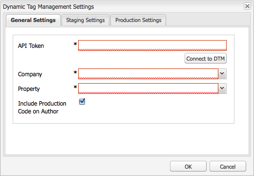

# 与AdobeDynamic Tag Management集成 {#integrating-with-adobe-dynamic-tag-management}

集成 [Adobe动态Tag Management](https://business.adobe.com/products/experience-platform/adobe-experience-platform.html) AEM ，以便您可以使用Dynamic Tag Management Web资产跟踪AEM站点。 Dynamic Tag Management允许营销人员管理用于收集数据的标记，并在各种数字营销系统中分发数据。 例如，使用Dynamic Tag Management收集AEM网站的使用情况数据，并分发数据以在Adobe Analytics或Adobe Target中进行分析。

在集成之前，请先创建动态Tag Management [Web属性](https://microsite.omniture.com/t2/help/en_US/dtm/#Web_Properties) 跟踪AEM网站的域。 此 [托管选项](https://microsite.omniture.com/t2/help/en_US/dtm/#Hosting__Embed_Tab) 的，以便您可以配置AEM来访问Dynamic Tag Management库。

配置集成后，对Dynamic Tag Management部署工具和规则的更改不需要在AEM中更改Dynamic Tag Management配置。 这些更改可自动供AEM使用。

>[!NOTE]
>
>如果您将DTM与自定义代理配置一起使用，请同时配置HTTP客户端代理配置，因为AEM的某些功能使用的是3.x API，而其他一些功能使用的是4.x API：
>
>* 3.x 通过 [http://localhost:4502/system/console/configMgr/com.day.commons.httpclient](http://localhost:4502/system/console/configMgr/com.day.commons.httpclient) 进行配置
>* 4.x 通过 [http://localhost:4502/system/console/configMgr/org.apache.http.proxyconfigurator](http://localhost:4502/system/console/configMgr/org.apache.http.proxyconfigurator) 进行配置
>

## 部署选项 {#deployment-options}

以下部署选项会影响与Dynamic Tag Management集成的配置。

### Dynamic Tag Management托管 {#dynamic-tag-management-hosting}

AEM支持在云中托管或在AEM上托管的动态Tag Management。

* 云托管： Dynamic Tag Management JavaScript库存储在云中，您的AEM页面直接引用它们。
* AEM托管：动态Tag Management生成JavaScript库。 AEM使用工作流模型来获取和安装库。

您的实施使用的托管类型决定了您执行的某些配置和实施任务。 有关托管选项的信息，请参阅 [“托管 — 嵌入”选项卡](https://microsite.omniture.com/t2/help/en_US/dtm/#Hosting__Embed_Tab) 在Dynamic Tag Management帮助中。

### 暂存和生产库 {#staging-and-production-library}

确定您的AEM创作实例使用的是Dynamic Tag Management暂存代码还是生产代码。

通常，您的创作实例使用动态Tag Management暂存库，而生产实例使用生产库。 此方案允许您使用创作实例测试未批准的动态Tag Management配置。

如果需要，您的创作实例可以使用生产库。 通过Web浏览器插件，您能够在使用暂存库之间进行切换，以便当库是云托管库时，进行测试。

### 使用Dynamic Tag Management部署挂钩 {#using-the-dynamic-tag-management-deployment-hook}

当AEM托管Dynamic Tag Management库时，您可以使用Dynamic Tag Management部署挂接服务自动将库更新推送到AEM。 在对库进行更改时(例如，在编辑Dynamic Tag Management Web属性时)，将推送库更新。

要使用部署挂接，Dynamic Tag Management必须能够连接到托管库的AEM实例。 [启用对AEM的访问](/help/sites-administering/dtm.md#enabling-access-for-the-deployment-hook-service) (对于Dynamic Tag Management服务器)。

在某些情况下，可能无法访问AEM，例如当AEM位于防火墙后面时。 在这些情况下，您可以使用AEM轮询导入程序选项定期检索库。 cron作业表达式规定了库下载计划。

## 启用部署挂接服务的访问 {#enabling-access-for-the-deployment-hook-service}

启用Dynamic Tag Management部署挂接服务以访问AEM，以便该服务可以更新AEM托管的库。 指定根据需要更新暂存和生产库的Dynamic Tag Management服务器的IP地址：

* 暂存： `107.21.99.31`
* 生产： `23.23.225.112` 和 `204.236.240.48`

使用 [Web控制台](/help/sites-deploying/configuring-osgi.md#osgi-configuration-with-the-web-console) 或 [`sling:OsgiConfig`](/help/sites-deploying/configuring-osgi.md#osgi-configuration-in-the-repository) 节点：

* 在Web控制台中，使用“配置”页面上的“AdobeDTM部署挂接配置”项。
* 对于OSGi配置，服务PID为 `com.adobe.cq.dtm.impl.servlets.DTMDeployHookServlet`.

下表描述了要配置的属性。

| Web控制台属性 | OSGi属性 | 描述 |
|---|---|---|
| 暂存DTM IP白名单 | `dtm.staging.ip.whitelist` | 更新暂存库的动态Tag Management服务器的IP地址。 |
| 生产DTM IP白名单 | `dtm.production.ip.whitelist` | 更新生产库的动态Tag Management服务器的IP地址。 |

## 创建动态Tag Management配置 {#creating-the-dynamic-tag-management-configuration}

创建云配置，以便AEM实例可以使用Dynamic Tag Management进行身份验证并与您的Web资产交互。

>[!NOTE]
>
>如果您的DTM Web资产包含Adobe Analytics工具，并且您还在使用，请避免在页面上包含两个Adobe Analytics跟踪代码 [内容分析](/help/sites-authoring/content-insights.md). 在您的 [Adobe Analytics Cloud配置](/help/sites-administering/adobeanalytics-connect.md#configuring-the-connection-to-adobe-analytics)中，选择不包括跟踪代码选项。

### 常规设置 {#general-settings}

<table>
 <tbody>
  <tr>
   <th>属性</th>
   <th>描述</th>
  </tr>
  <tr>
   <td>api令牌</td>
   <td>Dynamic Tag Management用户帐户的API令牌属性的值。 AEM使用此属性来通过Dynamic Tag Management进行身份验证。</td>
  </tr>
  <tr>
   <td>公司</td>
   <td>与您的登录ID关联的公司。</td>
  </tr>
  <tr>
   <td>属性</td>
   <td>您为管理AEM站点的标记而创建的Web属性的名称。</td>
  </tr>
  <tr>
   <td>包含有关作者的生产代码</td>
   <td>
选择此选项以使AEM创作和发布实例使用Dynamic Tag Management库的生产版本。 
 
如果未选择此选项时，暂存设置将应用于创作实例，而生产设置将应用于发布实例。
 </td>
  </tr>
 </tbody>
</table>

### 自托管属性 — 暂存和生产 {#self-hosting-properties-staging-and-production}

通过Dynamic Tag Management配置的以下属性，AEM可以托管Dynamic Tag Management库。 利用这些属性，AEM可以下载并安装库。 或者，您也可以自动更新库，以确保它们反映在Dynamic Tag Management管理应用程序中所做的任何更改。

某些资产会使用从Dynamic Tag Management Web资产的“嵌入”选项卡的“库下载”部分中获取的值。 有关信息，请参阅 [库下载](https://microsite.omniture.com/t2/help/en_US/dtm/#Library_Download) 在Dynamic Tag Management帮助中。

>[!NOTE]
>
>在AEM上托管Dynamic Tag Management捆绑包时，必须先在Dynamic Tag Management中启用库下载，然后才能创建配置。 此外，必须启用Akamai，因为Akamai提供了可供下载的库。

在AEM上托管Dynamic Tag Management库时，AEM会根据您的配置自动配置Web资产的某些属性。 请参阅下表中的说明。

<table>
 <tbody>
  <tr>
   <th>属性</th>
   <th>描述</th>
  </tr>
  <tr>
   <td>使用自托管</td>
   <td>选择何时在AEM上托管Dynamic Tag Management库文件。 选择此选项将显示此表中的其他属性。</td>
  </tr>
  <tr>
   <td>DTM 包 URL</td>
   <td>用于下载动态Tag Management库的URL。 从Dynamic Tag Management的“库下载”页面的“下载URL”部分中获取此值。 出于安全原因，必须手动配置此值。</td>
  </tr>
  <tr>
   <td>下载工作流</td>
   <td>
用于下载和安装Dynamic Tag Management库的工作流模型。 默认模型为“默认DTM包下载”。 除非已创建自定义模型，否则请使用此模型。
 
默认下载工作流会在下载库时自动激活库。
 </td>
  </tr>
  <tr>
   <td>域提示</td>
   <td>
（可选）托管Dynamic Tag Management库的AEM服务器的域。 指定一个值，以便可以覆盖为配置的默认域。 <a href="/help/sites-developing/externalizer.md">Day CQ Link Externalizer服务</a>.
 
连接到动态Tag Management时，AEM使用此值为动态Tag Management Web属性配置暂存HTTP路径或库下载属性的生产HTTP路径。
 </td>
  </tr>
  <tr>
   <td>安全域提示</td>
   <td>
（可选）通过HTTPS托管Dynamic Tag Management库的AEM服务器的域。 指定一个值，以便可以覆盖为配置的默认域。 <a href="/help/sites-developing/externalizer.md">Day CQ Link Externalizer服务</a>.
 
连接到动态Tag Management时，AEM会使用此值为动态Tag Management Web属性配置暂存HTTPS路径或库下载属性的生产HTTPS路径。
 </td>
  </tr>
  <tr>
   <td>共享密钥</td>
   <td>
（可选）用于解密下载的共享密钥。 从Dynamic Tag Management的“库下载”页面的“共享密钥”字段中获取此值。
 
<strong>注意：</strong> 必须在安装了AEM的计算机上安装OpenSSL库，以便AEM可以解密下载的库。
 </td>
  </tr>
  <tr>
   <td>启用轮询导入程序</td>
   <td>
（可选）选择以定期下载和安装Dynamic Tag Management库，以确保您使用的是更新版本。 选中后，Dynamic Tag Management不会将HTTPPOST请求发送到部署挂接URL。
 
AEM会自动为Dynamic Tag Management Web属性配置“库下载”属性的“部署挂接URL”属性。 选中后，属性将配置为无值。 如果未选定该属性，则使用您的动态Tag Management配置的URL配置该属性。
 
当Dynamic Tag Management部署挂接无法连接到AEM时(例如，当AEM位于防火墙后面时)，启用轮询导入程序。
 </td>
  </tr>
  <tr>
   <td>时间表表达式</td>
   <td>（在选择启用轮询导入程序时显示和必需。） 控制何时下载Dynamic Tag Management库的cron表达式。</td>
  </tr>
 </tbody>
</table>

### 云托管属性 — 暂存和生产 {#cloud-hosting-properties-staging-and-production}

在云托管动态标签配置时，您可以为Dynamic Tag Management配置配置以下属性。

<table>
 <tbody>
  <tr>
   <th>属性</th>
   <th>描述</th>
  </tr>
  <tr>
   <td>使用自托管</td>
   <td>在云中托管Dynamic Tag Management库文件时，请清除此选项。</td>
  </tr>
  <tr>
   <td>页眉代码</td>
   <td>
从您主机的动态Tag Management中获取的暂存标头代码。 当您连接到Dynamic Tag Management时，会自动填充此值。
 
 要在Dynamic Tag Management中查看代码，请单击嵌入选项卡，然后单击主机名。 展开标题代码部分，然后根据需要单击复制暂存嵌入代码的嵌入代码或生产嵌入代码区域。
 </td>
  </tr>
  <tr>
   <td>页脚代码</td>
   <td>
从您主机的Dynamic Tag Management中获取的暂存页脚代码。 当您连接到Dynamic Tag Management时，会自动填充此值。
 
要在Dynamic Tag Management中查看代码，请单击嵌入选项卡，然后单击主机名。 展开页脚代码部分，并根据需要单击复制暂存嵌入代码的嵌入代码或生产嵌入代码区域。
 </td>
  </tr>
 </tbody>
</table>

以下过程使用触屏优化UI来配置与Dynamic Tag Management的集成。

1. 在边栏中，单击“工具” > “操作” > “云” > “Cloud Service” 。
1. 在Dynamic Tag Management区域中，将显示以下用于添加配置的链接之一：

   * 如果这是您添加的第一个配置，请单击立即配置。
   * 单击显示配置，如果已创建一个或多个配置，则单击可用配置旁边的+链接。

   

1. 键入配置的标题，然后单击“创建”。
1. 在API令牌字段中，输入Dynamic Tag Management用户帐户的API令牌属性的值。

   要获取API令牌的值，请联系DTM客户关怀团队。

   >[!NOTE]
   >
   >在Dynamic Tag Management用户明确请求过期的API令牌之前，该API令牌不会过期。

   

1. 单击连接到DTM。 AEM通过Dynamic Tag Management进行身份验证，并检索与您的帐户关联的公司列表。
1. 选择公司，然后选择用于跟踪AEM网站的资产。
1. 如果您在创作实例上使用暂存代码，请取消选择在创作实例上包含生产代码。
1. 根据需要在“暂存设置”选项卡和“生产设置”选项卡上提供属性的值，然后单击“确定”。

## 手动下载Dynamic Tag Management库 {#manually-downloading-the-dynamic-tag-management-library}

手动下载Dynamic Tag Management库以立即在AEM上更新它们。 例如，如果您想要在轮询导入程序计划自动下载库之前测试更新的库，请手动下载。

1. 在边栏中，单击“工具” > “操作” > “云” > “Cloud Service” 。
1. 在Dynamic Tag Management区域中，单击显示配置，然后单击您的配置。
1. 在暂存设置区域或生产设置区域中，单击触发下载工作流按钮以下载和部署库捆绑包。

   

>[!NOTE]
>
>下载的文件存储在 `/etc/clientlibs/dtm/my config/companyID/propertyID/servertype`.
>
>以下内容直接从您的 [DTM配置](#creating-the-dynamic-tag-management-configuration).
>
>* `myconfig`
>* `companyID`
>* `propertyID`
>* `servertype`
>

## 将动态Tag Management配置与您的站点关联 {#associating-a-dynamic-tag-management-configuration-with-your-site}

将您的动态Tag Management配置与网站页面关联，以便AEM将所需的脚本添加到页面。 将站点的根页面与配置关联。 该页面的所有后代都将继承关联。 如有必要，您可以在子页面中覆盖关联。

使用以下过程可将页面及其后代与Dynamic Tag Management配置相关联。

1. 在经典UI中打开站点的根页面。
1. 使用Sidekick打开页面属性。
1. 在“Cloud Service”选项卡中，单击添加服务，选择动态Tag Management ，然后单击确定。

   

1. 使用Dynamic Tag Management下拉菜单选择您的配置，然后单击“确定”。

使用以下过程可覆盖页面的继承配置关联。 覆盖将影响页面和所有页面子项。

1. 在经典UI中打开页面。
1. 使用Sidekick打开页面属性。
1. 在“Cloud Service”选项卡上，单击“继承自”属性旁边的挂锁图标，然后在确认对话框中单击“是”。

   

1. 删除或选择其他Dynamic Tag Management配置，然后单击“确定”。
