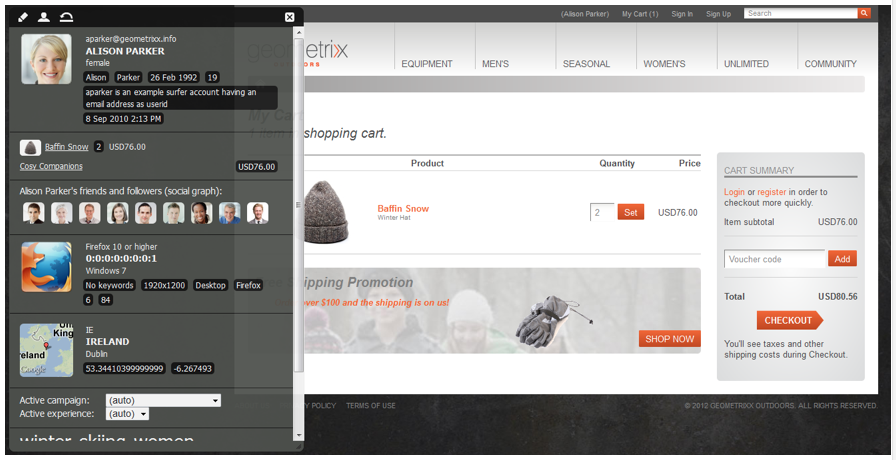

# 电子商务{#ecommerce}

* [概念 ](/help/sites-administering/concepts.md)
* [管理（一般）](/help/sites-administering/generic.md)

Adobe提供了两个版本的商务集成框架：

<table>
 <tbody>
  <tr>
   <th>
 
 </th>
   <th>
CIF在预装
 </th>
   <th>
CIF云
 </th>
  </tr>
  <tr>
   <td>
支持的 AEM 版本
 </td>
   <td>
AEM on-prem或AMS 6.x
 </td>
   <td>AEM AMS 6.4和6.5</td>
  </tr>
  <tr>
   <td>
后端
 </td>
   <td>
    <ul>
     <li>AEM、Java</li>
     <li>整体集成，预构建映射（模板）</li>
     <li>JCR存储库</li>
    </ul> </td>
   <td>
    <ul>
     <li>Magento</li>
     <li>Java和Javascript</li>
     <li>JCR存储库中未存储商务数据</li>
    </ul> </td>
  </tr>
  <tr>
   <td>
前端
 </td>
   <td>
AEM服务器端呈现的页面
 </td>
   <td>混合页面应用程序（混合渲染）</td>
  </tr>
  <tr>
   <td>
产品目录
 </td>
   <td>
    <ul>
     <li>产品导入程序，编辑器，在AEM中缓存</li>
     <li>具有AEM或代理页的常规目录</li>
    </ul> </td>
   <td>
    <ul>
     <li>无产品导入</li>
     <li>通用模板</li>
     <li>通过连接器的点播数据</li>
    </ul> </td>
  </tr>
  <tr>
   <td>
可伸缩性
 </td>
   <td>
    <ul>
     <li>最多可支持几百万种产品（取决于用例）</li>
     <li>Dispatcher上的缓存</li>
    </ul> </td>
   <td>
    <ul>
     <li>无卷限制</li>
     <li>在Dispatcher或CDN上缓存</li>
    </ul> </td>
  </tr>
  <tr>
   <td>标准化数据模型</td>
   <td>否</td>
   <td>是，Magento图QL模式</td>
  </tr>
  <tr>
   <td>可用性</td>
   <td>
是. SAPCommerce Cloud(Extension updated to support AEM 6.4 and Hybris 5(default)and maintains compatibility with Hybris 4
 
SalesforceCommerce Cloud(连接器开放源码支持AEM 6.4)
 </td>
   <td>是，通过GitHub开放源。 Magento Commerce(支持Magento2.3.2（默认），并兼容Magento2.3.1)。</td>
  </tr>
  <tr>
   <td>何时使用</td>
   <td>有限用例：例如，在需要导入小型静态目录的情况下</td>
   <td>大多数用例中的首选解决方案</td>
  </tr>
 </tbody>
</table>

电子商务与产品信息管理(PIM)一起，处理网站的活动，重点通过在线商店销售产品：

* 产品的创建、生命周期和过时
* 价格管理
* 交易管理
* 管理整个目录
* 实时和集中的存储记录
* Web界面

AEM eCommerce帮助营销人员跨网络、移动和社交接触点提供品牌化、个性化的购物体验。 AEM创作环境允许您根据目标访客环境和销售战略自定义页面和组件；例如：

* 产品页面
* 购物车组件
* 结帐组件

该实施允许对产品信息进行实时访问。 这可用于强制：

* 产品信息完整性
* 定价
* 库存库存
* 购物车状态变化

>[!NOTE]
>
>要将集成框架与外部电子商务提供商一起使用，您首先需要安装所需的包。 有关详细信息，请参阅[部署eCommerce](/help/sites-deploying/ecommerce.md)。
>
>有关扩展电子商务功能的信息，请参阅[开发电子商务](/help/sites-developing/ecommerce.md)。

## 主要功能{#main-features}

AEM eCommerce提供：

* 一些&#x200B;**现成的AEM组件**，用于说明可以为项目实现哪些目标：

   * 产品显示
   * 购物车
   * 结帐
   * 最近查看的产品
   * 优惠券
   * 和其他

   

   >[!NOTE]
   >
   >AEM提供的集成框架还允许您为独立于特定电子商务引擎的商务功能构建其他AEM组件。

* **搜索** -使用以下任一方式：

   * aem搜索
   * 电子商务系统的探索
   * 第三方搜索(如Search&amp;Promote)
   * 或其组合。

   

* 使用AEM功能&#x200B;**在多个渠道**&#x200B;上展示您的内容，无论是整个浏览器窗口还是移动设备。 这以您的访客需要的格式提供您的内容。

   

* **根据[AEM eCommerce framework](#the-framework)**&#x200B;开发您自己的集成实现的能力。

   当前可用的两种实现都基于相同的基础构建——在常规API（框架）之上。 实施新集成只涉及实施您的集成需要的功能。 任何新的实现都可以使用前端组件，因为它们使用接口（因此与实现无关）。

* 基于购物者数据和活动&#x200B;**开发**&#x200B;体验驱动型商务的可能性。 这使您能够实现许多场景：

   * 例如，当订单总额超过特定金额时，可能会降低运输成本。
   * 另一种方式可能允许您提供使用优惠数据的季节性用户档案（例如位置）。 然后，根据其他因素，根据需要再次突出显示这些内容。

   在以下示例中，一个Teaser显示为购物车的内容小于$75:

   

   当购物车内容超过$75时，可以更改此设置：

   

* 其他功能包括：

   * 跨会话保留的购物车内容
   * 完整订单历史记录
   * 快速目录更新

## 框架{#the-framework}

[概念](/help/sites-administering/concepts.md)部分更详细地介绍了框架，但下面提供了框架的高级、高速视图:

### 什么？{#what}

* 集成框架提供API、用于说明功能的一系列组件以及提供连接方法示例的几个扩展。
* 该框架提供了项目实施所需的基本结构。
* 该框架是可扩展的。
* 框架不提供现成的、随时可用的站点。 总是需要一定量的开发工作来调整框架，使其符合您的规范。

### 为什么？{#why}

* 提供快速实现自定义电子商务站点所需的基本机制。
* 提供开发真实电子商务站点所需的灵活性。
* 说明最佳实践。