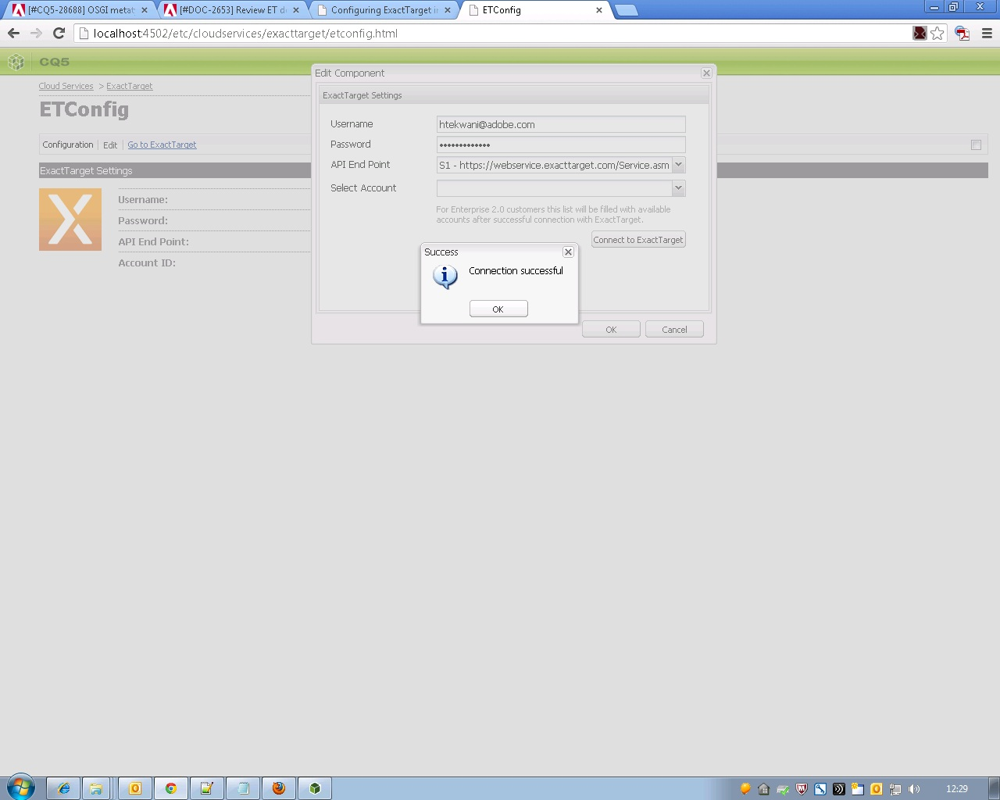

# 与ExactTarget集成{#integrating-with-exacttarget}

将Adobe Experience Manager (AEM)与Exact Target集成后，您可以通过Exact Target管理和发送在AEM中创建的电子邮件。 它还允许您通过AEM页面上的AEM表单来使用Exact Target的潜在客户管理功能。

该集成提供了以下功能：

* 能够在AEM中创建电子邮件并将其发布到Exact Target以供分发。
* 能够设置AEM表单的操作，以创建Exact Target订阅服务器。

配置ExactTarget后，您可以将新闻稿或电子邮件发布到ExactTarget。 请参阅[将新闻稿发布到电子邮件服务](/help/sites-authoring/personalization.md)。

## 创建ExactTarget配置 {#creating-an-exacttarget-configuration}

可以通过Cloudservices或Tools添加ExactTarget配置。 本节将介绍这两种方法。

### 通过Cloudservices配置ExactTarget {#configuring-exacttarget-via-cloudservices}

要在Cloud Service中创建ExactTarget配置，请执行以下操作：

1. 在欢迎页面上，单击&#x200B;**Cloud Service**。 （或直接访问`https://<hostname>:<port>/etc/cloudservices.html`。）
1. 单击&#x200B;**ExactTarget**，然后单击&#x200B;**配置**。 将打开ExactTarget配置窗口。

   

1. 输入标题，也可以输入名称，然后单击&#x200B;**创建**。 将打开&#x200B;**ExactTarget设置**&#x200B;配置窗口。

   

1. 输入用户名、密码并选择API终结点(例如，**https://webservice.exacttarget.com/Service.asmx**)。
1. 单击&#x200B;**连接到ExactTarget。**&#x200B;成功连接后，您会看到一个成功对话框。 框单击&#x200B;**确定**&#x200B;退出窗口。

   

1. 选择一个帐户（如果可用）。 该帐户适用于Enterprise 2.0客户。 单击&#x200B;**确定**。

   已配置ExactTarget。 您可以通过单击&#x200B;**编辑**&#x200B;来编辑配置。 您可以通过单击&#x200B;**转到ExactTarget**&#x200B;来转到ExactTarget。

1. AEM现在提供数据扩展功能。 您可以导入ExactTarget数据扩展列。 除了成功创建的ExactTarget配置以外，通过单击旁边显示的“+”号，可以对其进行配置。 可以从下拉列表中选择任何现有数据扩展。 有关如何配置数据扩展的详细信息，请参阅[ExactTarget文档](https://help.salesforce.com/s/articleView?id=sf.mc_es_data_extension_data_relationships_classic.htm&amp;type=5)。

   导入的数据扩展列以后可以通过&#x200B;**Text和Personalization**&#x200B;组件使用。

   

### 通过工具配置ExactTarget {#configuring-exacttarget-via-tools}

要在工具中创建ExactTarget配置，请执行以下操作：

1. 在欢迎页面上，单击&#x200B;**工具**。 或直接转到`https://<hostname>:<port>/misadmin#/etc`导航到那里。
1. 选择&#x200B;**Tools**，然后选择&#x200B;**Cloud Service配置，**，然后选择&#x200B;**ExactTarget**。
1. 单击&#x200B;**新建**&#x200B;以打开&#x200B;**创建页面**&#x200B;窗口。

   

1. 输入&#x200B;**Title**&#x200B;和可选的&#x200B;**Name**，然后单击&#x200B;**创建**。
1. 按照上一过程中的步骤4输入配置信息。 按照该过程完成ExactTarget的配置。

### 添加多个配置 {#adding-multiple-configurations}

要添加多个配置，请执行以下操作：

1. 在欢迎页面上，单击&#x200B;**Cloud Service**，然后单击&#x200B;**ExactTarget**。 单击如果有一个或多个ExactTarget配置可用，则会显示的&#x200B;**显示配置**。 列出了所有可用的配置。
1. 单击“可用配置”旁边的&#x200B;**+**&#x200B;号。 这将打开&#x200B;**创建配置**&#x200B;窗口。 按照之前的配置过程创建配置。
