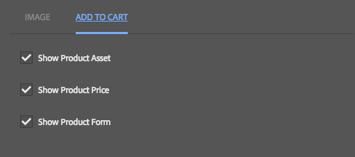
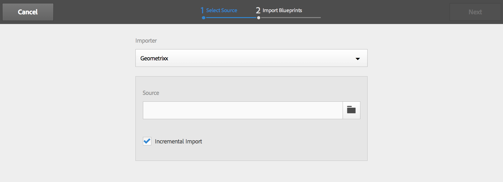

# 管理通用电子商务 {#administering-generic-ecommerce}

AEM通用解决方案提供了管理存储库中保存的商务信息的方法（与使用外部电子商务引擎相比）。 这包括：

* [产品](/help/sites-administering/concepts.md#products)
* [产品的系列品种](/help/sites-administering/concepts.md#product-variants)
* [目录](/help/sites-administering/concepts.md#catalogs)
* [促销活动](/help/sites-administering/concepts.md#promotions)
* [优惠券](/help/sites-administering/concepts.md#vouchers)
* [订单](/help/sites-administering/concepts.md#shopping-cart-and-orders)
* [代理页面](/help/sites-administering/concepts.md#proxy-pages)

>[!NOTE]
>
>标准AEM安装包括通用AEM(JCR)电子商务实施。
>
>这目前用于演示目的，或根据您的要求作为自定义实施的基本基础。

## 产品和产品变体 {#products-and-product-variations}

>[!NOTE]
>
>以下过程适用于产品和产品变体。

在创建产品之前，您需要定义一个 [scaffold](/help/sites-authoring/scaffolding.md)。 这指定了定义产品以及编辑产品时所需的字段。

每种不同的产品类型都需要一个scaffold。 相应的scaffold通过以下任一方式与产品关联：

* 路径
* 产品可以引用scaffold

>[!NOTE]
>
>Geometrixx-Outdoors商店具有单一产品类型（因此是单个scaffold）:
>
>`/etc/scaffolding/geometrixx-outdoors`
>
>Geometrixx-Outdoors产品类型在以下位置处于活动状态：
>
>`/etc/commerce/products/geometrixx-outdoors`
>
>您可以在任何位置创建新的产品定义，而无需任何其他设置。

### 正在导入产品 {#importing-products}

#### 导入产品——触屏优化UI {#importing-products-touch-optimized-ui}

1. 通过商务 **导航到** “产品”控 **制台**。
1. 使用产 **品控制台** ，导航到所需的位置。
1. 使用“ **导入产品** ”图标打开向导。

   

1. 指定：

   * **导入程序**

      默认情况下，特定商 [务提供者的导](/help/sites-administering/concepts.md#commerce-providers)入程序 `Geometrixx`。

   * **源**

      要导入的文件；您可以使用浏览器选择文件。

   * **增量导入**

      指示这是否为增量导入（与完全导入相对）。
   >[!NOTE]
   >
   >增量导入（属于示例geometrixx-outdoor导入程序）在产品级别操作。
   >
   >可以根据需要定义自定义的导入程序以运行。

1. 选择 **下一步** ，导入产品后，将显示所执行操作的日志。

   >[!NOTE]
   >
   >产品将导入到当前位置或相对于当前位置。

   >[!NOTE]
   >
   >重复使 **用** Next **和Back** 将重复导入产品定义。 但是，由于它们具有相同的SKU，因此存储库中的现有信息将被覆盖。

1. 选择 **完成** ，关闭向导。

#### 导入产品——经典UI {#importing-products-classic-ui}

1. 使用工 **具控制台** ，打开“商 **务** ”文件夹。
1. 双击以打开产品导 **入程序**:

   

1. 指定：

   * **存储名称**

      产品将导入到：

      `/etc/commerce/products/<*store name*>/`

   * **商业提供程序**

      您的商务提供商 [的导入程序](/help/sites-administering/concepts.md#commerce-providers);默认情况下为Geometrixx。

   * **源文件**

      要导入的文件在存储库中的位置。

   * **增量导入**

      指示这是否为增量导入（与完全导入相对）。

1. 单击“ **导入产品**”。

### 创建产品信息 {#creating-product-information}

>[!NOTE]
>
>标准产品管理是基本的，因为Geometrixx-Outdoors产品集一直保持基本。 复杂性基于产品基架 ，因此使用您自己的产品基架可以实现更复杂的编辑。

#### 创建产品信息——触屏优化UI {#creating-product-information-touch-optimized-ui}

1. 使用产 **品控制台** (通过 **商务**)导航到所需的位置。
1. 使用创 **建图标** ，可选择以下任一选项（具体取决于结构和位置）:

   * **创建产品**
   * **创建产品变量**
   

1. 此时将打开向导。 使用“ **基本** ”( **Basic** )和“产品”( [Product)选项卡输](/help/sites-administering/concepts.md#product-attributes) 入新产品或产品变体的产品属性。

   >[!NOTE]
   >
   >**标题** 和 **** SKU是创建产品或变体所需的最低要求。

1. 选择 **创建** ，以保存信息。

>[!NOTE]
>
>许多产品提供各种颜色和／或尺寸。 有关基本产品和相关产品变体的信息都可以从“产品”控制台进 **行管理** 。
>
>产品及其变体以树结构的形式存储，产品信息位于顶部，变体位于下面（此结构由UI强制实施）。

### 编辑产品信息 {#editing-product-information}

>[!NOTE]
>
>Geometrixx-outdoors中的产品图像由以下位置提供：
>
>`/etc/commerce/products/...`
>
>这意味着，默认情况下，调度程序会阻止 [它们](https://helpx.adobe.com/experience-manager/dispatcher/using/dispatcher-configuration.html)，因此请根据需要进行配置。

#### 编辑产品信息——触屏优化UI {#editing-product-information-touch-optimized-ui}

1. 使用产 **品控制台** (通过商 **务**)导航到您的产品信息。
1. 使用以下任何一种方式：

   * [快速操作](/help/sites-authoring/basic-handling.md#quick-actions)
   * [选择模式](/help/sites-authoring/basic-handling.md#navigating-and-selection-mode)
   选择“查 **看产品数据** ”图标：

   

1. 将 [显示产品](/help/sites-administering/concepts.md#product-attributes) 属性。 使用 **编辑****和完** 成进行任何更改。

### 显示产品引用 {#showing-product-references}

#### Showing Product References - Touch-optimized UI {#showing-product-references-touch-optimized-ui}

1. 使用产 **品控制台** (通过商 **务**)导航到您的产品信息。
1. 打开引用的辅助边栏，并显示以下图标：

   

1. 选择所需的产品——辅助边栏将更新以显示可用的引用类型：

   

1. 单击／点按引用类型（例如，产品页面）以展开列表。
1. 选择特定引用以显示选项：

   * 导航到产品页面
   * 编辑产品页面
   

### Search for Products {#search-for-products}

1. 通过商务 **导航到** “产品”控 **制台**。
1. 打开“搜索”的辅助边栏，并显示以下图标：

   

1. 您可以使用多个彩块化来搜索产品。 搜索只能使用一个或多个彩块化。 将显示找到的产品：

   

1. 单击／点按产品可打开它。 您还可以发布产品或查看产品数据。

#### 扩展搜索 {#extending-search}

您可以使用CRXDE Lite修改现有facet或添加新facet:

1. 导航至:

   `http://localhost:4502/crx/de/index.jsp#/libs/commerce/gui/content/products/aside/items/search/items/searchpanel/facets`

1. 例如，您可以修改将在产品搜索页面上显示的大小。 单击节 `sizegroup` 点。
1. 单击 `items` 节点，然后单击 `propertypredicate` 节点。
1. 您可以修改 `propertyValues`。 例如，您可以添加XS、XXL或删除大小。
1. 单击 **全部保存** ，然后导航到产品搜索页面。 您所做的更改应当出现。

### 多个资产 {#multiple-assets}

您可以在产品组件中添加多个资产，然后指定将在产品页面上显示的资产。

>[!NOTE]
>
>与多个资产相关的所有操作都可通过触屏优化UI完成。

#### 添加多个资产 {#adding-multiple-assets}

1. 通过商务 **导航到** “产品”控 **制台**。
1. 使用产 **品控制台** ，导航到所需的产品。

   >[!NOTE]
   >
   >您必须处于产品级别，而不是变体级别。

1. 点按／单击 **查看产品数据图标** （带有选择模式或快速操作）。
1. 点按／单击编辑图标。
1. 滚动到 **添加**。

   

1. 点按／单击 **添加**。 此时会显示新的资产占位符。
1. 点按／单击**更改**会打开一个对话框，通过该对话框可以选择资产。
1. 选择要添加的资产。

   >[!NOTE]
   >
   >您可以选择的资产来自 [资产](https://helpx.adobe.com/experience-manager/aem-previous-versions.html#assets)。

1. 点按／单击完成图标。

两个资产现在存储在您的产品组件中。 您可以配置将在产品页面上显示哪个页面。 这适用于类别系统。 首先，您需要向单个资产添加类别：

1. 点按／单击 **查看产品数据**。
1. 在资产 **下键入资产类别** ，例如 `cat1` 和 `cat2`。

   >[!NOTE]
   >
   >您还可以对类别使用标记。

1. 点按／单击完成图标。 您现在必须转 [出您](#rolling-out-a-catalog) 的更改。

现在，您的资产在产品组件中具有一个类别。 您可以配置将在三个不同级别显示的类别：

* [产品页面](#product-page)
* [目录](#catalog)
* [产品控制台](#products-console)

>[!NOTE]
>
>如果未设置类别，则第一个资产将显示在产品页面上。

选择要显示的图像的机制如下：

1. 验证是否已为产品页面设置类别。
1. 如果未设置，请验证是否为目录设置了类别。
1. 如果没有，请验证是否为产品控制台设置了类别。

>[!NOTE]
>
>对于目录级别和产品控制台级别，您必须转出更改以应用修改并查看产品页面上的差异。

#### 产品页面 {#product-page}

1. 导航到您的产品页面。
1. **编辑** “产品”组件。
1. 键入您 **选择的图像类别** ( `cat1` 例如)。
1. 点按／单击 **完成**。 页面将刷新，此时应显示正确的资产。

#### 目录  {#catalog}

1. 导航到您的目录。
1. 点按／单击 **查看属性**。
1. Tap/click **Edit**.
1. 点按／单击资 **产选项** 卡。
1. 键入所需的 **产品资产类别**。
1. 点按／单击 **完成**。
1. [转出](#rolling-out-a-catalog) ，您的更改。

#### 产品控制台 {#products-console}

1. 使用“产 **品** ”控制台，导航到所需的产品。
1. 点按／单击 **查看产品数据**。
1. Tap/click **Edit**.
1. 键入默 **认资产类别**。
1. 点按／单击 **完成**。
1. [转出](#rolling-out-a-catalog) ，您的更改。

### 发布／取消发布产品信息 {#publishing-unpublishing-product-information}

#### 发布／取消发布产品信息——触屏优化UI {#publishing-unpublishing-product-information-touch-optimized-ui}

>[!NOTE]
>
>产品信息通常通过引用它的页面发布。 例如，在发布引用产品Y的页面X时，AEM将询问您是否也要发布产品Y。
>
>对于特殊情况，AEM还支持从产品数据直接发布。

1. 使用产 **品控制台** (通过商 **务**)导航到您的产品信息。
1. 使用以下任何一种方式：

   * [快速操作](/help/sites-authoring/basic-handling.md#quick-actions)
   * [选择模式](/help/sites-authoring/basic-handling.md#navigating-and-selection-mode)
   根据需 **要选择** “发 **布”或** “取消发布”图标：

    

   将根据需要发布或取消发布产品信息。

### Product Feed {#product-feed}

Search&amp;Promote集成允许您：

* 使用独立于基础存储库结构和商务平台的eCommerce API。
* 利用Search&amp;Promote的Index Connector功能以XML格式提供产品源。
* 利用Search&amp;Promote的远程控制功能执行产品源的按需或计划请求
* 不同Search&amp;Promote帐户的源生成，配置为云服务配置。

有关详细信息，请阅读 [产品信息源](/help/sites-administering/product-feed.md)。

### 产品更新的事件处理程序 {#event-handler-for-product-updates}

有一个事件处理程序，它在添加、修改或删除产品以及添加、修改或删除产品页面时记录事件。 有以下OSGi事件：

* `com/adobe/cq/commerce/pim/PRODUCT_ADDED`
* `com/adobe/cq/commerce/pim/PRODUCT_MODIFIED`
* `com/adobe/cq/commerce/pim/PRODUCT_DELETED`
* `com/adobe/cq/commerce/pim/PRODUCT_PAGE_ADDED`
* `com/adobe/cq/commerce/pim/PRODUCT_PAGE_MODIFIED`
* `com/adobe/cq/commerce/pim/PRODUCT_PAGE_DELETED`

对于 `PRODUCT_*` 事件，路径指向中的基本产品 `/etc/commerce/products`。 对于 `PRODUCT_PAGE_*` 事件，路径指向节 `cq:Page` 点。

您可以在Web控制台中的OSGI事件()中查 `/system/console/events`看它们，例如：

>[!NOTE]
>
>另请阅读 [AEM中的事件处理](https://blogs.adobe.com/experiencedelivers/experience-management/event_handling_incq/)。 

### 添加到购物车图像链接 {#image-with-add-to-cart-links}

通过添加到购物车链接的图像组件，您可以通过在图像上创建与产品链接的热点来快速将产品添加到购物车。

单击热点会打开一个对话框，通过该对话框可以选择产品的大小和数量。

1. 导航到要添加组件的页面。
1. 将组件拖放到页面中。
1. 从资产浏览器在组件中拖放一 [个图像](/help/sites-authoring/author-environment-tools.md#assets-browser)。
1. 您可以：

   * 单击组件，然后单击编辑图标
   * 慢速双击

1. 单击全屏图标。

   

1. 单击启动映射图标。

   

1. 单击其中一个形状图标。

   

1. 根据需要修改和移动形状。
1. 单击形状。
1. 单击浏览图标可打开资产 [选取器](../assets/search-assets.md#assetselector)。

   >[!NOTE]
   >
   >或者，您也可以直接键入必须在产品级别而非变体级别的产品路径。

   

1. 单击确认图标两次，然后单击退出全屏。
1. 单击组件旁边的页面上的某处。 页面应刷新，并且您应在图像上看到以下符号：

   

1. Switch to [preview](/help/sites-authoring/editing-content.md#previewingpagestouchoptimizedui) mode.
1. 单击+热点。 此时会打开一个对话框，您可以在其中选择您在路径中输入的产品的大小和 **数量**。

   

1. 输入大小和数量。
1. 单击“添加到购物车”按钮。 对话框将关闭。
1. 导航到购物车。 产品应该在此处。

#### Configuration Options {#configuration-options}

您可以配置单击热点时对话框的外观：

1. 单击组件，然后单击配置图标。

   

1. 向下滚动. “添加到购 **物车”选项卡** 。

   

1. 单击 **添加到购物车**。 您可以使用3个配置选项。

   

1. 单击完成图标。

## 目录 {#catalogs}

### 生成目录 {#generating-a-catalog}

#### 生成目录——触屏优化UI {#generating-a-catalog-touch-optimized-ui}

>[!NOTE]
>
>目录将引用您的产品数据。

要生成目录，请执行以下操作：

1. 打开“站点”控制台（例如，[http://localhost:4502/sites.html/content](http://localhost:4502/sites.html/content)）。
1. 导航到要创建新页面的位置。
1. 要打开选项列表，请使用“**创建**”图标：

   

1. From the list select **Create Catalog**, the Create Catalog wizard will open.

   

1. 导航到所需的目录Blueprint。
1. 点按／单击 **选择** 按钮，然后点按／单击所需的目录Blueprint。
1. Tap/click **Next**.

   

1. 键入标 **题** 和名 **称**。
1. 点按／单击创 **建** 按钮。 将创建目录并打开一个对话框。

   

1. 点按／单 **击** “完成”按钮将返回到“站点”控制台，您将能够在该控制台中看到您的目录。

   点按／单 **击“打开目录** ”按钮可打开您的目录(例如 `http://localhost:4502/editor.html/content/test-catalog.html`)。

#### 生成目录——经典UI {#generating-a-catalog-classic-ui}

>[!NOTE]
>
>目录将引用您的 [产品数据](#products-and-product-variants)。

1. 使用“网 **站** ”控制台，导航到您的“目 **录蓝图**”，然后导航到“基本目录”。

   例如：

   `http://localhost:4502/siteadmin#/content/catalogs/geometrixx-outdoors/base-catalog`

1. 使用章节Blueprint模板创 **建新页面** 。

   For example, `Swimwear`.

1. 打开新页 `Swimwear` 面，然后单 **击编辑Blueprint** ，打开“属性” **对话框** ，在该对话框中可以设置“产品 **** ”选择。

   例如，打开“标 **记／关键字** ”字段以选择“活动”，然后从Geometrixx-Outdoors部分中选择“游泳”。

1. 单击 **确定** ，以保存您的属性；示例产品将显示在Blueprint页 **面的“产品选择标准** ”下。
1. 单击转 **出更改……**，选择转出页 **面和所有子页面**，然后单击下一步 **,******&#x200B;转出转出。 成功完成转出后，状 **态指示符** 将显示为绿色。
1. 您现在可以单击“ **关闭** ”并检查新目录部分；例如，on和under:

   `http://localhost:4502/cf#/content/geometrixx-outdoors/en/swimwear.html`

1. 再次从Blueprint页面单击“编 **辑Blueprint** ”，在“属性”对话 **框中打开“** 生成的页面 **** ”选项卡。 在横幅列表字段中，选择要显示的图像；例如， `summer.jpg`
1. 单击 **确定** ，以保存您的属性；横幅信息将显示在Blueprint页面 **的“产品选择条件** ”下。
1. 转出这些新更改。

### Rolling Out a Catalog {#rolling-out-a-catalog}

#### 推出目录——触屏优化UI {#rolling-out-a-catalog-touch-optimized-ui}

转出目录：

1. 通过“商 **务** ”导航到目 **录控制台**。
1. 导航到要转出的目录。
1. 使用以下任何一种方式：

   * [快速操作](/help/sites-authoring/basic-handling.md#quick-actions)
   * [选择模式](/help/sites-authoring/basic-handling.md#navigating-and-selection-mode)
   选择转出 **更改图标** :

   

1. 在向导中，根据需要设置转出，然后点按／单击转出 **更改**。
1. 此时将打开一个对话框。 完成进程 **后点按** /单击完成。

#### Rolling out a Catalog - Classic UI {#rolling-out-a-catalog-classic-ui}

转出目录：

1. 导航到要转出的目录。 例如：

   `http://localhost:4502/cf#/content/catalogs/geometrixx-outdoors/base-catalog.html`

1. 单击 **转出更改……**
1. 根据需要设置转出。
1. 单击 **转出**。

### Blueprint Importer {#blueprint-importer}

#### Blueprint Importer —— 触屏优化UI {#blueprint-importer-touch-optimized-ui}

1. 通过“商 **务** ”导航到目 **录控制台**。
1. 导览至要导入目录Blueprint的位置。
1. 点按／单击“导入 **Blueprints** ”图标。

   

1. 在向导中，根据需要选择源，然后点按／单击下 **一步**。

   

1. 完成导入 **后点按** /单击完成。

#### Blueprint Importer —— 经典UI {#blueprint-importer-classic-ui}

1. 使用工 **具控制台** ，导航到 **商务**。

   例如：

   `http://localhost:4502/miscadmin#/etc/commerce`

1. 打开“目 **录蓝印导入程序”**。
1. 根据需要设置导入。
1. 单击“ **导入目录Blueprints”**。

## 促销活动 {#promotions}

### 创建促销 {#creating-a-promotion}

#### 创建促销——经典UI {#creating-a-promotion-classic-ui}

>[!NOTE]
>
>以下示例处理直接在营销活动中持有的 [促销](/help/sites-classic-ui-authoring/classic-personalization-campaigns.md)，它用于凭证。
>
>促销活动也可以包含在 [营销](/help/sites-authoring/personalization.md) 活动中的体验中。
>
>有关详细信息，请参 [阅Promotions and Vouchers](#promotions-and-vouchers)。

1. 打开创 **作实例的** “网站”控制台。
1. 在左侧窗格中，选择所需的营销 **活动**。
1. 单击“ **New**”，选择“ **Promotion** ”模板，然后为新凭证指定标题 **(如果需要，****** 则为NameNameName)。
1. 单击&#x200B;**创建**。新的促销页面将显示在右侧窗格中。

1. 通过以下任 **一方式** ，编辑属性：

   * 打开页面，然后单击“编辑”按钮以打开“属性”对话框
   * **在网站控制台中选择页面，然后使用上下文菜单（通常是鼠标右键）选择**&#x200B;属性……并打开属性对话框
   根据需 **要指定促销**、折扣 **类型**、 **折扣值** ，以及任何其他字段。

1. 单击&#x200B;**确定**&#x200B;进行保存。

1. 您现在可以激活您的促销，以便购物者在发布实例中看到它。

## 优惠券 {#vouchers}

### 创建凭证 {#creating-a-voucher}

#### 创建优惠券——经典UI {#creating-a-voucher-classic-ui}

1. 打开创 **作实例的** “网站”控制台。
1. 在左侧窗格中，选择所需的营销 **活动**。
1. 单击“ **New**”，选择“ **Voucher** ”模板，然后为新凭证指定标题 **(如果需要，****** 则为NameNameNameFild)。
1. 单击&#x200B;**创建**。右侧窗格中将显示新的凭证页面。

1. 通过双击打开新的凭证页面，然后单击“ **Edit** ”以根据需要配置信息。
1. 单击&#x200B;**确定**&#x200B;进行保存。

1. 您现在可以激活您的优惠券，以便购物者可以在发布实例上的购物车中使用它。

### 删除优惠券 {#removing-vouchers}

#### 删除优惠券——经典UI {#removing-vouchers-classic-ui}

要使凭证对客户不可用，您可以：

* 取消激活凭证——它将在创作环境中保持可用，因此您可以在以后重新激活它。
* 完全删除它。

这两种操作都可以从网站控制 **台中完** 成。

### 修改凭证 {#modifying-vouchers}

#### Modifying Vouchers - Classic UI {#modifying-vouchers-classic-ui}

要更改优惠券或促销的属性，可在“网站”控制台上双击该优惠券或 **促销** ，然后单击“编 **辑”**。 保存后，您应激活它，以便将更改推送到发布实例。

### 将优惠券添加到购物车 {#adding-vouchers-to-a-cart}

要允许用户向购物车添加凭证，您可以使用内置的 **Vouchers** 组件（商务类别）。 您需要将其添加到显示购物车的页面（但不是必需的）。 The vouchers component is a form which the user can enter a voucher code, it is the shopping cart component that actially shows the list of applied vouchers and their discount.

在演示站点(Geometrixx Outdoors - English)中，您可以在购物车页面上的实际购物车下看到凭证表单。

## 订单 {#orders}

>[!NOTE]
>
>应记住，开箱即用的AEM没有与订单相关的标准功能（如退回商品、更新订单状态、执行履行、生成包装单）所需的操作。 它主要用于技术预览。
>
>AEM中的通用订单管理一直是基本的；向导中可用的字段取决于scaffold:
>`/etc/scaffolding/geometrixx-outdoors/order/jcr:content/cq:dialog`
>
>如果创建自定义的基架，则可以存储更多订单信息。

>[!NOTE]
>
>订单控制台会显示供应商订单信息，该信息从不发布。
>
>客户订单信息保留在其主目录中，并由其帐户的订单历史记录公开。 此信息与其主目录的其余部分一起发布。

### 创建订单信息 {#creating-order-information}

#### 创建订单信息——触屏优化UI {#creating-order-information-touch-optimized-ui}

1. 使用“订 **单** ”控制台导航到所需的位置。
1. 使用创 **建图** 标选择创 **建顺序**。

   

1. 此时将打开向导。 使用“基 **本**”、“ **内容**”、“付款 **”和“******履行”标签输入关于新订单的履行信息。

1. 选择 **创建** ，以保存信息。

### 编辑订单信息 {#editing-order-information}

#### 编辑订单信息——触屏优化UI {#editing-order-information-touch-optimized-ui}

1. 使用“订 **单** ”控制台导航到订单。
1. 使用以下任何一种方式：

   * [快速操作](/help/sites-authoring/basic-handling.md#quick-actions)
   * [选择模式](/help/sites-authoring/basic-handling.md#navigating-and-selection-mode)
   选择“查 **看订单数据** ”图标：

   

1. 将 [显示订单](/help/sites-administering/concepts.md#order-information) 。 使用 **编辑****和完** 成进行任何更改。

