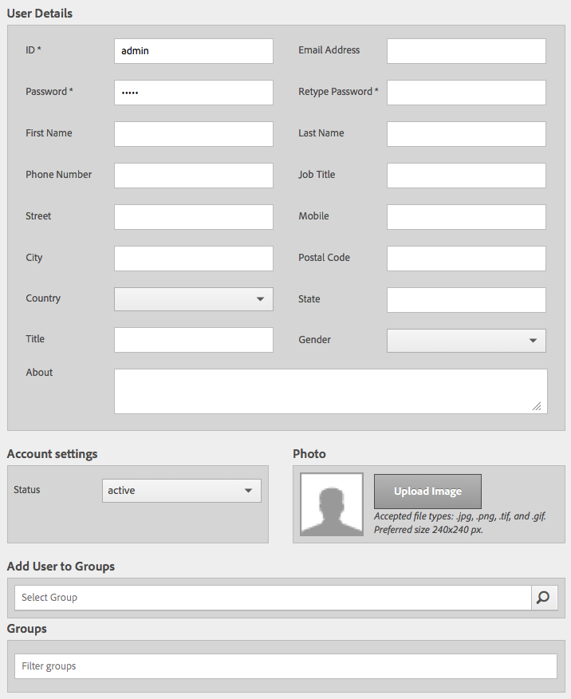

# Granite操作 — 用户和组管理{#granite-operations-user-and-group-administration}

由于Granite采用了CRX Repository实现的JCR API规范，因此它有自己的用户和组管理。

这些帐户是[AEM帐户](/help/sites-administering/security.md)的基础基础，如果从[AEM用户控制台](/help/sites-administering/security.md#accessing-user-administration-with-the-security-console)（例如，`http://localhost:4502/useradmin`）访问这些帐户，则将反映对Granite管理所做的任何帐户更改。 从AEM Users控制台中，您还可以管理权限和其他AEM详细信息。

Granite用户和组管理控制台都可以从触控优化UI的&#x200B;**[工具](/help/sites-administering/tools-consoles.md)**&#x200B;控制台中使用：

从“工具”控制台中选择&#x200B;**用户**&#x200B;或&#x200B;**组**&#x200B;将打开相应的控制台。 在这两种情况下，您都可以通过以下两种方式执行操作：使用点击框，然后从工具栏执行操作，或者通过&#x200B;**名称**&#x200B;下的链接打开帐户详细信息。

* [用户管理](#user-administration)

  

  **用户**&#x200B;控制台列表：

   * 用户名
   * 用户登录名（帐户名）
   * 已指定帐户的任何标题

* [组管理](#group-administration)

  

  **组**&#x200B;控制台列表：

   * 组名称
   * 组描述
   * 组中的用户/组数

## 用户管理 {#user-administration}

### 添加新用户 {#adding-a-new-user}

1. 使用&#x200B;**添加用户**&#x200B;图标：

   

1. **创建用户**&#x200B;表单打开：

   

   您可以在此输入帐户的用户详细信息（大部分是标准且无需解释）：

   * **ID**

     这是用户帐户的唯一标识。 它是必填项，不能包含空格。

   * **电子邮件地址**
   * **密码**

     必须输入密码。

   * **Retype密码**

     这是强制性的，因为确认密码需要它。

   * **名字**
   * **姓氏**
   * **电话号码**
   * **职务**
   * **街道**
   * **移动设备**
   * **城市**
   * **邮政编码**
   * **国家/地区**
   * **状态**
   * **标题**
   * **性别**
   * **关于**
   * **帐户设置**

      * **状态**
您可以将帐户标记为&#x200B;**活动**&#x200B;或&#x200B;**非活动**。

   * **照片**

     您可以在此处上传照片以用作头像。

     接受的文件类型： `.jpg .png .tif .gif`

     首选大小： `240x240px`

   * **将用户添加到组**

     使用选择下拉列表选择用户应成为其成员的组。 选择后，在保存前按名称取消选择&#x200B;**X**。

   * **组**

     用户当前所属的组的列表。 在保存前按名称取消选择&#x200B;**X**。

1. 定义用户帐户后，使用：

   * **取消**&#x200B;以中止注册。
   * **保存**&#x200B;以完成注册。 将通过一条消息确认创建用户帐户。

### 编辑现有用户 {#editing-an-existing-user}

1. 从用户控制台中用户名下的链接访问用户详细信息。

1. 您现在可以按[添加新用户](#adding-a-new-user)中的方式编辑详细信息。

1. 从用户控制台中用户名下的链接访问用户详细信息。

1. 您现在可以按[添加新用户](#adding-a-new-user)中的方式编辑详细信息。

### 更改现有用户的密码 {#changing-the-password-for-an-existing-user}

1. 从用户控制台中用户名下的链接访问用户详细信息。

1. 您现在可以按[添加新用户](#adding-a-new-user)中的方式编辑详细信息。 在&#x200B;**帐户设置**&#x200B;下有&#x200B;**更改密码**&#x200B;的链接。

   

1. **更改密码**&#x200B;对话框打开。 输入并重新键入新密码以及您的密码。 使用&#x200B;**确定**&#x200B;确认更改。

   

   将显示一条消息，确认密码已更改。

### 快速组分配 {#quick-group-assignment}

1. 使用点击框标记一个或多个用户。
1. 使用&#x200B;**组**&#x200B;图标：

   

   要打开组选择下拉列表，请执行以下操作：

   

1. 在选择框中，您可以选择或取消选择用户帐户所属的组。

1. 当已分配或未分配组时，根据需要使用：

   * **取消**&#x200B;以中止更改
   * **保存**&#x200B;以确认更改

### 删除现有用户详细信息 {#deleting-existing-user-details}

1. 使用点击框标记一个或多个用户。
1. 使用&#x200B;**删除**&#x200B;图标删除用户详细信息：

   

1. 系统会要求您确认删除，然后会显示一条消息，确认已执行实际删除。

## 组管理 {#group-administration}

### 添加新组 {#adding-a-new-group}

1. 使用“添加群组”图标：

   

1. **创建组**&#x200B;表单打开：

   

   您可以在此输入组详细信息：

   * **ID**

     这是组的唯一标识符。 这是必填项，不能包含空格。

   * **名称**

     组的名称；它显示在“组”控制台中。

   * **描述**

     组的描述。

   * **将成员添加到组**

     使用选择下拉列表选择要添加到组中的用户。 选择后，在保存前按名称取消选择&#x200B;**X**。

   * **组成员**

     组中的用户列表。 在保存前按名称取消选择&#x200B;**X**。

1. 定义组后，使用：

   * **取消**&#x200B;以中止注册。
   * **保存**&#x200B;以完成注册。 将通过一条消息确认组的创建。

### 编辑现有组 {#editing-an-existing-group}

1. 从组控制台中组名称下的链接访问组详细信息。

1. 您现在可以在[添加新组](#adding-a-new-group)中编辑并保存详细信息。

### 复制现有组 {#copying-an-existing-group}

1. 使用点击框标记组。
1. 使用&#x200B;**复制**&#x200B;图标复制组详细信息：

   

1. 将打开&#x200B;**编辑组设置**&#x200B;表单。

   组ID将与原始组相同，但带有`Copy of`前缀。 编辑此ID，因为它不能包含空格。 所有其他细节与原始细节相同。

   您现在可以在[添加新组](#adding-a-new-group)中编辑并保存详细信息。

### 删除现有组 {#deleting-an-existing-group}

1. 使用点击框标记一个或多个组。
1. 使用&#x200B;**删除**&#x200B;图标删除组详细信息：

   

1. 系统会要求您确认删除，然后会显示一条消息，确认已执行实际删除。
