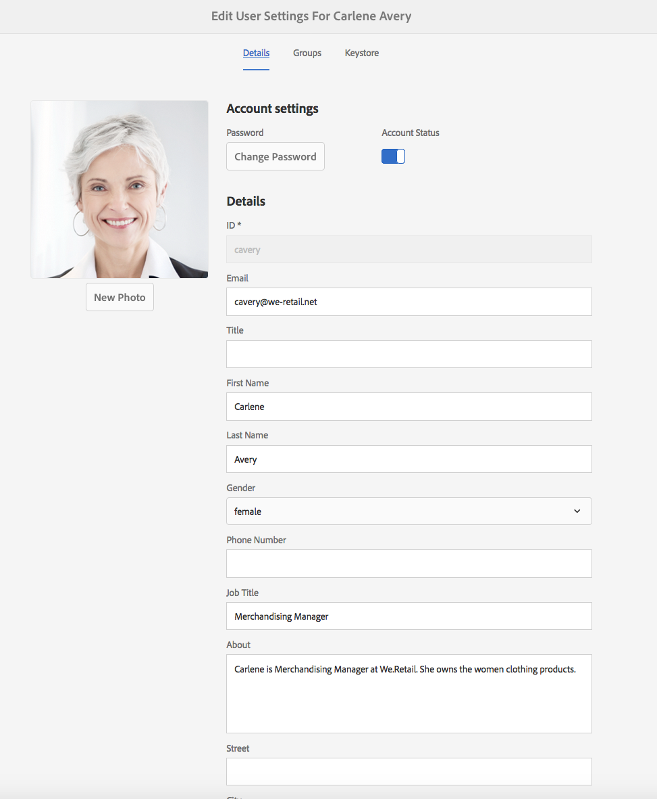
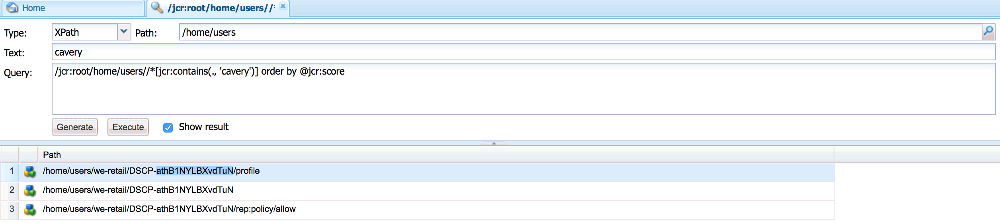

# 处理 Adobe Experience Manager（AEM）基础的 GDPR 请求{#handling-gdpr-requests-for-the-aem-foundation}

>[!IMPORTANT]
>
>以下章节以 GDPR 为示例进行说明，但其中涵盖的细节同样适用于所有数据保护和隐私法规，例如 GDPR 和 CCPA 等。

## AEM 基础 GDPR 支持 {#aem-foundation-gdpr-support}

在 AEM 基础层级，所存储的个人数据为用户轮廓。因此，本文主要说明如何访问和删除用户轮廓，以分别满足 GDPR 的“访问”和“删除”请求。

## 访客用户配置文件 {#accessing-a-user-profile}

### 手动步骤 {#manual-steps}

1. 打开用户管理控制台，可通过导航至&#x200B;**[!UICONTROL 设置 - 安全性 - 用户]**，或直接访问 `https://<serveraddress>:<serverport>/libs/granite/security/content/useradmin.html`

   

1. 然后，在页面顶部的搜索栏中输入该用户的姓名以进行搜索：

   

1. 最后，单击用户轮廓以将其打开，然后在&#x200B;**[!UICONTROL 详细信息]**&#x200B;选项卡下查看。

   

### HTTP API {#http-api}

如前所述，Adobe 提供了用于访问用户数据的 API 来促进自动化。有多种类型的 API 可供您使用：

**UserProperties API**

```shell
curl -u user:password http://localhost:4502/libs/granite/security/search/profile.userproperties.json\?authId\=cavery
```

**Sling API**

*发现用户主页：*

```xml
curl -g -u user:password 'http://localhost:4502/libs/granite/security/search/authorizables.json?query={"condition":[{"named":"cavery"}]}'
     {"authorizables":[{"type":"user","authorizableId_xss":"cavery","authorizableId":"cavery","name_xss":"Carlene Avery","name":"Carlene Avery","home":"/home/users/we-retail/DSCP-athB1NYLBXvdTuN"}],"total":1}
```

*检索用户数据*

使用从上述命令返回的 JSON 负载的 home 属性中的节点路径：

```shell
curl -u user:password  'http://localhost:4502/home/users/we-retail/DSCP-athB1NYLBXvdTuN/profile.-1.json'
```

```shell
curl -u user:password  'http://localhost:4502/home/users/we-retail/DSCP-athB1NYLBXvdTuN/profiles.-1.json'
```

## 禁用用户并删除关联的配置文件 {#disabling-a-user-and-deleting-the-associated-profiles}

### 禁用用户 {#disable-user}

1. 如上所述，打开用户管理控制台并搜索有问题的用户。
1. 将鼠标悬停在用户上方并单击选择图标。配置文件显示为灰色，表明它已被选中。

1. 在顶部菜单中点击“禁用”按钮以禁用该用户：

   

1. 最后，确认操作：

   

   用户界面会通过将轮廓卡变灰并添加锁定图标来表示该用户已被停用：

   

### 删除用户轮廓信息 {#delete-user-profile-information}

1. 登录 CRXDE Lite，然后搜索 `[!UICONTROL userId]`：

   

1. 打开位于 `[!UICONTROL /home/users]` 下的用户节点（默认位置）：

   

1. 删除轮廓节点及其所有子节点。根据 AEM 版本，轮廓节点有两种格式：

   1. `[!UICONTROL /profile]` 下的默认私有轮廓
   1. `[!UICONTROL /profiles]`，适用于使用 AEM 6.5 创建的新轮廓

   

### HTTP API {#http-api-1}

以下程序使用 `curl` 命令行工具演示如何禁用 `userId` 为 **[!UICONTROL cavery]** 的用户，并删除位于默认位置的 `cavery` 轮廓。

* *查找用户主目录*

```shell
curl -g -u user:password 'http://localhost:4502/libs/granite/security/search/authorizables.json?query={"condition":[{"named":"cavery"}]}'
     {"authorizables":[{"type":"user","authorizableId_xss":"cavery","authorizableId":"cavery","name_xss":"Carlene Avery","name":"Carlene Avery","home":"/home/users/we-retail/DSCP-athB1NYLBXvdTuN"}],"total":1}
```

* *禁用用户*

使用从上述命令返回的 JSON 负载的主目录属性中的节点路径：

```shell
curl -X POST -u user:password -FdisableUser="describe the reasons for disabling this user (GDPR in this case)" 'http://localhost:4502/home/users/we-retail/DSCP-athB1NYLBXvdTuN.rw.userprops.html'
```

* *删除用户配置文件*

使用从帐户发现命令返回的 JSON 负载的 home 属性中的节点路径和已知的现成配置文件节点位置：

```shell
curl -X POST -u user:password -H "Accept: application/json,**/**;q=0.9" -d ':operation=delete' 'http://localhost:4502/home/users/we-retail/DSCP-athB1NYLBXvdTuN/profile'
```

```shell
curl -X POST -u user:password -H "Accept: application/json,**/**;q=0.9" -d ':operation=delete' 'http://localhost:4502/home/users/we-retail/DSCP-athB1NYLBXvdTuN/profile'
```
