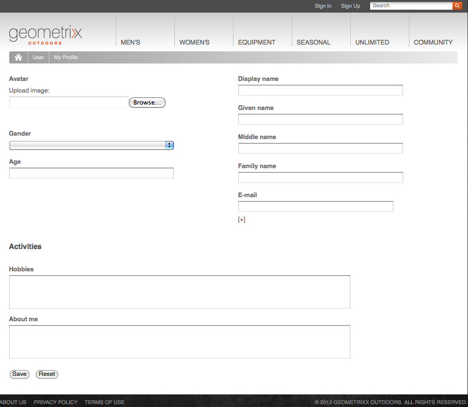
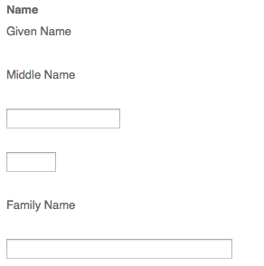

# Identity Management{#identity-management}

只有在您提供网站访问者登录功能后，才能识别这些访客。 您可能希望提供登录功能的原因有多种：

* [AEM Communities](/help/communities/overview.md)网站访客需要登录才能向社区发布内容。
* [已关闭的用户组](/help/sites-administering/cug.md)

  您可能需要限制特定访客访问您的网站（或部分网站）。

* [Personalization](/help/sites-administering/personalization.md)允许访客配置访问您网站的特定方式。

登录（和注销）功能由具有&#x200B;**个人资料**&#x200B;[&#128279;](#profiles-and-user-accounts)&#x200B;的帐户提供，该帐户保存有关已注册访客（用户）的其他信息。 注册和授权的实际流程可能有所不同：

* 从网站自助注册

  可以将[社区站点](/help/communities/sites-console.md)配置为允许访客使用其Facebook或Twitter帐户进行自助注册或登录。

* 网站注册申请

  对于封闭用户组，您可以允许访客请求注册，但通过工作流强制执行授权。

* 在创作环境中注册每个帐户

  如果您的配置文件数量较少（无论如何都需要授权），则可以决定直接注册每个配置文件。

要允许访客注册，可使用一系列组件和表单来收集所需的身份信息，然后收集其他（通常是可选的）配置文件信息。 完成注册后，他们还可以查看和更新已提交的详细信息。

可以配置或开发其他功能：

* 配置所需的任何反向复制。
* 允许用户通过结合工作流开发表单来移除其用户档案。

>[!NOTE]
>
>配置文件中指定的信息也可用于通过[区段](/help/sites-administering/campaign-segmentation.md)和[营销活动](/help/sites-classic-ui-authoring/classic-personalization-campaigns.md)向用户提供目标内容。

## 注册Forms {#registration-forms}

可以使用[表单](/help/sites-authoring/default-components.md#form-component)收集注册信息，然后生成新的帐户和配置文件。

例如，用户可以使用“Geometrixx”页面请求新的配置文件
`http://localhost:4502/content/geometrixx-outdoors/en/user/register.html`


提交请求后，将打开用户档案页面，用户可在其中提供个人详细信息。



新帐户也可在[用户控制台](/help/sites-administering/security.md)中看到。

## 登录 {#login}

登录组件可用于收集登录信息，然后激活登录过程。

这将为访客提供&#x200B;**用户名**&#x200B;和&#x200B;**密码**&#x200B;的标准字段，以及一个&#x200B;**登录**&#x200B;按钮，以便在输入凭据时激活登录过程。

例如，用户可以使用以下页面上的&#x200B;**登录**&#x200B;选项登录或创建Geometrixx：

`http://localhost:4502/content/geometrixx-outdoors/en/user/sign-in.html`


## 注销 {#logging-out}

由于存在登录机制，因此还需要注销机制。 该选项可用作Geometrixx中的&#x200B;**注销**&#x200B;选项。

## 查看和更新用户档案 {#viewing-and-updating-a-profile}

根据您的注册表，访客可能在他们的个人资料中注册了信息。 他们应该能够在以后的阶段查看和/或更新此内容。 这可以用类似的形式完成；例如，在Geometrixx中：

```
http://localhost:4502/content/geometrixx-outdoors/en/user/profile.html
```

要查看个人资料的详细信息，请单击任何页面右上角的&#x200B;**我的个人资料**；例如，使用`admin`帐户：
`http://localhost:4502/home/users/a/admin/profile.form.html/content/geometrixx-outdoors/en/user/profile.html.`

您可以使用[客户端上下文](/help/sites-administering/client-context.md)查看另一个配置文件（在创作环境中，具有足够的权限）：

1. 打开一个页面；例如，Geometrixx页面：

   `http://localhost:4502/cf#/content/geometrixx/en.html`

1. 单击右上角的&#x200B;**我的个人资料**。 您将看到当前帐户的配置文件；例如，管理员。
1. 按&#x200B;**control-alt-C**&#x200B;打开客户端上下文。
1. 在客户端上下文的左上角，单击&#x200B;**加载配置文件**&#x200B;按钮。

   

1. 从对话框窗口的下拉列表中选择其他配置文件；例如，**Alison Parker**。
1. 单击&#x200B;**确定**。
1. 再次单击&#x200B;**我的个人资料**。 将使用Alison的详细信息更新表单。

   

1. 您现在可以使用&#x200B;**编辑配置文件**&#x200B;或&#x200B;**更改密码**&#x200B;来更新详细信息。

## 将字段添加到用户档案定义 {#adding-fields-to-the-profile-definition}

您可以将字段添加到用户档案定义。 例如，要将“最喜爱的颜色”字段添加到Geometrixx配置文件，请执行以下操作：

1. 从网站控制台导航到Geometrixx Outdoors站点>英语>用户>我的配置文件。
1. 双击&#x200B;**我的个人资料**&#x200B;页面以打开它进行编辑。
1. 在sidekick的&#x200B;**组件**&#x200B;选项卡中，展开&#x200B;**表单**&#x200B;部分。
1. 将&#x200B;**下拉列表**&#x200B;从Sidekick拖到表单中，**关于我**&#x200B;字段的正下方。
1. 双击&#x200B;**下拉列表**&#x200B;组件以打开配置对话框并输入：

   * **元素名称** - `favoriteColor`
   * **标题** - `Favorite Color`
   * **项** — 添加多种颜色作为项

   单击&#x200B;**确定**&#x200B;进行保存。

1. 关闭页面并返回&#x200B;**网站**&#x200B;控制台并激活“我的个人资料”页面。

   下次查看配置文件时，您可以选择最喜爱的颜色：

   

   该字段将保存在相关用户帐户的&#x200B;**配置文件**&#x200B;部分下：

   在CRXDE中

## 配置文件状态 {#profile-states}

有几个用例需要知道用户（或其配置文件）是否处于&#x200B;*特定状态*。

这涉及在用户配置文件中定义适当的属性，其方式：

* 对用户可见和访问
* 为每个属性定义两个状态
* 允许您在定义的两种状态之间进行切换

此操作可通过以下方式完成：

* [状态提供程序](#state-providers)

  管理特定资产的两种状态以及这两种状态之间的过渡。

* [工作流](#workflows)

  用于管理与状态相关的操作。

可以定义多个状态；例如，在Geometrixx中，这些状态包括：

* 订阅（或取消订阅）新闻稿或评论会话上的通知
* 添加和删除与好友的连接

### 状态提供程序 {#state-providers}

状态提供程序管理相关属性的当前状态，以及两个可能状态之间的过渡。

状态提供程序作为组件实施，因此可以根据您的项目进行自定义。 在Geometrixx中，这些功能包括：

* 取消订阅/订阅论坛主题
* 添加/删除朋友

### 工作流 {#workflows}

状态提供程序管理配置文件属性及其状态。

实施与状态相关的操作需要一个工作流。 例如，订阅通知时，工作流将处理实际的订阅操作；取消订阅通知时，工作流将处理从订阅列表中删除用户的操作。

## 配置文件和用户帐户 {#profiles-and-user-accounts}

配置文件作为[用户帐户](/help/sites-administering/user-group-ac-admin.md)的一部分存储在内容存储库中。

可在`/home/users/geometrixx`下找到配置文件：

在CRXDE中看到的

在标准安装（创作或发布）中，每个人都具有对所有用户整个配置文件信息的读取权限。 每个人均是一个“*内置组，自动包含所有现有用户和组。 无法编辑成员列表*。

这些访问权限由以下通配符ACL定义：

/home每个用户都允许jcr：read rep：glob = &#42;/profile&#42;

这允许：

* 论坛、评论或博客帖子以显示相应配置文件中的信息（例如图标或全名）
* geometrixx配置文件页面的链接

如果此类访问不适用于您的安装，则可以更改这些默认设置。

可以使用&#x200B;**[访问控制](/help/sites-administering/user-group-ac-admin.md#access-right-management)**&#x200B;选项卡完成此操作：


## 配置文件组件 {#profile-components}

一系列配置文件组件也可用于定义您站点的配置文件要求。

### 检查密码字段 {#checked-password-field}

此组件为您提供以下两个字段：

* 密码的输入
* 用于确认密码已正确输入的检查。

在默认设置下，该组件将按如下方式显示：


### 个人资料头像照片 {#profile-avatar-photo}

此组件为用户提供了一种选择和上传头像照片文件的机制。


### 个人资料详细姓名 {#profile-detailed-name}

此组件允许用户输入详细名称。



### 个人资料性别 {#profile-gender}

此组件允许用户输入其性别。


