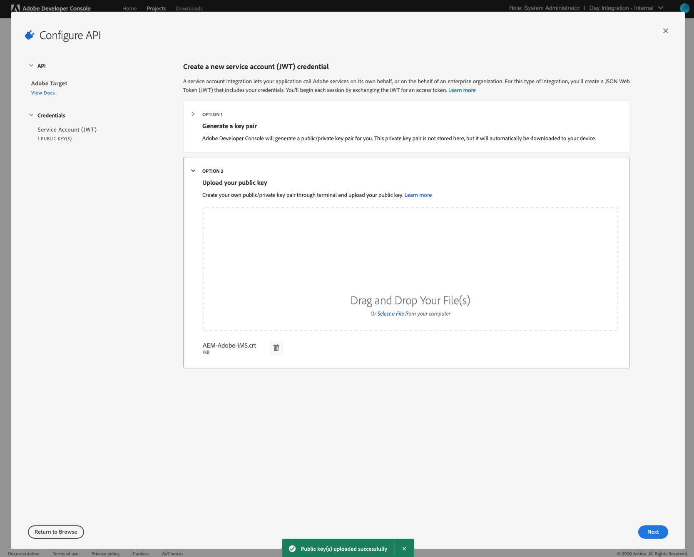

# 使用Adobe I/O{#integration-with-adobe-target-using-adobe-i-o}与Adobe Target集成

通过Target Standard API将AEM与Adobe Target集成需要配置Adobe IMS(Identity Management System)和Adobe I/O。

>[!NOTE]
>
>AEM 6.5中新增了对Adobe Target Standard API的支持。Target Standard API使用IMS身份验证。
>
>仍支持在AEM中使用Adobe Target Classic API，以实现向后兼容性。 [目标经典API使用用户凭据身份验证](/help/sites-administering/target-configuring.md#manually-integrating-with-adobe-target)。
>
>API选择由用于AEM/目标集成的身份验证方法驱动。
>另请参阅[租户ID和客户端代码](#tenant-client)部分。

## 前提条件 {#prerequisites}

在开始此过程之前：

* [Adobe](https://helpx.adobe.com/cn/contact/enterprise-support.ec.html) 支持必须为以下项目设置您的帐户：

   * Adobe控制台
   * Adobe I/O
   * Adobe Target和
   * Adobe IMS(Identity Management系统)

* 贵组织的系统管理员应使用该Admin Console将贵组织中所需的开发人员添加到相关产品用户档案。

   * 这为特定开发人员提供了在Adobe I/O内启用集成的权限。
   * 有关更多详细信息，请参阅[管理开发人员](https://helpx.adobe.com/enterprise/admin-guide.html/enterprise/using/manage-developers.ug.html)。

## 配置IMS配置 — 生成公钥{#configuring-an-ims-configuration-generating-a-public-key}

配置的第一阶段是在AEM中创建IMS配置并生成公钥。

1. 在AEM中，打开&#x200B;**工具**&#x200B;菜单。
1. 在&#x200B;**安全**&#x200B;部分，选择&#x200B;**AdobeIMS配置**。
1. 选择&#x200B;**创建**&#x200B;以打开&#x200B;**AdobeIMS技术帐户配置**。
1. 使用&#x200B;**云配置**&#x200B;下的下拉菜单，选择&#x200B;**Adobe Target**。
1. 激活&#x200B;**创建新证书**&#x200B;并输入新别名。
1. 使用&#x200B;**创建证书**&#x200B;进行确认。

   

1. 选择&#x200B;**下载**（或&#x200B;**下载公钥**），将文件下载到本地驱动器，以便在[配置Adobe I/O以与AEM](#configuring-adobe-i-o-for-adobe-target-integration-with-aem)集成Adobe Target时可以使用文件。

   >[!CAUTION]
   >
   >保持此配置打开，当[在AEM](#completing-the-ims-configuration-in-aem)中完成IMS配置时，将再次需要此配置。

   

## 配置Adobe I/O以与AEM {#configuring-adobe-i-o-for-adobe-target-integration-with-aem}集成Adobe Target

您需要使用AEM将使用的Adobe Target创建Adobe I/O项目（集成），然后分配所需的权限。

### 创建项目{#creating-the-project}

打开Adobe I/O控制台，使用AEM将使用的Adobe Target创建I/O项目：

>[!NOTE]
>
>另请参阅[Adobe I/O教程](https://www.adobe.io/apis/experienceplatform/home/tutorials/alltutorials.html)。

1. 打开项目的Adobe I/O控制台：

   [https://console.adobe.io/projects](https://console.adobe.io/projects)

1. 将显示您所有的项目。 选择&#x200B;**创建新项目** — 位置和用法取决于：

   * 如果尚未有任何项目，**创建新项目**将居中，位于底部。
      
   * 如果您已有现有项目，则将列出这些项目，并且&#x200B;**创建新项目**将位于右上方。
      

1. 选择&#x200B;**添加到Project**，后跟&#x200B;**API**:

   

1. 选择&#x200B;**Adobe Target**，然后选择&#x200B;**下一个**:

   >[!NOTE]
   >
   >如果您订阅了Adobe Target，但未看到它列出，则应检查[Prerequestes](#prerequisites)。

   

1. **上传公钥**，完成后继续 **下**:

   

1. 查看凭据，并继续&#x200B;**Next**:

   

1. 选择所需的产品用户档案，并继续&#x200B;**保存配置的API**:

   >[!NOTE]
   >
   >显示的产品用户档案取决于您是否：
   >
   >* Adobe Target Standard — 仅&#x200B;**默认工作区**&#x200B;可用
   >* Adobe Target Premium — 列出所有可用工作区，如下所示

   

1. 将确认创建。

<!--
1. The creation will be confirmed, you can now **Continue to integration details**; these are needed for [Completing the IMS Configuration in AEM](#completing-the-ims-configuration-in-aem).

   
-->

### 为集成{#assigning-privileges-to-the-integration}分配权限

您现在必须为集成分配所需的权限：

1. 打开Adobe **Admin Console**:

   * [https://adminconsole.adobe.com](https://adminconsole.adobe.com/)

1. 导航到&#x200B;**Products**（顶部工具栏），然后选择&#x200B;**Adobe Target - &lt;*your-tenant-id*>**（从左侧面板）。
1. 选择&#x200B;**产品用户档案**，然后从显示的列表中选择所需的工作区。 例如，默认工作区。
1. 选择&#x200B;**集成**，然后选择所需的集成配置。
1. 选择&#x200B;**Editor**&#x200B;作为&#x200B;**产品角色**;而不是&#x200B;**观察者**。

## 为Adobe I/O集成项目{#details-stored-for-the-adobe-io-integration-project}存储的详细信息

从“Adobe I/O项目”控制台中，您可以看到所有集成项目的列表:

* [https://console.adobe.io/projects](https://console.adobe.io/projects)

选择&#x200B;**视图**（特定项目条目右侧）以显示有关配置的更多详细信息。 这些 Cookie 包括：

* 项目概述
* 分析
* 凭据
   * 服务帐户(JWT)
      * 凭据详细信息
      * 生成JWT
* API
   * 例如，Adobe Target

其中一些需要完成Adobe I/O集成，以在AEM中实现目标。

## 在AEM {#completing-the-ims-configuration-in-aem}中完成IMS配置

返回AEM后，您可以通过从目标集成中添加所需值来完成IMS配置：

1. 返回至在AEM](#configuring-an-ims-configuration-generating-a-public-key)中打开的[IMS配置。
1. 选择&#x200B;**下一步**。

1. 您可以在此处使用Adobe I/O](#details-stored-for-the-adobe-io-integration-project)中的[详细信息：

   * **标题**:您的文本。
   * **授权服务器**:从下面的Payloads部 `"aud"` 分行复 **** 制/粘贴此内容， `"https://ims-na1.adobelogin.com"` 例如在以下示例中
   * **API密钥**:从Adobe I/O集成的  “概述”部分复制此内容以用于目标
   * **客户机密**:在Adobe I/O集成的  概述部分中生成此组件以用于目标，并复制
   * **有效负荷**:从Adobe I/O集 [成](#details-stored-for-the-adobe-io-integration-project) 的Generate JWT部分复制此组件以目标

   

1. 使用&#x200B;**创建**&#x200B;进行确认。

1. 您的Adobe Target配置将显示在AEM控制台中。

   

## 确认IMS配置{#confirming-the-ims-configuration}

要确认配置是否按预期运行，请执行以下操作：

1. 打开：

   * `https://localhost<port>/libs/cq/adobeims-configuration/content/configurations.html`

   例如：

   * `https://localhost:4502/libs/cq/adobeims-configuration/content/configurations.html`

1. 选择配置。
1. 从工具栏中选择&#x200B;**检查运行状况**，然后选择&#x200B;**检查**。

   

1. 如果成功，您将看到以下消息：

   

## 配置Adobe TargetCloud Service{#configuring-the-adobe-target-cloud-service}

现在可以引用该配置，以便Cloud Service使用Target Standard API:

1. 打开&#x200B;**工具**&#x200B;菜单。 然后，在&#x200B;**Cloud Services**&#x200B;部分中，选择&#x200B;**旧Cloud Services**。
1. 向下滚动至&#x200B;**Adobe Target**&#x200B;并选择&#x200B;**立即配置**。

   将打开&#x200B;**创建配置**&#x200B;对话框。

1. 输入&#x200B;**标题**，并根据需要输入&#x200B;**名称**（如果留空，则从标题生成）。

   您还可以选择所需的模板（如果有多个模板可用）。

1. 使用&#x200B;**创建**&#x200B;进行确认。

   将打开&#x200B;**编辑组件**&#x200B;对话框。

1. 在&#x200B;**Adobe Target设置**&#x200B;选项卡中输入详细信息：

   * **身份验证**:IMS
   * **租户ID**:AdobeIMS租户ID。另请参见下面的[租户ID和客户端代码](#tenant-client)部分。

      >[!NOTE]
      >
      >对于IMS，此值需要从目标本身中提取。 您可以登录目标并从URL提取租户ID。
      >
      >例如，如果URL为：
      >
      >`https://experience.adobe.com/#/@yourtenantid/target/activities`
      >
      >然后使用`yourtenantid`。
   * **客户端代码**:请参阅 [下面的租户ID和客](#tenant-client) 户端代码部分。
   * **IMS配置**:选择IMS配置的名称
   * **API类型**:休息
   * **A4T Analytics Cloud配置**:选择用于目标活动目标和量度的Analytics云配置。如果您在定位内容时使用Adobe Analytics作为报告源，则需要此选项。 如果看不到云配置，请参阅[配置A4T Analytics Cloud Configuration](/help/sites-administering/target-configuring.md#configuring-a-t-analytics-cloud-configuration)中的注意事项。
   * **使用准确定位**:默认情况下，此复选框处于选中状态。如果选择，云服务配置将在加载内容之前等待上下文加载。 请参阅以下注意事项。
   * **从Adobe Target同步区段**:选择此选项可下载在目标中定义的区段，以在AEM中使用它们。当“API类型”属性为REST时，必须选择此选项，因为不支持内联区段，并且您始终需要使用来自目标的区段。 (请注意，AEM术语“segment”等效于目标“受众”。)
   * **客户端库**:选择是要AT.js客户端库还是mbox.js（已弃用）。
   * **使用标签管理系统来传送客户端库**:使用DTM（已弃用）、Adobe Launch或任何其他标签管理系统。
   * **自定义AT.js**:如果选中“标签管理”框或使用默认的AT.js，请留空。或者上传自定义AT.js。 仅在您选择了AT.js时显示。

   >[!NOTE]
   >
   >[已弃用Cloud Service配置以使用目标 Classic ](/help/sites-administering/target-configuring.md#manually-integrating-with-adobe-target) API(使用Adobe Recommendations设置选项卡)。
1. 单击&#x200B;**连接到目标**&#x200B;以初始化与Adobe Target的连接。

   如果连接成功，则显示消息&#x200B;**连接成功**。

1. 在消息上选择&#x200B;**OK**，在对话框上选择&#x200B;**OK**&#x200B;以确认配置。
1. 您现在可以继续[添加目标 Framework](/help/sites-administering/target-configuring.md#adding-a-target-framework)以配置将发送到目标的ContextHub或ClientContext参数。 请注意，将AEM Experience Fragments导出到目标时可能不需要执行此操作。

### 租户ID和客户端代码{#tenant-client}

在[Adobe Experience Manager 6.5.8.0](/help/release-notes/sp-release-notes.md)中，“客户端代码”字段已添加到目标配置窗口。

配置租户ID和客户端代码字段时，请注意以下事项：

1. 对于大多数客户，租户ID和客户端代码是相同的。 这意味着这两个字段包含相同的信息并且相同。 请确保在这两个字段中输入租户ID。
2. 出于旧版目的，您还可以在租户ID和客户端代码字段中输入不同的值。

在这两种情况下，请注意：

* 默认情况下，客户端代码（如果是先添加的）也将自动复制到租户ID字段中。
* 您可以选择更改默认的租户ID集。
* 因此，对目标的后端调用将基于租户ID，而对目标的客户端调用将基于客户端代码。

如前所述，第一种情况是AEM 6.5中最常见的情况。无论采用哪种方式，均应根据您的要求确保&#x200B;**和**&#x200B;字段包含正确的信息。

>[!NOTE]
>
> 如果要更改现有目标配置：
>
> 1. 重新输入租户ID。
> 2. 重新连接到目标。
> 3. 保存配置。

