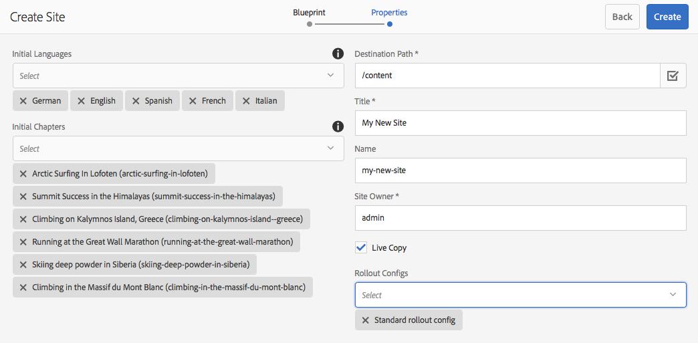
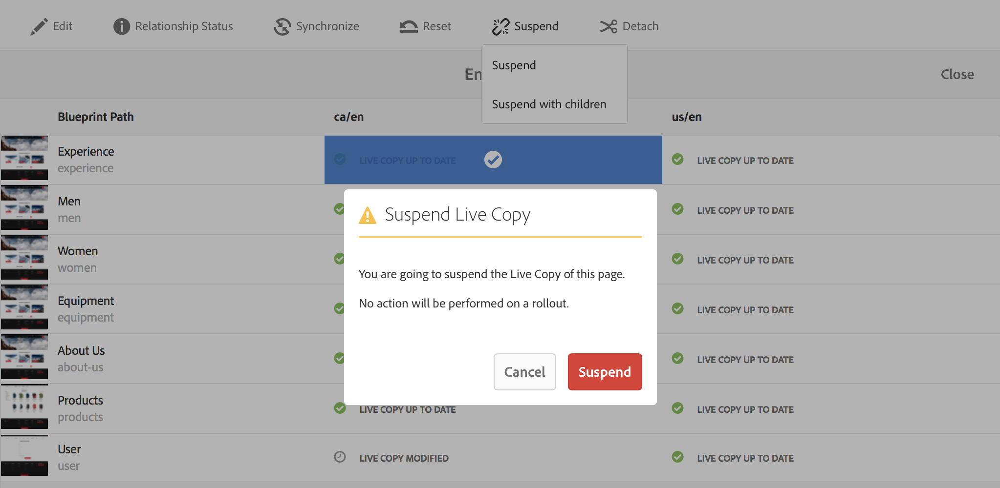

# 创建并同步 Live Copy{#creating-and-synchronizing-live-copies}

您可以从页面或Blueprint配置创建Live Copy，然后可以管理继承和同步。

## 管理 Blueprint 配置 {#managing-blueprint-configurations}

Blueprint配置标识要用作一个或多个Live Copy页面的源的现有网站。

>[!NOTE]
>
>通过Blueprint配置，可将内容更改推送到活动副本。 请参阅 [Live Copy – 源、Blueprint 和 Blueprint 配置](/help/sites-administering/msm.md#source-blueprints-and-blueprint-configurations)。

创建 Blueprint 配置时，可以选择定义 Blueprint 的内部结构的模板。默认 Blueprint 模板假定源网站具有以下特征：

* 网站具有根页面。
* 根的直接子页面是网站的语言分支。在创建Live Copy时，将语言显示为可选内容，以便包含在副本中。
* 每个语言分支的根均有一个或多个子页面。在创建Live Copy时，子页面显示为可包含在Live Copy中的章节。

>[!NOTE]
>
>不同的结构需要另一个Blueprint模板。

创建 Blueprint 配置后，可以配置以下属性：

* **名称**： Blueprint配置的名称。
* **Source路径**：您用作源的站点根页面的路径(Blueprint)。
* **描述**。（可选）Blueprint配置的描述。 该描述显示在创建站点时可从中进行选择的Blueprint配置列表中。

使用Blueprint配置时，您可以将其与转出配置关联，以确定源/Blueprint的实时副本的同步方式。 请参阅[指定要使用的转出配置](/help/sites-administering/msm-sync.md#specifying-the-rollout-configurations-to-use)。

### 创建Blueprint配置 {#creating-a-blueprint-configuration}

要创建 Blueprint 配置，请执行以下操作：

1. [导航](/help/sites-authoring/basic-handling.md#global-navigation)到&#x200B;**工具**&#x200B;菜单，然后选择&#x200B;**站点**&#x200B;菜单。
1. 选择 **Blueprint** 以打开 **Blueprint 配置**&#x200B;控制台：

   

1. 选择&#x200B;**创建**。
1. 选择 Blueprint 模板，然后选择&#x200B;**下一步**&#x200B;以继续。
1. 选择要用作 Blueprint 的源页面；然后选择&#x200B;**下一步**&#x200B;以继续。
1. 定义：

   * **标题**：Blueprint 的强制性标题
   * **描述**：用于提供更多详细信息的可选描述。

1. **创建**&#x200B;将根据您的规范创建 Blueprint 配置。

### 编辑或删除Blue配置 {#editing-or-deleting-a-blueprint-configuration}

您可以编辑或删除现有 Blueprint 配置：

1. [导航](/help/sites-authoring/basic-handling.md#global-navigation)到&#x200B;**工具**&#x200B;菜单，然后选择&#x200B;**站点**&#x200B;菜单。
1. 选择 **Blueprint** 以打开 **Blueprint 配置**&#x200B;控制台：

   

1. 选择所需的 Blueprint 配置 – 可在工具栏中使用相应的操作：

   * **属性**；可以使用此项查看并编辑配置的属性。
   * **删除**

## 创建 Live Copy {#creating-a-live-copy}

### 创建页面的 Live Copy {#creating-a-live-copy-of-a-page}

您可以创建任何页面或分支的Live Copy。 在创建Live Copy时，您可以指定用于同步内容的转出配置：

* 选定的转出配置将应用于Live Copy页面及其子页面。
* 如果您未指定任何转出配置，MSM 将确定要使用的转出配置。请参阅[指定要使用的转出配置](/help/sites-administering/msm-sync.md#specifying-the-rollout-configurations-to-use)。

您可以创建任何页面的Live Copy：

* 由[Blueprint配置](#creating-a-blueprint-configuration)引用的页面。
* 以及与配置无关联的页面。
* AEM还支持在其他Live Copy的页面中创建Live Copy。

唯一的区别是，**转出**&#x200B;命令在源/Blueprint 页面上的可用性取决于 Blueprint 配置是否引用了源：

* 如果从Blueprint配置中引用的&#x200B;**是**&#x200B;的源页面创建Live Copy，则转出命令将适用于源/Blueprint页面。
* 如果从Blueprint配置中未引用&#x200B;**的**&#x200B;的源页面创建Live Copy，则转出命令将不适用于源/Blueprint页面。

要创建Live Copy，请执行以下操作：

1. 在&#x200B;**Sites**&#x200B;控制台中，依次选择&#x200B;**创建**&#x200B;和 **Live Copy**。

   

1. 选择源页面，然后单击&#x200B;**下一步**。 例如：

   

1. 指定Live Copy的目标路径（打开Live Copy的父文件夹/页面），然后单击&#x200B;**下一步**。

   

   >[!NOTE]
   >
   >目标路径不能在源路径内。

1. 输入：

   * 页面的&#x200B;**标题**。
   * URL 中使用的&#x200B;**名称**。

   

1. 使用&#x200B;**排除子页面**&#x200B;复选框：

   * 选中：仅创建所选页面的Live Copy（浅Live Copy）
   * 未选择：创建一个包含选定页面的所有子项的Live Copy（深Live Copy）

1. （可选）要指定用于LiveCopy的一个或多个转出配置，请使用&#x200B;**转出配置**&#x200B;下拉列表来选择它们；所选配置显示在下拉选择器的下方。
1. 单击&#x200B;**创建**。这会显示一条确认消息，可在其中选择&#x200B;**打开**&#x200B;或&#x200B;**完成**。

### 从 Blueprint 配置创建站点的 Live Copy {#creating-a-live-copy-of-a-site-from-a-blueprint-configuration}

使用Blueprint配置创建Live Copy可基于Blueprint（源）内容创建站点。 从Blueprint配置创建Live Copy时，选择要复制的Blueprint源的一个或多个语言分支，然后从语言分支中选择要复制的章节。 请参阅[创建 Blueprint 配置](/help/sites-administering/msm-livecopy.md#creating-a-blueprint-configuration)。

如果从Live Copy中省略了一些语言分支或章节，则可稍后添加它们；请参阅[在Live Copy中创建Live Copy（Blueprint配置）](#creating-a-live-copy-inside-a-live-copy-blueprint-configuration)。

>[!CAUTION]
>
>当Blueprint源包含以其他分支中的段落为目标的链接和引用时，目标不会在Live Copy页面中更新，而是仍指向原始目标。

创建站点时，请提供以下属性的值：

* **初始语言**：要包含在Live Copy中的Blueprint源的语言分支。
* **初始章节**：要包含在Live Copy中的Blueprint语言分支的子页面。
* **目标路径**： Live Copy站点的根页面的位置。
* **标题**： Live Copy站点的根页面的标题。
* **Name**： （可选）存储Live Copy根页面的JCR节点的名称。 默认值基于标题。
* **站点所有者**： （可选）
* **Live Copy**：选择此选项可与源站点建立实时关系。如果不选择此选项，则尽管会创建 Blueprint 的副本，但该副本随后不会与源同步。
* **转出配置**：（可选）选择一个或多个转出配置以用于同步Live Copy。 默认情况下，转出配置继承自Blueprint；有关更多详细信息，请参阅[指定要使用的转出配置](/help/sites-administering/msm-sync.md#specifying-the-rollout-configurations-to-use)。

要从Blueprint配置创建站点的Live Copy，请执行以下操作：

1. 在&#x200B;**Sites**&#x200B;控制台中，选择&#x200B;**创建**，然后从下拉选择器中选择&#x200B;**站点**。
1. 选择要用作Live Copy源的Blueprint配置，然后选择&#x200B;**下一步**：

   

1. 使用&#x200B;**初始语言**&#x200B;选择器指定要用于Live Copy的Blueprint站点的语言。

   默认选择所有可用语言。要删除某种语言，请单击该语言旁边显示的&#x200B;**X**。

   例如：

   

1. 使用&#x200B;**初始章节**&#x200B;下拉列表选择要包含在Live Copy中的Blueprint的部分。 默认情况下，会再次包含所有可用章节，但可以将其删除。
1. 提供剩余属性的值，然后选择&#x200B;**创建**。在确认对话框中，选择&#x200B;**完成**&#x200B;以返回&#x200B;**Sites**&#x200B;控制台，或选择&#x200B;**打开站点**&#x200B;以打开站点的根页面。

### 在 Live Copy（Blueprint 配置）中创建 Live Copy {#creating-a-live-copy-inside-a-live-copy-blueprint-configuration}

在现有Live Copy（使用Blueprint配置创建的）中创建Live Copy时，您可以插入最初创建Live Copy时未包含的任何语言副本或章节。

## 监控您的 Live Copy {#monitoring-your-live-copy}

### 查看 Live Copy 的状态 {#seeing-the-status-of-a-live-copy}

Live Copy页面的属性显示有关Live Copy的以下信息：

* **Source**： Live Copy页面的源页面。
* **状态**： Live Copy的同步状态。 状态包括Live Copy是否与源保持同步、上次同步时间以及同步操作的执行者。
* **配置**：

   * 页面是否仍受Live Copy继承的约束。
   * 配置是否继承自父页面。
   * Live Copy使用的任何转出配置。

要查看属性，请执行以下操作：

1. 在&#x200B;**站点**&#x200B;控制台中，选择Live Copy页面并打开属性。
1. 选择 **Live Copy** 选项卡。

   例如：

   

### 查看 Blueprint 页面的 Live Copy {#seeing-the-live-copies-of-a-blueprint-page}

Blueprint页面（在Blueprint配置中引用）为您提供使用当前(Blueprint)页面作为源的Live Copy页面的列表。 使用此列表可跟踪活动副本。 此列表显示在[页面属性](/help/sites-authoring/editing-page-properties.md)的 **Blueprint** 选项卡上。

## 同步您的 Live Copy {#synchronizing-your-live-copy}

### 转出 Blueprint {#rolling-out-a-blueprint}

转出Blueprint页面以将内容更改推送到活动副本。 **转出**&#x200B;操作执行使用[转出](/help/sites-administering/msm-sync.md#rollout-triggers)触发器的转出配置。

>[!NOTE]
>
>如果在Blueprint分支和从属Live Copy分支中都创建了具有相同页面名称的新页面，则可能会发生冲突。
>
>[转出时需要处理和解决此类冲突](/help/sites-administering/msm-rollout-conflicts.md)。
>

#### 从页面属性转出 Blueprint {#rolling-out-a-blueprint-from-page-properties}

1. 在&#x200B;**Sites**&#x200B;控制台中，选择 Blueprint 中的页面并打开属性。
1. 打开 **Blueprint** 选项卡。
1. 选择&#x200B;**转出**。

   

1. 指定页面和任何子页面，然后通过复选标记进行确认：

   

1. 指定转出作业是应立即执行（**现在**）还是在其他日期/时间执行（**稍后**）。

   

转出作为异步作业处理，并且可在&#x200B;[**异步作业状态**&#x200B;仪表板](asynchronous-jobs.md#monitor-the-status-of-asynchronous-operations)中进行检查，该仪表板位于&#x200B;**全局导航** > **工具** > **操作** > **作业**

>[!NOTE]
>
>异步转出处理需要AEM 6.5.3.0或更高版本。 在以前的版本中，会立即同步处理页面。

#### 从引用边栏转出 Blueprint {#roll-out-a-blueprint-from-the-reference-rail}

1. 在&#x200B;**Sites**&#x200B;控制台中，从 Live Copy 中选择此页面，然后从工具栏中打开&#x200B;**[引用](/help/sites-authoring/basic-handling.md#references)**&#x200B;面板。
1. 从列表中选择 **Blueprint** 选项以查看与此页面关联的 Blueprint。
1. 从列表中选择所需的 Blueprint。
1. 单击&#x200B;**转出**。
1. 系统会要求您确认转出的详细信息：

   * **转出范围**：

     指定范围是仅针对所选页面，还是应包括子页面。

   * **计划**：

     指定转出作业是应立即执行（**现在**）还是在某个将来日期/时间执行（**稍后**）。

     

1. 确认这些详细信息后，选择&#x200B;**转出**&#x200B;以执行此操作。

转出作为异步作业处理，并且可在&#x200B;[**异步作业状态**&#x200B;仪表板](asynchronous-jobs.md#monitor-the-status-of-asynchronous-operations)中进行检查，该仪表板位于&#x200B;**全局导航** > **工具** > **操作** > **作业**

>[!NOTE]
>
>异步转出处理需要AEM 6.5.3.0或更高版本。 在以前的版本中，除非选中&#x200B;**后台转出**&#x200B;选项，否则将立即同步处理页面。

#### 从 Live Copy 概述转出 Blueprint {#roll-out-a-blueprint-from-the-live-copy-overview}

在选择Blueprint页面时，也可以从Live Copy概述[&#128279;](/help/sites-administering/msm-livecopy-overview.md#using-the-live-copy-overview)执行转出操作。

1. 打开 [Live Copy 概述](/help/sites-administering/msm-livecopy-overview.md#using-the-live-copy-overview)并选择 Blueprint 页面。
1. 从工具栏中选择&#x200B;**转出**。
1. 指定页面和任何子页面，然后通过复选标记进行确认：

   

1. 指定转出作业是应立即执行（**现在**）还是在其他日期/时间执行（**稍后**）。

   

转出作为异步作业处理，并且可在&#x200B;[**异步作业状态**&#x200B;仪表板](asynchronous-jobs.md#monitor-the-status-of-asynchronous-operations)中进行检查，该仪表板位于&#x200B;**全局导航** > **工具** > **操作** > **作业**

>[!NOTE]
>
>异步转出处理需要AEM 6.5.3.0或更高版本。 在以前的版本中，会立即同步处理页面。

### 同步 Live Copy {#synchronizing-a-live-copy}

同步Live Copy页面以将内容更改从源拉入Live Copy。

#### 从页面属性同步 Live Copy {#synchronize-a-live-copy-from-page-properties}

同步Live Copy以将更改从源拉入Live Copy。

>[!NOTE]
>
>同步执行使用[转出](/help/sites-administering/msm-sync.md#rollout-triggers)触发器的转出配置。

1. 在&#x200B;**站点**&#x200B;控制台中，选择Live Copy页面并打开属性。
1. 打开 **Live Copy** 选项卡。
1. 单击&#x200B;**同步**。

   

   将请求确认，并使用&#x200B;**同步**&#x200B;以继续。

#### 从 Live Copy 概述同步 Live Copy {#synchronize-a-live-copy-from-the-live-copy-overview}

在选择 Live Copy 页面时，[也可以从 Live Copy 概述执行同步操作](/help/sites-administering/msm-livecopy-overview.md#using-the-live-copy-overview)。

1. 打开 [Live Copy 概述](/help/sites-administering/msm-livecopy-overview.md#using-the-live-copy-overview)并选择 Live Copy 页面。
1. 从工具栏中选择&#x200B;**同步**。
1. 在指定是否要包含以下项后，在对话框中确认&#x200B;**转出**&#x200B;操作：

   * **页面和子页面**
   * **仅页面**

   

## 更改 Live Copy 内容 {#changing-live-copy-content}

要更改Live Copy内容，您可以：

* 将段落添加到页面。
* 通过中断任何页面或组件的Live Copy继承来更新现有内容。

>[!NOTE]
>
>如果您在Live Copy中手动创建页面，则该页面是Live Copy的本地页面，这意味着它没有要附加到的相应源页面。
>
>创建属于关系一部分的本地页面的最佳实践是在源中创建它并执行（深）转出。 这将在本地创建页面作为活动副本。

>[!NOTE]
>
>如果在Blueprint分支和从属Live Copy分支中都创建了具有相同页面名称的新页面，则可能会发生冲突。
>
>[转出时需要处理和解决此类冲突](/help/sites-administering/msm-rollout-conflicts.md)。
>

### 向 Live Copy 页面添加组件 {#adding-components-to-a-live-copy-page}

可随时将组件添加到Live Copy页面。 Live Copy及其段落系统的继承状态不会控制您添加组件的能力。

当Live Copy页面与源页面同步时，添加的组件保持不变。 另请参阅[更改Live Copy页面上的组件顺序](#changing-the-order-of-components-on-a-live-copy-page)。

>[!NOTE]
>
>在本地对标记为容器的组件所做的更改不会由转出时的 Blueprint 内容覆盖。请参阅 [MSM 最佳实践](/help/sites-administering/msm-best-practices.md#components-and-container-synchronization)以了解更多信息。

### 暂停页面的继承 {#suspending-inheritance-for-a-page}

创建Live Copy时，Live Copy配置将保存在所复制页面的根页面上。 根页面的所有子页面将继承Live Copy配置。 Live Copy页面上的组件也将继承Live Copy配置。

您可以暂停Live Copy页面的Live Copy继承，以便更改页面属性和组件。 当您暂停继承时，页面属性和组件不再与源同步。

>[!NOTE]
>
>您还可以[将Live Copy](#detaching-a-live-copy)从其Blueprint分离以删除所有连接。 分离操作是永久性且不可逆的。

>[!NOTE]
>
>如果组件标记为容器，则取消和暂停操作不会应用于其子组件。 另请参阅[MSM最佳实践](/help/sites-administering/msm-best-practices.md#components-and-container-synchronization)以获取更多信息。

#### 暂停来自页面属性的继承 {#suspending-inheritance-from-page-properties}

要暂停页面上的继承，请执行以下操作：

1. 使用&#x200B;**站点**&#x200B;控制台的&#x200B;**查看属性**&#x200B;命令或页面工具栏上的&#x200B;**页面信息**&#x200B;打开Live Copy页面的属性。
1. 单击&#x200B;**Live Copy**&#x200B;选项卡。
1. 从工具栏中选择&#x200B;**暂停**。之后，您可以选择：

   * **暂停**：仅当前页面
   * **与子项一起暂停**：当前页面与任何子页面一起

1. 在确认对话框上选择&#x200B;**暂停**。

#### 暂停来自 Live Copy 概述的继承 {#suspending-inheritance-from-the-live-copy-overview}

在选择 Live Copy 页面时，[也可以从 Live Copy 概述执行暂停操作](/help/sites-administering/msm-livecopy-overview.md#using-the-live-copy-overview)。

1. 打开 [Live Copy 概述](/help/sites-administering/msm-livecopy-overview.md#using-the-live-copy-overview)并选择 Live Copy 页面。
1. 从工具栏中选择&#x200B;**暂停**。
1. 从以下项中选择适当的选项：

   * **暂停**
   * **与子项一起暂停**

   

1. 在&#x200B;**暂停 Live Copy** 对话框中确认&#x200B;**暂停**&#x200B;操作：

   

### 恢复页面的继承 {#resuming-inheritance-for-a-page}

暂停页面的Live Copy继承是一项临时操作。 在暂停后，**恢复**&#x200B;操作将可用，可让您恢复实时关系。

当您重新启用继承时，页面不会自动与源同步。如果需要，您可以通过以下方式请求同步：

* 在&#x200B;**恢复**/**还原**&#x200B;对话框中；例如：

  

* 在稍后阶段，通过手动选择同步操作。

>[!CAUTION]
>
>当您重新启用继承时，页面不会自动与源同步。如果需要，您可以在恢复时或稍后手动请求同步。

#### 恢复来自页面属性的继承 {#resuming-inheritance-from-page-properties}

在[暂停](#suspending-inheritance-from-page-properties)后，**恢复**&#x200B;操作将在页面属性的工具栏中变得可用：

选中后，将显示对话框。 您可以根据需要选择同步，然后确认操作。

#### 从 Live Copy 概述恢复 Live Copy 页面 {#resume-a-live-copy-page-from-the-live-copy-overview}

在选择 Live Copy 页面时，[也可以从 Live Copy 概述执行恢复操作](/help/sites-administering/msm-livecopy-overview.md#using-the-live-copy-overview)。

1. 打开[Live Copy概述](/help/sites-administering/msm-livecopy-overview.md#using-the-live-copy-overview)并选择已暂停的Live Copy页面；它显示为&#x200B;**继承已取消**。
1. 从工具栏中选择&#x200B;**恢复**。
1. 指示是否要在恢复继承后同步页面，然后在&#x200B;**恢复 Live Copy** 对话框中确认&#x200B;**恢复**&#x200B;操作。

### 更改继承深度（浅/深） {#changing-inheritance-depth-shallow-deep}

在现有Live Copy上，您可以更改页面的深度，即是否包含子页面。

* 切换到浅Live Copy：

   * 将立即生效且不可逆。

      * 子页面会从Live Copy显式分离。 如果撤消，则无法保留对子项所做的进一步修改。

      * 将删除任何下级 `LiveRelationships`，即使存在嵌套式 `LiveCopies` 也是如此。

* 切换到深Live Copy：

   * 子页面保持不变。
   * 要查看切换的效果，您可以进行转出，将根据转出配置应用任何内容修改。

* 切换到浅Live Copy，然后切换到深：

   * （以前的）浅Live Copy的所有子项都被视为手动创建，因此使用`[oldname]_msm_moved name`移开。

要指定或更改深度，请执行以下操作：

1. 使用&#x200B;**站点**&#x200B;控制台的&#x200B;**查看属性**&#x200B;命令或页面工具栏上的&#x200B;**页面信息**&#x200B;打开Live Copy页面的属性。
1. 单击&#x200B;**Live Copy**&#x200B;选项卡。
1. 在&#x200B;**配置**&#x200B;部分中，根据是否包含子页面来设置或清除 **Live Copy 继承**&#x200B;选项：

   * 选中 — 深live copy（包含子页面）
   * 清除 — 浅Live Copy（排除子页面）

   >[!CAUTION]
   >
   >切换到浅Live Copy将立即生效并且不可逆。
   >
   >有关更多信息，请参阅 [Live Copy – 构图](/help/sites-administering/msm.md#live-copies-composition)。

1. 单击&#x200B;**保存**&#x200B;以保留您的更新。

### 取消组件的继承 {#cancelling-inheritance-for-a-component}

取消组件的Live Copy继承，以便该组件不再与源组件同步。 如有必要，您可以稍后启用继承。

>[!NOTE]
>
>如果组件标记为容器，则取消和暂停操作不会应用于其子组件。 另请参阅[MSM最佳实践](/help/sites-administering/msm-best-practices.md#components-and-container-synchronization)以获取更多信息。

>[!NOTE]
>
>当您重新启用继承时，组件不会自动与源同步。如果需要，您可以手动请求同步。

取消继承可更改组件内容或删除组件：

1. 单击要取消继承的组件。

   

1. 在组件工具栏上，单击&#x200B;**取消继承**&#x200B;图标。

   

1. 在“取消继承”对话框中，单击&#x200B;**是**&#x200B;确认操作。

   这将更新组件工具栏以包含所有（适当的）编辑命令。

### 重新启用组件的继承 {#re-enabling-inheritance-for-a-component}

要启用组件的继承，请单击组件工具栏上的&#x200B;**重新启用继承**&#x200B;图标。

### 更改 Live Copy 页面上的组件顺序 {#changing-the-order-of-components-on-a-live-copy-page}

如果Live Copy包含属于某个段落系统的组件，则该段落系统的继承将遵循以下规则：

* 即使建立了继承，也可修改继承的段落系统中的组件顺序。
* 在推出时，将从 Blueprint 中恢复组件顺序。如果在转出之前已将新组件添加到live copy，则这些新组件将与其上所添加的组件一起重新排序。
* 如果取消段落系统的继承，组件的顺序将不会在推出时恢复，并且将在Live Copy中保持不变。

>[!NOTE]
>
>在段落系统上恢复取消的继承时，组件的顺序&#x200B;**将不会自动从 Blueprint 恢复**。如果需要，您可以手动请求同步。

使用以下过程可取消段落系统的继承。

1. 打开Live Copy页面。
1. 将现有组件拖动到页面上的新位置。
1. 在&#x200B;**取消继承**&#x200B;对话框中，单击&#x200B;**是**&#x200B;确认操作。

### 覆盖 Live Copy 页面的属性 {#overriding-properties-of-a-live-copy-page}

默认情况下，Live Copy页面的页面属性是从源页面继承（且不可编辑）的。

在需要更改Live Copy的属性值时，可以取消属性的继承。 链接图标表示为属性启用继承。

在取消继承时，可以更改属性值。断开链接图标表示取消继承。

如果需要，您可以稍后重新启用属性的继承。

>[!NOTE]
>
>当您重新启用继承时，Live Copy 页面属性不会自动与源属性同步。如果需要，您可以手动请求同步。

1. 使用&#x200B;**站点**&#x200B;控制台的&#x200B;**查看属性**&#x200B;选项或页面工具栏上的&#x200B;**页面信息**&#x200B;图标来打开Live Copy页面的属性。
1. 要取消属性的继承，请单击属性右侧显示的链接图标。

   

1. 在&#x200B;**取消继承**&#x200B;确认对话框中，单击&#x200B;**是**。

### 还原 Live Copy 页面的属性 {#revert-properties-of-a-live-copy-page}

要为属性启用继承，请单击属性旁边显示的&#x200B;**还原继承**&#x200B;图标。

### 重置 Live Copy 页面 {#resetting-a-live-copy-page}

将Live Copy页面重置为：

* 删除所有继承取消并
* 将页面返回到与源页面相同的状态。

重置会影响您对页面属性、段落系统和组件所做的更改。

#### 从页面属性重置 Live Copy 页面 {#reset-a-live-copy-page-from-the-page-properties}

1. 在&#x200B;**站点**&#x200B;控制台中，选择Live Copy页面并选择&#x200B;**查看属性**。
1. 打开 **Live Copy** 选项卡。
1. 从工具栏中选择&#x200B;**重置**。

   

1. 在&#x200B;**重置 Live Copy** 对话框中，单击&#x200B;**重置**&#x200B;进行确认。

#### 从 Live Copy 概述重置 Live Copy 页面 {#reset-a-live-copy-page-from-the-live-copy-overview}

在选择Live Copy页面时，也可以从Live Copy概述[&#128279;](/help/sites-administering/msm-livecopy-overview.md#using-the-live-copy-overview)执行重置操作。

1. 打开 [Live Copy 概述](/help/sites-administering/msm-livecopy-overview.md#using-the-live-copy-overview)并选择 Live Copy 页面。
1. 从工具栏中选择&#x200B;**重置**。
1. 在&#x200B;**重置 Live Copy** 对话框中确认&#x200B;**重置**&#x200B;操作。

   

## 比较 Live Copy 页面与 Blueprint 页面 {#comparing-a-live-copy-page-with-a-blueprint-page}

要跟踪您所做的更改，您可以在&#x200B;**引用**&#x200B;中查看Blueprint页面，并将其与其Live Copy页面进行比较：

1. 在&#x200B;**站点**&#x200B;控制台中，[导航到Blueprint或Live Copy页面并将其选定](/help/sites-authoring/basic-handling.md#viewing-and-selecting-resources)。
1. 打开&#x200B;**[引用](/help/sites-authoring/basic-handling.md#references)**&#x200B;面板，然后选择：

   * **Blueprint**（当选择Live Copy页面时）
   * **活动副本**（当选择Blueprint页面时）

1. 选择特定的Live Copy ，然后：

   * **与Blueprint比较**（当选择Live Copy页面时）
   * **与Live Copy比较**（当选择Blueprint页面时）

   例如：

   

1. 两个页面（Live Copy和Blueprint）将并排打开。

   有关使用此功能的完整信息，请参阅[页面差异](/help/sites-authoring/page-diff.md)。

## 分离 Live Copy {#detaching-a-live-copy}

分离将永久删除Live Copy与其源/Blueprint页面之间的实时关系。 将从Live Copy中删除所有与MSM相关的属性，并且Live Copy页面会成为独立副本。

>[!CAUTION]
>
>分离Live Copy后，无法恢复实时关系。
>
>要删除实时关系并选择稍后恢复它，您可以[取消页面的Live Copy继承](#suspending-inheritance-for-a-page)。

这会对树中使用&#x200B;**分离**&#x200B;的位置产生影响：

* 在LiveCopy的根页面上&#x200B;**分离**

  在Live Copy的根页面上执行此操作时，它会删除Blueprint的所有页面与其LiveCopy之间的实时关系。

  对Blueprint中页面的进一步更改（按原样）**将不会**&#x200B;影响Livecopy（按原样）。

* 在LiveCopy的子页面上&#x200B;**分离**

  在Live Copy中的子页面（或分支）上执行此操作时：

   * 将删除该子页面（或分支）的实时关系
   * 和live copy分支中的（子）页面被视为是手动创建的。

  *但是*，子页面仍受父分支的实时关系的约束，因此进一步转出Blueprint页面将：

   1. 重命名分离的页面：

      * 这是因为MSM将它们视为手动创建的页面，这些页面因具有与它尝试创建的livecopy页面相同的名称而导致发生冲突。

   1. 创建一个具有原始名称的(livecopy)页面，其中包含转出后所做的更改。

  >[!NOTE]
  >
  >有关此类情况的详细信息，请参阅 [MSM 转出冲突](/help/sites-administering/msm-rollout-conflicts.md)。

### 从页面属性分离 Live Copy 页面 {#detach-a-live-copy-page-from-the-page-properties}

要分离Live Copy，请执行以下操作：

1. 在&#x200B;**站点**&#x200B;控制台中，选择Live Copy页面并单击&#x200B;**查看属性**。
1. 打开 **Live Copy** 选项卡。
1. 在工具栏上，选择&#x200B;**分离**。

   

1. 将显示确认对话框，请选择&#x200B;**分离**&#x200B;以完成操作。

### 从 Live Copy 概述分离 Live Copy 页面 {#detach-a-live-copy-page-from-the-live-copy-overview}

在选择 Live Copy 页面时，[也可以从 Live Copy 概述执行分离操作](/help/sites-administering/msm-livecopy-overview.md#using-the-live-copy-overview)。

1. 打开 [Live Copy 概述](/help/sites-administering/msm-livecopy-overview.md#using-the-live-copy-overview)并选择 Live Copy 页面。
1. 从工具栏中选择&#x200B;**分离**。
1. 在&#x200B;**分离 Live Copy** 对话框中确认&#x200B;**分离**&#x200B;操作：

   
