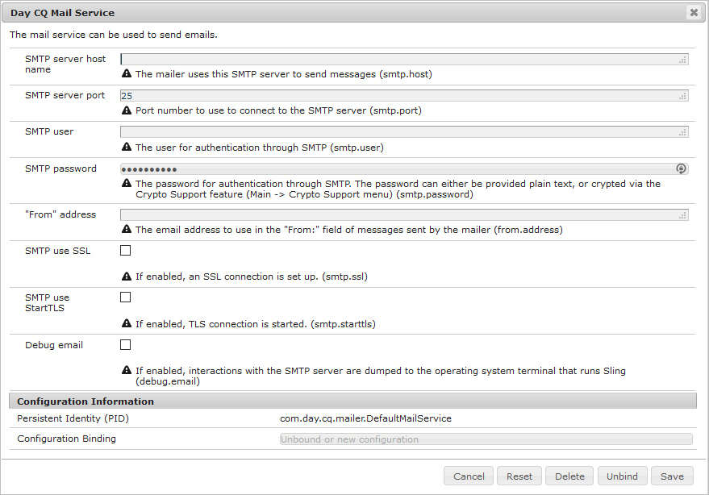

# 配置电子邮件通知{#configuring-email-notification}

AEM会向以下用户发送电子邮件通知：

* 已订阅页面事件，例如修改或复制。 [通知收件箱](/help/sites-classic-ui-authoring/author-env-inbox.md#subscribing-to-notifications)部分介绍如何订阅此类事件。

* 已订阅论坛活动。
* 必须在工作流中执行步骤。 [参与者步骤](/help/sites-developing/workflows-step-ref.md#participant-step)部分介绍如何在工作流中触发电子邮件通知。

先决条件：

* 用户需要在其配置文件中定义有效的电子邮件地址。
* **Day CQ Mail Service**&#x200B;需要正确配置。

当用户收到通知时，他会收到一封电子邮件，其语言为其个人资料中定义的语言。 每种语言都有其自己的可自定义的模板。 可以为新语言添加新的电子邮件模板。

>[!NOTE]
>
>使用AEM时，可通过多种方法来管理此类服务的配置设置；有关更多详细信息和建议的实践，请参阅[配置OSGi](/help/sites-deploying/configuring-osgi.md) 。

## 配置邮件服务{#configuring-the-mail-service}

为了使AEM能够发送电子邮件，需要正确配置&#x200B;**Day CQ Mail Service**。 您可以在Web控制台中查看配置。 使用AEM时，可通过多种方法来管理此类服务的配置设置；有关更多详细信息和建议的实践，请参阅[配置OSGi](/help/sites-deploying/configuring-osgi.md) 。

以下约束适用：

* **SMTP服务器端口**&#x200B;必须为25或更高。

* **SMTP服务器主机名**&#x200B;不能为空。
* **&quot;From&quot;地址**&#x200B;不得为空。

为帮助您调试&#x200B;**Day CQ Mail Service**&#x200B;的问题，您可以查看服务的日志：

`com.day.cq.mailer.DefaultMailService`

配置在Web控制台中如下所示：



## 配置电子邮件通知渠道{#configuring-the-email-notification-channel}

订阅页面或论坛事件通知时，默认情况下，发件人电子邮件地址设置为`no-reply@acme.com`。 您可以通过在Web控制台中配置&#x200B;**通知电子邮件渠道**&#x200B;服务来更改此值。

要配置发件人电子邮件地址，请向存储库添加`sling:OsgiConfig`节点。 使用以下过程直接使用CRXDE Lite添加节点：

1. 在CRXDE Lite中，在应用程序文件夹下添加一个名为`config`的文件夹。
1. 在配置文件夹中，添加一个名为的节点：

   `com.day.cq.wcm.notification.email.impl.EmailChannel` 类型  `sling:OsgiConfig`

1. 将`String`属性添加到名为`email.from`的节点。 对于值，指定要使用的电子邮件地址。

1. 单击&#x200B;**Save All**。

使用以下过程定义内容包源文件夹中的节点：

1. 在`jcr_root/apps/*app_name*/config folder`中创建名为`com.day.cq.wcm.notification.email.impl.EmailChannel.xml`的文件

1. 添加以下XML来表示节点：

   `<?xml version="1.0" encoding="UTF-8"?> <jcr:root xmlns:sling="https://sling.apache.org/jcr/sling/1.0" xmlns:jcr="https://www.jcp.org/jcr/1.0" jcr:primaryType="sling:OsgiConfig" email.from="name@server.com"/>`
1. 将`email.from`属性(`name@server.com`)的值替换为您的电子邮件地址。

1. 保存文件。

## 配置工作流电子邮件通知服务{#configuring-the-workflow-email-notification-service}

当您收到工作流电子邮件通知时，发件人电子邮件地址和主机URL前缀均设置为默认值。 您可以通过在Web控制台中配置&#x200B;**Day CQ工作流电子邮件通知服务**&#x200B;来更改这些值。 如果这样做，建议在存储库中保留所做的更改。

默认配置在Web控制台中如下所示：


### 页面通知{#email-templates-for-page-notification}的电子邮件模板

页面通知的电子邮件模板位于以下位置：

`/etc/notification/email/default/com.day.cq.wcm.core.page`

默认的英语模板(`en.txt`)的定义如下：

```xml
subject=[CQ Page Event Notification]: Page Event

header=-------------------------------------------------------------------------------------\n \
Time: ${time}\n \
User: ${userFullName} (${userId})\n \
-------------------------------------------------------------------------------------\n\n

message=The following pages were affected by the event: \n \
 \n \
${modifications} \n \
 \n\n
footer=\n \
-------------------------------------------------------------------------------------\n \
This is an automatically generated message. Please do not reply.
```

#### 为页面通知自定义电子邮件模板{#customizing-email-templates-for-page-notification}

要自定义页面通知的英语电子邮件模板，请执行以下操作：

1. 在CRXDE中，打开文件：

   `/etc/notification/email/default/com.day.cq.wcm.core.page/en.txt`

1. 根据需要修改文件。
1. 保存更改。

模板需要具有以下格式：

```
 subject=<text_1>
 header=<text_2>
 message=<text_3>
 footer=<text_4>
```

其中&lt;text_x>可以是静态文本和动态字符串变量的混合变量。 可以在电子邮件模板中使用以下变量来发送页面通知：

* `${time}`，事件日期和时间。

* `${userFullName}`，触发事件的用户的全名。

* `${userId}`，触发事件的用户ID。
* `${modifications}`，采用以下格式描述页面事件类型和页面路径：

   &lt;page event=&quot;&quot; type=&quot;&quot;> =>  &lt;page path=&quot;&quot;>

   例如：

   PageModified => /content/geometrixx/en/products

### 论坛通知{#email-templates-for-forum-notification}的电子邮件模板

论坛通知的电子邮件模板位于：

`/etc/notification/email/default/com.day.cq.collab.forum`

默认的英语模板(`en.txt`)的定义如下：

```xml
subject=[CQ Forum Notification]

header=-------------------------------------------------------------------------------------\n \
Time: Time: ${time}\n \
Forum Page Path: ${forum.path}\n \
-------------------------------------------------------------------------------------\n\n

message=Page: ${host.prefix}${forum.path}.html\n

footer=\n \
-------------------------------------------------------------------------------------\n \
This is an automatically generated message. Please do not reply.
```

#### 为论坛通知{#customizing-email-templates-for-forum-notification}自定义电子邮件模板

要自定义论坛通知的英语电子邮件模板，请执行以下操作：

1. 在CRXDE中，打开文件：

   `/etc/notification/email/default/com.day.cq.collab.forum/en.txt`

1. 根据需要修改文件。
1. 保存更改。

模板需要具有以下格式：

```
 subject=<text_1>
 header=<text_2>
 message=<text_3>
 footer=<text_4>
```

其中`<text_x>`可以是静态文本和动态字符串变量的混合变量。

在论坛通知的电子邮件模板中可以使用以下变量：

* `${time}`，事件日期和时间。

* `${forum.path}`，查看论坛页面的路径。

### 工作流通知{#email-templates-for-workflow-notification}的电子邮件模板

工作流通知的电子邮件模板（英文）位于：

`/etc/workflow/notification/email/default/en.txt`

定义如下：

```xml
subject=Workflow notification: ${event.EventType}

header=-------------------------------------------------------------------------------------\n \
Time: ${event.TimeStamp}\n \
Step: ${item.node.title}\n \
User: ${participant.name} (${participant.id})\n \
Workflow: ${model.title}\n \
-------------------------------------------------------------------------------------\n\n

message=Content: ${host.prefix}${payload.path.open}\n

footer=\n \
-------------------------------------------------------------------------------------\n \
View the overview in your ${host.prefix}/aem/inbox\n \
-------------------------------------------------------------------------------------\n \
This is an automatically generated message. Please do not reply.
```

#### 自定义工作流通知{#customizing-email-templates-for-workflow-notification}的电子邮件模板

要自定义工作流事件通知的英语电子邮件模板，请执行以下操作：

1. 在CRXDE中，打开文件：

   `/etc/workflow/notification/email/default/en.txt`

1. 根据需要修改文件。
1. 保存更改。

模板需要具有以下格式：

```
subject=<text_1>
 header=<text_2>
 message=<text_3>
 footer=<text_4>
```

>[!NOTE]
>
>其中`<text_x>`可以是静态文本和动态字符串变量的混合变量。 `<text_x>`项目的每行都需要以反斜杠(`\`)结尾，但最后一个实例除外，因为没有反斜杠表示`<text_x>`字符串变量的结尾。
>
>有关模板格式的详细信息，请参阅Properties.load()](https://docs.oracle.com/javase/8/docs/api/java/util/Properties.html#load-java.io.InputStream-)方法的[javaoc。

方法`${payload.path.open}`显示工作项有效负载的路径。 例如，对于站点中的页面，则`payload.path.open`类似于`/bin/wcmcommand?cmd=open&path=…`。;这没有服务器名称，因此模板会将此名称附加到`${host.prefix}`。

以下变量可在电子邮件模板中使用：

* `${event.EventType}`，事件类型
* `${event.TimeStamp}`、事件的日期和时间
* `${event.User}`，触发事件的用户
* `${initiator.home}`，启动器节点路径

* `${initiator.name}`，启动器名称

* `${initiator.email}`，启动器的电子邮件地址
* `${item.id}`，工作项的id
* `${item.node.id}`，与此工作项关联的工作流模型中节点的id
* `${item.node.title}`，工作项的标题
* `${participant.email}`，参与者的电子邮件地址
* `${participant.name}`、参与者姓名
* `${participant.familyName}`，参与者的姓氏
* `${participant.id}`，参与者的id
* `${participant.language}`，参与者语言
* `${instance.id}`，工作流id
* `${instance.state}`，工作流状态
* `${model.title}`，工作流模型的标题
* `${model.id}`，工作流模型的id

* `${model.version}`，工作流模型的版本
* `${payload.data}`，负载

* `${payload.type}`，有效负载类型
* `${payload.path}`、有效负载路径
* `${host.prefix}`，主机前缀，例如：http://localhost:4502

### 为新语言{#adding-an-email-template-for-a-new-language}添加电子邮件模板

为新语言添加模板：

1. 在CRXDE中，添加下面的文件`<language-code>.txt`:

   * `/etc/notification/email/default/com.day.cq.wcm.core.page` :用于页面通知
   * `/etc/notification/email/default/com.day.cq.collab.forum` :用于论坛通知
   * `/etc/workflow/notification/email/default` :用于工作流通知

1. 使文件适应语言。
1. 保存更改。

>[!NOTE]
>
>`<language-code>`用作电子邮件模板的文件名时，必须是由AEM识别的小写字母语言代码。 对于语言代码，AEM依赖于ISO-639-1。

## 配置AEM Assets电子邮件通知 {#assetsconfig}

在AEM Assets中的收藏集进行共享或取消共享时，用户可以从AEM收到电子邮件通知。 要配置电子邮件通知，请执行以下步骤。

1. 按照上文[配置邮件服务](/help/sites-administering/notification.md#configuring-the-mail-service)中所述配置电子邮件服务。
1. 以管理员身份登录AEM。 单击&#x200B;**工具** > **操作** > **Web控制台**&#x200B;以打开Web控制台配置。
1. 编辑&#x200B;**Day CQ DAM资源收集Servlet**。 选择&#x200B;**发送电子邮件**。 单击&#x200B;**保存**。

## 设置OAuth {#setting-up-oauth}

AEM为其集成的邮件服务提供了OAuth2支持，以便组织能够遵守安全的电子邮件要求。

您可以为多个电子邮件提供商配置OAuth，如下所述。

### Gmail {#gmail}

1. 在`https://console.developers.google.com/projectcreate`创建项目
1. 选择您的项目，然后转到&#x200B;**API和服务** - **功能板 — 凭据**
1. 根据您的要求配置OAuth同意屏幕
1. 在下面的更新屏幕中，添加以下两个范围：
   * `https://mail.google.com/`
   * `https://www.googleapis.com//auth/gmail.send`
1. 添加作用域后，返回到左侧菜单中的&#x200B;**凭据**，然后转到&#x200B;**创建凭据** - **OAuth客户端ID** - **桌面应用程序**
1. 将打开一个包含客户端ID和客户端密钥的新窗口。
1. 保存这些凭据。

**AEM端配置**

>[!NOTE]
>
>Adobe托管服务客户可以与其客户服务工程师合作，对生产环境进行这些更改。

首先，配置邮件服务：

1. 转到`http://serveraddress:serverport/system/console/configMgr`以打开AEM Web控制台
1. 查找，然后单击&#x200B;**Day CQ Mail Service**
1. 添加以下设置：
   * SMTP 服务器主机名: `smtp.gmail.com`
   * SMTP服务器端口：`25`或`587`，具体取决于要求
   * 选中&#x200B;**SMPT使用StarTLS**&#x200B;和&#x200B;**SMTP需要StarTLS**&#x200B;的复选框
   * 检查&#x200B;**OAuth流**&#x200B;并单击&#x200B;**保存**。

接下来，按照以下步骤配置SMTP OAuth提供程序：

1. 转到`http://serveraddress:serverport/system/console/configMgr`以打开AEM Web控制台
1. 查找，然后单击&#x200B;**CQ邮件程序SMTP OAuth2提供程序**
1. 按如下方式填写所需信息：
   * 授权URL:`https://accounts.google.com/o/oauth2/auth`
   * 令牌URL:`https://accounts.google.com/o/oauth2/token`
   * 范围：`https://www.googleapis.com/auth/gmail.send`和`https://mail.google.com/`。 通过按每个已配置范围右侧的&#x200B;**+**&#x200B;按钮，可添加多个范围。
   * 客户端ID和客户端密钥：使用您检索到的值配置这些字段，如上段所述。
   * 刷新令牌 URL: `https://accounts.google.com/o/oauth2/token`
   * 刷新令牌到期：从
1. 单击&#x200B;**保存**。

<!-- clarify refresh token expiry, currrently not present in the UI -->

配置完毕后，设置应如下所示：


现在，激活OAuth组件。 您可以通过以下方式执行此操作：

1. 通过访问以下URL，转到组件控制台：`http://serveraddress:serverport/system/console/components`
1. 查找以下组件
   * `com.day.cq.mailer.oauth.servlets.handler.OAuthCodeGenerateServlet`
   * `com.day.cq.mailer.oauth.servlets.handler.OAuthCodeAccessTokenGenerator`
1. 按组件左侧的播放图标

   

最后，通过以下方式确认配置：

1. 转到发布实例的地址，并以管理员身份登录。
1. 在浏览器中打开新选项卡，然后转到`http://serveraddress:serverport/services/mailer/oauth2/authorize`。 这会将您重定向到SMTP提供程序的页面（在此例中为Gmail）。
1. 登录并同意授予所需权限
1. 同意后，令牌将存储在存储库中。 您可以通过直接访问发布实例上的此URL，在`accessToken`下访问该URL:`http://serveraddress:serverport/crx/de/index.jsp#/conf/global/settings/mailer/oauth2 `
1. 对每个发布实例重复上述步骤

<!-- clarify if the ip/server address in the last procedure is that of the publish instance -->

### Microsoft Outlook {#microsoft-outlook}

1. 转到[https://portal.azure.com/](https://portal.azure.com/)并登录。
1. 在搜索栏中搜索&#x200B;**Azure Active Directory**&#x200B;并单击结果。 或者，您也可以直接浏览到[https://portal.azure.com/#blade/Microsoft_AAD_IAM/ActiveDirectoryMenuBlade/Overview](https://portal.azure.com/#blade/Microsoft_AAD_IAM/ActiveDirectoryMenuBlade/Overview)
1. 单击&#x200B;**应用程序注册** - **新建注册**

   

1. 根据您的要求填写信息，然后单击&#x200B;**Register**
1. 转到新创建的应用程序，然后选择&#x200B;**API权限**
1. 转到&#x200B;**Add Permission** - **Graph Permission** - **Delegated Permissions**
1. 选择您的应用程序的以下权限，然后单击&#x200B;**添加权限**:
   * `SMTP.Send`
   * `Mail.Read`
   * `Mail.Send`
   * `openid`
   * `offline_access`
1. 转到&#x200B;**Authentication** - **添加平台** - **Web**，在&#x200B;**重定向Url**&#x200B;部分中，添加以下用于重定向OAuth代码的URL，然后按&#x200B;**Configure**:
   * `http://localhost:4503/services/mailer/oauth2/token`
1. 对每个发布实例重复上述步骤
1. 根据您的要求配置设置
1. 接下来，转到&#x200B;**Certificates and Secrets**，单击&#x200B;**New client secret**，然后按照屏幕上的步骤创建密钥。 请务必注意此密码，供以后使用
1. 在左窗格中按&#x200B;**Overview**，并复制&#x200B;**应用程序（客户端）ID**&#x200B;和&#x200B;**目录（租户）ID**&#x200B;的值，以供以后使用

要重新查看，您需要以下信息在AEM端为邮件程序服务配置OAuth2:

* 身份验证URL，将使用租户ID构建。 它将具有以下表单：`https://login.microsoftonline.com/<tenantID>/oauth2/v2.0/authorize`
* 令牌URL，将使用租户ID构建。 它将具有以下表单：`https://login.microsoftonline.com/<tenantID>/oauth2/v2.0/token`
* 刷新URL，将使用租户ID构建。 它将具有以下表单：`https://login.microsoftonline.com/<tenantID>/oauth2/v2.0/token`
* 客户端ID
* 客户端密钥

**AEM端配置**

接下来，将OAuth2设置与AEM集成：

1. 通过浏览到`http://serveraddress:serverport/system/console/configMgr`，转到本地实例的Web控制台
1. 查找并单击&#x200B;**Day CQ Mail Service**
1. 添加以下设置：
   * SMTP 服务器主机名: `smtp.office365.com`
   * SMTP用户：您的用户名采用电子邮件格式
   * “发件人”地址：邮件发送者发送的邮件的“发件人：”字段中使用的电子邮件地址
   * SMTP服务器端口：`25`或`587`，具体取决于要求
   * 选中&#x200B;**SMPT使用StarTLS**&#x200B;和&#x200B;**SMTP需要StarTLS**&#x200B;的复选框
   * 检查&#x200B;**OAuth流**&#x200B;并单击&#x200B;**保存**。
1. 查找，然后单击&#x200B;**CQ邮件程序SMTP OAuth2提供程序**
1. 按如下方式填写所需信息：
   * 按照[此过程结束时的](#microsoft-outlook)所述，通过构建授权URL、令牌URL和刷新令牌URL来填写它们
   * 客户端ID和客户端密钥：使用如上所述的检索值配置这些字段。
   * 将以下作用域添加到配置中：
      * openid
      * offline_access
      * `https://outlook.office365.com/Mail.Send`
      * `https://outlook.office365.com/Mail.Read`
      * `https://outlook.office365.com/SMTP.Send`
   * 身份验证代码重定向Url:`http://localhost:4503/services/mailer/oauth2/token`
   * 刷新令牌URL:此URL的值应与上面的令牌URL的值相同
1. 单击&#x200B;**保存**。

配置完毕后，设置应如下所示：


现在，激活OAuth组件。 您可以通过以下方式执行此操作：

1. 通过访问以下URL，转到组件控制台：`http://serveraddress:serverport/system/console/components`
1. 查找以下组件
   * `com.day.cq.mailer.oauth.servlets.handler.OAuthCodeGenerateServlet`
   * `com.day.cq.mailer.oauth.servlets.handler.OAuthCodeAccessTokenGenerator`
1. 按组件左侧的播放图标


最后，通过以下方式确认配置：

1. 转到发布实例的地址，并以管理员身份登录。
1. 在浏览器中打开新选项卡，然后转到`http://serveraddress:serverport/services/mailer/oauth2/authorize`。 这会将您重定向到SMTP提供程序的页面（在此例中为Gmail）。
1. 登录并同意授予所需权限
1. 同意后，令牌将存储在存储库中。 您可以通过直接访问发布实例上的此URL，在`accessToken`下访问该URL:`http://serveraddress:serverport/crx/de/index.jsp#/conf/global/settings/mailer/oauth2 `