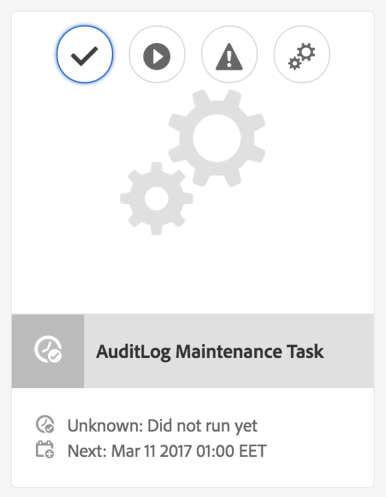

# AEM 6中的审核日志维护{#audit-log-maintenance-in-aem}

符合审核日志记录条件的AEM事件会生成大量存档数据。 由于复制、资产上传和其他系统活动，这些数据会随着时间的推移而快速增长。

审核日志维护包括若干部分功能，利用这些功能，可自动执行特定策略下的审核日志维护。

它是作为可配置的每周维护任务实施的，可通过Operations Dashboard监控控制台访问。

有关详细信息，请参阅[操作功能板文档](/help/sites-administering/operations-dashboard.md)。

有三种类型的“审核日志清除”选项：

1. [页面审核日志清除](/help/sites-administering/operations-audit-log.md#configure-page-audit-log-purging)
1. [DAM审核日志清除](/help/sites-administering/operations-audit-log.md#configure-dam-audit-log-purging)
1. [复制审核日志过程](/help/sites-administering/operations-audit-log.md#configure-replication-audit-log-purging)

每种规则都可以通过在AEM Web控制台中创建规则来配置。 配置完它们后，您可以通过转到&#x200B;**工具 — 操作 — 维护 — 每周维护时段**&#x200B;并运行&#x200B;**审核日志维护任务**&#x200B;来触发它们。

## 配置页面审计日志清除 {#configure-page-audit-log-purging}

按照以下步骤配置审计日志清除：

1. 将您的浏览器指向`http://localhost:4502/system/console/configMgr/`，转到Web控制台管理员

1. 搜索名为&#x200B;**页面审核日志清除规则**&#x200B;的项目并单击它。

   

1. 接下来，根据您的要求配置清除计划程序。 可用的选项为：

   * **规则名称：**&#x200B;审核策略规则的名称；
   * **内容路径：**&#x200B;规则将应用到的内容的路径；
   * **最短保留时间：**&#x200B;需要保留审核日志的时间（以天为单位）；
   * **审核日志类型：**&#x200B;应清除的审核日志类型。

   >[!NOTE]
   >
   >内容路径仅适用于存储库中`/var/audit/com.day.cq.wcm.core.page`节点的子节点。

1. 保存规则。
1. 您创建的规则需要在“操作仪表板”中公开才能执行。 为此，请从AEM欢迎屏幕中转到&#x200B;**工具 — 操作 — 维护**。

1. 按&#x200B;**每周维护时段**&#x200B;卡。

1. 您会发现&#x200B;**AuditLog维护任务**&#x200B;信息卡下已存在该维护任务。

   

1. 您可以检查下一次执行的日期、配置该日期，或通过按播放按钮手动执行该日期。

在AEM 6.3中，如果计划维护窗口在审核日志清除任务完成之前关闭，则该任务会自动停止。 当下一个维护窗口打开时，它将恢复。

**使用AEM 6.5**，您可以通过单击&#x200B;**停止**&#x200B;图标来手动停止正在运行的审核日志清除任务。 在下一次执行时，任务将安全地恢复。

>[!NOTE]
>
>停止维护任务意味着暂停其执行，而不会丢失已在进行的作业的跟踪。

## 配置DAM审核日志清除 {#configure-dam-audit-log-purging}

1. 导航到位于&#x200B;*https://&lt;serveraddress>：&lt;serverport>/system/console/configMgr*&#x200B;的系统控制台
1. 搜索&#x200B;**DAM审核日志清除**&#x200B;规则并单击结果。
1. 在下一个窗口中，相应地配置规则。 选项包括：

   * **规则名称：**&#x200B;审核策略规则的名称；
   * **内容路径：**&#x200B;规则将应用于的内容的路径
   * **最短保留时间：**&#x200B;需要保留审核日志的时间（以天为单位）
   * **审核日志DAM事件类型：**&#x200B;应清除的DAM审核事件类型。

1. 单击&#x200B;**保存**&#x200B;以保存您的配置

## 配置复制审核日志清除  {#configure-replication-audit-log-purging}

1. 导航到位于&#x200B;*https://&lt;serveraddress>：&lt;serverport>/system/console/configMgr*&#x200B;的系统控制台
1. 搜索&#x200B;**复制审核日志清除计划程序**&#x200B;并单击结果
1. 在下一个窗口中，相应地配置规则。 选项包括：

   * **规则名称：**&#x200B;审核策略规则的名称
   * **内容路径：**&#x200B;规则将应用于的内容的路径
   * **最短保留时间：**&#x200B;需要保留审核日志的时间（以天为单位）
   * **审核日志复制事件类型：**&#x200B;应清除的复制审核事件类型

1. 单击&#x200B;**保存**&#x200B;以保存您的配置。
