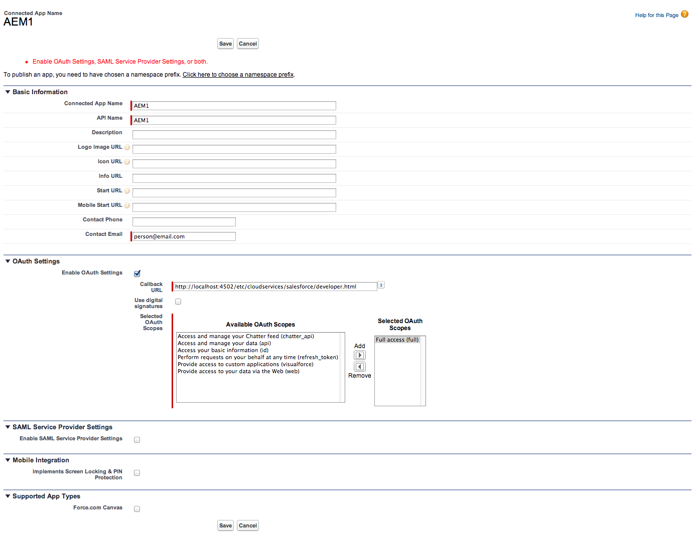
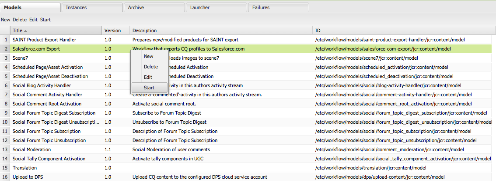

# 与Salesforce集成 {#integrating-with-salesforce}

将Salesforce与Adobe Experience Manager (AEM)集成提供了商机管理功能，并使用Salesforce提供的现成功能。 您可以配置AEM将潜在客户发布到Salesforce，并创建直接从Salesforce访问数据的组件。

AEM与Salesforce之间的双向可扩展集成可实现：

* 组织可充分利用和修改数据以提升客户体验。
* 从营销活动到销售活动的参与。
* 用于自动从Salesforce数据存储区传输和接收数据的组织。

本文档将介绍以下内容：

* 如何配置SalesforceCloud Service(配置AEM以与Salesforce集成)。
* 如何在Client Context中使用Salesforce潜在客户/联系人信息进行个性化。
* 如何使用Salesforce工作流模型将AEM用户作为潜在客户发布到Salesforce。
* 如何创建一个显示Salesforce中数据的组件。

## 配置AEM以与Salesforce集成 {#configuring-aem-to-integrate-with-salesforce}

要配置AEM以与Salesforce集成，首先需要在Salesforce中配置远程访问应用程序。 然后，将Salesforce云服务配置为指向此远程访问应用程序。

>[!NOTE]
>
>您可以在Salesforce中创建免费的开发人员帐户。

要配置AEM以与Salesforce集成，请执行以下操作：

>[!CAUTION]
>
>安装 [Salesforce Api](https://experience.adobe.com/#/downloads/content/software-distribution/en/aem.html?fulltext=salesforce*&amp;orderby=%40jcr%3Acontent%2Fjcr%3AlastModified&amp;orderby.sort=desc&amp;layout=list&amp;p.offset=0&amp;p.limit=2&amp;package=%2Fcontent%2Fsoftware-distribution%2Fen%2Fdetails.html%2Fcontent%2Fdam%2Faem%2Fpublic%2Fadobe%2Fpackages%2Fcq650%2Ffeaturepack%2Fcom.adobe.cq.mcm.salesforce.content-1.0.4.zip) 集成包。 有关如何使用包的更多详细信息，请参阅 [如何使用包](/help/sites-administering/package-manager.md#package-share) 页面。

1. 在AEM中，导航到 **Cloud Service**. 在第三方服务中，单击 **立即配置** 在 **Salesforce**.

   

1. 创建配置，例如， **开发人员**.

   >[!NOTE]
   >
   >新配置将重定向到新页面： **http://localhost:4502/etc/cloudservices/salesforce/developer.html**. 这与在Salesforce中创建远程访问应用程序时必须在回调URL中指定的值完全相同。 这些值必须匹配。

1. 登录到您的Salesforce帐户(或者如果您没有帐户，请在 [https://developer.salesforce.com](https://developer.salesforce.com).)
1. 在Salesforce中，导航到 **创建** > **应用程序** 以访问 **连接的应用程序** (在以前版本的Salesforce中，工作流是 **部署** > **远程访问**)。
1. 单击 **新建** 以便将AEM与Salesforce连接起来。

   

1. 输入 **连接的应用程序名称**， **API名称**、和 **联系人电子邮件**. 选择 **启用OAuth设置** 复选框，然后输入 **回调URL** 并添加OAuth范围（例如，完全访问）。 回调URL类似于： `http://localhost:4502/etc/cloudservices/salesforce/developer.html`

   更改服务器名称/端口号和页面名称以匹配您的配置。

   

1. 单击 **保存** 以保存Salesforce配置。 Salesforce创建 **消费方密钥** 和 **消费方密码**，您需要使用该配置文件来配置AEM。

   

   >[!NOTE]
   >
   >等待几分钟（最多15分钟）以激活Salesforce中的远程访问应用程序。

1. 在AEM中，导航到 **Cloud Service** 并导航到您之前创建的Salesforce配置(例如， **开发人员**)。 单击 **编辑** 并输入salesforce.com中的客户密钥和客户密钥。

   

   | 登录 Url | 这是Salesforce授权端点。 其值是预填充的，适用于大多数情况。 |
   |---|---|
   | 客户密钥 | 输入从salesforce.com中的“远程访问应用程序注册”页获得的值 |
   | 客户密码 | 输入从salesforce.com中的“远程访问应用程序注册”页获得的值 |

1. 单击 **连接到Salesforce** 以连接。 Salesforce请求允许配置连接到Salesforce。

   

   在AEM中，将打开一个确认对话框，告诉您已成功连接。

1. 导航到网站的根页面，然后单击 **页面属性**. 然后选择 **Cloud Service** 并添加 **Salesforce** 并选择正确的配置(例如， **开发人员**)。

   

   现在，您可以使用工作流模型将潜在客户发布到Salesforce，并创建从Salesforce访问数据的组件。

## 将AEM用户导出为Salesforce潜在客户 {#exporting-aem-users-as-salesforce-leads}

如果要将AEM用户导出为Salesforce潜在客户，请配置工作流以将潜在客户发布到Salesforce。

要将AEM用户导出为Salesforce潜在客户，请执行以下操作：

1. 导航到Salesforce工作流，网址为 `http://localhost:4502/workflow` 通过右键单击工作流 **Salesforce.com导出** 并单击 **开始**.

   

1. 选择要创建为潜在客户的AEM用户，作为 **有效负荷** （主页 — >用户）。 请确保选择用户的配置文件节点，因为它包含如下信息 **givenName**、和  **familyName**，映射到Salesforce潜在客户的 **名字** 和 **姓氏** 字段。

   

   >[!NOTE]
   >
   >在开始此工作流之前，AEM中的潜在客户节点在发布到Salesforce之前必须填写某些必填字段。 这些是 **givenName**， **familyName**， **公司**、和 **电子邮件**. 要查看AEM用户与Salesforce潜在客户之间的完整映射列表，请参阅 [在AEM用户和Salesforce潜在客户之间映射配置。](#mapping-configuration-between-aem-user-and-salesforce-lead)

1. 单击&#x200B;**确定**。用户信息将导出到salesforce.com。 您可以在salesforce.com中进行验证。

   >[!NOTE]
   >
   >错误日志显示是否导入了商机。 有关详细信息，请查看错误日志。

### 配置Salesforce.com导出工作流 {#configuring-the-salesforce-com-export-workflow}

如有必要，请配置Salesforce.com导出工作流以使其与正确的Salesforce.com配置匹配，或进行其他更改。

要配置Salesforce.com导出工作流，请执行以下操作：

1. 导航至 `http://localhost:4502/cf#/etc/workflow/models/salesforce-com-export.html.`

   

1. 打开Salesforce.com导出步骤，选择 **参数** 选项卡，然后选择正确的配置并单击 **确定**. 此外，如果您希望工作流重新创建在Salesforce中删除的潜在客户，请选中复选框。

   

1. 单击 **保存** 以保存更改。

   

### AEM用户和Salesforce潜在客户之间的映射配置 {#mapping-configuration-between-aem-user-and-salesforce-lead}

要查看或编辑AEM用户与Salesforce潜在客户之间的当前映射配置，请打开Configuration Manager： `https://<hostname>:<port>/system/console/configMgr` 和搜索 **Salesforce潜在客户映射配置**.

1. 通过单击打开配置管理器 **Web控制台** 或直接转到 `https://<hostname>:<port>/system/console/configMgr.`
1. 搜索 **Salesforce潜在客户映射配置**.

   

1. 根据需要更改映射。 缺省映射遵循该模式 **aemUserAttribute=sfLeadAttribute**. 单击 **保存** 以保存更改。

## 配置Salesforce客户端上下文存储 {#configuring-salesforce-client-context-store}

Salesforce客户端上下文存储显示有关当前登录用户的附加信息，而不是在AEM中已有的信息。 它会根据用户与Salesforce之间的连接从Salesforce中提取此附加信息。

为此，请配置以下内容：

1. 通过Salesforce连接组件将AEM用户与Salesforce ID关联。
1. 将Salesforce配置文件数据添加到客户端上下文页面，以便您可以配置要查看的属性。
1. （可选）构建一个使用Salesforce Client Context Store中数据的区段。

### 将AEM用户与Salesforce ID关联 {#linking-an-aem-user-with-a-salesforce-id}

使用Salesforce ID映射AEM用户，以便在客户端上下文中加载该ID。 在真实情景中，您将基于已知用户数据与验证进行关联。 出于演示目的，在此过程中，您使用 **Salesforce连接** 组件。

1. 导航到AEM中的网站并登录，然后拖放 **Salesforce连接** Sidekick中的组件。

   >[!NOTE]
   >
   >如果 **Salesforce连接** 组件不可用，请转到 **设计** 查看并选择它以使其在 **编辑** 视图。

   

   将组件拖动到页面时，该组件将显示 **链接到Salesforce=Off**.

   

   >[!NOTE]
   >
   >此组件仅用于演示目的。 对于真实情景，将有另一个流程将用户与潜在客户关联起来/匹配。

1. 在页面上拖动组件后，请打开该组件以对其进行配置。 选择配置、联系人类型以及Salesforce潜在客户或联系人，然后单击 **确定**.

   

   AEM将用户与Salesforce联系人或商机关联起来。

   

### 将Salesforce数据添加到客户端上下文 {#adding-salesforce-data-to-client-context}

您可以在Client Context中从Salesforce加载用户数据以用于个性化：

1. 通过导航到要扩展的客户端上下文来打开它，例如， `http://localhost:4502/etc/clientcontext/default/content.html.`

   

1. 拖动 **Salesforce个人资料数据** 组件添加到客户端上下文。

   

1. 双击组件以将其打开。 选择 **添加项目** 并从下拉列表中选择一个资产。 添加所需数量的属性并选择 **确定**.

   

1. 现在，您会在客户端上下文中看到Salesforce中特定于Salesforce的属性。

   

### 使用Salesforce Client Context Store中的数据构建区段 {#building-a-segment-using-data-from-salesforce-client-context-store}

您可以构建一个使用Salesforce Client Context Store中数据的区段。 要执行此操作：

1. 通过转到，导航到AEM中的分段 **工具** > **分段** 或者将要 [http://localhost:4502/miscadmin#/etc/segmentation](http://localhost:4502/miscadmin#/etc/segmentation).
1. 创建或更新区段以包含来自Salesforce的数据。 有关更多信息，请参阅 [分段](/help/sites-administering/campaign-segmentation.md).

## 搜索潜在客户 {#searching-leads}

AEM附带了一个示例搜索组件，该组件根据给定的条件在Salesforce中搜索潜在客户。 此组件向您展示如何使用Salesforce REST API搜索Salesforce对象。 要触发对salesforce.com的调用，请链接具有Salesforce配置的页面。

>[!NOTE]
>
>这是一个示例组件，向您展示了如何使用Salesforce REST API查询Salesforce对象。 以为例，根据您的需求创建更复杂的组件。

要使用此组件，请执行以下操作：

1. 导航到要使用此配置的页面。 打开页面属性并选择 **Cloud Service。** 单击 **添加服务** 并选择 **Salesforce** 以及相应的配置，然后单击 **确定**.

   

1. 将Salesforce搜索组件拖动到页面（前提是已启用该组件）。 要启用该功能，请转到“设计”模式并将其添加到相应的区域)。

   

1. 打开搜索组件并指定搜索参数，然后单击 **好的。**

   

1. AEM显示搜索组件中指定的符合指定条件的潜在客户。

   
