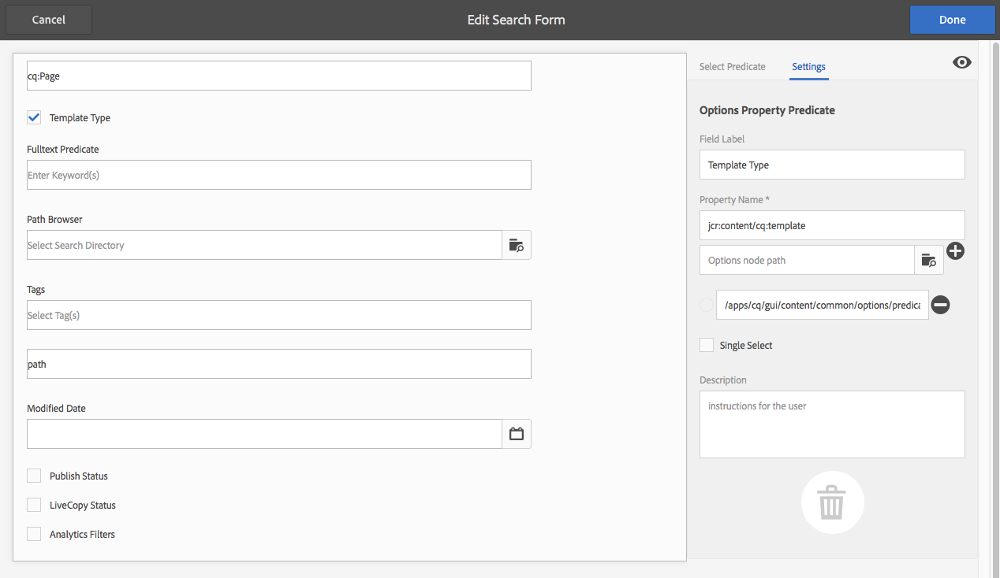

# 配置搜索表单{#configuring-search-forms}

使用 **搜尋Forms** 自訂搜尋述詞的選擇，這些述詞用於作者環境的各種AEM主控台和/或面板中可用的搜尋面板。 自訂這些面板可讓搜尋功能根據您的特定需求而通用。

A [述詞範圍](#predicates-and-their-settings)s是現成可用的。 您可以新增多個述詞，包括（其中包括）「屬性」述詞以搜尋符合您指定的單一屬性的資產，或「選項」述詞以搜尋符合您為特定屬性指定的一或多個值的資產。

您可以 [設定搜尋表單](#configuring-your-search-forms) 用於各種主控台和資產瀏覽器（編輯頁面時）。 此 [用於設定這些表單的對話方塊](#configuring-your-search-forms) 可透過以下方式存取：

* **工具**

   * **常规**

      * **搜索表单**

第一次存取此主控台時，您可以看到所有設定都有掛鎖符號。 這表示適當的設定是預設（現成可用）設定 — 並且不能刪除。 一旦您自訂了設定，鎖定就會消失 — 除非您 [刪除您的自訂設定](#deleting-a-configuration-to-reinstate-the-default)，則系統會恢復預設值（和掛鎖指標）。

## 配置 {#configurations}

可用的預設設定包括：

* **頁面編輯器（檔案搜尋）：**

   此設定會定義在資產瀏覽器中搜尋檔案時（編輯頁面時）可用的選項。

* **頁面編輯器（影像搜尋）：**

   此設定會定義在資產瀏覽器中搜尋影像時（編輯頁面時）可用的選項。

* **頁面編輯器（手稿搜尋）：**

   此設定會定義在資產瀏覽器中搜尋手稿時（編輯頁面時）可用的選項。

* **頁面編輯器（頁面搜尋）：**

   此設定會定義在資產瀏覽器中搜尋頁面時（編輯頁面時）可用的選項。

* **頁面編輯器（段落搜尋）：**

   此設定會定義在資產瀏覽器中搜尋段落時（編輯頁面時）可用的選項。

* **頁面編輯器（產品搜尋）：**

   此設定會定義在資產瀏覽器中搜尋產品時（編輯頁面時）可用的選項。

* **頁面編輯器(Dynamic Media Classic) [先前稱為Scene7] search)**：

   此設定會定義在資產瀏覽器中搜尋Scene7資源（編輯頁面時）時可用的選項。

* **站点管理员搜索边栏**:

   此設定會定義使用者在使用Sites主控台的搜尋邊欄時可用的搜尋選項。

* **頁面編輯器（視訊搜尋）：**

   此設定會定義在資產瀏覽器中搜尋視訊時（編輯頁面時）可用的選項。

* **资产管理员搜索边栏:**

   此設定會定義使用者在使用Assets控制檯時可用的搜尋選項。

* **目录管理员搜索边栏:**

   此設定會定義使用者在搜尋商務目錄時可使用的搜尋選項。

* **订单管理员搜索边栏:**

   此設定會定義使用者在搜尋商務訂單時可用的搜尋選項。

* **产品收藏集管理员搜索边栏:**

   此設定會定義使用者在搜尋商務產品集合時可用的搜尋選項。

* **产品管理员搜索边栏:**

   此設定會定義使用者在搜尋商務產品時可用的搜尋選項。

* **项目管理员搜索边栏:**

   此設定會定義使用者在搜尋專案時可用的搜尋選項。

## 述詞及其設定 {#predicates-and-their-settings}

### 述詞 {#predicates}

視設定而定，以下述詞可供使用：

<table>
 <tbody>
  <tr>
   <th>谓词</th>
   <th>用途</th>
   <th>设置</th>
  </tr>
  <tr>
   <td>分析 </td>
   <td>顯示Analytics支援的資料時，可在Sites瀏覽器中搜尋/篩選功能。 Analytics搜尋篩選器會載入以符合對應的自訂分析欄。</td>
   <td>
    <ul>
     <li>字段标签</li>
     <li>描述</li>
    </ul> </td>
  </tr>
  <tr>
   <td>上次修改的资源 </td>
   <td>上次修改資產的日期。  </td>
   <td>根據日期述詞的自訂述詞。</td>
  </tr>
  <tr>
   <td>组件 </td>
   <td>允許作者搜尋/篩選上面有特定元件的頁面。 例如，影像庫。  </td>
   <td>
    <ul>
     <li>字段标签</li>
     <li>占位符</li>
     <li>属性名称*</li>
     <li>属性深度</li>
     <li>描述</li>
    </ul> </td>
  </tr>
  <tr>
   <td>日期 </td>
   <td>根據日期屬性的資產滑桿式搜尋。</td>
   <td>
    <ul>
     <li>字段标签</li>
     <li>属性名称*</li>
     <li>描述</li>
    </ul> </td>
  </tr>
  <tr>
   <td>日期范围 </td>
   <td>搜尋在指定範圍內建立的資產，以取得日期屬性。 在「搜尋」面板中，您可以指定「開始」和「結束」日期。</td>
   <td>
    <ul>
     <li>字段标签</li>
     <li>占位符</li>
     <li>属性名称*</li>
     <li>範圍文字（從）*</li>
     <li>範圍文字（至）*</li>
     <li>描述</li>
    </ul> </td>
  </tr>
  <tr>
   <td>到期状态 </td>
   <td>根據到期狀態搜尋資產。</td>
   <td>
    <ul>
     <li>字段标签</li>
     <li>属性名称*</li>
     <li>描述</li>
    </ul> </td>
  </tr>
  <tr>
   <td>檔案大小 </td>
   <td>根據資產的大小來搜尋資產。</td>
   <td>
    <ul>
     <li>字段标签</li>
     <li>属性名称*</li>
     <li>选项路径</li>
     <li>描述</li>
    </ul> </td>
  </tr>
  <tr>
   <td>隐藏的筛选器</td>
   <td>屬性與值的篩選器，使用者看不到。</td>
   <td>
    <ul>
     <li>属性名称</li>
     <li>属性值</li>
     <li>描述</li>
    </ul> </td>
  </tr>
  <tr>
   <td>选项 </td>
   <td>
選項是由使用者建立的內容節點。
 
另請參閱 <a href="#addinganoptionspredicate">新增選項述詞</a> 以取得詳細資訊。
 </td>
   <td>
    <ul>
     <li>字段标签</li>
     <li>JSON 路径</li>
     <li>属性名称*</li>
     <li>单选</li>
     <li>选项路径</li>
     <li>描述</li>
    </ul> </td>
  </tr>
  <tr>
   <td>选项 属性 </td>
   <td>搜尋選項的屬性。</td>
   <td>
    <ul>
     <li>字段标签</li>
     <li>属性名称*</li>
     <li>选项节点路径  </li>
     <li>单选</li>
     <li>描述</li>
    </ul> </td>
  </tr>
  <tr>
   <td>页面状态 </td>
   <td>根據頁面狀態來搜尋頁面。</td>
   <td>
    <ul>
     <li>字段标签</li>
     <li>发布属性名称</li>
     <li>LiveCopy 属性名称</li>
     <li>描述</li>
    </ul> </td>
  </tr>
  <tr>
   <td>路径 </td>
   <td>搜尋位於特定路徑下的資產。</td>
   <td>
    <ul>
     <li>字段标签</li>
     <li>新增搜尋路徑</li>
     <li>描述</li>
    </ul> </td>
  </tr>
  <tr>
   <td>属性 </td>
   <td>搜尋指定的屬性。</td>
   <td>无</td>
  </tr>
  <tr>
   <td>發佈狀態 </td>
   <td>根據資產的發佈狀態搜尋資產</td>
   <td>
    <ul>
     <li>字段标签</li>
     <li>属性名称*</li>
     <li>描述</li>
    </ul> </td>
  </tr>
  <tr>
   <td>范围 </td>
   <td>搜尋位於指定範圍內的資源。 在「搜尋」面板中，您可以指定範圍的最小值和最大值。</td>
   <td>
    <ul>
     <li>字段标签</li>
     <li>属性名称</li>
     <li>描述</li>
    </ul> </td>
  </tr>
  <tr>
   <td>范围选项 </td>
   <td>資產的特定搜尋述詞，與常用的滑桿述詞相同。 由於回溯相容性問題，仍可使用。</td>
   <td>
    <ul>
     <li>字段标签</li>
     <li>属性名称*</li>
     <li>选项路径</li>
     <li>描述</li>
    </ul> </td>
  </tr>
  <tr>
   <td>评分 </td>
   <td>根據資產評等搜尋資產。  </td>
   <td>
    <ul>
     <li>字段标签</li>
     <li>属性名称*</li>
     <li>选项路径</li>
     <li>描述</li>
    </ul> </td>
  </tr>
  <tr>
   <td>相对日期 </td>
   <td>根據資產的相對建立日期搜尋資產  </td>
   <td>
    <ul>
     <li>字段标签</li>
     <li>属性名称*</li>
     <li>相对日期</li>
     <li>描述</li>
    </ul> </td>
  </tr>
  <tr>
   <td>滑块范围 </td>
   <td>使用滑桿功能擴充範圍述詞的常見搜尋述詞。 搜尋的屬性值必須介於滑桿限制之間。</td>
   <td>
    <ul>
     <li>字段标签</li>
     <li>属性名称*</li>
     <li>描述</li>
    </ul> </td>
  </tr>
  <tr>
   <td>标记 </td>
   <td>根據標籤搜尋資產。 您可以設定Path屬性以填入Tags清單中的各種標籤。</td>
   <td>
    <ul>
     <li>字段标签</li>
     <li>属性名称*</li>
     <li>选项路径</li>
     <li>描述</li>
    </ul> </td>
  </tr>
  <tr>
   <td>标记 </td>
   <td>根據標籤進行搜尋。</td>
   <td>
    <ul>
     <li>占位符</li>
     <li>属性名称*</li>
     <li>描述</li>
    </ul> </td>
  </tr>
 </tbody>
</table>

>[!NOTE]
>
>* 常見的搜尋述詞定義於：
   >  `/libs/cq/gui/components/common/admin/customsearch/searchpredicates`
>
>* 僅與Siteadmin （傳統UI）相關的搜尋述詞位於以下位置：
   >  `/libs/cq/gui/components/siteadmin/admin/searchpanel/searchpredicates`
   >   * 這些功能已過時，僅供回溯相容性使用。
>
>此資訊僅供參考，您不得對下列專案進行變更 `/libs`.

### 述詞設定 {#predicate-settings}

視述詞而定，有多種設定可供設定：

* **字段标签**

   將顯示為可摺疊標題或述詞欄位標籤的標籤。

* **描述**

   使用者的描述性詳細資料。

* **占位符**

   空白文字或述詞的預留位置（若未輸入篩選文字）。

* **属性名称**

   要搜尋的屬性。 它使用相對路徑和萬用字元 `*/*/*` 指定屬性相對於的深度 `jcr:content` 節點（每個星號代表一個節點層級）。

   如果您只想搜尋具有下列專案的資源之第一層子節點： `x` 上的屬性 `jcr:content` 節點使用 `*/jcr:content/x`

* **属性深度**

   在資源中搜尋該屬性的最大深度。 因此，可針對資源及遞回子系執行該屬性的搜尋，直到子系層級等於指定的深度為止。

* **属性值**

   作為絕對字串或作為運算式語言的屬性值；例如， `cq:Page` 或

   `${empty requestPathInfo.suffix ? "/content" : requestPathInfo.suffix}`。

* **範圍文字**

   中範圍欄位的標籤 **日期範圍** 述詞。

* **选项路径**

   使用者可以使用述詞設定索引標籤中的路徑瀏覽器來選取路徑。 選取 **+** 圖示可將選取專案新增至有效選項清單(然後 **-** 圖示以視需要移除)。

   選項是使用者建立的內容節點，結構如下：

   `(jcr:primaryType = nt:unstructured, value (String), jcr:title (String))`

* **選項節點路徑**
實際上與 
**選項路徑**，只有這個在「通用述詞」欄位中，其他則專用於資產。

* **單選**
如果勾選，這些選項會呈現為僅允許單一選取的核取方塊。 若誤選，可取消選取核取方塊。

* **發佈和即時副本屬性名稱**
網站特定述詞的發佈和即時副本核取方塊的標籤。

* &amp;ast；在中的欄位標籤上 **設定** tab表示欄位為必填，如果留空，將顯示錯誤訊息

## 設定搜尋Forms {#configuring-your-search-forms}

### 建立/開啟自訂組態 {#creating-opening-a-customized-configuration}

1. 導覽至 **工具**， **一般**， **搜尋Forms**.

1. 選取您要自訂的設定。
1. 使用 **編輯** 圖示以開啟設定以進行更新。
1. 如果新的自訂專案，您可能想要 [新增述詞欄位並定義設定](#add-edit-a-predicate-field-and-define-field-settings) 視需要。 如果存在現有的自訂，您可以選取現有的欄位和 [更新設定](#add-edit-a-predicate-field-and-define-field-settings).
1. 選取 **完成** 以儲存設定。

   >[!NOTE]
   >
   >自訂的設定會視情況儲存在：
   >
   >* `/apps/cq/gui/content/facets/<option>`
   >* `/apps/commerce/gui/content/facets/<option>`

### 新增/編輯述詞欄位和定義欄位設定 {#add-edit-a-predicate-field-and-define-field-settings}

您可以新增或編輯欄位，以及定義/更新其設定：

1. [開啟自訂設定](#creating-opening-a-customized-configuration) 以進行更新。
1. 如果您想要新增欄位，請開啟 **選取述詞** 定位並拖曳所需的述詞至所需的位置。 例如， **日期範圍述詞**：

   

1. 視以下情況而定：

   * 您正在新增欄位：

      新增述詞後 **設定** 標籤會開啟並顯示可定義的屬性。

   * 您要更新現有的述詞：

      選取述詞欄位（在右側），然後開啟 **設定** 標籤。
   例如， **日期範圍述詞**：

   

1. 視需要進行變更，並確認： **完成**.

### 預覽搜尋組態 {#previewing-the-search-configuration}

1. 選取「預覽」圖示：

   

1. 如此將顯示搜尋表單，如同它們在適當主控台的「搜尋」欄中顯示（完全展開）一樣。

   

1. **關閉** 預覽以傳回並完成設定。

### 刪除述詞欄位 {#deleting-a-predicate-field}

1. [開啟自訂設定](#creating-opening-a-customized-configuration) 以進行更新。
1. 選取述詞欄位（在右側），開啟 **設定** 標籤，然後選取 **刪除** 圖示（左下方）。

   

1. 對話方塊會要求確認刪除動作。

1. 確認此變更和任何其他變更，透過 **完成**.

### 刪除組態（恢復預設值） {#deleting-a-configuration-to-reinstate-the-default}

自訂設定後，這將覆蓋預設值。 您可以刪除自訂的設定，以重新指出預設設定。

>[!NOTE]
>
>您無法刪除任一預設設定。

從主控台刪除自訂設定完成：

1. 選取所需的設定(例如， **頁面編輯器（段落搜尋）**)，然後按一下 **刪除** 圖示：

   

1. 自訂的設定將會刪除並恢復預設設定（這由主控台中掛鎖符號的重新出現表示）。

### 新增選項述詞 {#adding-options-predicates}

選項述詞（選項、選項屬性）可讓您設定要搜尋的專案。 它們通常用於搜尋頁面正下方的內容；例如，頁面節點上的屬性。

以下範例（根據用來建立頁面的範本進行搜尋）說明了相關步驟：

1. 建立定義要搜尋之屬性的節點。

   您需要一個根節點，其中包含使用者可用的個別選項定義。

   個別選項的節點需要屬性：

   * `jcr:title`  — 搜尋邊欄中顯示的欄位標籤
   * `value`  — 要搜尋的屬性值

   

   >[!NOTE]
   >
   >您 ***必須*** 不變更中的任何專案 `/libs` 路徑。
   >
   >這是因為 `/libs` 下次升級執行個體時會被覆寫（而您在套用hotfix或feature pack時很可能會被覆寫）。
   >
   >設定和其他變更的建議方法是：
   >
   >1. 重新建立必要專案，因為它存在於中 `/libs`，下 `/apps`. 在此範例中，來自：
   >1. `/libs/cq/gui/content/common/options/predicates`
   >1. 進行任何變更 `/apps.`

1. 開啟 **搜尋Forms** 控制檯並選取您要更新的設定。 例如， **網站管理搜尋邊欄**.

   然後按一下/點選 **編輯搜尋表單** 圖示。

1. 視設定而定，新增 **選項** 或 **Options屬性** 至設定。
1. 更新欄位，特別是：

   * **属性名称**

      指定要在目標節點上搜尋的節點屬性。 例如：

      `jcr:content/cq:template`

   * **選項節點路徑**

      選取保留選項的路徑。 例如：

      `/apps/cq/gui/content/common/options/predicates/templatetype`
   

1. 選取 **完成** 以儲存您的設定。
1. 導覽至適當的主控台(在此範例中， **網站**)並開啟 **搜尋** 邊欄。 將顯示新定義的搜尋表單以及各種選項。 選取必要選項以檢視搜尋結果：

   

## 用户权限 {#user-permissions}

下表列出對搜尋表單執行編輯、刪除和預覽動作所需的許可權。

<table>
 <tbody>
  <tr>
   <td><strong>操作</strong></td>
   <td><strong>权限</strong></td>
  </tr>
  <tr>
   <td>编辑 </td>
   <td>的讀取、寫入許可權 <code>/apps </code>節點。</td>
  </tr>
  <tr>
   <td>删除</td>
   <td>對的讀取、寫入、刪除許可權 <code>/apps</code> 節點</td>
  </tr>
  <tr>
   <td>预览</td>
   <td>對的讀取、寫入、刪除許可權 <code>/var/dam/content</code> 節點。  的讀取、寫入許可權 <code>/apps</code> 節點。</td>
  </tr>
 </tbody>
</table>
