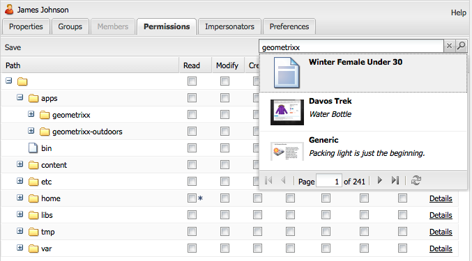

# 用户管理与安全性{#user-administration-and-security}

本章介绍如何配置和维护用户授权，并阐述 AEM 中身份验证和授权的工作原理。

## AEM 中的用户和组 {#users-and-groups-in-aem}

本节将更详细地说明各类实体和相关概念，以帮助您设计一个易于维护的用户管理方案。

### 用户 {#users}

用户使用其帐户登录 AEM。每个用户帐户都是唯一的，并包含基本的帐户信息以及分配的权限。

用户通常是组的成员，而组可以简化权限和/或特权的分配。

### 组 {#groups}

组是用户、其他组或两者的集合。这些集合统称为组的成员。

其主要目的是通过减少需要更新的实体数量来简化维护流程，因为对组所做的更改会应用到该组的所有成员。组通常反映以下情况：

* 应用程序中的角色，例如仅允许浏览内容的用户，或允许贡献内容的用户。
* 您的组织；您可能希望扩展角色，以区分来自不同部门的贡献者，并在他们被限制于内容树的不同分支时加以管理。

因此，组通常保持稳定，而用户的进出更为频繁。

通过合理规划并设置清晰的结构，使用组可以很好地映射您的组织结构，为您提供清晰的概览和高效的更新机制。

### 内置用户和组 {#built-in-users-and-groups}

AEM WCM 会安装多个用户和组。在安装完成后首次访问安全控制台时，您会看到这些集合。

下表列出了每个条目及其内容：

* 简要说明
* 有关必要更改的建议

*请更改所有默认密码*（如果未在某些情况下删除该帐户本身）。

<table>
 <tbody>
  <tr>
   <td>用户 ID</td>
   <td>类型</td>
   <td>描述</td>
   <td>推荐</td>
  </tr>
  <tr>
   <td>
admin
 
默认密码：admin
 </td>
   <td>用户</td>
   <td>
具有完全访问权限的系统管理帐户。
 
此帐户用于 AEM WCM 与 CRX 之间的连接。
 
如果您不小心删除了该帐户，它在存储库重新启动时（默认设置下）会自动重新创建。
 
管理员帐户是 AEM 平台的必需帐户。因此，该帐户不能删除。
 </td>
   <td>
Adobe 建议您更改此用户帐户的默认密码。
 
最好在安装时完成，也可以在安装后进行。
 
注意：请勿将此帐户与 CQ Servlet Engine 的管理员帐户混淆。
 </td>
  </tr>
  <tr>
   <td>
anonymous
 
 
 </td>
   <td>用户</td>
   <td>
拥有对实例进行未经身份验证的访问的默认权限。默认情况下，该帐户仅具备最低访问权限。
 
如果您不小心删除了该帐户，它会在启动时重新创建。该帐户无法被永久删除，但可以禁用。
 </td>
   <td>请避免删除或禁用此帐户，否则会对作者实例的正常运行产生负面影响。如果出于安全要求必须删除，请务必先充分测试该帐户对系统的影响。</td>
  </tr>
  <tr>
   <td>
author
 
默认密码：author
 </td>
   <td>用户</td>
   <td>
允许向 /content 写入的作者帐户。包含贡献者和浏览者的权限。
 
由于可以访问整个 /content 树，该帐户也可用作网站管理员。
 
此帐户不是内置用户，而是另一个 Geometrixx 演示用户。
 </td>
   <td>
Adobe 建议或者彻底删除该帐户，或者更改其默认密码。
 
最好在安装时完成，也可以在安装后进行。
 </td>
  </tr>
  <tr>
   <td>administrators</td>
   <td>组</td>
   <td>
此组为所有成员授予管理员权限。只有管理员可以编辑该组。
 
拥有完整访问权限。
 </td>
   <td>即使您在某个节点上设置了“拒绝所有人”，管理员仍可访问该节点</td>
  </tr>
  <tr>
   <td>content-authors</td>
   <td>组</td>
   <td>
负责内容编辑的组。需要读取、修改、创建和删除权限。
 </td>
   <td>您可以创建自己的 content-authors 组，并为其设置项目特定访问权限，只要为其添加读取、修改、创建和删除权限即可。</td>
  </tr>
  <tr>
   <td>contributor</td>
   <td>组</td>
   <td>
允许用户撰写内容的基本权限（即仅限于实现基本功能所需的权限）。
 
不授予访问 /content 树本身的任何权限。这些权限必须专门分配给特定的组或用户。
 </td>
   <td> </td>
  </tr>
  <tr>
   <td>dam-users</td>
   <td>组</td>
   <td>典型 AEM Assets 用户的开箱即用参考组。该组成员具有相应权限，可上传/共享资产和收藏集。</td>
   <td> </td>
  </tr>
  <tr>
   <td>everyone</td>
   <td>组</td>
   <td>
AEM 中的每个用户都是 everyone 组的成员，即使您可能在所有工具中看不到该组或成员关系。
 
该组可视为默认权限组，因为它可以用于为所有用户应用权限，其中甚至包括将来新创建的用户。
 </td>
   <td>
请勿修改或删除此组。
 
修改此帐户会带来额外的安全隐患。
 </td>
  </tr>
  <tr>
   <td>tag-administrators</td>
   <td>组</td>
   <td>允许编辑标记的组。</td>
   <td> </td>
  </tr>
  <tr>
   <td>user-administrators</td>
   <td>组</td>
   <td>授权进行用户管理，即创建用户和组的权限。</td>
   <td> </td>
  </tr>
  <tr>
   <td>workflow-editors</td>
   <td>组</td>
   <td>允许创建和修改工作流模型的组。</td>
   <td> </td>
  </tr>
  <tr>
   <td>workflow-users</td>
   <td>组</td>
   <td>
参与工作流的用户必须是 workflow-users 组的成员。该组为用户提供对 /etc/workflow/instances 的完全访问权限，以便他们能够更新工作流实例。
 
该组包含在标准安装中，但您需要手动将用户添加到该组中。
 </td>
  </tr>
 </tbody>
</table>

## AEM 中的权限 {#permissions-in-aem}

AEM 使用 ACL 来确定用户或组可以执行哪些操作，以及在何处执行这些操作。

### 权限和 ACL {#permissions-and-acls}

权限定义了谁可以对资源执行哪些操作。这些权限是对[访问控制](#access-control-lists-and-how-they-are-evaluated)评估的结果。

您可以通过选择或清除单个 AEM [操作](security.md#actions)的复选框，来更改授予/拒绝某用户的权限。复选标记表示允许该操作。没有复选标记则表示拒绝该操作。

复选标记在权限网格中的位置还表示用户在 AEM 内部哪些位置（即路径）具有什么权限。

### 操作 {#actions}

操作可以在页面（资源）上执行。对于层级中的每个页面，您都可以指定是否允许该用户在该页面上执行某个操作。[权限](#permissions-and-acls)可用于允许或拒绝某一操作。

<table>
 <tbody>
  <tr>
   <td><strong>操作 </strong></td>
   <td><strong>描述 </strong></td>
  </tr>
  <tr>
   <td>读取</td>
   <td>用户可以读取该页面及其任何子页面。</td>
  </tr>
  <tr>
   <td>修改</td>
   <td>
用户可以：

    <ul>
     <li>修改页面及其任何子页面上的现有内容。</li>
     <li>在页面或任何子页面上创建段落。</li>
    </ul> 
在 JCR 层级，用户可以通过编辑属性、加锁、版本控制和 nt-modifications 来编辑资源，并且对定义了 jcr:content 子节点的节点具有完整写入权限。例如：cq:Page、nt:file、cq:Asset。
 </td>
  </tr>
  <tr>
   <td>创建</td>
   <td>
用户可以：

    <ul>
     <li>创建页面或子页面。</li>
    </ul> 
如果<strong>修改</strong>被拒绝，则会排除 jcr:content 下的子树，因为创建 jcr:content 及其子节点被视为页面修改。此规则仅适用于定义了 jcr:content 子节点的节点。
 </td>
  </tr>
  <tr>
   <td>删除</td>
   <td>
用户可以：

    <ul>
     <li>从页面或子页面中删除现有段落。</li>
     <li>删除页面或子页面。</li>
    </ul> 
如果<strong>修改</strong>被拒绝，则会排除 jcr:content 下的子树，因为移除 jcr:content 及其子节点被视为页面修改。此规则仅适用于定义了 jcr:content 子节点的节点。
 </td>
  </tr>
  <tr>
   <td>读取 ACL</td>
   <td>用户可以读取页面或子页面的访问控制列表。</td>
  </tr>
  <tr>
   <td>编辑 ACL</td>
   <td>用户可以修改页面或子页面的访问控制列表。</td>
  </tr>
  <tr>
   <td>复制</td>
   <td>用户可以将内容复制到其他环境（例如发布环境）。该权限同样适用于任何子页面。</td>
  </tr>
 </tbody>
</table>

>[!NOTE]
>
>AEM 会在[收藏集](/help/assets/manage-collections.md)中自动生成用户组，以用于角色分配（所有者、编辑者、查看者）。但是，为这些组手动添加 ACL 可能会在 AEM 内部引入安全漏洞。Adobe 建议您避免手动添加 ACL。

### 访问控制列表及其评估方式 {#access-control-lists-and-how-they-are-evaluated}

AEM WCM 使用访问控制列表（ACL）来组织应用于各个页面的权限。

访问控制列表由单个权限组成，用于确定这些权限的应用顺序。该列表根据所涉及页面的层级生成。然后，系统会自下而上扫描此列表，直到找到适用于某页面的第一个合适权限为止。

>[!NOTE]
>
>示例中包含了一些 ACL。建议您进行审查，并确定哪些适合您的应用程序。要查看这些包含的 ACL，请前往 **CRXDE** 并选择以下节点的&#x200B;**访问控制**&#x200B;选项卡：
>
>* `/etc/cloudservices`
>* `/home/users/we-retail`
>
>您的自定义应用程序可能会为其他关系设置访问权限，例如：
>
>* `*/social/relationships/friend/*`
>* 或 `*/social/relationships/pending-following/*`。
>
>当您为社区创建特定的 ACL 时，加入这些社区的成员可能会获得额外权限。例如，当用户加入以下社区时：`/content/we-retail/us/en/community`

### 权限状态 {#permission-states}

>[!NOTE]
>
>针对 CQ 5.3 用户：
>
>与之前的 CQ 版本不同，如果用户仅需修改页面，则不应再授予&#x200B;**创建**&#x200B;和&#x200B;**删除**&#x200B;权限。相反，仅当您希望用户能够在现有页面上创建、修改或删除组件时，才应授予&#x200B;**修改**&#x200B;操作。
>
>出于向后兼容的考虑，操作测试不会考虑对定义了 **jcr:content** 节点的特殊处理。

| **操作** | **描述** |
|---|---|
| 允许（复选标记） | AEM WCM 允许用户在此页面或任何子页面上执行该操作。 |
| 拒绝（无复选标记） | AEM WCM 不允许用户在此页面或任何子页面上执行该操作。 |

这些权限同样适用于所有子页面。

如果某权限不是从父节点继承的，但至少有一个本地条目，则会在复选框中附加以下符号。本地条目是在 CRX 2.2 界面中创建的（目前通配符 ACL 只能在 CRX 中创建）。

对于指定路径上的某个操作：

<table>
 <tbody>
  <tr>
   <td>*（星号）</td>
   <td>至少存在一个本地条目（有效或无效）。这些通配符 ACL 在 CRX 中定义。</td>
  </tr>
  <tr>
   <td>！（感叹号）</td>
   <td>至少存在一个当前无效的条目。</td>
  </tr>
 </tbody>
</table>

当您将鼠标悬停在星号或感叹号上时，会显示一个工具提示，其中会提供有关已声明条目的更多信息。工具提示分为两部分：

<table>
 <tbody>
  <tr>
   <td>上半部分</td>
   <td>
列出有效条目。
 </td>
  </tr>
  <tr>
   <td>下半部分</td>
   <td>列出无效条目，这些条目可能在树的其他位置生效（由相应 ACE 中的特殊属性指明，用于限制条目的作用范围）。或者，它表示某个条目已被在该路径或父节点上定义的其他条目撤销。</td>
  </tr>
 </tbody>
</table>

>[!NOTE]
>
>如果未为某个页面定义权限，则所有操作都会被拒绝。

以下是管理访问控制列表的建议：

* 请勿将权限直接分配给用户。仅将它们分配给组。

  这样可以简化维护，因为组的数量远小于用户数量，且相对更稳定。

* 如果您希望某个组/用户只能修改页面，请不要授予其创建或拒绝权限。只需授予修改和读取权限即可。
* 谨慎使用“拒绝”。尽量只使用“允许”。

  如果权限的应用顺序与预期不同，使用“拒绝”可能会导致产生意外结果。当用户属于多个组时，一个组中的拒绝声明可能会抵消另一个组中的允许声明，反之亦然。在这种情况下很难保持整体清晰，并且容易导致不可预见的结果，而“允许”分配则不会引发此类冲突。

  Adobe 建议您尽量使用“允许”而非“拒绝”，请参阅[最佳做法](#best-practices)。

在修改任何权限之前，请务必了解其工作方式及相互关系。请参阅 CRX 文档，其中说明了 AEM WCM 如何[评估访问权限](/help/sites-administering/user-group-ac-admin.md#how-access-rights-are-evaluated)，并提供了设置访问控制列表的示例。

### 权限 {#permissions}

权限为用户和组提供在 AEM 页面上使用 AEM 功能的访问权。

您可以通过展开/折叠节点按路径浏览权限，并可追踪权限继承，直至根节点。

您可以通过选中或清除相应复选框来允许或拒绝权限。

### 查看详细的权限信息 {#viewing-detailed-permission-information}

除了网格视图，AEM 还为指定路径下的选定用户或用户组提供详细的权限视图。详细视图会显示更多补充信息。

除了查看信息外，您还可以将当前用户或用户组加入某个组，或将其移出组。请参阅[在添加权限时添加用户或组](#adding-users-or-groups-while-adding-permissions)。在此处所做的更改会立即反映在详细视图的上半部分。

要访问详细视图，请在&#x200B;**权限**&#x200B;选项卡中，针对任意已选定的组/用户及路径，单击&#x200B;**详细信息**。

详细信息分为两部分：

<table>
 <tbody>
  <tr>
   <td>上半部分</td>
   <td>
重复显示您在树形网格中看到的信息。对于每个操作，图标都会指示该操作是被允许还是被拒绝：

    <ul>
     <li>无图标 = 未声明条目</li>
     <li>（勾选）= 已声明操作（允许）</li>
     <li>（-）= 已声明操作（拒绝）</li>
    </ul> </td>
  </tr>
  <tr>
   <td>下半部分</td>
   <td>
显示用户和组网格，其作用如下：

    <ul>
     <li>在指定路径下声明了条目，并且</li>
     <li>是指定的可授权对象，或是一个组</li>
    </ul> </td>
  </tr>
 </tbody>
</table>

### 模拟其他用户 {#impersonating-another-user}

通过[模拟功能](/help/sites-authoring/user-properties.md#user-settings)，用户可以代表另一位用户执行操作。

也就是说，一个用户帐户可以指定其他帐户以其身份进行操作。例如，如果允许用户 B 模拟用户 A，那么用户 B 就可以使用用户 A 的完整帐户信息进行操作。

此功能允许模拟帐户像被模拟帐户一样完成任务。例如，可在用户缺席期间或短期分担过重工作量时使用。

>[!NOTE]
>
>若要使非管理员用户能够执行模拟操作，模拟者（上述示例中的用户 B）必须在 `/home/users` 路径下拥有读取权限。
>
>请参阅 [AEM 中的权限](/help/sites-administering/security.md#permissions-in-aem)。

>[!CAUTION]
>
>当一个帐户模拟另一个帐户时，通常不易被发现。当模拟开始和结束时，会在审核日志中记录条目，但其他日志文件（如访问日志）不会记录发生过模拟事件的信息。因此，如果用户 B 在模拟用户 A，所有事件看起来都像是由用户 A 执行的。

>[!CAUTION]
>
>模拟用户身份时可以执行页面锁定。不过，以这种方式锁定的页面只能由被模拟的用户本人，或具有管理员权限的用户解锁。
>
>无法通过模拟锁定页面的用户的身份来解锁页面。

### 最佳做法 {#best-practices}

以下为处理权限和特权时的最佳做法：

| 规则 | 原因 |
|--- |--- |
| *使用组* | 避免逐一为单个用户分配访问权限。之所以建议这样做，原因有以下几点：<ul><li>系统中用户数量远多于用户组，使用组可以简化结构。</li><li>组有助于全面了解所有帐户。</li> <li>继承关系在组中更为简单。</li><li>用户会进进出出。而组则具有长期性。</li></ul> |
| *保持正向* | 尽量通过“允许”语句来指定组的权限。避免使用“拒绝”语句。组是按顺序评估的，并且每个用户的顺序可能不同。换句话说：您可能无法完全控制语句的实施和评估顺序。如果仅使用“允许”语句，顺序便无关紧要。 |
| *保持简洁* | 在配置新安装时投入一些时间和精力是值得的。应用清晰的结构能简化后续维护与管理，确保您当前的同事和未来继任者都能轻松理解已实施的配置。 |
| *测试* | 使用测试安装进行练习，以确保您理解不同用户和组之间的关系。 |
| *默认用户/组* | 安装完成后，请务必立即更新默认用户和组，以帮助避免任何安全问题。 |

## 管理用户和组 {#managing-users-and-groups}

用户包括使用系统的人员，以及向系统发出请求的外部系统。

组是一组用户的集合。

两者都可以通过“安全控制台”中的用户管理功能进行配置。

### 通过安全控制台访问用户管理 {#accessing-user-administration-with-the-security-console}

您可以使用安全控制台访问所有用户、组及其相关权限。本节所述的所有程序均在此窗口中完成。

要访问 AEM WCM 安全性，请执行以下任一操作：

* 在 AEM 欢迎屏幕或其他位置，单击安全图标：

* 直接导航至 `https://<server>:<port>/useradmin`。请确保您以管理员身份登录 AEM。

随后会显示以下窗口：

左侧树状结构列出了系统中当前的所有用户和组。您可以选择要显示的列，对列内容进行排序，甚至可以通过将列标题拖动到新位置来更改列的显示顺序。

这些选项卡提供了对各种配置的访问：

<!-- ??? in table below. -->

| 选项卡 | 描述 |
|--- |--- |
| 筛选条件框 | 用于筛选列出的用户、组或两者兼有的机制。请参阅[筛选用户和组](#filtering-users-and-groups)。 |
| 隐藏用户 | 切换开关，可隐藏所有列出的用户，仅显示组。请参阅[隐藏用户和组](#hiding-users-and-groups)。 |
| 隐藏组 | 切换开关，可隐藏所有列出的组，仅显示用户。请参阅[隐藏用户和组](#hiding-users-and-groups)。 |
| 编辑 | 菜单，可用于创建和删除用户或组，以及激活和停用它们。请参阅[创建用户和组](#creating-users-and-groups)以及[删除用户和组](#deleting-users-and-groups)。 |
| 属性 | 列出用户或组的信息，包括电子邮件信息、描述和名称等。还允许您更改用户密码。请参阅[创建用户和组](#creating-users-and-groups)、[修改用户和组属性](#modifying-user-and-group-properties)以及[更改用户密码](#changing-a-user-password)。 |
| 组 | 列出所选用户或组所属的所有组。您可以将所选用户或组分配到其他组，或将其从组中移除。请参阅[组](#adding-users-or-groups-to-a-group)。 |
| 成员 | 仅适用于组。列出特定组的成员。请参阅[成员](#members-adding-users-or-groups-to-a-group)。 |
| 权限 | 您可以为用户或组分配权限。可控制以下内容：<ul><li>与特定页面/节点相关的权限。请参阅[设置权限](#setting-permissions)。 </li><li>与页面创建和删除及层级修改相关的权限。??? 允许您[分配特权](#settingprivileges)，例如层级修改，以创建和删除页面，</li><li>与[复制特权](#setting-replication-privileges)相关的权限（通常是从创作环境到发布环境），依据路径进行分配。</li></ul> |
| 模拟者 | 允许其他用户模拟该帐户。当您需要某个用户代表另一用户执行操作时非常有用。请参阅[模拟用户](#impersonating-another-user)。 |
| 首选项 | 设置[用户或组的首选项](#setting-user-and-group-preferences)。例如，语言首选项。 |

### 筛选用户和组 {#filtering-users-and-groups}

您可以通过输入筛选表达式来筛选列表，从而隐藏所有与该表达式不匹配的用户和组。您还可以使用[隐藏用户和隐藏组](#hiding-users-and-groups)按钮来隐藏用户和组。

筛选用户或组的方法：

1. 在左侧树状列表中，在提供的空间内键入您的筛选表达式。例如，输入 **admin** 将显示所有包含该字符串的用户和组。
1. 单击放大镜来筛选列表。

   

1. 当您要移除所有筛选条件时，请单击 **x**。

### 隐藏用户和组 {#hiding-users-and-groups}

隐藏用户或组是过滤系统中所有用户和组列表的另一种方式。此功能提供两种切换机制。单击“隐藏用户”将会从视图中隐藏所有用户，单击“隐藏组”将会从视图中隐藏所有组（您不能同时隐藏用户和组）。如需通过筛选表达式筛选列表，请参阅[筛选用户和组](#filtering-users-and-groups)。

隐藏用户和组的方法：

1. 在&#x200B;**安全**&#x200B;控制台中，单击&#x200B;**隐藏用户**&#x200B;或&#x200B;**隐藏组**。所选按钮会显示为高亮状态。

   

1. 如需重新显示用户或组，请再次单击相应按钮。

### 创建用户和组 {#creating-users-and-groups}

要创建用户或组：

1. 在&#x200B;**安全**&#x200B;控制台的树状列表中，单击&#x200B;**编辑**，然后选择&#x200B;**创建用户**&#x200B;或&#x200B;**创建组**。

   

1. 根据您要创建的是用户或者组，输入所需的详细信息。

   * 如果选择&#x200B;**创建用户，**&#x200B;则需输入登录 ID、名字和姓氏、电子邮件地址以及密码。默认情况下，AEM 会根据姓氏的首字母创建路径，但您也可以选择其他路径。

   

   * 如果选择&#x200B;**创建组**，则需输入组 ID 和可选的描述信息。

   

1. 单击&#x200B;**创建**。您创建的用户或组会显示在树状列表中。

### 删除用户和组 {#deleting-users-and-groups}

要删除用户或组：

1. 在&#x200B;**安全**&#x200B;控制台中，选择要删除的用户或组。如果要删除多个条目，请按住 Shift 单击或按住 Ctrl 单击进行选择。
1. 单击&#x200B;**编辑，**&#x200B;然后选择删除。AEM WCM 会询问您是否要删除该用户或组。
1. 单击&#x200B;**确定**&#x200B;以确认，或单击取消。

### 修改用户和组属性 {#modifying-user-and-group-properties}

要修改用户和组属性：

1. 在&#x200B;**安全**&#x200B;控制台中，双击要修改的用户或组名称。

1. 单击&#x200B;**属性**&#x200B;选项卡，进行所需更改，然后单击&#x200B;**保存**。

   

>[!NOTE]
>
>用户的路径会显示在用户属性的底部，该路径无法修改。

### 更改用户密码 {#changing-a-user-password}

请按照以下程序修改用户密码。

>[!NOTE]
>
>您无法使用安全控制台更改管理员密码。要更改管理员帐户的密码，请使用 Granite Operations 提供的[用户控制台](/help/sites-administering/granite-user-group-admin.md#changing-the-password-for-an-existing-user)。
>
>如果您使用的是 JEE 上的 AEM Forms，请不要按照以下说明更改密码，而应使用JEE 上的 AEM Forms Admin Console（/adminui）修改密码。

1. 在&#x200B;**安全**&#x200B;控制台中，双击要更改密码的用户名。
1. 单击&#x200B;**属性**&#x200B;选项卡（如果尚未处于活动状态）。
1. 单击&#x200B;**设置密码**。系统会打开“设置密码”窗口，您可以在此更改密码。

   

1. 输入新密码两次；由于不会以明文显示，因此该操作是为了确认输入是否一致——如果两次输入不一致，系统会显示错误。
1. 单击&#x200B;**设置**&#x200B;以启用该帐户的新密码。

### 将用户或用户组添加到组 {#adding-users-or-groups-to-a-group}

AEM 提供三种方式将用户或组添加到现有组：

* 当您处于组页面时，可以添加成员（用户或组）。
* 当您处于成员页面时，可以将成员添加到组中。
* 当您处理权限时，可以将成员添加到组中。

### 组——将用户或组添加到组 {#groups-adding-users-or-groups-to-a-group}

**组**&#x200B;选项卡显示当前帐户所属的组。您可以使用它将所选帐户添加到某个组：

1. 双击要分配到组的帐户（用户或组）名称。
1. 单击&#x200B;**组**&#x200B;选项卡。您将看到该帐户已属于的组列表。
1. 在树状列表中，单击要添加到帐户的组名称，并将其拖动到&#x200B;**组**&#x200B;窗格中。（如果要添加多个用户，请按住 Shift 单击或按住 Ctrl 单击这些名称并进行拖动。）

   

1. 单击&#x200B;**保存**&#x200B;以保存更改。

### 成员——将用户或组添加到组 {#members-adding-users-or-groups-to-a-group}

**成员**&#x200B;选项卡仅适用于组，用于显示属于当前组的用户和组。您可以使用它将帐户添加到组中：

1. 双击要向其中添加成员的组名称。
1. 单击&#x200B;**成员**&#x200B;选项卡。您将看到已属于该组的成员列表。
1. 在树状列表中，单击要添加到组的成员名称，并将其拖动到&#x200B;**成员**&#x200B;窗格中。（如果要添加多个用户，请按住 Shift 单击或按住 Ctrl 单击这些名称并进行拖动。）

   

1. 单击&#x200B;**保存**&#x200B;以保存更改。

### 在添加权限时添加用户或组 {#adding-users-or-groups-while-adding-permissions}

要在特定路径下向组添加成员：

1. 双击您希望添加用户的组或用户名称。

1. 单击&#x200B;**权限**&#x200B;选项卡。

1. 导航至您希望添加权限的路径，并单击&#x200B;**详细信息**。详细信息窗口的下半部分会显示哪些用户拥有该页面的权限。

   

1. 在&#x200B;**成员**&#x200B;列中选中您希望拥有该路径权限的成员复选框。取消选中要移除权限的成员复选框。您更改过的单元格中会显示一个红色三角形。
1. 单击&#x200B;**确定**&#x200B;以保存更改。

### 从组中移除用户或组 {#removing-users-or-groups-from-groups}

AEM 提供三种方式将用户或组从现有组中移除：

* 当您处于组轮廓中时，可以移除成员（用户或组）。
* 当您处于成员轮廓中时，可以将成员从组中移除。
* 当您处理权限时，可以将成员从组中移除。

### 组——从组中移除用户或组 {#groups-removing-users-or-groups-from-groups}

要将用户或组帐户从组中移除：

1. 双击您希望从组中移除的组或用户帐户名称。
1. 单击&#x200B;**组**&#x200B;选项卡。您将看到所选帐户所属的组。
1. 在&#x200B;**组**&#x200B;窗格中，单击要从组中移除的用户或组名称，然后单击&#x200B;**移除**。（如果要移除多个帐户，请按住 Shift 单击或按住 Ctrl 单击这些名称并单击&#x200B;**移除**。）

   

1. 单击&#x200B;**保存**&#x200B;以保存更改。

### 成员——从组中移除用户或组 {#members-removing-users-or-groups-from-groups}

要将帐户从组中移除：

1. 双击您希望移除成员的组的名称。
1. 单击&#x200B;**成员**&#x200B;选项卡。您将看到已属于该组的成员列表。
1. 在&#x200B;**成员**&#x200B;窗格中，单击要从组中移除的成员名称，然后单击&#x200B;**移除**。（如果要移除多个用户，请按住 Shift 单击或按住 Ctrl 单击这些名称并单击&#x200B;**移除**。）

   

1. 单击&#x200B;**保存**&#x200B;以保存更改。

### 在添加权限时移除用户或组 {#removing-users-or-groups-while-adding-permissions}

要在特定路径下将成员从组中移除：

1. 双击您希望移除用户的组或用户名。

1. 单击&#x200B;**权限**&#x200B;选项卡。

1. 导航至您希望移除权限的路径，并单击&#x200B;**详细信息**。详细信息窗口的下半部分会显示哪些用户拥有该页面的权限。

   

1. 在&#x200B;**成员**&#x200B;列中选中您希望拥有该路径权限的成员复选框。取消选中要移除权限的成员复选框。您更改过的单元格中会显示一个红色三角形。
1. 单击&#x200B;**确定**&#x200B;以保存更改。

### 用户同步 {#user-synchronization}

当部署为[发布场](/help/sites-deploying/recommended-deploys.md#tarmk-farm)时，必须在所有发布节点之间同步用户和组。

要了解用户同步及其启用方法，请参阅[用户同步](/help/sites-administering/sync.md)。

## 管理权限 {#managing-permissions}

>[!NOTE]
>
>Adobe 推出了一个基于触控 UI 的新主体视图，用于管理权限。有关如何使用该视图的详细信息，请参阅[权限管理的主体视图](/help/sites-administering/touch-ui-principal-view.md)。

本节将介绍如何设置权限，包括复制特权。

### 设置权限 {#setting-permissions}

权限允许用户在特定路径下对资源执行某些操作。它还包括创建或删除页面的能力。

要添加、修改或删除权限：

1. 在&#x200B;**安全**&#x200B;控制台中，双击要为其设置权限的用户或组名称，或[搜索节点](#searching-for-nodes)。

1. 单击&#x200B;**权限**&#x200B;选项卡。

   

1. 在树状网格中，选中复选框可允许所选用户或组执行某个操作，清除复选框则可拒绝该用户或组执行该操作。要了解更多信息，请单击&#x200B;**详细信息**。

1. 完成后，单击&#x200B;**保存**。

### 设置复制权限 {#setting-replication-privileges}

复制权限是发布内容的权利，可以为组或用户设置。

>[!NOTE]
>
>* 授予组的任何复制权限都会应用于该组中的所有用户。
>* 单个用户的复制权限优先于组的复制权限。
>* “允许”复制权限的优先级高于“拒绝”复制权限。有关更多信息，请参阅 [AEM 中的权限](#permissions-in-aem)。
>

要设置复制权限：

1. 从列表中选择用户或组，双击以打开，然后单击&#x200B;**权限**。
1. 在网格中，导航到希望用户拥有复制权限的路径，或[搜索节点](#searching-for-nodes)。

1. 在所选路径的&#x200B;**复制**&#x200B;列中，选中复选框可为该用户或组添加复制权限，清除复选框则可移除复制权限。AEM 会在尚未保存更改的位置显示红色三角形。

   

1. 单击&#x200B;**保存**&#x200B;以保存更改。

### 搜索节点 {#searching-for-nodes}

在添加或移除权限时，您可以浏览节点，也可以搜索节点。

路径搜索有两种类型：

* 路径搜索——如果搜索字符串以 “/” 开头，则会搜索指定路径下的直接子节点：

在搜索框中，您可以执行以下操作：

| 操作 | 作用 |
|--- |--- |
| 右箭头键 | 选择搜索结果中的子节点 |
| 下箭头键 | 重新开始搜索。 |
| Enter（返回）键 | 选择子节点并将其加载到树状网格中 |

* 全文搜索——如果搜索字符串不是以 “/” 开头，则会在 “/content” 路径下的所有节点上执行全文搜索。

要执行路径搜索或全文搜索：

1. 在安全控制台中，选择一个用户或组，然后单击&#x200B;**权限**&#x200B;选项卡。

1. 在搜索框中输入要搜索的词语。

### 模拟用户 {#impersonating-users}

您可以指定一个或多个用户来模拟当前用户。此功能意味着他们可以将自己的帐户设置切换为当前用户的帐户设置，并代表该用户执行操作。

请谨慎使用此功能，因为它可能会让用户执行其自身帐户无法执行的操作。在模拟用户时，系统会通知他们当前并非以自己的身份登录。

您可能会在以下各个场景中使用此功能，包括：

* 如果您不在办公室，可以让其他人在您离开期间模拟您的身份。通过使用此功能，您可以确保他人拥有与您相同的访问权限，而无需修改用户轮廓或泄露密码。
* 您也可以将其用于调试目的。例如，查看具有受限访问权限的用户在网站上的实际体验。此外，如果某个用户报告技术问题，您可以模拟该用户来诊断并解决问题。

要模拟现有用户：

1. 在树状列表中，选择您希望为其分配模拟用户的人员姓名。双击以打开。
1. 点击&#x200B;**模拟者**&#x200B;选项卡。
1. 单击您希望能够模拟所选用户的用户。将该用户（模拟者）从列表拖动到“模拟者”窗格中。该姓名会显示在列表中。

   

1. 单击&#x200B;**保存**。

### 设置用户和组首选项 {#setting-user-and-group-preferences}

要设置用户和组的首选项（包括语言、窗口管理和工具栏首选项）：

1. 在左侧树状结构中选择您要更改首选项的用户或组。要选择多个用户或组，请使用按住 Ctrl 单击或按住 Shift 单击您的选择。
1. 点击&#x200B;**首选项**&#x200B;选项卡。

   

1. 根据需要更改组或用户的首选项，完成后单击&#x200B;**保存**。

### 为用户或管理员设置管理其他用户的权限 {#setting-users-or-administrators-to-have-the-privilege-to-manage-other-users}

要为用户或管理员授予删除/启用/停用其他用户的权限：

1. 将您希望授予管理其他用户权限的用户添加到管理员组中，然后保存更改。

   

1. 在用户的&#x200B;**权限**&#x200B;选项卡中，导航到“/”，然后在“复制”列中选中复选框以允许在 “/” 执行复制操作，并单击&#x200B;**保存**。

   

   此时，所选用户即可停用、启用、删除和创建用户。

### 在项目层面扩展权限 {#extending-privileges-on-a-project-level}

如果您计划实施特定于应用程序的权限，以下信息说明了在 CQ 中实施自定义权限及其强制执行时需要了解的内容：

层级修改权限由多个 jcr-privileges 组合实现。复制权限的名称为 **crx:replicate**，它与其他权限一同在 jcr 存储库中存储和评估。然而，它并不会在 jcr 层面强制执行。

自定义权限的定义和注册自 2.4 版本起正式成为 [Jackrabbit API](https://jackrabbit.apache.org/oak/docs/security/privilege.html) 的一部分（另请参阅 [JCR-2887](https://issues.apache.org/jira/browse/JCR-2887)）。其后续使用由 JCR 访问控制管理覆盖，例如 [JSR 283](https://jcp.org/en/jsr/detail?id=283)（第 16 节）中所定义的内容。此外，Jackrabbit API 还定义了若干扩展。

权限注册机制会在&#x200B;**存储库配置**&#x200B;的用户界面中体现。

新建（自定义）权限的注册本身受内置权限保护，必须在存储库级别授予该权限。在 JCR 中：在 ac mgt API 中将 “absPath” 参数设为 “null”，详细信息请参阅 JSR 333。默认情况下，**管理员**&#x200B;和所有管理员组成员均已获得此权限。

>[!NOTE]
>
>虽然实施过程中会对自定义权限进行验证和评估，但除非它们是内置权限的组合，否则无法强制执行。
