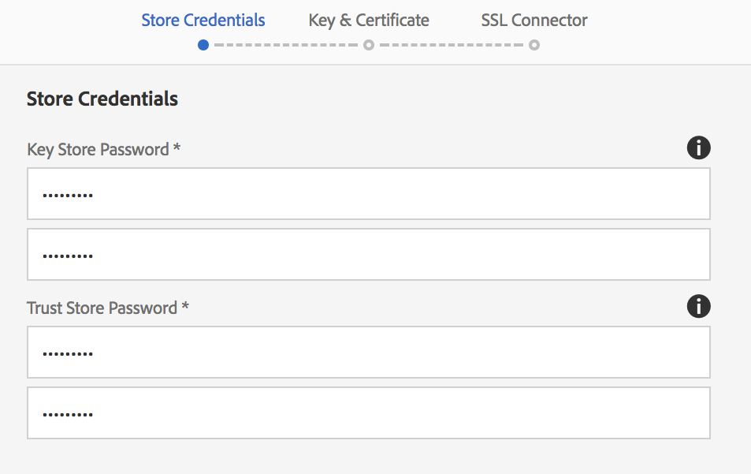

# 默认情况下为SSL/TLS{#ssl-tls-by-default}

为了持续提高AEM的安全性，Adobe引入了“默认为SSL”功能。 其目的是鼓励使用HTTPS连接到AEM实例。

## 默认启用SSL/TLS {#enabling-ssl-tls-by-default}

您可以通过单击AEM主屏幕中相关的收件箱消息来开始默认配置SSL/TLS。 要访问收件箱，请按屏幕右上角的铃铛图标。 然后，单击 **查看全部**. 这将显示列表视图中排序的所有警报的列表。

在列表中，选择并打开 **配置HTTPS** 警报：


>[!NOTE]
>
>如果 **配置HTTPS** 警报在收件箱中不存在，您可以通过转到 *<http://serveraddress:serverport/libs/granite/security/content/sslConfig.html?item=configuration%2fconfiguressl&_charset_=utf-8>*

名为的服务用户 **ssl-service** 已为此功能创建。 打开警报后，将引导您完成以下配置向导：

1. 首先，设置存储凭据。 这些是 **ssl-service** 系统用户的密钥存储，其中将包含HTTPS侦听器的私钥和信任存储。

   

1. 输入凭据后，单击 **下一个** 的双曲余切值。 然后，为SSL/TLS连接上传关联的私钥和证书。

   

   >[!NOTE]
   >
   >有关如何生成私钥和证书以与向导一起使用的信息，请参阅 [此过程](/help/sites-administering/ssl-by-default.md#generating-a-private-key-certificate-pair-to-use-with-the-wizard) 下。

1. 最后，为HTTPS侦听器指定HTTPS主机名和TCP端口。

   

## 默认自动化SSL/TLS {#automating-ssl-tls-by-default}

默认情况下，有三种方法可自动执行SSL/TLS。

### 通过HTTPPOST {#via-http-post}

第一种方法是将内容发布到配置向导正在使用的SSLSetup服务器：

```shell
POST /libs/granite/security/post/sslSetup.html
```

您可以在POST中使用以下有效负载来自动配置：

```xml
------WebKitFormBoundaryyBO4ArmGlcfdGDbs
Content-Disposition: form-data; name="keystorePassword"

test
------WebKitFormBoundaryyBO4ArmGlcfdGDbs
Content-Disposition: form-data; name="keystorePasswordConfirm"
test
------WebKitFormBoundaryyBO4ArmGlcfdGDbs
Content-Disposition: form-data; name="truststorePassword"
test
------WebKitFormBoundaryyBO4ArmGlcfdGDbs
Content-Disposition: form-data; name="truststorePasswordConfirm"
test
------WebKitFormBoundaryyBO4ArmGlcfdGDbs
Content-Disposition: form-data; name="privatekeyFile"; filename="server.der"
Content-Type: application/x-x509-ca-cert

------WebKitFormBoundaryyBO4ArmGlcfdGDbs
Content-Disposition: form-data; name="certificateFile"; filename="server.crt"
Content-Type: application/x-x509-ca-cert

------WebKitFormBoundaryyBO4ArmGlcfdGDbs
Content-Disposition: form-data; name="httpsPort"
8443
```

Servlet与任何slingPOSTServlet一样，将做出响应，显示200 OK或错误HTTP状态代码。 您可以在响应的HTML正文中找到有关状态的详细信息。

以下是成功响应和错误的示例。

**成功示例** （状态= 200）：

```xml
<!DOCTYPE html>
<html lang='en'>
<head>
<title>OK</title>
</head>
<body>
<h1>OK</h1>
<dl>
<dt class='foundation-form-response-status-code'>Status</dt>
<dd>200</dd>
<dt class='foundation-form-response-status-message'>Message</dt>
<dd>SSL successfully configured</dd>
<dt class='foundation-form-response-title'>Title</dt>
<dd>OK</dd>
<dt class='foundation-form-response-description'>Description</dt>
<dd>HTTPS has been configured on port 8443. The private key and
certificate were stored in the key store of the user ssl-service.
Please take note of the key store password you provided. You will need
it for any subsequent updating of the private key or certificate.</dd>
</dl>
<h2>Links</h2>
<ul class='foundation-form-response-links'>
<li><a class='foundation-form-response-redirect' href='/'>Done</a></li>
</ul>
</body>
</html>
```

**错误示例** （状态= 500）：

```xml
<!DOCTYPE html>
<html lang='en'>
<head>
<title>Error</title>
</head>
<body>
<h1>Error</h1>
<dl>
<dt class='foundation-form-response-status-code'>Status</dt>
<dd>500</dd>
<dt class='foundation-form-response-status-message'>Message</dt>
<dd>The provided file is not a valid key, DER format expected</dd>
<dt class='foundation-form-response-title'>Title</dt>
<dd>Error</dd>
</dl>
</body>
</html>
```

### 通过包 {#via-package}

或者，您也可以通过上传已包含以下必需项的包来自动设置SSL/TLS:

* ssl-service用户的密钥库。 位于 */home/users/system/security/ssl-service/keystore* 中。
* 的 `GraniteSslConnectorFactory` 配置

### 生成要与向导一起使用的私钥/证书对 {#generating-a-private-key-certificate-pair-to-use-with-the-wizard}

在下面，您将找到一个示例，用于创建DER格式的自签名证书，SSL/TLS向导可以使用该证书。 根据操作系统安装OpenSSL，打开OpenSSL命令提示符，然后将目录更改为要在其中生成私钥/证书的文件夹。

>[!NOTE]
>
>自签名证书的使用仅供使用，不应在生产中使用。

1. 首先，创建私钥：

   ```shell
   openssl genrsa -aes256 -out localhostprivate.key 4096
   openssl rsa -in localhostprivate.key -out localhostprivate.key
   ```

1. 然后，使用私钥生成证书签名请求(CSR):

   ```shell
   openssl req -sha256 -new -key localhostprivate.key -out localhost.csr -subj "/CN=localhost"
   ```

1. 生成SSL/TLS证书并使用私钥对其进行签名。 在本例中，将从现在起一年到期：

   ```shell
   openssl x509 -req -days 365 -in localhost.csr -signkey localhostprivate.key -out localhost.crt
   ```

将私钥转换为DER格式。 这是因为SSL向导要求键采用DER格式：

```shell
openssl pkcs8 -topk8 -inform PEM -outform DER -in localhostprivate.key -out localhostprivate.der -nocrypt
```

最后，上载 **localhostprivate.der** 作为私钥和 **localhost.crt** 作为图形SSL/TLS向导步骤2中的SSL/TLS证书，如本页开头所述。

### 通过cURL更新SSL/TLS配置 {#updating-the-ssl-tls-configuration-via-curl}

>[!NOTE]
>
>请参阅 [将cURL与AEM结合使用](https://helpx.adobe.com/experience-manager/6-4/sites/administering/using/curl.html) ，以获取AEM中有用cURL命令的集中列表。

您还可以使用cURL工具自动配置SSL/TLS。 您可以通过将配置参数发布到此URL来执行此操作：

*https://&lt;serveraddress>:&lt;serverport>/libs/granite/security/post/sslSetup.html*

以下是在配置向导中更改各种设置的参数：

* `-F "keystorePassword=password"`  — 密钥库密码；

* `-F "keystorePasswordConfirm=password"`  — 确认密钥库密码；

* `-F "truststorePassword=password"`  — 信任存储密码；

* `-F "truststorePasswordConfirm=password"`  — 确认信任存储密码；

* `-F "privatekeyFile=@localhostprivate.der"`  — 指定私钥；

* `-F "certificateFile=@localhost.crt"`  — 指定证书；

* `-F "httpsHostname=host.example.com"` — 指定主机名；
* `-F "httpsPort=8443"` - HTTPS侦听器将使用的端口。

>[!NOTE]
>
>运行cURL以自动化SSL/TLS配置的最快捷方式是从DER和CRT文件所在的文件夹中运行。 或者，您也可以在 `privatekeyFile` 和certificateFile参数。
>
>您还需要进行身份验证才能执行更新，因此请确保在 `-u user:passeword` 参数。
>
>正确的cURL post命令应当如下所示：

```shell
curl -u user:password -F "keystorePassword=password" -F "keystorePasswordConfirm=password" -F "truststorePassword=password" -F "truststorePasswordConfirm=password" -F "privatekeyFile=@localhostprivate.der" -F "certificateFile=@localhost.crt" -F "httpsHostname=host.example.com" -F "httpsPort=8443" https://host:port/libs/granite/security/post/sslSetup.html
```

#### 使用cURL的多个证书 {#multiple-certificates-using-curl}

您可以通过重复以下certificateFile参数来向Servlet发送一系列证书：

`-F "certificateFile=@root.crt" -F "certificateFile=@localhost.crt"..`

执行命令后，请确认已将所有证书发送到密钥库。 从以下位置检查KeyStore:
[http://localhost:4502/libs/granite/security/content/userEditor.html/home/users/system/security/ssl-service](http://localhost:4502/libs/granite/security/content/userEditor.html/home/users/system/security/ssl-service)

### 启用TLS 1.3连接 {#enabling-tls-connection}

1. 转到Web控制台
1. 然后，导航到 **OSGi** - **配置** - **AdobeGranite SSL连接器工厂**
1. 转到 **包含的密码套件** 字段，并添加以下条目。 您可以通过按“**+**“ ”按钮，在中添加每个按钮后：

   * `TLS_AES_256_GCM_SHA384`
   * `TLS_AES_128_GCM_SHA256`
   * `TLS_CHACHA20_POLY1305_SHA256`
   * `TLS_AES_128_CCM_SHA256`
   * `TLS_AES_128_CCM_8_SHA256`