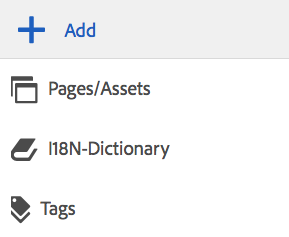
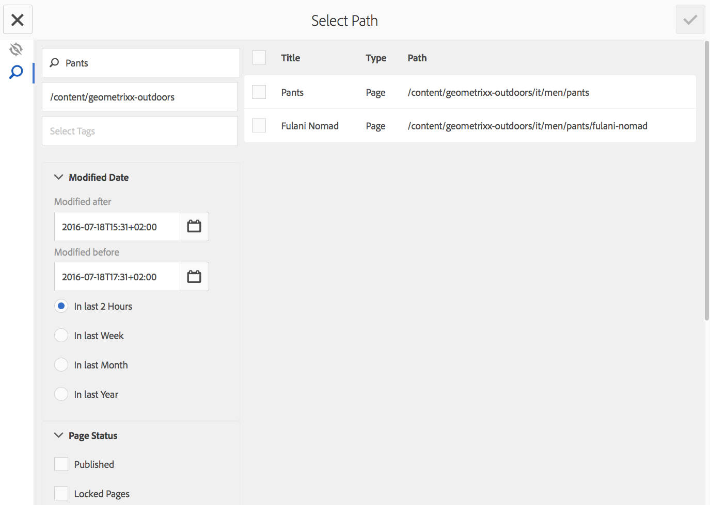
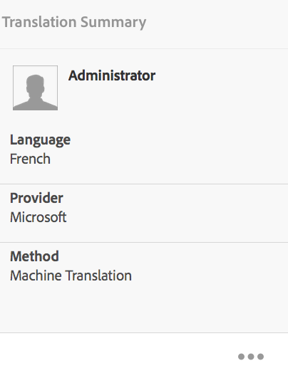
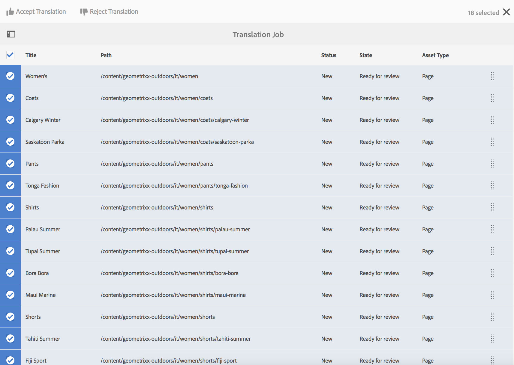
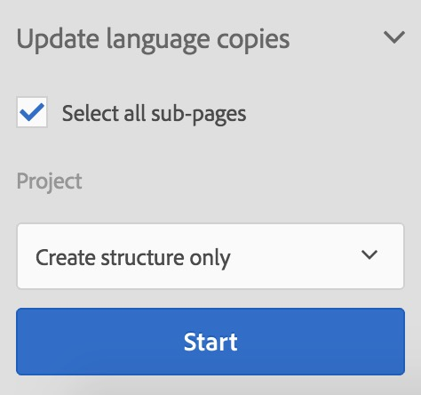

# 管理翻译项目{#managing-translation-projects}

在準備翻譯內容後，您需要建立遺漏的語言副本來完成語言結構，並建立翻譯專案。

翻译项目可让您管理 AEM 内容的翻译。翻译项目是一类 AEM [项目](/help/sites-authoring/projects.md)，其中包含要翻译成其他语言的资源。这些资源是从语言母版创建的[语言副本](/help/sites-administering/tc-prep.md)的页面和资产。

在将资源添加到翻译项目时，将为其创建翻译作业。作业提供用于管理对资源执行的人工翻译和机器翻译工作流的命令和状态信息。

>[!NOTE]
>
>翻譯專案可包含多個翻譯工作。

翻译项目是长期运行的项目，它们由语言和翻译方法/提供商定义，以便与全球化的组织治理保持一致。它们应该在初始翻译期间启动一次或手动启动一次，并在整个内容和翻译更新活动中保持有效。

翻译项目和作业是通过翻译准备工作流创建的。这些工作流具有三个选项，适用于初始翻译（创建和翻译）和更新（更新翻译）：

1. [新建项目](#creating-translation-projects-using-the-references-panel)
1. [添加到现有项目](#adding-pages-to-a-translation-project)
1. [仅内容结构](#creating-the-structure-of-a-language-copy)

>[!NOTE]
>
>選項3與翻譯工作/專案無關。 它可讓您將語言母版中的內容和結構變更複製到（未翻譯的）語言副本。 即使没有翻译，您也可以使用此项来使您的语言母版保持同步。

## 執行初始翻譯並更新現有翻譯 {#performing-initial-translations-and-updating-existing-translations}

AEM 检测是否正在为内容的初始翻译创建翻译项目，或更新已翻译的语言副本。在为页面创建翻译项目并指明要翻译的语言副本时，AEM 会检测源页面是否已存在于目标语言副本中：

* **语言副本不包含页面：** AEM 将此情况视为初始翻译。该页面将立即复制到语言副本，并包含在项目中。将翻译后的页面导入 AEM 后，AEM 会将此页面直接复制到语言副本。
* **语言副本已包含页面：** AEM 将此情况视为更新后的翻译。将创建一个启动项，页面副本将添加到该启动项，并包含在项目中。利用启动项，您可以先查看更新后的翻译，然后再将它提交给语言副本：

   * 将翻译后的页面导入 AEM 时，它将覆盖启动项中的页面。
   * 翻译后的页面仅在提升启动项时覆盖语言副本。

例如，會為/content/geometrixx/en主語言的法文翻譯建立/content/geometrixx/fr語言根。 法语副本中没有任何其他页面。

* 系統會針對/content/geometrixx/en/products頁面及所有子頁面，以法語副本為目標，建立翻譯專案。 因為語言副本不包含/content/geometrixx/fr/products頁面，AEM會立即將/content/geometrixx/en/products頁面和所有子頁面複製到法文語言副本。 这些副本也包含在翻译项目中。
* 系統會針對/content/geometrixx/en頁面及所有子頁面，以法語副本為目標，建立翻譯專案。 由於語言副本包含與/content/geometrixx/en頁面（語言根）對應的頁面，因此AEM會複製/content/geometrixx/en頁面及所有子頁面，並將其新增至啟動。 这些副本也包含在翻译项目中。

## 使用“引用”面板创建翻译项目 {#creating-translation-projects-using-the-references-panel}

创建翻译项目，以便您能执行和管理用于翻译语言母版的工作流。在创建项目时，您可以指定正在翻译的语言母版中的页面，并指定正在为其执行翻译的语言副本：

* 与所选页面关联的翻译集成框架的云配置决定了翻译项目的多个属性，例如要使用的翻译工作流。
* 为每个选定的语言副本创建一个项目。
* 将创建所选页面和相关资产的副本，并将它们添加到每个项目中。这些副本稍后将发送到翻译提供商进行翻译。

您可以指定也选定所选页面的子页面。在此情况下，子页面的副本也将添加到每个项目中以便进行翻译。当任何子页面与不同的翻译集成框架配置关联时，AEM 会创建其他项目。

您也可以[手动创建翻译项目](#creating-a-translation-project-using-the-projects-console)。

>[!NOTE]
>
>要创建项目，您的帐户必须是 `project-administrators` 组的成员。

**初始翻译和更新翻译**

“引用”面板指示您是更新现有语言副本还是创建语言副本的第一个版本。当所选页面存在语言副本时，将显示“更新语言副本”选项卡以提供对项目相关命令的访问。

翻译后，您可以先[查看翻译](#reviewing-and-promoting-updated-content)，然后再用它覆盖语言副本。当所选页面没有语言副本时，将显示“创建并翻译”选项卡以提供对项目相关命令的访问。

### 为新语言副本创建翻译项目 {#create-translation-projects-for-a-new-language-copy}

1. 使用站点控制台选择要添加到翻译项目的页面。

   例如，若要翻譯Geometrixx示範網站的英文頁面，請選取「Geometrixx示範網站>英文」。

1. 在工具列上，按一下或點選「參照」。

   

1. 选择语言副本，然后选择要为其翻译源页面的语言副本。
1. 单击或点按创建并翻译，然后配置翻译作业：

   * 使用语言下拉列表选择要翻译的语言副本。根据需要选择其他语言。列表中显示的语言与[创建的语言根](/help/sites-administering/tc-prep.md#creating-a-language-root)对应。
   * 若要翻譯您選取的頁面和所有子頁面，請選取「選取所有子頁面」。 要仅翻译选定的页面，请清除此选项。
   * 針對「專案」，選取「建立新翻譯專案」。
   * 輸入專案名稱。

   

1. 单击或点按创建。

### 为现有语言副本创建翻译项目 {#create-translation-projects-for-an-existing-language-copy}

1. 使用站点控制台选择要添加到翻译项目的页面。

   例如，若要翻譯Geometrixx示範網站的英文頁面，請選取「Geometrixx示範網站>英文」。

1. 在工具列上，按一下或點選「參照」。

   

1. 选择语言副本，然后选择要为其翻译源页面的语言副本。
1. 单击或点按更新语言副本，然后配置翻译作业：

   * 若要翻譯您選取的頁面和所有子頁面，請選取「選取所有子頁面」。 要仅翻译选定的页面，请清除此选项。
   * 針對「專案」，選取「建立新翻譯專案」。
   * 輸入專案名稱。

   

1. 按一下或點選「開始」。

## 将页面添加到翻译项目 {#adding-pages-to-a-translation-project}

建立翻譯專案後，您可以使用「資源」窗格將頁面新增至專案。 在同一个项目中包含来自不同分支的页面时，添加页面会很有用。

在将页面添加到翻译项目时，页面将包含在新的翻译作业中。您也可以[将页面添加到现有作业](#adding-pages-assets-to-a-translation-job)。

与创建新项目时一样，在添加页面时，页面的副本会在必要时添加到启动项中，避免覆盖现有语言副本。（请参阅[为现有语言副本创建翻译项目](#performing-initial-translations-and-updating-existing-translations)。）

1. 使用站点控制台选择要添加到翻译项目的页面。

   例如，若要翻譯Geometrixx示範網站的英文頁面，請選取「Geometrixx示範網站>英文」。

1. 在工具列上，按一下或點選「參照」。

   

1. 选择语言副本，然后选择要为其翻译源页面的语言副本。

   

1. 单击或点按更新语言副本，然后配置属性：

   * 若要翻譯您選取的頁面和所有子頁面，請選取「選取所有子頁面」。 要仅翻译选定的页面，请清除此选项。
   * 針對專案，選取「新增至現有翻譯專案」。
   * 選取專案。

   >[!NOTE]
   >
   >翻譯專案中設定的目標語言應與參考面板中顯示的語言副本路徑相符。

   

1. 按一下或點選「開始」。

## 新增頁面/資產至翻譯工作 {#adding-pages-assets-to-a-translation-job}

您可以將頁面、資產、標籤或i18n字典新增至翻譯專案的翻譯工作。 要添加页面或资产，请执行以下操作：

1. 在翻譯專案的「翻譯工作」表徵圖底部，按一下或點選省略符號。

   

1. 按一下或點選「新增」和「頁面/資產」。

   

1. 選取您要新增之分支的最上層專案，然後按一下或點選核取記號圖示。 您可以進行多重選取。

   

1. 或者，您可以选择搜索图标以轻松查找要添加到翻译作业的页面或资产。

   

您的頁面和/或資產會新增至翻譯工作。

## 將i18n字典新增至翻譯工作 {#adding-i-n-dictionaries-to-a-translation-job}

您可以將頁面、資產、標籤或i18n字典新增至翻譯專案的翻譯工作。 新增i18n字典：

1. 在翻譯專案的「翻譯工作」表徵圖底部，按一下或點選省略符號。

   

1. 按一下或點選「新增」和「I18N字典」。

   

1. 選取您要新增的字典，然後按一下或點選「新增」按鈕。

   

您的字典現在在翻譯工作當中。

>[!NOTE]
>
>如需i18n字典的詳細資訊，請閱讀 [使用翻譯工具管理字典](/help/sites-developing/i18n-translator.md).

## 将标记添加到翻译作业 {#adding-tags-to-a-translation-job}

您可以將頁面、資產、標籤或i18n字典新增至翻譯專案的翻譯工作。 若要新增標籤：

1. 在翻譯專案的「翻譯工作」表徵圖底部，按一下或點選省略符號。

   

1. 按一下或點選「新增」，然後點選「標籤」。

   

1. 選取您要新增的標籤，然後按一下或點選核取記號圖示。 您可以進行多重選取。

   

您的標籤現在已新增至翻譯工作。

## 查看翻译项目详细信息 {#seeing-translation-project-details}

「翻譯摘要」表徵圖包含為翻譯專案設定的屬性。 除了泛型之外 [專案資訊](/help/sites-authoring/projects.md#project-info)，翻譯標籤會包含翻譯特有的屬性：

* 源语言：正在翻译的页面的语言.
* 目標語言：頁面要翻譯成哪種語言。
* 翻譯方法：翻譯工作流程。 支援人工翻譯或機器翻譯。
* 翻译提供商：执行翻译的翻译服务提供商.
* 内容类别：（机器翻译）用于翻译的内容类别.
* 雲端設定：專案所用翻譯服務聯結器的雲端設定。

使用頁面的「資源」窗格建立專案時，系統會根據來源頁面的屬性自動設定這些屬性。

## 监控翻译作业状态 {#monitoring-the-status-of-a-translation-job}

翻譯專案的「翻譯工作」表徵圖提供翻譯工作的狀態，以及工作中的頁面和資產數量。

下表描述了作业或作业中的项目可以具有的每种状态：

| 状态 | 描述 |
|---|---|
| 草稿 | 翻译作业尚未开始。翻譯工作在建立時處於「草稿」狀態。 |
| 已提交 | 在将翻译作业中的文件成功发送到翻译服务后，这些文件具有此状态。發出Request Scope指令或Start指令後，可能會出現此狀態。 |
| 已请求设定范围 | 對於人工翻譯工作流程，作業中的檔案已提交給翻譯供應商來設定範圍。 在发出请求设定范围命令后，将出现此状态。 |
| 已完成范围的设定 | 供应商尚未设定翻译作业的范围。 |
| 已提交进行翻译 | 项目所有者已接受范围。此状态表示翻译供应商应开始翻译作业中的文件。 |
| 正在进行翻译 | 对于作业，此状态表示作业中一个或多个文件的翻译尚未完成。对于作业中的项目，此状态表示正在翻译项目。 |
| 已翻译 | 对于作业，此状态表示作业中所有文件的翻译已完成。对于作业中的项目，此状态表示已翻译项目。 |
| 准备好审查 | 作业中的项目已翻译，并且文件已导入 AEM 中。 |
| 完成 | 项目所有者已表示翻译合同已完成。 |
| 取消 | 表示翻译供应商应停止处于翻译作业。 |
| 错误更新 | 在 AEM 和翻译服务之间传输文件时出错。 |
| 状态未知 | 出现未知错误。 |

要查看作业中每个文件的状态，请单击或点按拼贴底部的省略号。

## 设置翻译作业的截止日期 {#setting-the-due-date-of-translation-jobs}

指定一个日期，翻译供应商需在该日期之前发送回已翻译文件。您可以設定專案或特定工作的到期日：

* **專案：** 專案中的翻譯工作會繼承到期日期。
* **工作：** 您為工單設定的到期日會覆寫為專案設定的到期日。

仅在您使用的翻译供应商支持此功能时，才能正确设置截止日期。

下列程式會設定專案的到期日。

1. 按一下或點選「翻譯摘要」方塊底部的省略符號。

   

1. 在基本选项卡上，使用截止日期属性的数据选取器来选择截止日期。

   

1. 按一下或點選「完成」。

下列程式會設定翻譯工作的到期日。

1. 在「翻譯工作」方塊上，按一下或點選命令功能表，然後按一下或點選「到期日」。

   

1. 在對話方塊中，按一下或點選行事曆圖示，然後選取要用作到期日的日期和時間，然後按一下「儲存」。

   

## 设定翻译作业的范围 {#scoping-a-translation-job}

设定翻译作业的范围，从翻译服务提供商处获得翻译成本的估计值。在设定作业范围时，源文件将提交给翻译供应商，后者会将文本与其存储的翻译池（翻译记忆库）进行比较。通常，范围是需要翻译的字数。

要获取有关范围设定结果的更多信息，请联系您的翻译供应商。

>[!NOTE]
>
>範圍設定是選用專案。 您无需设定范围即可开始翻译作业。

設定翻譯工作的範圍時，工作的狀態為 `Scope Requested`. 當翻譯供應商傳回範圍時，狀態會變更為 `Scope Completed`. 在完成范围的设定后，您可以使用显示范围命令来查看范围设定结果。

仅在您使用的翻译供应商支持此功能时，才能正确设定范围。

1. 在「專案」主控台中，開啟您的翻譯專案。
1. 在「翻譯工作」表徵圖上，按一下或點選命令功能表，然後按一下或點選「請求範圍」。

   

1. 當工作狀態變更為SCOPE_COMPLETED時，在「翻譯工作」拼貼上按一下或點選命令功能表，然後按一下或點選「顯示範圍」。

## 開始翻譯工作 {#starting-a-translation-job}

开始翻译作业，将源页面翻译成目标语言。根據「翻譯摘要」拼貼的屬性值執行翻譯。

開始翻譯工作後，「翻譯工作」表徵圖會顯示「翻譯進行中」狀態。

1. 在「專案」主控台中，開啟翻譯專案。
1. 在「翻譯工作」圖磚上，按一下或點選命令功能表，然後按一下或點選「開始」。

   

1. 在確認開始翻譯的「動作」對話方塊中，按一下或點選「關閉」。

## 取消翻译作业 {#canceling-a-translation-job}

取消翻译作业可停止翻译过程并阻止翻译供应商执行任何进一步的翻译。當工作具有下列條件時，您可以取消工作 `Committed For Translation` 或 `Translation In Progress` 狀態。

1. 在「專案」主控台中，開啟翻譯專案。
1. 在「翻譯工作」拼貼上，按一下或點選命令功能表，然後按一下或點選「取消」。
1. 在確認取消轉譯的「動作」對話方塊中，按一下或點選「確定」。

## 接受/拒絕工作流程 {#accept-reject-workflow}

当内容在翻译后返回并处于准备好审查状态时，您可以进入翻译作业并接受/拒绝内容。

如果您选择拒绝翻译，则可以选择添加批注。

拒絕內容會將內容傳回翻譯廠商，以便他看到評論。

## 檢閱和提升更新的內容 {#reviewing-and-promoting-updated-content}

在为现有语言副本翻译内容时，审查翻译并在必要时进行更改，然后提升翻译以将其移至语言副本。可以在翻译作业显示准备好审查状态时审查已翻译文件。

1. 在语言母版中选择页面，单击或点按引用，然后单击或点按语言副本。
1. 单击或点按要审查的语言副本。

   

1. 单击或点按启动项以显示与启动项相关的命令。

   

1. 要打开页面的启动项副本以审查和编辑内容，请单击打开页面。
1. 在审查内容并进行必要的更改后，要提升启动项副本，请单击提升。
1. 在提升启动项页面上，指定要提升的页面，然后单击或点按提升。

## 比较语言副本 {#comparing-language-copies}

若要將語言副本與語言主要版本進行比較：

1. 在 **網站** 主控台，導覽至您要比較的語言副本。
1. 開啟 **[引用](/help/sites-authoring/basic-handling.md#references)** 面板。
1. 在&#x200B;**副本**&#x200B;标题下，选择&#x200B;**语言副本**。
1. 選取您的特定語言副本，然後您可以按一下**與主版比較**或**與上一個比較**（如果適用）。

   

1. 兩個頁面（啟動項和來源）將並排開啟。

   如需關於使用此功能的完整資訊，請參閱 [頁面差異](/help/sites-authoring/page-diff.md).

## 完成并存档翻译作业 {#completing-and-archiving-translation-jobs}

在查看来自供应商的已翻译文件后完成翻译作业。對於人工翻譯工作流程，完成翻譯會向供應商指出已履行翻譯合約，且他們應將翻譯儲存至其翻譯記憶庫。

完成工作之後，工作會具有「完成」狀態。

在翻译作业完成后将其存档，并且您不再需要查看作业状态详细信息。當您封存工作時，「翻譯工作」表徵圖會從專案中移除。

## 创建语言副本的结构 {#creating-the-structure-of-a-language-copy}

填充您的语言副本，使它包含您正在翻译的主语言的内容。您必须先为语言副本[创建语言根](/help/sites-administering/tc-prep.md#creating-a-language-root)，然后再填充语言副本。

1. 使用Sites主控台來選取您用來作為來源的主語言的語言根。 例如，若要翻譯Geometrixx示範網站的英文頁面，請選取「內容>Geometrixx示範網站>英文」。
1. 在工具列上，按一下或點選「參照」。

   

1. 选择语言副本，然后选择要填充的语言副本。

   

1. 单击或点按更新语言副本以显示翻译工具并配置属性：

   * 選取「選取所有子頁面」選項。
   * 对于项目，请选择仅创建结构。

   

1. 按一下或點選「開始」。

## 移动或重命名源页面 {#move-source}

如果需要[重命名或移动](/help/sites-authoring/managing-pages.md#moving-or-renaming-a-page)一个已翻译的源页面，在移动后重新翻译该页面将根据新的页面名称/位置创建新的语言副本。基于上一个名称/位置的旧语言副本仍将存在。

在此场景中，最佳实践是遵循以下过程：
1. 取消发布与要移动的源页面关联的语言副本。
1. 删除它们。
1. 从新移动的源页面创建新的语言副本。
1. 发布新创建的语言副本。

## 使用项目控制台创建翻译项目 {#creating-a-translation-project-using-the-projects-console}

如果您偏好使用專案主控台，可以手動建立翻譯專案。

>[!NOTE]
>
>要创建项目，您的帐户必须是 `project-administrators` 组的成员。

在手动创建翻译项目时，必须为以下与翻译相关的属性以及[基本属性](/help/sites-authoring/touch-ui-managing-projects.md#creating-a-project)提供值：

* **名称：**&#x200B;项目名称。
* **源语言：**&#x200B;源内容的语言.
* **目標語言：** 內容將翻譯成何種語言。
* **翻译方法：**&#x200B;选择人工翻译以指示要手动执行翻译。

1. 在「專案」控制檯的工具列上，按一下或點選「建立」。
1. 选择翻译项目模板，然后单击或点按下一步。
1. 輸入基本屬性的值。
1. 单击或点按高级，并提供与翻译相关的属性的值。
1. 单击或点按创建。在確認方塊中，按一下或點選「完成」以返回專案主控台，或按一下或點選「開啟專案」以開啟並開始管理專案。

## 导出翻译作业 {#exporting-a-translation-job}

您可以下载翻译作业的内容，例如，通过连接器发送给未与 AEM 集成的翻译提供商，或审查内容。

1. 從「翻譯工作」表徵圖的下拉式選單中，按一下或點選「匯出」。
1. 在「匯出」對話方塊中，按一下或點選「下載匯出的檔案」，並視需要使用Web瀏覽器對話方塊來儲存檔案。
1. 在「匯出」對話方塊中，按一下或點選「關閉」。

## 导入翻译作业 {#importing-a-translation-job}

您可以将已翻译内容导入 AEM 中（例如，当翻译提供商将已翻译内容发送给您时），因为它们未通过连接器与 AEM 集成。

1. 從「翻譯工作」圖磚的下拉式選單中，按一下或點選「匯入」。
1. 使用 Web 浏览器的对话框选择要导入的文件。
1. 在「匯入」對話方塊中，按一下或點選「關閉」。
