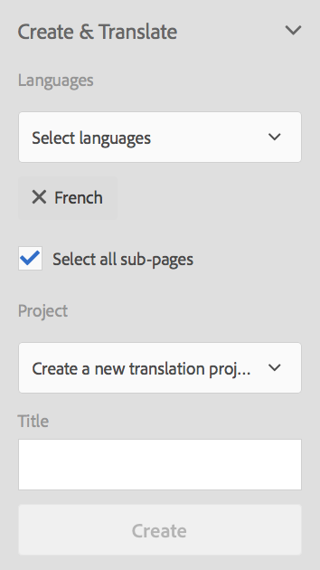
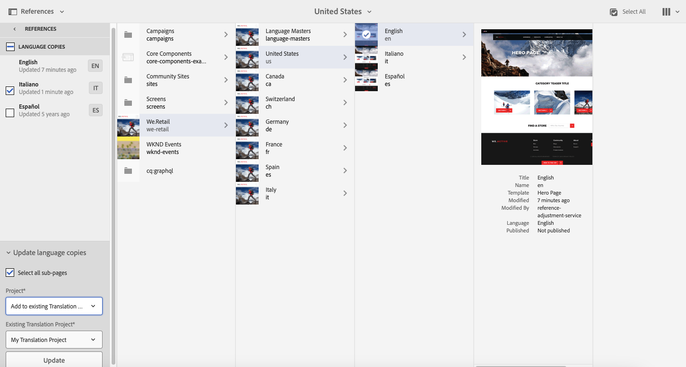

# 管理翻译项目{#managing-translation-projects}

在准备内容以进行翻译后，您需要通过创建缺少的语言副本来完成语言结构，并创建翻译项目。

翻译项目可让您管理 AEM 内容的翻译。翻译项目是一类 AEM [项目](/help/sites-authoring/projects.md)，其中包含要翻译成其他语言的资源。这些资源是从语言母版创建的[语言副本](/help/sites-administering/tc-prep.md)的页面和资源。

在将资源添加到翻译项目时，将为其创建翻译作业。作业提供用于管理对资源执行的人工翻译和机器翻译工作流的命令和状态信息。

>[!NOTE]
>
>翻译项目可以包含多个翻译作业。

翻译项目是长期运行的项目，它们由语言和翻译方法/提供商定义，以便与全球化的组织治理保持一致。它们应该在初始翻译期间启动一次或手动启动一次，并在整个内容和翻译更新活动中保持有效。

翻译项目和作业是通过翻译准备工作流创建的。这些工作流具有三个选项，适用于初始翻译（创建和翻译）和更新（更新翻译）：

1. [新建项目](#creating-translation-projects-using-the-references-panel)
1. [添加到现有项目](#adding-pages-to-a-translation-project)
1. [仅内容结构](#creating-the-structure-of-a-language-copy)

>[!NOTE]
>
>选项3与翻译作业/项目无关。 通过它，可将语言母版中的内容和结构更改复制到（未翻译的）语言副本。 即使没有翻译，您也可以使用此项来使您的语言母版保持同步。

## 执行初始翻译并更新现有翻译 {#performing-initial-translations-and-updating-existing-translations}

AEM 检测是否正在为内容的初始翻译创建翻译项目，或更新已翻译的语言副本。在为页面创建翻译项目并指明要翻译的语言副本时，AEM 会检测源页面是否已存在于目标语言副本中：

* **语言副本不包含页面：** AEM 将此情况视为初始翻译。该页面将立即复制到语言副本，并包含在项目中。将翻译后的页面导入 AEM 后，AEM 会将此页面直接复制到语言副本。
* **语言副本已包含页面：** AEM 将此情况视为更新后的翻译。将创建一个启动项，页面副本将添加到该启动项，并包含在项目中。利用启动项，您可以先查看更新后的翻译，然后再将它提交给语言副本：

   * 将翻译后的页面导入 AEM 时，它将覆盖启动项中的页面。
   * 翻译后的页面仅在提升启动项时覆盖语言副本。

例如，/content/geometrixx/fr语言根是为/content/geometrixx/en主语言的法语翻译创建的。 法语副本中没有任何其他页面。

* 将为/content/geometrixx/en/products页面及其所有子页面创建翻译项目，并以法语副本为目标。 由于语言副本不包含/content/geometrixx/fr/products页面，因此，AEM会立即将/content/geometrixx/en/products页面及其所有子页面复制到法语副本。 这些副本也包含在翻译项目中。
* 将为/content/geometrixx/en页面及其所有子页面创建翻译项目，并以法语副本为目标。 由于语言副本包含与/content/geometrixx/en页面（语言根）对应的页面，因此，AEM将复制/content/geometrixx/en页面及其所有子页面，并将它们添加到启动项。 这些副本也包含在翻译项目中。

## 使用“引用”面板创建翻译项目 {#creating-translation-projects-using-the-references-panel}

创建翻译项目，以便您能执行和管理用于翻译语言母版的工作流。在创建项目时，您可以指定正在翻译的语言母版中的页面，并指定正在为其执行翻译的语言副本：

* 与所选页面关联的翻译集成框架的云配置决定了翻译项目的多个属性，例如要使用的翻译工作流。
* 为每个选定的语言副本创建一个项目。
* 将创建所选页面和相关资源的副本，并将它们添加到每个项目中。这些副本稍后将发送到翻译提供商进行翻译。

您可以指定也选定所选页面的子页面。在此情况下，子页面的副本也将添加到每个项目中以便进行翻译。当任何子页面与不同的翻译集成框架配置关联时，AEM 会创建其他项目。

您也可以[手动创建翻译项目](#creating-a-translation-project-using-the-projects-console)。

>[!NOTE]
>
>要创建项目，您的帐户必须是 `project-administrators` 组的成员。

**初始翻译和更新翻译**

“引用”面板指示您是更新现有语言副本还是创建语言副本的第一个版本。当所选页面存在语言副本时，将显示“更新语言副本”选项卡以提供对项目相关命令的访问。

翻译后，您可以先[查看翻译](#reviewing-and-promoting-updated-content)，然后再用它覆盖语言副本。当所选页面没有语言副本时，将显示“创建并翻译”选项卡以提供对项目相关命令的访问。

### 为新语言副本创建翻译项目 {#create-translation-projects-for-a-new-language-copy}

1. 使用 Sites 控制台选择要添加到翻译项目的页面。

   例如，要翻译Geometrixx演示站点的英语页面，请选择Geometrixx演示站点>英语。

1. 在工具栏上，单击“引用”。

   

1. 选择语言副本，然后选择要为其翻译源页面的语言副本。
1. 单击创建并翻译，然后配置翻译作业：

   * 使用语言下拉列表选择要翻译的语言副本。 根据需要选择其他语言。列表中显示的语言与[创建的语言根](/help/sites-administering/tc-prep.md#creating-a-language-root)对应。
   * 要翻译选定的页面和所有子页面，请选择选择所有子页面。 要仅翻译选定的页面，请清除此选项。
   * 对于项目，选择新建翻译项目。
   * 键入项目的名称。

   

1. 单击“创建”。

### 为现有语言副本创建翻译项目 {#create-translation-projects-for-an-existing-language-copy}

1. 使用 Sites 控制台选择要添加到翻译项目的页面。

   例如，要翻译Geometrixx演示站点的英语页面，请选择Geometrixx演示站点>英语。

1. 在工具栏上，单击“引用”。

   

1. 选择语言副本，然后选择要为其翻译源页面的语言副本。
1. 单击更新语言副本，然后配置翻译作业：

   * 要翻译选定的页面和所有子页面，请选择选择所有子页面。 要仅翻译选定的页面，请清除此选项。
   * 对于项目，选择新建翻译项目。
   * 键入项目的名称。

   

1. 单击“Start（开始）”。

## 将页面添加到翻译项目 {#adding-pages-to-a-translation-project}

创建翻译项目后，可以使用“资源”窗格将页面添加到项目。 在同一个项目中包含来自不同分支的页面时，添加页面会很有用。

在将页面添加到翻译项目时，页面将包含在新的翻译作业中。您也可以[将页面添加到现有作业](#adding-pages-assets-to-a-translation-job)。

与创建项目时一样，在添加页面时，页面的副本会在必要时添加到启动项，以避免覆盖现有语言副本。 （请参阅[为现有语言副本创建翻译项目](#performing-initial-translations-and-updating-existing-translations)。）

1. 使用 Sites 控制台选择要添加到翻译项目的页面。

   例如，要翻译Geometrixx演示站点的英语页面，请选择Geometrixx演示站点>英语。

1. 在工具栏上，单击“引用”。

   

1. 选择语言副本，然后选择要为其翻译源页面的语言副本。

   

1. 单击更新语言副本，然后配置属性：

   * 要翻译选定的页面和所有子页面，请选择选择所有子页面。 要仅翻译选定的页面，请清除此选项。
   * 对于项目，选择添加到现有翻译项目。
   * 选择项目。

   >[!NOTE]
   >
   >翻译项目中设置的目标语言应与引用面板中显示的语言副本的路径匹配。

   

1. 单击“Start（开始）”。

## 将页面/Assets添加到翻译作业 {#adding-pages-assets-to-a-translation-job}

您可以将页面、资产、标记或i18n词典添加到翻译项目的翻译作业中。 要添加页面或资源，请执行以下操作：

1. 在翻译项目的翻译作业拼贴的底部，单击省略号。

   

1. 单击添加和页面/Assets。

   

1. 选择要添加的分支的最顶部项目，然后单击复选标记图标。 您可以进行多选。

   

1. 或者，您可以选择搜索图标以轻松查找要添加到翻译作业的页面或资源。

   

您的页面和/或资产已添加到翻译作业。

## 将i18n词典添加到翻译作业 {#adding-i-n-dictionaries-to-a-translation-job}

您可以将页面、资产、标记或i18n词典添加到翻译项目的翻译作业中。 添加i18n词典：

1. 在翻译项目的翻译作业拼贴的底部，单击省略号。

   

1. 单击添加和I18N词典。

   

1. 选择要添加的&#x200B;**根目录**&#x200B;和字典（如有必要），然后选择&#x200B;**添加**。

   

1. 如有请求，请选择更新的性质：

   

您的词典现在正在翻译作业中。

>[!NOTE]
>
>有关i18n词典的详细信息，请阅读[使用Translator管理词典](/help/sites-developing/i18n-translator.md)。

## 将标记添加到翻译作业 {#adding-tags-to-a-translation-job}

您可以将页面、资产、标记或i18n词典添加到翻译项目的翻译作业中。 要添加标记，请执行以下操作：

1. 在翻译项目的翻译作业拼贴的底部，单击省略号。

   

1. 单击“添加”，然后单击“标记”。

   

1. 选择要添加的标记，然后单击复选标记图标。 您可以进行多选。

   

您的标记现已添加到翻译作业中。

## 查看翻译项目详细信息 {#seeing-translation-project-details}

“翻译摘要”拼贴包含为翻译项目配置的属性。 除了通用[项目信息](/help/sites-authoring/projects.md#project-info)之外，“翻译”选项卡还包含翻译特定的属性：

* Source语言：正在翻译的页面的语言。
* 目标语言：页面将翻译成的语言。
* 翻译方法：翻译工作流。 支持人工翻译或机器翻译。
* 翻译提供商：执行翻译的翻译服务提供商。
* 内容类别： （机器翻译）用于翻译的内容类别。
* 云配置：用于项目的翻译服务连接器的云配置。

使用页面的资源窗格创建项目时，会根据源页面的属性自动配置这些属性。

## 监控翻译作业状态 {#monitoring-the-status-of-a-translation-job}

翻译项目的翻译作业拼贴提供了翻译作业的状态，以及作业中页面和资产的数量。

下表描述了作业或作业中的项目可以具有的每种状态：

| 状态 | 描述 |
|---|---|
| 草稿 | 翻译作业尚未开始。翻译作业在创建时处于草稿状态。 |
| 已提交 | 在将翻译作业中的文件成功发送到翻译服务后，这些文件具有此状态。在发出Request Scope命令或Start命令后，将出现此状态。 |
| 已请求设定范围 | 对于人工翻译工作流，作业中的文件已提交给翻译供应商来设定范围。 在发出请求设定范围命令后，将出现此状态。 |
| 已完成范围的设定 | 供应商尚未设定翻译作业的范围。 |
| 已提交进行翻译 | 项目所有者已接受范围。此状态表示翻译供应商应开始翻译作业中的文件。 |
| 正在进行翻译 | 对于作业，此状态表示作业中一个或多个文件的翻译尚未完成。对于作业中的项目，此状态表示正在翻译项目。 |
| 已翻译 | 对于作业，此状态表示作业中所有文件的翻译已完成。对于作业中的项目，此状态表示已翻译项目。 |
| 准备好审查 | 作业中的项目已翻译，并且文件已导入 AEM 中。 |
| 完成 | 项目所有者已表示翻译合同已完成。 |
| 取消 | 表示翻译供应商应停止处于翻译作业。 |
| 错误更新 | 在 AEM 和翻译服务之间传输文件时出错。 |
| 状态未知 | 出现未知错误。 |

要查看作业中每个文件的状态，请单击拼贴底部的省略号。

## 设置翻译作业的截止日期 {#setting-the-due-date-of-translation-jobs}

指定一个日期，翻译供应商需在该日期之前发送回已翻译文件。您可以为项目或特定作业设置到期日期：

* **项目：**&#x200B;项目中的翻译作业将继承到期日期。
* **作业：**&#x200B;您为作业设置的到期日期将覆盖为项目设置的到期日期。

仅在您使用的翻译供应商支持此功能时，才能正确设置截止日期。

以下过程设置项目的到期日期。

1. 单击“翻译摘要”拼贴底部的省略号。

   

1. 在基本选项卡上，使用截止日期属性的日期选取器来选择截止日期。

   

1. 单击“完成”。

以下过程设置翻译作业的截止日期。

1. 在翻译作业拼贴上，单击命令菜单，然后单击到期日期。

   

1. 在对话框中，单击日历图标，选择要用作截止日期的日期和时间，然后单击保存。

   

## 设定翻译作业的范围 {#scoping-a-translation-job}

设定翻译作业的范围，从翻译服务提供商处获得翻译成本的估计值。在设定作业范围时，源文件将提交给翻译供应商，后者会将文本与其存储的翻译池（翻译记忆库）进行比较。通常，范围是需要翻译的字数。

要获取有关范围设定结果的更多信息，请联系您的翻译供应商。

>[!NOTE]
>
>范围设定是可选的。 您无需设定范围即可开始翻译作业。

在设定翻译作业的范围时，作业的状态为`Scope Requested`。 当翻译供应商返回范围时，状态将更改为`Scope Completed`。 在完成范围的设定后，您可以使用“显示范围”命令来查看范围设定结果。

仅在您使用的翻译供应商支持此功能时，才能正确设定范围。

1. 在“项目”控制台中，打开您的翻译项目。
1. 在翻译作业拼贴上，单击命令菜单，然后单击请求设定范围。

   

1. 当作业状态变为SCOPE_COMPLETED时，在“翻译作业”拼贴上单击命令菜单，然后单击“显示范围”。

## 启动翻译作业 {#starting-a-translation-job}

开始翻译作业，将源页面翻译成目标语言。根据“翻译摘要”拼贴的属性值执行翻译。

开始翻译作业后，翻译作业拼贴将显示正在进行翻译状态。

1. 在“项目”控制台中，打开翻译项目。
1. 在“翻译作业”拼贴上，单击命令菜单，然后单击“开始”。

   

1. 在用于确认开始翻译的操作对话框中，单击关闭。

## 取消翻译作业 {#canceling-a-translation-job}

取消翻译作业可停止翻译过程并阻止翻译供应商执行任何进一步的翻译。当作业的状态为`Committed For Translation`或`Translation In Progress`时，您可以取消该作业。

1. 在“项目”控制台中，打开翻译项目。
1. 在翻译作业拼贴上，单击命令菜单，然后单击取消。
1. 在用于确认取消翻译的操作对话框中，单击确定。

## 接受/拒绝工作流 {#accept-reject-workflow}

当内容在翻译后返回并处于准备好审查状态时，您可以进入翻译作业并接受/拒绝内容。

如果选择“拒绝翻译”，则可以选择添加注释。

如果拒绝内容，则会将内容发送回翻译供应商，以便他查看批注。

## 审阅和提升更新的内容 {#reviewing-and-promoting-updated-content}

在为现有语言副本翻译内容时，审查翻译并在必要时进行更改，然后提升翻译以将其移至语言副本。您可以在翻译作业显示“准备好审查”状态时审查已翻译文件。

1. 在语言母版中选择页面，单击“引用”，然后单击“语言副本”。
1. 单击要审查的语言副本。

   

1. 单击启动项以显示与启动项相关的命令。

   

1. 要打开页面的启动项副本以审查和编辑内容，请单击打开页面。
1. 在审查内容并进行必要的更改后，要提升启动项副本，请单击提升。
1. 在提升启动项页面上，指定要提升的页面，然后单击提升。

## 比较语言副本 {#comparing-language-copies}

要将语言副本与语言母版进行比较，请执行以下操作：

1. 在&#x200B;**站点**&#x200B;控制台中，导航到要比较的语言副本。
1. 打开&#x200B;**[引用](/help/sites-authoring/basic-handling.md#references)**&#x200B;面板。
1. 在&#x200B;**副本**&#x200B;标题下，选择&#x200B;**语言副本**。
1. 选择特定的语言副本，然后您可以单击&#x200B;**与母版比较**&#x200B;或**与上一个比较**（如果适用）。

   

1. 此时将并列打开两个页面（启动页面和源页面）。

   有关使用此功能的完整信息，请参阅[页面差异](/help/sites-authoring/page-diff.md)。

## 完成并存档翻译作业 {#completing-and-archiving-translation-jobs}

在查看来自供应商的已翻译文件后完成翻译作业。 对于人工翻译工作流，完成翻译会向供应商表明翻译合同已履行，他们应将翻译保存到其翻译记忆库中。

完成作业后，该作业的状态为“完成”。

在翻译作业完成后将其存档，并且您不再需要查看作业状态详细信息。 在存档作业时，将从项目中删除翻译作业拼贴。

## 创建语言副本的结构 {#creating-the-structure-of-a-language-copy}

填充您的语言副本，使它包含您正在翻译的主语言的内容。您必须先为语言副本[创建语言根](/help/sites-administering/tc-prep.md#creating-a-language-root)，然后再填充语言副本。

1. 使用站点控制台选择用作源的主语言的语言根。 例如，要翻译Geometrixx演示站点的英语页面，请选择内容>Geometrixx演示站点>英语。
1. 在工具栏上，单击“引用”。

   

1. 选择语言副本，然后选择要填充的语言副本。

   

1. 单击更新语言副本以显示翻译工具并配置属性：

   * 选择选择所有子页面选项。
   * 对于项目，选择“仅创建结构”。

   

1. 单击“Start（开始）”。

## 移动或重命名源页面 {#move-source}

如果已经翻译的源页面需要[重命名或移动](/help/sites-authoring/managing-pages.md#moving-or-renaming-a-page)，请在移动后根据新的页面名称/位置重新翻译该页面，以创建一个语言副本。 基于先前名称/位置的旧语言副本仍然存在。 要防止出现这种情况，您可以在移动后使用更新语言复制功能：

1. 移动具有语言副本的页面。
1. 选择语言副本根。
1. 打开&#x200B;**引用**&#x200B;面板。
1. 选择&#x200B;**语言副本**。
1. 选择要更新的目标语言。
1. 选择&#x200B;**更新语言副本**。

   

1. 单击&#x200B;**更新**。 将创建[启动项](/help/sites-authoring/launches-promoting.md)。
1. 导航到所需的语言根并将其选定。
1. 使用&#x200B;**引用**&#x200B;面板，选择&#x200B;**启动项**。

   

1. 单击已创建的启动项，然后单击&#x200B;**提升启动项**。

现在，源页面和关联的语言副本已移动。

## 使用项目控制台创建翻译项目 {#creating-a-translation-project-using-the-projects-console}

如果您希望使用项目控制台，则可以手动创建翻译项目。

>[!NOTE]
>
>要创建项目，您的帐户必须是 `projects-administrators` 组的成员。

在手动创建翻译项目时，必须为以下与翻译相关的属性以及[基本属性](/help/sites-authoring/touch-ui-managing-projects.md#creating-a-project)提供值：

* **名称：**&#x200B;项目名称。
* **Source语言：**&#x200B;源内容的语言。
* **目标语言：**&#x200B;内容将翻译成的语言。
* **翻译方法：**&#x200B;选择人工翻译以指示要手动执行翻译。

1. 在“项目”控制台的工具栏上，单击“创建”。
1. 选择翻译项目模板，然后单击下一步。
1. 输入“基本”属性的值。
1. 单击高级，并提供与翻译相关的属性的值。
1. 单击“创建”。 在确认框中，单击完成以返回项目控制台，或单击打开项目以打开并开始管理项目。

## 导出翻译作业 {#exporting-a-translation-job}

例如，您可以下载翻译作业的内容，以通过连接器发送给未与AEM集成的翻译提供商，或审查内容。

1. 从翻译作业拼贴的下拉菜单中，单击导出。
1. 在“导出”对话框中，单击“下载导出的文件”，并在必要时使用Web浏览器对话框保存该文件。
1. 在“导出”对话框中，单击“关闭”。

## 导入翻译作业 {#importing-a-translation-job}

例如，当翻译提供商将已翻译内容发送给您时，您可以将已翻译内容导入AEM，因为它们未通过连接器与AEM集成。

1. 从翻译作业拼贴的下拉菜单中，单击导入。
1. 使用 Web 浏览器的对话框选择要导入的文件。
1. 在“导入”对话框中，单击“关闭”。
