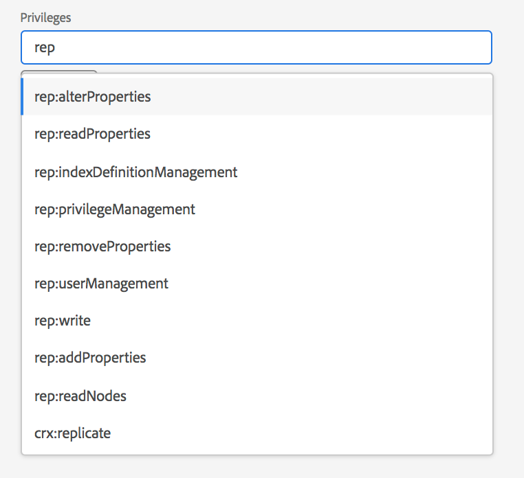

# 权限管理的主体视图{#principal-view-for-permissions-management}

## 概述 {#overview}

AEM 6.5引入了用户和组的权限管理。 主要功能与经典UI相同，但更加用户友好且高效。

## 使用方法 {#how-to-use}

### 访问UI {#accessing-the-ui}

通过安全性下的权限卡访问新的基于UI的权限管理，如下所示：

通过新视图，可以更轻松地查看明确授予权限的所有路径上给定主体的整套权限和限制。 这样便无需转至

CRXDE用于管理高级权限和限制。 该报表已合并到同一视图中。 该视图默认为“everyone”组。

有一个筛选器允许用户选择承担者类型以查看&#x200B;**用户**、**组**&#x200B;或&#x200B;**所有**&#x200B;并搜索任何承担者&#x200B;**。**

### 查看承担者的权限 {#viewing-permissions-for-a-principal}

左侧的框架允许用户向下滚动以查找任何承担者或根据所选筛选器搜索组或用户，如下所示：

单击名称会在右侧显示分配的权限。 权限窗格显示特定路径上的访问控制条目列表以及配置的限制。

### 为主体添加新的访问控制条目 {#adding-new-access-control-entry-for-a-principal}

可以通过添加访问控制条目来添加新权限。 只需单击Add ACE按钮。

此时将显示以下窗口，下一步是选择必须配置权限的路径。

此处，选择一个路径，您可以在其中配置&#x200B;**dam-users**&#x200B;的权限：

选择路径后，工作流将返回此屏幕，用户随后可以从可用命名空间（如`jcr`、`rep`或`crx`）中选择一个或多个权限，如下所示。

可以通过使用文本字段进行搜索，然后从列表中选择来添加权限。

>[!NOTE]
>
>有关权限和说明的完整列表，请参阅[用户、组和访问权限管理](/help/sites-administering/user-group-ac-admin.md#access-right-management)。

给定路径的 

选择权限列表后，用户可以选择权限类型：拒绝或允许，如下所示。

 

### 使用限制 {#using-restrictions}

除了给定路径上的权限和权限类型列表之外，此屏幕还允许您为细粒度访问控制添加限制，如下所示：

>[!NOTE]
>
>有关每个限制含义的更多信息，请参阅[Jackrabbit Oak文档](https://jackrabbit.apache.org/oak/docs/security/authorization/restriction.html)。

可以通过选择限制类型、输入值并点击&#x200B;**+**&#x200B;图标来添加如下所示的限制。

 

新的ACE会反映在“访问控制列表”中，如下所示。 请注意，`jcr:write`是一个聚合特权，它包含上面添加的`jcr:removeNode`，但不显示于下面，因为它包含在`jcr:write`中。

### 编辑ACE {#editing-aces}

通过选择承担者并选择要编辑的ACE，可以编辑访问控制条目。

例如，您可以在此处通过单击右侧的铅笔图标来编辑&#x200B;**dam-users**&#x200B;的以下条目：

此时将显示编辑屏幕，其中已预先选择配置的ACE，单击它们旁边的交叉图标可以删除这些ACE，也可以为给定路径添加新权限，如下所示。

此处为给定路径上的&#x200B;**dam-users**&#x200B;添加了`addChildNodes`权限。

单击右上方的&#x200B;**保存**&#x200B;按钮可保存更改，更改将反映在&#x200B;**dam-users**&#x200B;的新权限中，如下所示：

### 删除ACE {#deleting-aces}

可以删除访问控制条目，以删除授予特定路径上的承担者的所有权限。 可以使用ACE旁边的X图标将其删除，如下所示：

 

### 经典UI权限组合 {#classic-ui-privilege-combinations}

新权限UI明确使用基本权限集，而不是预定义的组合，这些组合不能真正反映所授予的确切基础权限。

这会导致混淆，不知到底在配置什么内容。 下表列出了从经典UI到组成权限组合的实际权限之间的映射：

<table>
 <tbody>
  <tr>
   <th>经典UI权限组合</th>
   <th>权限UI权限</th>
  </tr>
  <tr>
   <td>读取</td>
   <td><code>jcr:read</code></td>
  </tr>
  <tr>
   <td>修改</td>
   <td>
<code>jcr:modifyProperties</code>
 
<code>jcr:lockManagement</code>
 
<code>jcr:versionManagement</code>
 </td>
  </tr>
  <tr>
   <td>创建</td>
   <td>
<code>jcr:addChildNodes</code>
 
<code>jcr:nodeTypeManagement</code>
 </td>
  </tr>
  <tr>
   <td>删除</td>
   <td>
<code>jcr:removeNode</code>
 
<code>jcr:removeChildNodes</code>
 </td>
  </tr>
  <tr>
   <td>读取 ACL</td>
   <td><code>jcr:readAccessControl</code></td>
  </tr>
  <tr>
   <td>编辑 ACL</td>
   <td><code>jcr:modifyAccessControl</code></td>
  </tr>
  <tr>
   <td>复制</td>
   <td><code>crx:replicate</code></td>
  </tr>
 </tbody>
</table>
