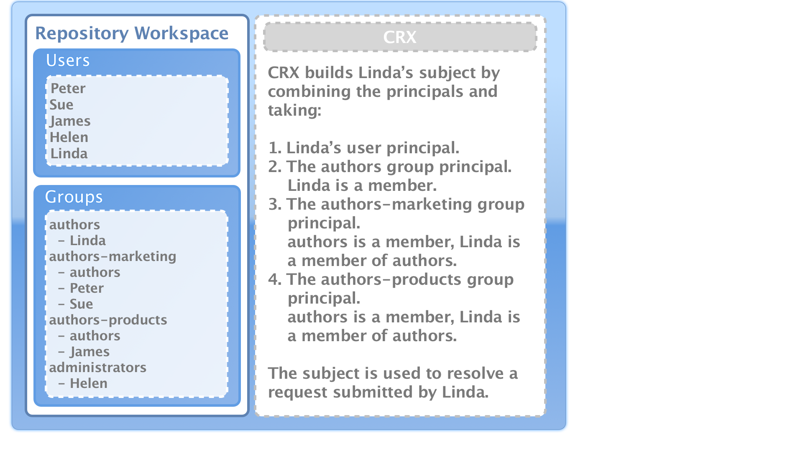

# 用户、组和访问权限管理{#user-group-and-access-rights-administration}

启用对CRX存储库的访问涉及多个主题：

* [访问权限](#how-access-rights-are-evaluated)  — 如何定义和评估这些变量的概念
* [用户管理](#user-administration)  — 管理用于访问的单个帐户
* [群组管理](#group-administration)  — 通过组建组来简化用户管理
* [访问权限管理](#access-right-management)  — 定义控制这些用户和组如何访问资源的策略

基本元素包括：

**用户帐户** CRX通过根据用户帐户中保存的详细信息来识别和验证用户（由某人或其他应用程序），从而验证访问权限。

在CRX中，每个用户帐户都是工作区中的节点。 CRX用户帐户具有以下属性：

* 它表示CRX的一个用户。
* 它包含用户名和密码。
* 适用于该工作区。
* 不能有子用户。 对于分层访问权限，您应使用组。

* 您可以指定用户帐户的访问权限。

   但是，为简化管理，我们建议（在大多数情况下）您为组帐户分配访问权限。 为每个用户分配访问权限会很快变得非常难以管理（只有一个或两个实例时，某些系统用户会例外）。

**组帐户** 群组帐户是用户和/或其他群组的集合。 这些权限可简化管理，因为分配给群组的访问权限更改会自动应用于该群组中的所有用户。 用户不必属于任何组，但通常属于多个组。

在CRX中，组具有以下属性：

* 它表示一组具有共同访问权限的用户。 例如，作者或开发人员。
* 适用于该工作区。
* 它可以有成员；这些组可以是个人用户或其他组。
* 可通过成员关系实现分层分组。 不能将组直接放置在存储库中另一个组的下方。
* 您可以为所有群组成员定义访问权限。

**访问权限** CRX使用访问权限控制对存储库特定区域的访问。

这是通过将权限分配给允许或拒绝访问存储库中的资源（节点或路径）来完成的。 由于可以分配各种权限，因此必须对其进行评估以确定哪种组合适用于当前请求。

CRX允许您配置用户帐户和组帐户的访问权限。 评估的基本原则同样适用于这两者。

## 如何评估访问权限 {#how-access-rights-are-evaluated}

>[!NOTE]
>
>CRX实施 [JSR-283定义的访问控制](https://www.adobe.io/experience-manager/reference-materials/spec/jcr/2.0/16_Access_Control_Management.html).
>
>CRX存储库的标准安装配置为使用基于资源的访问控制列表。 这是JSR-283访问控制的一个可能实施，也是Jackrabbit提供的一个实施。

### 主体与主体 {#subjects-and-principals}

CRX在评估访问权限时使用两个关键概念：

* A **主体** 是具有访问权限的实体。 承担者包括：

   * 用户帐户
   * 群组帐户

      如果某个用户帐户属于一个或多个组，则它也与这些组主体中的每个主体相关联。

* A **主题** 用于表示请求的源。

   它用于整合适用于该请求的访问权限。 这些参数取自：

   * 用户主体

      您直接分配给用户帐户的权限。

   * 与该用户关联的所有主体组

      分配给用户所属的任何组的所有权限。
   然后，结果用于允许或拒绝对所请求资源的访问。

#### 编制主题访问权列表 {#compiling-the-list-of-access-rights-for-a-subject}

在CRX中，主题取决于：

* 用户主体
* 与该用户关联的所有组主体

适用于主题的访问权限列表由以下内容构成：

* 您直接分配给用户帐户的权限
* 加上分配给用户所属的任何组的所有权限



>[!NOTE]
>
>* CRX编译列表时，不考虑任何用户层次结构。
>* 仅当您将某个组作为另一个组的成员包含在内时，CRX才使用组层次结构。 组权限没有自动继承。
>* 您指定群组的顺序不会影响访问权限。
>


### 解决请求和访问权限 {#resolving-request-and-access-rights}

当CRX处理该请求时，它会将来自主题的访问请求与存储库节点上的访问控制列表进行比较：

如果琳达要更新 `/features` 节点：


### 优先顺序 {#order-of-precedence}

对CRX中的访问权限进行评估的方式如下：

* 用户主体始终优先于组主体，而不考虑以下事项：

   * 他们在访问控制列表中的顺序
   * 在节点层次结构中的位置

* 对于给定的主体，给定节点上存在（最多）1个拒绝和1个允许条目。 该实施始终清除冗余条目，并确保允许条目和拒绝条目中未列出相同的权限。

>[!NOTE]
>
>此评估过程适用于标准CRX安装的基于资源的访问控制。

举两个用户 `aUser` 是该组的成员 `aGroup`:

```xml
   + parentNode
     + acl
       + ace: aUser - deny - write
     + childNode
       + acl
         + ace: aGroup - allow - write
       + grandChildNode
```

在上述情况下：

* `aUser` 未获得对的写入权限 `grandChildNode`.

```xml
   + parentNode
     + acl
       + ace: aUser - deny - write
     + childNode
       + acl
         + ace: aGroup - allow - write
         + ace: aUser - deny - write
       + grandChildNode
```

在这种情况下：

* `aUser` 未获得对的写入权限 `grandChildNode`.
* 第二个ACE `aUser` 冗余。

根据多个组主体在层次结构内和单个访问控制列表内的顺序来评估其访问权限。

### 最佳实践 {#best-practices}

下表列出了一些建议和最佳实践：

<table>
 <tbody>
  <tr>
   <td>推荐...</td>
   <td>原因...</td>
  </tr>
  <tr>
   <td><i>使用群组</i></td>
   <td><p>避免按用户分配访问权限。 原因有多种：</p>
    <ul>
     <li>用户比组多，因此组可以简化结构。</li>
     <li>群组可帮助提供有关所有帐户的概述。</li>
     <li>对于组，继承更简单。</li>
     <li>用户来来去。 群体是长期的。</li>
    </ul> </td>
  </tr>
  <tr>
   <td><i>积极</i></td>
   <td><p>始终使用Allow语句指定组主体的访问权限（尽可能）。 避免使用Deny语句。</p> <p>组主体在层次结构内和在单个访问控制列表内按顺序评估。</p> </td>
  </tr>
  <tr>
   <td><i>保持简单</i></td>
   <td><p>在配置新安装时花一些时间和时间思考就能得到很好的回报。</p> <p>应用清晰的结构将简化持续的维护和管理，确保您的当前同事和/或未来继任者都能够轻松了解正在实施的内容。</p> </td>
  </tr>
  <tr>
   <td><i>测试</i></td>
   <td>使用测试安装来实践并确保您了解各种用户和组之间的关系。</td>
  </tr>
  <tr>
   <td><i>默认用户/组</i></td>
   <td>请始终在安装后立即更新默认用户和组，以帮助防止出现任何安全问题。</td>
  </tr>
 </tbody>
</table>

## 用户管理 {#user-administration}

标准对话框用于 **用户管理**.

您必须登录到相应的工作区，然后才能从以下两个位置访问对话框：

* the **用户管理** 链接（位于CRX的主控制台上）
* the **安全性** CRX资源管理器的菜单


**属性**

* **用户ID**

   访问CRX时使用的帐户短名称。

* **主体名称**

   帐户的全文名称。

* **密码**

   使用此帐户访问CRX时需要。

* **ntlmhash**

   自动为每个新帐户分配，并在密码更改时更新。

* 您可以通过定义名称、类型和值来添加新属性。 对于每个新属性，单击“保存”（绿色勾号）。

**组成员资格**

这会显示该帐户所属的所有组。 “继承”列指示因其他组的成员资格而继承的成员资格。

单击GroupID（如果可用）将打开 [群组管理](#group-administration) 那群人。

**模拟者**

借助“模拟”功能，用户可以代表其他用户工作。

这意味着用户帐户可以指定其他帐户（用户或组），这些帐户可以使用其帐户运行。 换言之，如果允许用户B模拟用户A，则用户B可以使用用户A的完整帐户详细信息（包括ID、名称和访问权限）执行操作。

这样，模拟员帐户就可以像使用模拟员帐户一样完成任务；例如，在缺勤期间或在短期内共享过多负载。

如果某个帐户模拟另一个帐户，则很难查看。 日志文件不包含有关事件发生模拟的事实的信息。 因此，如果用户B模拟用户A，则所有事件看起来都像是用户A个人执行的。

### 创建用户帐户 {#creating-a-user-account}

1. 打开 **用户管理** 对话框。
1. 单击 **创建用户**.
1. 然后，您可以输入属性：

   * **用户ID** 用作帐户名称。
   * **密码** 登录时需要。
   * **主体名称** 提供完整的文本名称。
   * **中间路径** 可用来形成树结构。

1. 单击“保存”（绿色勾号）。
1. 该对话框将会展开，以便您能够：

   1. 配置 **属性**.
   1. 请参阅 **组成员资格**.
   1. 定义 **模拟者**.

>[!NOTE]
>
>在安装中注册新用户时，如果这两个用户的数量都很大，则有时会出现性能损失：
>
>* 用户
>* 组 许多成员
>


### 更新用户帐户 {#updating-a-user-account}

1. 使用 **用户管理** 对话框打开所有帐户的列表视图。
1. 在树结构中导航。
1. 单击所需的帐户以打开进行编辑。
1. 进行更改，然后单击该条目的“保存”（绿色勾号）。
1. 单击 **关闭** 完成，或 **列表……** 返回所有用户帐户的列表。

### 删除用户帐户 {#removing-a-user-account}

1. 使用 **用户管理** 对话框打开所有帐户的列表视图。
1. 在树结构中导航。
1. 选择所需的帐户并单击 **删除用户**;该帐户将被立即删除。

>[!NOTE]
>
>这会从存储库中删除此主体的节点。
>
>不会删除访问权限条目。 这可确保历史完整性。

### 定义属性 {#defining-properties}

您可以定义 **属性** 对于新帐户或现有帐户：

1. 打开 **用户管理** 对话框。
1. 定义 **属性** 名称。
1. 选择 **类型** 从下拉列表中。
1. 定义 **值**.
1. 为新属性单击“保存”（绿色单击符号）。

可以使用垃圾桶符号删除现有属性。

除“密码”外，属性无法编辑，必须删除并重新创建。

#### 更改密码 {#changing-the-password}

的 **密码** 是一个特殊资产，可通过单击 **更改密码** 链接。

您还可以将密码从 **安全性** 菜单访问Advertising Cloud帮助。

### 定义模拟器 {#defining-an-impersonator}

您可以为新帐户或现有帐户定义模拟器：

1. 打开 **用户管理** 对话框。
1. 指定允许模拟该帐户的帐户。

   您可以使用浏览……来选择现有帐户。

1. 为新属性单击“保存”（绿色勾号）。

## 群组管理 {#group-administration}

标准对话框用于 **群组管理**.

您必须登录到相应的工作区，然后才能从以下两个位置访问对话框：

* the **群组管理** 链接（位于CRX的主控制台上）
* the **安全性** CRX资源管理器的菜单


**属性**

* **GroupID**

   群组帐户的短名称。

* **主体名称**

   群组帐户的全文名称。

* 您可以通过定义名称、类型和值来添加新属性。 对于每个新属性，单击“保存”（绿色勾号）。

* **成员**

   您可以添加用户或其他群组作为此群组的成员。

**组成员资格**

这会显示当前组帐户所属的所有组。 “继承”列指示因其他组的成员资格而继承的成员资格。

单击GroupID将打开该组的对话框。

**成员**

列出属于当前组的成员的所有帐户（用户和/或组）。

的 **继承** 列指示因其他组的成员身份而继承的成员资格。

>[!NOTE]
>
>在任何资产文件夹上为用户分配了“所有者”、“编辑者”或“查看者”角色后，系统都会创建一个新组。 组名称的格式为 `mac-default-<foldername>` 对于定义角色的每个文件夹。

### 创建群组帐户 {#creating-a-group-account}

1. 打开 **群组管理** 对话框。
1. 单击 **创建群组**.
1. 然后，您可以输入属性：

   * **主体名称** 提供完整的文本名称。
   * **中间路径** 可用来形成树结构。

1. 单击“保存”（绿色勾号）。
1. 该对话框将会展开，以便您能够：

   1. 配置 **属性**.
   1. 请参阅 **组成员资格**.
   1. 管理 **成员**.

### 更新群组帐户 {#updating-a-group-account}

1. 使用 **群组管理** 对话框打开所有帐户的列表视图。
1. 在树结构中导航。
1. 单击所需的帐户以打开进行编辑。
1. 进行更改，然后单击该条目的“保存”（绿色勾号）。
1. 单击 **关闭** 完成，或 **列表……** 返回到所有组帐户的列表。

### 删除组帐户 {#removing-a-group-account}

1. 使用 **群组管理** 对话框打开所有帐户的列表视图。
1. 在树结构中导航。
1. 选择所需的帐户并单击 **删除组**;该帐户将被立即删除。

>[!NOTE]
>
>这会从存储库中删除此主体的节点。
>
>不会删除访问权限条目。 这可确保历史完整性。

### 定义属性 {#defining-properties-1}

您可以为新帐户或现有帐户定义属性：

1. 打开 **群组管理** 对话框。
1. 定义 **属性** 名称。
1. 选择 **类型** 从下拉列表中。
1. 定义 **值**.
1. 为新属性单击“保存”（绿色勾号）。

可以使用垃圾桶符号删除现有属性。

### 成员 {#members}

您可以向当前组添加成员：

1. 打开 **群组管理** 对话框。
1. 可以任选其一：

   * 输入所需成员的名称（用户或组帐户）。
   * 或使用 **浏览……** 要搜索并选择要添加的主体（用户或群组帐户），请执行以下操作：

1. 为新属性单击“保存”（绿色勾号）。

或删除具有垃圾桶符号的现有成员。

## 访问权限管理 {#access-right-management}

使用 **访问控制** CRXDE Lite的选项卡，您可以定义访问控制策略并分配相关权限。

例如， **当前路径** 在左窗格中选择所需的资源，在右下方窗格中选择访问控制选项卡：


这些策略按以下方式进行分类：

* **适用的访问控制策略**

   可以应用这些策略。

   这些策略可用于创建本地策略。 选择并添加适用的策略后，该策略将变为本地策略。

* **本地访问控制策略**

   这些是您已应用的访问控制策略。 然后，您可以更新、排序或删除这些组件。

   本地策略将覆盖从父级继承的所有策略。

* **有效的访问控制策略**

   这些是现在对任何访问请求生效的访问控制策略。 它们显示从本地策略和从父级继承的任何策略派生的聚合策略。

### 策略选择 {#policy-selection}

可以为以下项选择策略：

* **当前路径**

   如上例所示，在存储库中选择资源。 将显示此“当前路径”的策略。

* **存储库**

   选择存储库级别访问控制。 例如，在将 `jcr:namespaceManagement` 权限，仅与存储库相关，而与节点无关。

* **主体**

   在存储库中注册的主体。

   您可以在 **主体** 名称或单击字段右侧的图标以打开 **选择主体** 对话框。

   这样，您就可以 **搜索** a **用户** 或 **组**. 从结果列表中选择所需的主体，然后单击 **确定** 将值返回到上一个对话框。


>[!NOTE]
>
>为简化管理，我们建议您为群组帐户（而非单个用户帐户）分配访问权限。
>
>管理一些组比管理许多用户帐户更容易。

### 特权 {#privileges}

在添加访问控制条目时，可以选择以下权限(请参阅 [安全API](https://docs.adobe.com/docs/en/spec/javax.jcr/javadocs/jcr-2.0/javax/jcr/security/Privilege.html) 要获取完整详细信息):

<table>
 <tbody>
  <tr>
   <th><strong>权限名称</strong></th>
   <th><strong>控制特权……</strong></th>
  </tr>
  <tr>
   <td><code>jcr:read</code></td>
   <td>检索节点并读取其属性及其值。</td>
  </tr>
  <tr>
   <td><code>rep:write</code></td>
   <td>这是jcr:write和jcr:nodeTypeManagement的jackrabbit特定聚合权限。<br /> </td>
  </tr>
  <tr>
   <td><code>jcr:all</code></td>
   <td>这是包含所有其他预定义权限的聚合权限。</td>
  </tr>
  <tr>
   <td><strong>高级</strong></td>
   <td> </td>
  </tr>
  <tr>
   <td><code>crx:replicate</code></td>
   <td>执行节点复制。</td>
  </tr>
  <tr>
   <td><code>jcr:addChildNodes</code></td>
   <td>创建节点的子节点。</td>
  </tr>
  <tr>
   <td><code>jcr:lifecycleManagement</code></td>
   <td>对节点执行生命周期操作。</td>
  </tr>
  <tr>
   <td><code>jcr:lockManagement</code></td>
   <td>锁定和解锁节点；刷新锁。</td>
  </tr>
  <tr>
   <td><code>jcr:modifyAccessControl</code></td>
   <td>修改节点的访问控制策略。</td>
  </tr>
  <tr>
   <td><code>jcr:modifyProperties</code></td>
   <td>创建、修改和删除节点的属性。</td>
  </tr>
  <tr>
   <td><code>jcr:namespaceManagement</code></td>
   <td>注册、取消注册和修改命名空间定义。</td>
  </tr>
  <tr>
   <td><code>jcr:nodeTypeDefinitionManagement</code></td>
   <td>将节点类型定义导入存储库。</td>
  </tr>
  <tr>
   <td><code>jcr:nodeTypeManagement</code></td>
   <td>添加和删除混合节点类型，并更改节点的主节点类型。 这还包括对Node.addNode和XML导入方法的任何调用，其中明确指定了新节点的混合类型或主类型。</td>
  </tr>
  <tr>
   <td><code>jcr:readAccessControl</code></td>
   <td>读取节点的访问控制策略。</td>
  </tr>
  <tr>
   <td><code>jcr:removeChildNodes</code></td>
   <td>删除节点的子节点。</td>
  </tr>
  <tr>
   <td><code>jcr:removeNode</code></td>
   <td>删除节点。</td>
  </tr>
  <tr>
   <td><code>jcr:retentionManagement</code></td>
   <td>对节点执行保留管理操作。</td>
  </tr>
  <tr>
   <td><code>jcr:versionManagement</code></td>
   <td>对节点执行版本控制操作。</td>
  </tr>
  <tr>
   <td><code>jcr:workspaceManagement</code></td>
   <td>通过JCR API创建和删除工作区。</td>
  </tr>
  <tr>
   <td><code>jcr:write</code></td>
   <td>这是一个聚合权限，其中包含：<br /> - jcr:modifyProperties<br /> - jcr:addChildNodes<br /> - jcr:removeNode<br /> - jcr:removeChildNodes</td>
  </tr>
  <tr>
   <td><code>rep:privilegeManagement</code></td>
   <td>注册新权限。</td>
  </tr>
 </tbody>
</table>

### 注册新权限 {#registering-new-privileges}

您还可以注册新权限：

1. 从工具栏中选择 **工具**，则 **权限** 以显示当前注册的权限。

   

1. 使用 **注册权限** 图标(**+**)打开对话框并定义新权限：

   

1. 单击&#x200B;**确定**&#x200B;进行保存。该权限现在可供选择。

### 添加访问控制条目 {#adding-an-access-control-entry}

1. 选择您的资源并打开 **访问控制** 选项卡。

1. 添加新 **本地访问控制策略**，请单击 **+** 图标 **适用的访问控制策略** 列表：

   

1. 新条目显示在 **本地访问控制策略：**

   

1. 单击 **+** 图标以添加新条目：

   

   >[!NOTE]
   >
   >当前需要解决方法来指定空字符串。
   >
   >为此，您需要使用“”。

1. 定义访问控制策略并单击 **确定** 保存。 您的新策略将：

   * 在 **本地访问控制策略**
   * 更改将反映在 **有效的访问控制策略**.

CRX将验证您的选择；对于给定的主体，给定节点上存在（最多）1个拒绝和1个允许条目。 该实施始终清除冗余条目，并确保允许条目和拒绝条目中未列出相同的权限。

### 订购本地访问控制策略 {#ordering-local-access-control-policies}

列表中的顺序指示应用策略的顺序。

1. 在 **本地访问控制策略** 选择所需条目，并将其拖动到表中的新位置。

   

1. 更改将显示在 **本地** 和 **有效的访问控制策略**.

### 删除访问控制策略 {#removing-an-access-control-policy}

1. 在 **本地访问控制策略** 单击条目右侧的红色图标(-)。
1. 该条目将从 **本地** 和 **有效的访问控制策略**.

### 测试访问控制策略 {#testing-an-access-control-policy}

1. 从CRXDE Lite工具栏中，选择 **工具**，则 **测试访问控制……**.
1. 将在右上方窗格中打开一个新对话框。 选择 **路径** 和/或 **主体** 要测试的。
1. 单击 **测试** 要查看所选内容的结果，请执行以下操作：

   
