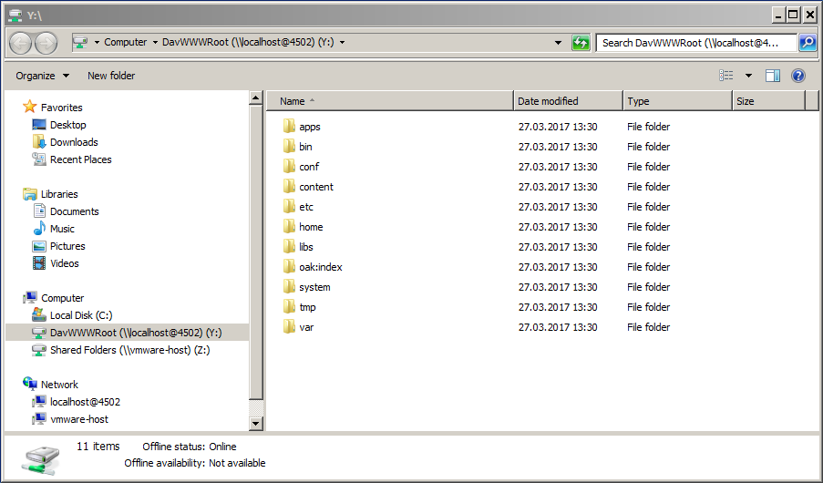

# WebDAV访问{#webdav-access}

要使用KDE通过WebDAV连接到AEM，请执行以下操作：

AEM提供WebDAV支持，可让您显示和编辑存储库内容。 通过WebDAV连接，您可以通过桌面直接访问内容存储库。 通过WebDAV连接添加到存储库中的文本和PDF文件会自动编制全文索引，并且可以使用标准搜索界面并通过标准Java™ API进行搜索。

## 常规 {#general}

[每个操作系统的详细说明](/help/sites-administering/webdav-access.md#connecting-via-webdav)都包含在此文档中，但实际上为了使用WebDAV协议连接到存储库，您需要将WebDAV客户端指向以下位置：

```xml
http://localhost:4502
```


从操作系统级别连接此URL时，该URL提供对默认工作区( `crx.default`)的WebDAV访问。 虽然对用户来说比较简单，但是它没有为他们提供指定工作区名称的额外灵活性，而工作区名称可以使用额外的[WebDAV URL](/help/sites-administering/webdav-access.md#webdav-urls)来完成。

AEM按如下方式显示存储库内容：

* 类型`nt:folder`的节点显示为文件夹。 `nt:folder`节点下的节点显示为文件夹内容。

* 类型`nt:file`的节点显示为文件。 不会显示`nt:file`节点下的节点，但会形成文件的内容。

当您使用WebDAV创建和编辑文件夹和文件时，AEM将创建和编辑必要的`nt:folder`和`nt:file`节点。 如果您计划使用WebDAV导入和导出内容，请尽量尝试使用`nt:file`和`nt:folder`节点类型。

>[!NOTE]
>
>在设置WebDAV之前，请检查[技术要求](/help/sites-deploying/technical-requirements.md#webdav-clients)。

## WebDAV URL {#webdav-urls}

WebDAV服务器的URL具有以下结构：

<table>
 <colgroup>
  <col width="100" />
  <col width="100" />
  <col width="100" />
  <col width="100" />
  <col width="100" />
 </colgroup>
 <tbody>
  <tr>
   <td>
    <code>
     <strong>URL Component</strong>
    </code></td>
   <td><code>https://&lt;host&gt;:&lt;port&gt;</code></td>
   <td><code>/&lt;crx-webapp-path&gt;</code></td>
   <td><code>/repository</code></td>
   <td><code>/&lt;workspace&gt;</code></td>
  </tr>
  <tr>
   <td>
    <code>
     <strong>Example</strong>
    </code></td>
   <td><code>http://localhost:4502</code></td>
   <td><code>/crx</code></td>
   <td><code>/repository</code></td>
   <td><code>/crx.default</code></td>
  </tr>
  <tr>
   <td><strong>描述</strong></td>
   <td>运行AEM的主机和端口</td>
   <td>AEM存储库Web应用程序的路径</td>
   <td>WebDAV servlet映射到的路径</td>
   <td>工作区的名称</td>
  </tr>
 </tbody>
</table>

通过更改路径中的工作区元素，可以映射默认工作区(`crx.default`)以外的工作区。 例如，要映射名为`staging`的工作区，请使用以下URL：

```xml
http://localhost:4502/crx/repository/staging
```

## 通过WebDAV连接 {#connecting-via-webdav}

[如上所述](/help/sites-administering/webdav-access.md#general)，要使用WebDAV协议连接到存储库，请将WebDAV客户端指向您的存储库位置。 但是，根据您的操作系统，连接客户端所涉及的步骤有所不同，可能需要配置操作系统。

提供了有关如何连接以下操作系统的说明：

* [Windows](/help/sites-administering/webdav-access.md#windows)
* [macOS](/help/sites-administering/webdav-access.md#macos)
* [Linux](/help/sites-administering/webdav-access.md#linux)

### Windows {#windows}

要成功地将Microsoft® Windows 7（及更高版本）系统连接到不使用SSL保护的AEM实例，必须在Windows中明确启用通过不安全的网络建立基本身份验证的选项。 此功能要求在WebClient的Windows注册表中进行更改。

一旦更新了注册表，AEM实例就可以映射为驱动器。

#### Windows 7及更高配置 {#windows-and-greater-configuration}

要更新注册表以允许通过不安全的网络进行基本身份验证，请执行以下操作：

1. 找到以下注册表子项：

   ```xml
   HKEY_LOCAL_MACHINE\SYSTEM\CurrentControlSet\Services\WebClient\Parameters
   ```

1. 将`BasicAuthLevel`注册表项子项设置为`2`或更大的值。

   如果不存在，请添加子键。

1. 重新启动系统以使注册表更改生效。

>[!NOTE]
>
>Adobe建议您使用与存储库用户相同的凭据创建Windows用户，否则可能会遇到权限冲突。

#### Windows 8配置 {#windows-configuration}

对于Windows 8，请按照Windows 7和更高版本](/help/sites-administering/webdav-access.md#windows-and-greater-configuration)的说明更改注册表项[。 但是，在执行此任务之前，必须启用Desktop Experience才能看到注册表项。

若要启用桌面体验，请打开&#x200B;**服务器管理器**，然后打开&#x200B;**功能**，再打开&#x200B;**添加功能**，然后打开&#x200B;**桌面体验**。

重新启动后，为Windows 7及更高版本描述的注册表项可用。 按照适用于Windows 7及更高版本的说明对其进行修改。

#### 在Windows中连接 {#connecting-in-windows}

要在Windows环境中通过WebDAV连接到AEM，请执行以下操作：

1. 打开&#x200B;**Windows资源管理器**&#x200B;或&#x200B;**文件资源管理器**，然后单击&#x200B;**计算机**&#x200B;或&#x200B;**此电脑**。

   

1. 要启动向导，请单击&#x200B;**映射网络驱动器**。
1. 输入映射详细信息：

   * **驱动器**：选择任何可用盘符
   * **文件夹**： `http://localhost:4502`
   * 检查&#x200B;**使用其他凭据连接**

   单击“完成”

   

   >[!NOTE]
   >
   >如果AEM在另一个端口上，请使用该端口号，而不是4502。 此外，如果您没有在本地计算机上运行内容存储库，请将`localhost`替换为相应的服务器名称或IP地址。

1. 输入用户名`admin`和密码`admin`。 Adobe建议您使用预配置的admin帐户进行测试。

   

1. 向导将关闭，新映射的驱动器将在Windows资源管理器或“文件资源管理器”窗口中打开。

   

Windows现在已通过WebDAV将AEM映射为驱动器，您可以将其用作任何其他驱动器。

### macOS {#macos}

在macOS上通过WebDAV连接不需要任何配置步骤。 您可以连接到WebDAV服务器。

1. 导航到任何&#x200B;**查找器**&#x200B;窗口并单击&#x200B;**转到**&#x200B;和&#x200B;**连接到服务器**，或按&#x200B;**Command+k**。
1. 在&#x200B;**连接到服务器**&#x200B;窗口中，输入AEM位置：

   * `http://localhost:4502`

   >[!NOTE]
   >
   >如果AEM在另一个端口上，请使用该端口号，而不是4502。 此外，如果您没有在本地计算机上运行内容存储库，请将`localhost`替换为相应的服务器名称或IP地址。

1. 当系统提示您进行身份验证时，请输入用户名`admin`和密码`admin`。 Adobe建议您使用预配置的admin帐户进行测试。

macOS现在已通过WebDAV连接到AEM，您可以将其用作Mac上的任何其他文件夹。

### Linux® {#linux}

在Linux®上通过WebDAV进行连接不需要任何配置，但需要执行一些步骤才能建立连接，具体步骤因您的桌面环境而异。

#### 地名 {#gnome}

要使用GNOME通过WebDAV连接到AEM，请执行以下操作：

1. 在Nautilus （文件资源管理器）中，选择&#x200B;**位置**&#x200B;并选择&#x200B;**连接到服务器**。
1. 在&#x200B;**连接到服务器**&#x200B;窗口中，选择“服务类型”中的WebDAV (HTTP)。

1. 在&#x200B;**服务器**&#x200B;中，输入`http://localhost:4502/crx/repository/crx.default`

   >[!NOTE]
   >
   >如果AEM在另一个端口上，请使用该端口号，而不是4502。 此外，如果您没有在本地计算机上运行内容存储库，请将`localhost`替换为相应的服务器名称或IP地址。

1. 在&#x200B;**文件夹**&#x200B;中，输入`/dav`
1. 输入用户名`admin`。 Adobe建议您使用预配置的admin帐户进行测试。
1. 将端口保留为空，并为连接输入任意名称。
1. 单击&#x200B;**连接**。AEM会提示您输入密码。
1. 输入密码`admin`并单击&#x200B;**连接**。

GNOME现在已将AEM装载为卷，您可以像使用任何其他卷一样使用它。

#### KDE {#kde}

1. 打开网络文件夹向导。
1. 选择&#x200B;**WebFolder**(webdav)，然后单击“下一步”。
1. 在&#x200B;**名称**&#x200B;中，键入连接名称。
1. 在&#x200B;**用户**&#x200B;中，输入`admin.`Adobe建议您使用预配置的管理员帐户。
1. 在&#x200B;**服务器**&#x200B;中，输入`http://localhost:4502/crx/repository/crx.default`

   >[!NOTE]
   >
   >如果AEM在另一个端口上，请使用该端口号，而不是4502。 此外，如果您没有在本地计算机上运行内容存储库，请将`localhost`替换为相应的服务器名称或IP地址

1. 在&#x200B;**文件夹**&#x200B;中，输入`dav`

1. 单击&#x200B;**保存并连接**。
1. 提示输入密码时，输入密码`admin`并单击&#x200B;**连接**。

KDE现在已将AEM装载为卷，您可以像使用任何其他卷一样使用它。
