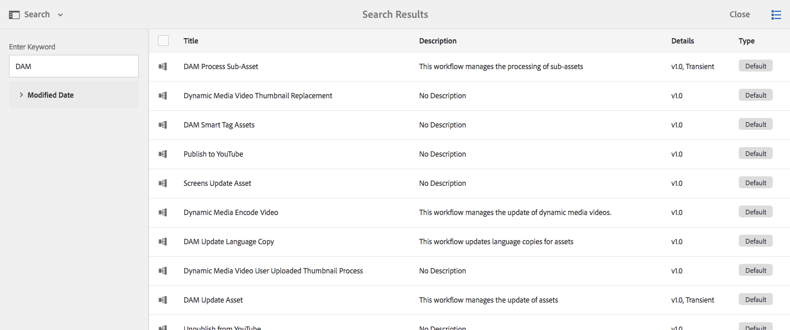

# 开始工作流{#starting-workflows}

在管理工作流时，您可以使用各种方法开始他们：

* 手动：

   * 从[工作流模型](#workflow-models)。
   * 使用工作流包进行[批处理](#workflow-packages-for-batch-processing)。

* 自动：

   * 响应节点变化；[使用启动器](#workflows-launchers)。

>[!NOTE]
>
>作者还可使用其他方法；有关完整详细信息，请参阅：
>
>* [将工作流应用于页面](/help/sites-authoring/workflows-applying.md)
>* [如何将工作流应用于DAM资产](/help/assets/assets-workflow.md)
>* [AEM Forms](https://helpx.adobe.com/aem-forms/6-2/aem-workflows-submit-process-form.html)
>* [翻译项目](/help/sites-administering/tc-manage.md)

>

## 工作流模型 {#workflow-models}

您可以根据“工作流模型”控制台上列出的某个模型](/help/sites-administering/workflows.md#workflow-models-and-instances)开始工作流[。 唯一的必需信息是有效负荷，但也可以添加标题和／或评论。

## 工作流启动器{#workflows-launchers}

工作流启动器监视内容存储库中的更改，以根据已更改节点的位置和资源类型启动工作流。

使用&#x200B;**启动器**&#x200B;可以：

* 查看已为特定节点启动的工作流。
* 选择在创建／修改／删除特定节点／节点类型时要启动的工作流。
* 删除现有的工作流到节点关系。

可以为任何节点创建启动器。 但是，对某些节点所做的更改不会启动工作流。 对以下路径下的节点所做的更改不会导致工作流启动：

* `/var/workflow/instances`
* 位于`/home/users`分支中任意位置的工作流收件箱节点
* `/tmp`
* `/var/audit`
* `/var/classes`
* `/var/eventing`
* `/var/linkchecker`
* `/var/mobile`
* `/var/statistics`

   * 异常：对`/var/statistics/tracking`*do*&#x200B;下的节点所做的更改会导致工作流启动。

标准安装中包含各种定义。 这些功能适用于数字资产管理和社交协作任务:

## 批处理{#workflow-packages-for-batch-processing}的工作流包

工作流包是可以作为有效负荷传递到工作流以进行处理的包，允许处理多个资源。

工作流包：

* 包含指向一组资源（如页面、资产）的链接。
* 包含包信息，如创建日期、创建包的用户和简短描述。
* 使用专用页面模板进行定义；这些页面允许用户指定包中的资源。
* 可多次使用。
* 可以由用户在工作流实例实际运行时更改（添加或删除资源）。

## 从“模型”控制台{#starting-a-workflow-from-the-models-console}启动工作流

1. 使用&#x200B;**工具**、**工作流**、**模型**&#x200B;导航到&#x200B;**模型**&#x200B;控制台。
1. 选择工作流(根据控制台视图);您还可以根据需要使用搜索（左上方）:

   

   >[!NOTE]
   >
   >**[临时](/help/sites-developing/workflows.md#transient-workflows)**&#x200B;指示器显示不会保留工作流历史记录的工作流。

1. 从工具栏中选择&#x200B;**开始工作流**。
1. 此时将打开“运行工作流”对话框，您可以指定：

   * **有效负荷**

      这可以是页面、节点、资产、包等其他资源。

   * **标题**

      帮助识别此实例的可选标题。

   * **注释**

      可选注释，帮助指示此实例的详细信息。
   

## 创建启动器配置{#creating-a-launcher-configuration}

1. 使用&#x200B;**工具**、**工作流**&#x200B;和&#x200B;**启动器**&#x200B;导航到&#x200B;**工作流启动器**&#x200B;控制台。
1. 选择&#x200B;**创建**，然后选择&#x200B;**添加启动器**&#x200B;以打开对话框：

   

   * **事件类型**

      将启动工作流的事件类型:

      * 创建时间
      * 修改时间
      * 已删除
   * **Notetype**

      工作流启动器应用的节点类型。

   * **路径**

      工作流启动器应用的路径。

   * **运行模式**

      工作流启动器应用的服务器类型。 选择&#x200B;**作者**、**发布**&#x200B;或&#x200B;**作者和发布**。

   * **条件**

      节点值的条件列表，在评估后，确定是否启动工作流。 例如，当节点的属性名具有值“用户”时，以下条件会导致工作流启动：

      name==用户

   * **功能**

      要启用的列表功能。 使用下拉选择器选择所需的功能。

   * **禁用的功能**

   要禁用的功能列表。 使用下拉选择器选择所需的功能。

   * **工作流模型**

      在定义的条件下的Nodetype和／或路径上发生事件类型时要启动的工作流。

   * **描述**

      您自己的文本，用于描述和标识启动器配置。

   * **激活**

      控制是否激活了工作流启动器：

      * 选择&#x200B;**启用**&#x200B;以在满足配置属性时启动工作流。
      * 选择&#x200B;**在工作流不应执行时禁用**（即使在配置属性被满足时也不例外）。
   * **排除列表**

      这指定在确定是否应触发工作流时要排除（即忽略）的任何JCR事件。

      此启动器属性是以逗号分隔的项目列表:&quot;

      * `property-name` 忽略在 `jcr` 指定的属性名称上触发的任何事件。&quot;
      * `event-user-data:<*someValue*>` 忽略包含通过 `*<someValue*`API `user-data` 设置的 [ `ObservationManager` >](https://docs.adobe.com/content/docs/en/spec/jsr170/javadocs/jcr-2.0/javax/jcr/observation/ObservationManager.html#setUserData(java.lang.String)的事件。

      例如：

      `jcr:lastModified,dc:modified,dc:format,jcr:lastModifiedBy,imageMap,event-user-data:changedByWorkflowProcess`

      此功能可用于通过添加排除项来忽略其他工作流进程触发的任何更改：

      `event-user-data:changedByWorkflowProcess`

1. 选择&#x200B;**创建**&#x200B;以创建启动器并返回控制台。

   在发生相应事件后，将触发启动器并启动工作流。

## 管理启动器配置{#managing-a-launcher-configuration}

创建启动器配置后，您可以使用相同的控制台选择实例，然后选择&#x200B;**视图属性**（并编辑它们）或&#x200B;**删除**。
