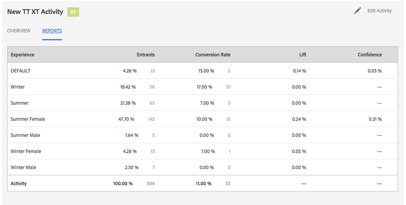

# 管理活动{#managing-activities}

通过“活动”控制台，您可以创建、组织和管理营销 [活动](/help/sites-authoring/personalization.md#activities) 您的品牌：

* 添加品牌.
* 为每个品牌添加并配置活动.
* 管理活动.

>[!NOTE]
>
>如果您使用Adobe Target作为定位引擎，还可以 [查看活动的性能数据](#viewing-performance-and-converting-winning-experiences-a-b-test). 如果您使用的是A/B测试，则可以 [转换入选者](#viewing-performance-and-converting-winning-experiences-a-b-test).

在“活动”控制台上，按品牌组织活动。 您可以使用品牌和文件夹来构建活动的组织。 通过点按/单击可导航到活动控制台 **个性化** 和点按/单击 **活动**.

在“定位”模式下，可以使用活动来[创作目标内容](/help/sites-authoring/content-targeting-touch.md)，您也可以在该模式下创建活动。在“定位”模式下创建的活动将显示在“活动”控制台中。

活动显示时带有标签，用于描述定义的活动类型：

* XT - Adobe Target体验定位
* A/B - Adobe Target A/B测试
* AEM - Adobe Experience Manager定位（contexthub或clientcontext驱动）

>[!NOTE]
>
>可用的活动类型由以下因素决定：
>
>* 如果 **xt_only** 在AEM端使用的Adobe Target租户(clientcode)上启用选项以连接到Adobe Target，然后您可以创建 **仅限** AEM XT活动。
>
>* 如果 **xt_only** 选项为 **非** 已在Adobe Target租户(clientcode)上启用，然后您可以创建 **两者** AEM XT和A/B活动。
>
>**其他说明：** **xt_only** options是对特定Target租户(clientcode)应用的设置，只能在Adobe Target中直接修改。 您无法在 AEM 中启用或禁用此选项。

>[!CAUTION]
>
>您必须确保发布实例中的活动设置节点 **cq:ActivitySettings** 安全，以使其不可由普通用户访问。该活动设置节点应当只能由负责将活动同步到 Adobe Target 的服务访问。
>
>请参阅[与 Adobe Target 集成的先决条件](/help/sites-administering/target-requirements.md#securingtheactivitysettings)，以了解详细信息。

## 使用“活动”控制台创建品牌 {#creating-a-brand-using-the-activities-console}

创建要为其管理营销活动的品牌。

使用“活动”控制台创建品牌后，[“选件”控制台](/help/sites-authoring/offerlib.md)（可在此处创建活动体验的选件）中也会出现该品牌。

1. 在“导航”控制台中，单击或点按&#x200B;**个性化**。单击或点按 **活动**.

   

1. 在“活动”控制台中，单击或点按 **创建**&#x200B;则&#x200B;**创建品牌**.
1. 选择品牌模板，然后单击或点按 **下一个**.
1. 键入您希望品牌在“活动”和“选件”控制台中显示的标题。 （可选）键入或选择一个或多个要与品牌关联的标记。
1. 单击或点按&#x200B;**创建**。您的品牌将显示在“活动”控制台中。

## 使用“活动”控制台添加/编辑活动 {#adding-editing-an-activity-using-the-activities-console}

添加活动或编辑现有活动，以将营销工作重点放在特定受众上。 在创建/编辑活动时，需要指定以下信息：

* **名称：**&#x200B;活动的名称。
* **定位引擎：**&#x200B;将 [AEM](/help/sites-authoring/personalization.md#aem) 或 [Adobe Target](/help/sites-authoring/personalization.md#adobe-target) 作为目标内容的引擎。

* **选择 Target 配置：**（仅限 Adobe Target）此活动连接到 Adobe Target 的云配置。只有为定位引擎选择了 Adobe Target 时，才会显示此选项。
* **活动类型：**活动类型 — A/B测试或体验定位
* **目标：**（可选）活动描述。
* **体验：**&#x200B;受众名称和您定位的营销区段之间的映射。
* **流量百分比：**&#x200B;如果选择 A/B 测试，则可以更改每个体验的流量（百分比）。
* **持续时间：**&#x200B;应用活动的时间段。
* **优先级：**&#x200B;活动的相对优先级。当活动为相同的用户区段提供内容时，具有较高优先级的活动优先。
* **目标量度：**&#x200B;如果选择 Adobe Target 作为定位引擎，则可向活动添加成功量度。需要一个成功量度。

>[!NOTE]
>
>新的 Adobe Target 活动需要在目标内容编辑器中（而不是在&#x200B;**活动**&#x200B;控制台中）***创建***，因为与 Adobe Target 的同步将失败。
>
>但是，您可以在控制台中编辑现有Adobe Target活动。

要添加活动，请执行以下操作：

1. 单击或点按要为其创建活动的品牌，单击或点按 **创建** 然后 **创建活动**. 如果您正在编辑，请选择活动，然后单击或点按 **编辑**.
1. 提供以下信息，然后单击或点按 **下一个**：

   * 活动的名称。
   * 要使用的定位引擎。 默认情况下，将选中ContextHub (AEM)。 如果需要使用Adobe Target，请在目标内容编辑器中创建活动。
   * 如果您选择了Adobe Target作为定位引擎，请选择/编辑要用于连接到Adobe Target的云配置。 （请注意，请勿选择为云配置创建的框架。）
   * （可选）活动的目标或描述。
   * 选择活动类型。

1. 向活动添加一个或多个体验。 单击或点按 **添加体验**。
1. 如果您使用的是AEM定位或Adobe Target体验定位：

   1. 单击或点按**选择受众**，然后选择您的体验定位的区段。
   1. 单击或点按&#x200B;**添加体验**，键入名称，然后单击或点按&#x200B;**确定**。

   1. 单击或点按&#x200B;**下一步**。

   如果您使用的是Adobe Target A/B测试：

   1. 单击或点按受众框中的铅笔可选择受众。
   1. 单击或点按&#x200B;**添加体验**，键入名称，然后单击或点按&#x200B;**确定**。

   1. 输入显示每个体验的流量百分比。
   1. 单击或点按&#x200B;**下一步**。

1. 要指定活动开始的时间，请使用 **开始** 下拉菜单选择以下值之一：

   * **激活时：** 激活包含目标内容的页面时，活动开始。
   * **指定的日期和时间：** 特定时间。 选择此选项时，单击或点按日历图标，选择日期，然后指定活动开始的时间。

1. 要指定活动结束的时间，请使用“结束”下拉菜单选择以下值之一：

   * **取消激活时**：在停用包含目标内容的页面时，活动结束。
   * **指定的日期和时间**：特定时间。 选择此选项时，单击或点按日历图标，选择日期，然后指定结束活动的时间。

1. 要指定活动的优先级，请使用滑块选择 **低**， **普通**，或 **高**.
1. 如果您将Adobe Target用作定位引擎，请选择要通过此活动衡量的指标。 请参阅[配置活动和设置目标](/help/sites-authoring/content-targeting-touch.md)，以了解有关可用成功量度的更多信息。您必须至少选择一个目标。
1. 单击或点按 **保存**.

   >[!NOTE]
   >
   >创建活动后，您需要发布活动使其可用。

## 发布和取消发布活动 {#publishing-and-unpublishing-activities}

您需要发布活动以使其可用。 相反，您可能希望通过取消发布活动来使其不可用。

>[!NOTE]
>
>取消发布活动时，除非您刷新页面，否则活动的状态不会改变。

要发布或取消发布活动，请执行以下操作：

1. 单击或点按品牌，然后单击或点按包含要发布或取消发布的活动的区域。
1. 点按或单击要发布或取消发布的一个或多个活动旁边的图标。

   

1. 要发布，请点按或单击 **Publish**. 要取消发布，请点按或单击 **取消发布**. 您的活动已发布或已取消发布，并且其状态在“活动”控制台中发生了更改（可能需要刷新）。

## 创作实例和发布实例上的活动 {#activities-on-author-and-publish-instances}

激活使用Adobe Target目标引擎的活动后，将在发布实例上创建第二个活动：

* 创作实例上的活动会跟踪创作实例上的活动，对于模拟访客体验非常有用。 为此活动记录的Analytics仅反映创作实例上发生的情况。
* 发布实例上的活动反映并响应发布服务器上的活动。 这是在公共网站上运行的活动。 只有发布活动与跟踪和分析实际公共网站的使用情况相关。

## 查看性能和转换入选体验（A/B测试） {#viewing-performance-and-converting-winning-experiences-a-b-test}

您可以查看任何Adobe Target活动（XT或A/B）的性能。 如果您使用的是A/B测试，则还可以转换入选体验，这会成为默认体验。

要查看活动业绩并转换入选体验，请执行以下操作：

1. 在&#x200B;**个性化**&#x200B;中，单击或点按&#x200B;**活动**，以导航到&#x200B;**活动**&#x200B;控制台。
1. 单击或点按要查看其活动的品牌。
1. ********&#x200B;显示性能数据。

   

1. 单击或点按&#x200B;**推送入选方**&#x200B;链接，以将入选体验推送为默认体验。

   如果转换入选方，则会：

   * 禁用当前活动
   * 修改所有页面，并将目标内容替换为入选体验的实际内容。入选体验的内容&#x200B;**无需**&#x200B;定位即可成为常规页面的一部分。

   

   入选体验是指可在报表中生成更多提升的体验，该体验基于转化率。

1. 单击或点按 **是** 要确认是否想要转换入选者，请禁用当前体验并将其替换为入选体验的内容。

## 与Adobe Target同步活动 {#synchronizing-activities-with-adobe-target}

使用Adobe Target定位引擎的活动将与Adobe Target营销活动同步。 当满足以下条件时，活动会自动同步到Adobe Target：

* 该活动至少包含一个体验。
* 至少一个体验包含映射的区段和一个选件。
* 活动中的每个体验必须具有相同数量的选件。

这些条件适用于创作实例和发布实例上的活动。

同步活动后，将在Adobe Target中创建相应的营销活动：

* 发布实例上的活动与相应的Adobe Target营销活动具有相同的名称。
* 创作实例中的活动与具有相同名称但带有 `_author` 后缀的 Target 营销活动相对应。

修改活动后，_author活动会立即同步。 即时同步允许使用Client Context或ContextHub模拟活动。

在将活动发布到AEM发布实例时，将同步发布活动。

## 活动同步疑难解答 {#troubleshooting-activity-synchronization}

与 Adobe Target 同步活动时，AEM 中包含一个名为 `thirdPartyId` 的活动属性。此属性的值基于活动在 AEM 存储库中的路径。Adobe Target 中的任意两个营销活动不能具有相同的 `thirdPartyId` 属性值。因此，如果 Adobe Target 中的某个现有营销活动（具有不同的类型：AB、XT）使用的 `thirdPartyId` 值与某个活动相同，则该活动的同步操作会失败。

在以下情况下，可能会发生这种情况：

1. 创建活动并与Adobe Target同步。
1. 在其他AEM实例上，使用相同的名称在相同品牌下创建活动。 尝试同步此活动时失败。

在以下情况下，也可能发生这种情况：

1. 创建活动并与Adobe Target同步。 然后，该活动将在AEM上删除。
1. 活动是在与已删除活动相同的品牌下使用相同的名称创建的。 尝试同步此活动时失败。

要避免出现同步问题，请始终为活动使用唯一的名称。 如果活动同步失败，您可以删除 Adobe Target 中具有相同名称的营销活动，但前提是该营销活动未在使用中。

>[!NOTE]
>
>在Adobe Target中创建营销活动时，会分配一个名为的属性 `thirdPartyId t`每次营销活动。 在 Adobe Target 中删除营销活动时，不会删除 `thirdPartyId`。您不能为不同类型（AB、XT）的营销活动重复使用 `thirdPartyId`，也不能手动删除此属性。为避免出现此问题，请为每个营销活动指定唯一的名称；这样，营销活动名称便无法在不同的营销活动类型中重复使用。
>
>如果在同一种营销活动类型中使用相同的名称，则会覆盖现有的营销活动。
>
>如果在同步时遇到错误“请求失败。`thirdPartyId` 已存在”，请更改营销活动的名称，然后重新进行同步。
