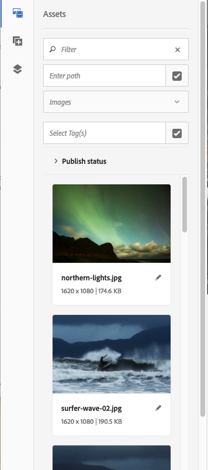
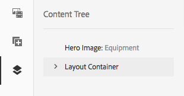
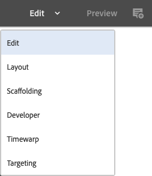

# 创作 - 环境和工具{#authoring-the-environment-and-tools}

AEM 的创作环境提供了各种可用于组织和编辑内容的机制. 可以从各种控制台和页面编辑器访问提供的工具。

## 管理您的站点 {#managing-your-site}

**站点**&#x200B;控制台允许您使用标题栏、工具栏、操作图标（适用于所选资源）和痕迹导航来导航和管理您的网站，选择后还可使用辅助边栏（例如时间轴和引用）。

例如，列视图：

## 编辑页面内容 {#editing-page-content}

您可以使用页面编辑器来编辑页面。例如：

`https://localhost:4502/editor.html/content/we-retail/us/en/equipment.html`

>[!NOTE]
>
>当您首次打开页面进行编辑时，会显示一系列幻灯片，带您浏览各项功能。
>
>如果不想浏览，可以跳过；如果想重新浏览，可以随时从&#x200B;**页面信息**&#x200B;菜单中进行选择。

## 访问帮助 {#accessing-help}

在编辑页面时，**帮助**&#x200B;可从以下位置访问：

* [**页面信息**](/help/sites-authoring/editing-page-properties.md#page-properties)&#x200B;选择器，这将显示幻灯片介绍（在您第一次访问编辑器时显示）。
* 适用于特定组件的[配置](/help/sites-authoring/editing-content.md#edit-configure-copy-cut-delete-paste)对话框（使用对话工具栏中的 ? 图标）；这将根据上下文显示帮助。

其他[与帮助相关的资源可以从控制台中访问](/help/sites-authoring/basic-handling.md#accessing-help)。

## 组件浏览器 {#components-browser}

组件浏览器会显示当前页面上可用的所有组件。这些组件可拖动至相应的位置，然后进行编辑以添加您的内容。

组件浏览器是侧面板中的一个选项卡（侧面板中还有[资产浏览器](/help/sites-authoring/author-environment-tools.md#assets-browser)和[内容树](/help/sites-authoring/author-environment-tools.md#content-tree)）。要打开（或关闭）侧面板，请使用工具栏左上方的图标：

打开侧面板时，它将从左侧滑开（根据需要选择&#x200B;**组件**&#x200B;选项卡）。打开该选项卡后，您可以浏览所有可用于页面的组件。

实际外观和操作取决于您所使用的设备类型：

>[!NOTE]
>
>系统能够检测到宽度小于 1024 像素的移动设备。这种情况也可能出现在较小的桌面窗口中。

* **移动设备（例如 iPad）**

   组件浏览器完整覆盖了编辑的页面。

   要向页面添加组件，请长按所需的组件，然后将其向右移动 - 组件浏览器将关闭以重新显示该页面，此时您便可以放置组件。

   

* **桌面设备**

   将在窗口左侧打开组件浏览器。

   要向页面添加组件，请单击所需的组件，然后将其拖动到所需的位置。

   

   组件通过以下形式来表示

   * 组件名称
   * 组件组（灰色）
   * 图标或缩写

      * 标准组件的图标是单色的。
      * 缩写始终由组件名称的前两个字符组成。

   从&#x200B;**组件**&#x200B;浏览器顶部的工具栏可以：

   * 按名称筛选组件。
   * 使用下拉选择框将显示内容限定为特定组。

   有关组件的更多详细说明，您可以单击或点按&#x200B;**组件**&#x200B;浏览器（如果可用）中组件旁边的信息图标。例如，对于&#x200B;**布局容器**：

   

   有关可供您使用的组件的更多信息，请参阅[组件控制台](/help/sites-authoring/default-components-console.md)。

## 资产浏览器 {#assets-browser}

资产浏览器会显示当前页面上可直接使用的所有[资产](/help/assets/home.md)。

资产浏览器是侧面板中的一个选项卡，侧面板中还有[组件浏览器](/help/sites-authoring/author-environment-tools.md#components-browser)和[内容树](/help/sites-authoring/author-environment-tools.md#content-tree)。要打开或关闭侧面板，请使用工具栏左上角的图标：

打开侧面板时，它将从左侧滑开。根据需要选择&#x200B;**资产**&#x200B;选项卡。

打开资产浏览器后，您可以浏览所有可用于页面的资产。如果需要，可使用无限滚动展开列表。

要向页面添加资产，请选择资产并将其拖动到所需的位置。可以添加的资产包括：

* 相应类型的现有组件。

   * 例如，可以将图像类型的资产拖动到图像组件上。

* 段落系统中用于创建相应类型新组件的[占位符](/help/sites-authoring/editing-content.md#component-placeholder)。

   * 例如，可以将图像类型的资产拖动到段落系统中，以创建图像组件。

>[!NOTE]
>
>此功能适用于特定资产和组件类型。有关更多详细信息，请参阅[使用资产浏览器插入组件](/help/sites-authoring/editing-content.md#inserting-a-component-using-the-assets-browser)。

从资产浏览器的顶部工具栏中，可以按以下条件筛选资产：

* 名称
* 路径
* 资产类型，例如图像、手稿、文档、视频、页面、段落和产品
* 资产特性，如方向（纵向、横向、正方形）和样式（颜色、单色、灰度）

   * 仅适用于某些资产类型

实际外观和操作取决于您所使用的设备类型：

>[!NOTE]
>
>在宽度小于 1024 像素时将视为检测到移动设备，这种情况也可能出现在较小的桌面窗口中。

* **移动设备，例如 iPad**

   资产浏览器完全覆盖了所编辑的页面。

   要向页面添加资产，请长按所需的资产，然后将其向右移动 - 资产浏览器将关闭以重新显示该页面，此时您便可以向所需的组件添加资产。

   

* **桌面设备**

   将在窗口左侧打开资产浏览器。

   要向页面添加资产，请单击所需的资产，然后将其拖动到所需的组件或位置。

   

如果您需要快速更改资产，可以直接从资产浏览器启动[资产编辑器](/help/assets/manage-assets.md)，方法是单击资产名称旁边显示的编辑图标。

## 内容树 {#content-tree}

**内容树**&#x200B;概述了层次结构中页面上的所有组件，以便您能够快速了解页面的组成方式。

内容树是侧面板中的一个选项卡（侧面板中还有组件浏览器和资产浏览器）。要打开（或关闭）侧面板，请使用工具栏左上方的图标：

打开侧面板时，它将（从左侧）滑开。根据需要选择&#x200B;**内容树**&#x200B;选项卡。打开该选项卡后，您会看到页面或模板的树视图表现形式，以便您更方便地了解其内容的层次构成方式。此外，您还可以更轻松地在复杂页面上的组件之间进行跳转。

页面可以由许多相同类型的组件轻松组成，因此内容（组件）树会在组件类型名称（黑色）之后显示描述性文本（灰色）。描述性文本来自组件的常见属性，例如标题或文本。

组件类型将以用户语言显示，而组件描述文本将来自页面语言。

单击组件旁边的 V 形图标将折叠或展开该级别。

>[!NOTE]
>
>如果您正在浏览器宽度小于 1024 像素的移动设备上编辑页面，则内容树将不可用。

单击组件将在页面编辑器中突出显示组件。可用的操作将取决于页面状态：

* 例如，基本页面：

   `https://localhost:4502/editor.html/content/we-retail/language-masters/en/equipment.html`

   

   如果在树中单击的组件是可编辑的，则会在其名称右侧显示一个扳手图标。单击此图标将直接启动组件的编辑对话框。

   

* 或者属于 [Live Copy](/help/sites-administering/msm.md) 一部分且其中组件继承自其他页面的页面；例如：

   `https://localhost:4502/editor.html/content/we-retail/us/en/equipment.html`

   

## 片段 – 关联的内容浏览器 {#fragments-associated-content-browser}

如果您的页面包含内容片段，那么您还可以访问[适用于关联内容的浏览器](/help/sites-authoring/content-fragments.md#using-associated-content)。

## 引用 {#references}

**引用**&#x200B;显示了与所选页面的所有关联：

* Blueprint
* 启动项
* Live Copy
* 语言副本
* 传入链接
* 对引用组件的使用：借入和借出的内容
* 对产品页面的引用（从“商务 - 产品”控制台实现）

打开所需的控制台，然后导航到所需资源并使用以下方法打开&#x200B;**引用**：

[选择您需要的资源](/help/sites-authoring/basic-handling.md#viewing-and-selecting-resources)以显示与该资源相关的引用类型列表：

选择相应的引用类型可获取详细信息。在某些情况下，当您选择了某个特定引用后，您还可以执行其他操作，包括：

* **传入链接**，在选择特定链接后提供引用页面的页面列表，并可直接访问以&#x200B;**编辑**&#x200B;这些页面之一

* 使用&#x200B;**引用**&#x200B;组件的借入和借出内容的实例，您可以从此处导航至正在引用/引用的页面

* [对产品页面的引用](/help/commerce/cif-classic/administering/generic.md#showing-product-references)（可以从“商务 - 产品”控制台实现）
* [启动项](/help/sites-authoring/launches.md)，提供对相关启动项的访问权
* [Live Copy](/help/sites-administering/msm.md) 显示基于选定资源的所有 Live Copy 的路径。
* [Blueprint](/help/sites-administering/msm-best-practices.md)，提供详细信息和各种操作
* [语言副本](/help/sites-administering/tc-manage.md#creating-translation-projects-using-the-references-panel)，提供详细信息和各种操作

例如，您可以在引用组件中修复中断的引用：

## 事件 – 时间线 {#events-timeline}

对于相应的资源（例如&#x200B;**站点**&#x200B;控制台中的页面或&#x200B;**资产**&#x200B;控制台中的资产），[可使用时间线显示任何选定项目上的近期活动](/help/sites-authoring/basic-handling.md#timeline)。

打开所需的控制台，然后导航到需要的资源并使用以下方法打开&#x200B;**时间线**：

[选择您需要的资源](/help/sites-authoring/basic-handling.md#viewing-and-selecting-resources)，然后选择&#x200B;**显示全部**&#x200B;或&#x200B;**活动**，可列出对所选资源的所有近期操作：

## 页面信息 {#page-information}

“页面信息”（均衡器图标）会打开一个菜单，其中也会提供有关上次编辑和上次发布的详细信息。根据页面、其站点和您的实例的特性，可用的选项可能会更多，也可能会更少：

* [打开属性](/help/sites-authoring/editing-page-properties.md)
* [转出页](/help/sites-administering/msm.md#msm-from-the-ui)
* [启动工作流](/help/sites-authoring/workflows-applying.md#starting-a-workflow-from-the-page-editor)
* [锁定页面](/help/sites-authoring/editing-content.md#locking-a-page)
* [发布页面](/help/sites-authoring/publishing-pages.md#main-pars-title-10)
* [取消发布页面](/help/sites-authoring/publishing-pages.md#main-pars-title-5)
* [编辑模板](/help/sites-authoring/templates.md)；在该页面基于[可编辑的模板](/help/sites-authoring/templates.md#editable-and-static-templates)时

* [以发布的形式查看](/help/sites-authoring/editing-content.md#view-as-published)
* [以管理员身份查看](/help/sites-authoring/basic-handling.md#viewing-and-selecting-resources)
* [帮助](/help/sites-authoring/basic-handling.md#accessing-help)

例如，在适当时，**页面信息**&#x200B;还有以下选项：

* [提升启动项](/help/sites-authoring/launches-promoting.md)，如果该页面是启动项。
* [在经典UI中打开](/help/sites-authoring/select-ui.md#switching-to-classic-ui-when-editing-a-page) 如果此选项已 [由管理员启用](/help/sites-administering/enable-classic-ui-editor.md)

另外，在适当时，**页面信息**&#x200B;还允许访问分析和建议。

## 页面模式 {#page-modes}

编辑页面时可以使用多种模式来执行不同的操作：

* [编辑](/help/sites-authoring/editing-content.md) - 编辑页面内容时使用的模式。
* [布局](/help/sites-authoring/responsive-layout.md) - 允许您创建和编辑依赖于设备的响应式布局（如果页面基于布局容器）

* [基架](/help/sites-authoring/scaffolding.md) - 帮助您创建大量结构相同但内容不同的页面。
* [开发人员](/help/sites-developing/developer-mode.md) - 允许您执行各种操作（需要权限）。这些操作包括检查页面及其组件的技术详细信息。

* [设计](/help/sites-authoring/default-components-designmode.md) - 使您能够允许/禁止组件在页面上使用，并配置组件的设计（如果页面基于[静态模板](/help/sites-authoring/templates.md#editable-and-static-templates)）。

* [定位](/help/sites-authoring/content-targeting-touch.md) - 通过在所有渠道中进行定位和衡量来提高内容相关性。
* [Activity Map](/help/sites-authoring/page-analytics-using.md#analyticsvisiblefromthepageeditor) - 显示页面的 Analytics 数据。

* [时间扭曲](/help/sites-authoring/working-with-page-versions.md#timewarp) - 允许您查看页面在特定时间点的状态。
* [Live Copy 状态](/help/sites-authoring/editing-content.md#live-copy-status) - 允许快速查看 Live Copy 状态以及继承/未继承的组件。
* [预览](/help/sites-authoring/editing-content.md#previewing-pages) - 用于查看将在发布环境中显示的页面；或使用内容中的链接进行导航。

* [注释](/help/sites-authoring/annotations.md) - 用于在页面上添加或查看注释。

您可以使用右上角的图标访问这些模式。实际图标会因您当前所使用的模式而有所不同：

>[!NOTE]
>
>* 根据页面的特性，某些模式可能不可用。
>* 某些模式需要相应的许可/权限才能访问。
>* 由于空间限制，“开发人员”模式在移动设备上不可用。
>* 使用[键盘快捷键](/help/sites-authoring/page-authoring-keyboard-shortcuts.md) (`Ctrl-Shift-M`) 可以在&#x200B;**预览**&#x200B;模式和当前选定的模式（例如，**编辑**、**布局**&#x200B;等）之间切换。
>

## 路径选择 {#path-selection}

在创作时，通常需要选择其他资源，例如在定义指向其他页面或资源的链接或者选择图像时。为了轻松选择路径，[路径字段](/help/sites-authoring/author-environment-tools.md#path-fields)提供了自动完成功能，并且还可通过[路径浏览器](/help/sites-authoring/author-environment-tools.md#path-browser)做出更可靠的选择。

### 路径字段 {#path-fields}

此处所用的说明示例是图像组件。有关使用和编辑组件的更多信息，请参阅[页面创作组件](/help/sites-authoring/default-components.md)。

路径字段现在具有自动完成和先行智能功能，可更方便地查找资源。

单击路径字段中的&#x200B;**打开选择对话框**&#x200B;按钮可打开[路径浏览器](/help/sites-authoring/author-environment-tools.md#path-browser)对话框，以查看更多详细选择选项。

或者您可以在路径字段中开始输入，AEM 将会在您输入的同时提供匹配的路径。

### 路径浏览器 {#path-browser}

路径浏览器的组织方式与站点控制台的[列视图](/help/sites-authoring/basic-handling.md#column-view)相似，允许查看更多详细资源选择选项。

* 选择资源后，对话框右上角的&#x200B;**选择**&#x200B;按钮将变为活动状态。单击或点按以确认选择，或者单击或点按&#x200B;**取消**&#x200B;以中止操作。
* 如果上下文允许选择多个资源，则选择某个资源也会激活“选择 **** ”按钮，但也会将选定资源的计数添加到窗口的右上角。 单击该 **数字旁边的** X可取消选择全部。
* 在树中导航时，您的位置会反映在对话框顶部的痕迹导航中。还可使用这些痕迹导航在资源层次结构中快速跳转。
* 您随时都可以使用对话框顶部的搜索字段。单击搜索字段中的 **X** 可清除搜索。
* 要缩小搜索范围，您可以显示过滤器选项并按特定路径筛选结果。

   

## 键盘快捷键 {#keyboard-shortcuts}

可以使用各种[键盘快捷键](/help/sites-authoring/page-authoring-keyboard-shortcuts.md)。
