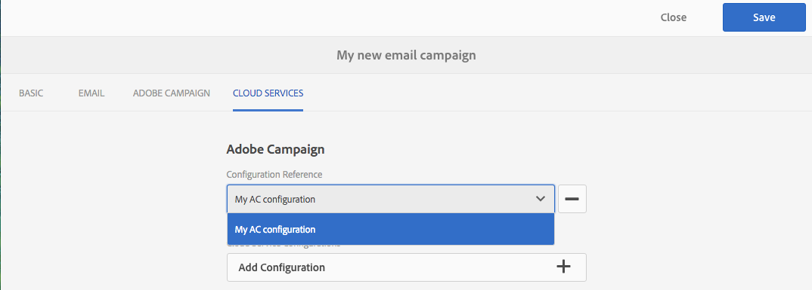
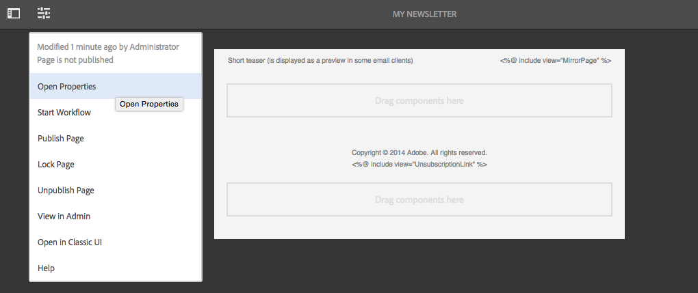
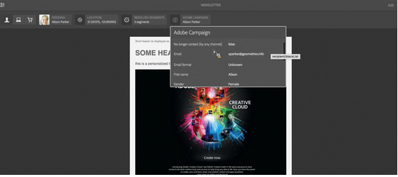

# 使用 Adobe Campaign Classic 和 Adobe Campaign Standard{#working-with-adobe-campaign-classic-and-adobe-campaign-standard}

您可以在AEM中创建电子邮件内容，并在Adobe Campaign电子邮件中处理这些内容。 为此，您必须：

1. 从特定于Adobe Campaign的模板在AEM中创建新闻稿。
1. 在编辑内容之前选择[Adobe Campaign服务](#selecting-the-adobe-campaign-cloud-service-and-template)以访问所有功能。
1. 编辑内容。
1. 验证内容。

然后，可以将内容与Adobe Campaign中的投放同步。 本文档中详述了相关说明。

另请参阅[在AEM中创建Adobe Campaign Forms](/help/sites-authoring/adobe-campaign-forms.md)。

>[!NOTE]
>
>在使用此功能之前，必须将AEM配置为与[Adobe Campaign](/help/sites-administering/campaignonpremise.md)或[Adobe Campaign Standard](/help/sites-administering/campaignstandard.md)集成。

## 通过Adobe Campaign发送电子邮件内容 {#sending-email-content-via-adobe-campaign}

配置AEM和Adobe Campaign后，您可以直接在AEM中创建电子邮件投放内容，然后在Adobe Campaign中处理该内容。

在AEM中创建Adobe Campaign内容时，必须先链接到Adobe Campaign服务，然后才能编辑内容以访问所有功能。

可能存在两种情况：

* 内容可以与Adobe Campaign中的投放同步。 这样，您就可以在投放中使用AEM内容。
* (仅限Adobe Campaign Classic)可以将内容直接发送到Adobe Campaign，后者自动生成新的电子邮件投放。 此模式具有限制。

本文档中详述了相关说明。

### 创建新电子邮件内容 {#creating-new-email-content}

>[!NOTE]
>
>添加电子邮件模板时，请确保将它们添加到&#x200B;**/content/campaigns**&#x200B;下以使它们可用。

#### 创建新电子邮件内容 {#creating-new-email-content-1}

1. 在AEM中，依次选择&#x200B;**站点**&#x200B;和&#x200B;**促销活动**，然后浏览到管理电子邮件促销活动的位置。 在以下示例中，路径是&#x200B;**站点** > **营销活动** > **Geometrixx Outdoors** > **电子邮件营销活动**。

   >[!NOTE]
   >
   >[电子邮件示例仅在Geometrixx](/help/sites-developing/we-retail.md)中可用。 从包共享下载示例Geometrixx内容。

   

1. 选择&#x200B;**创建**，然后选择&#x200B;**创建页面**。
1. 选择您连接到Adobe Campaign的特定可用模板之一，然后单击&#x200B;**下一步**。 默认情况下，有三个模板可用：

   * **Adobe Campaign Classic电子邮件**：允许您将内容添加到预定义模板（两列），然后再发送给Adobe Campaign Classic进行交付。
   * **Adobe Campaign Standard电子邮件**：允许您将内容添加到预定义模板（两列），然后再发送给Adobe Campaign Standard进行交付。

1. 填写&#x200B;**标题**&#x200B;和可选的&#x200B;**描述**，然后单击&#x200B;**创建**。 标题用作新闻稿/电子邮件的主题，除非您在编辑电子邮件时覆盖它。

### 选择Adobe Campaign云服务和模板 {#selecting-the-adobe-campaign-cloud-service-and-template}

要与Adobe Campaign集成，您需要将Adobe Campaign云服务添加到页面。 这样，您就可以访问个性化和其他Adobe Campaign信息。

此外，您可能还需要选择Adobe Campaign模板，并更改主题并为那些不会在HTML中查看电子邮件的用户添加纯文本内容。

您可以在创建云服务后，从&#x200B;**站点**&#x200B;选项卡或电子邮件/新闻稿中选择该服务。

建议从&#x200B;**站点**&#x200B;选项卡中选择云服务。 从电子邮件/新闻稿中选择云服务需要权宜之计。

从&#x200B;**站点**&#x200B;页面：

1. 在AEM中，选择电子邮件页面并单击&#x200B;**查看属性**。

   

1. 选择&#x200B;**编辑**，然后选择&#x200B;**Cloud Services**&#x200B;选项卡，向下滚动到底部并单击+符号添加配置，然后选择&#x200B;**Adobe Campaign**。

   

1. 从下拉列表中选择与您的Adobe Campaign实例匹配的配置，然后单击&#x200B;**保存**&#x200B;进行确认。
1. 通过单击&#x200B;**Adobe Campaign**&#x200B;选项卡，可查看电子邮件已应用于该模板的模板。 如果要选择其他模板，您可以在编辑时从电子邮件中访问该模板。

   如果要在&#x200B;**属性**&#x200B;中应用默认邮件模板以外的特定电子邮件投放模板(来自Adobe Campaign)，请选择&#x200B;**Adobe Campaign**&#x200B;选项卡。 在相关的Adobe Campaign实例中输入电子邮件投放模板的内部名称。

   您选择的模板决定了Adobe Campaign中可用的个性化字段。

   

由于布局问题，您可能无法从创作时的新闻稿/电子邮件中选择&#x200B;**页面属性**&#x200B;中的Adobe Campaign云服务配置。 您可以使用此处描述的解决方法：

1. 在AEM中，选择电子邮件页面并单击&#x200B;**编辑**。 单击&#x200B;**打开属性**。

   

1. 选择&#x200B;**云服务**&#x200B;并单击&#x200B;**+**&#x200B;添加配置。 选择任何可见的配置（无论哪个配置）。 单击&#x200B;**+**&#x200B;符号以添加其他配置，然后选择&#x200B;**Adobe Campaign**。

   >[!NOTE]
   >
   >或者，您也可以通过在&#x200B;**站点**&#x200B;选项卡中选择&#x200B;**查看属性**&#x200B;来选择云服务。

1. 从下拉列表中选择与您的Adobe Campaign实例匹配的配置，删除您创建的第一个不适用于Adobe Campaign的配置，然后单击复选标记进行确认。
1. 继续上一过程中的步骤4，选择模板并添加纯文本。

### 编辑电子邮件内容 {#editing-email-content}

要编辑电子邮件内容，请执行以下操作：

1. 打开电子邮件，并默认进入编辑模式。

   

1. 如果要更改电子邮件的主题或为那些不会在HTML中查看电子邮件的用户添加纯文本，请选择&#x200B;**电子邮件**&#x200B;并添加主题和文本。 选择页面图标以从HTML自动生成纯文本版本。 完成后，单击复选标记。

   您可以使用Adobe Campaign个性化字段个性化新闻稿。 要添加个性化字段，请单击显示Adobe Campaign徽标的按钮以打开个性化字段选取器。 然后，您可以从可用于此新闻稿的所有字段中进行选择。

   >[!NOTE]
   >
   >如果编辑器中的属性中的个性化字段显示为灰色，请重新检查您的配置。

   

1. 打开屏幕左侧的组件面板，然后从下拉菜单中选择&#x200B;**Adobe Campaign Newsletter**&#x200B;以查找这些组件。

   

1. 将组件直接拖到页面上并进行相应编辑。 例如，您可以拖动&#x200B;**文本与Personalization (Campaign)**&#x200B;组件并添加个性化文本。

   

   有关每个组件的详细说明，请参阅[Adobe Campaign组件](/help/sites-authoring/adobe-campaign-components.md)。

   

### 插入个性化 {#inserting-personalization}

编辑内容时，您可以插入：

* Adobe Campaign上下文字段。 这些字段可插入文本中，并根据收件人的数据（例如，名字、姓氏或目标维度的任何数据）进行调整。
* Adobe Campaign个性化块。 这些是与收件人数据无关的预定义内容块，例如品牌徽标或指向镜像页面的链接。

有关Campaign组件的完整说明，请参阅[Adobe Campaign组件](/help/sites-authoring/adobe-campaign-components.md)。

>[!NOTE]
>
>* 只考虑Adobe Campaign **配置文件**&#x200B;定向维度的字段。
>* 从&#x200B;**站点**&#x200B;查看属性时，您无权访问Adobe Campaign上下文字段。 您可以在编辑时直接从电子邮件访问这些内容。

要插入个性化设置，请执行以下操作：

1. 通过将其拖动到页面上，插入新的&#x200B;**新闻稿** > **文本与Personalization （营销活动）**&#x200B;组件。

   

1. 单击铅笔图标以打开组件。 将打开就地编辑器。

   

   >[!NOTE]
   >
   >Adobe Campaign Standard的&#x200B;**：**
   >
   >* 可用的上下文字段对应于Adobe Campaign中的&#x200B;**用户档案**&#x200B;定向维度。
   >* 请参阅[将AEM页面关联到Adobe Campaign电子邮件](#linking-an-aem-page-to-an-adobe-campaign-email-adobe-campaign-standard)。
   >
   >Adobe Campaign Classic的&#x200B;**：**
   >
   >* 可用的上下文字段是从Adobe Campaign **nms:seedMember**&#x200B;架构中动态恢复的。 目标扩展数据可从包含与内容同步的投放的工作流中动态恢复。 (请参阅[将AEM中创建的内容与Adobe Campaign中的投放同步](#synchronizing-content-created-in-aem-with-a-delivery-from-adobe-campaign-classic)部分)。
   >
   >* 要添加或隐藏个性化元素，请参阅[管理个性化字段和块](/help/sites-administering/campaignonpremise.md#managing-personalization-fields-and-blocks)。
   >* **重要信息**：所有种子表字段也必须位于收件人表（或相应的联系人表）中。

1. 通过键入插入文本。 通过单击Adobe Campaign组件并选择它们来插入上下文字段或个性化块。 完成后，选中复选标记。

   

   插入上下文字段或个性化块后，您可以预览新闻稿并测试字段。 请参阅[预览新闻稿](#previewing-a-newsletter)。

### 预览新闻稿 {#previewing-a-newsletter}

您可以预览新闻稿的外观，并预览个性化设置。

1. 在新闻稿打开时，单击AEM右上角的&#x200B;**预览**。 AEM显示用户收到新闻稿时的外观。

   

   >[!NOTE]
   >
   >如果您使用Adobe Campaign Standard并使用示例模板，则在交付期间导入内容时，显示初始内容的两个个性化块（**&quot;&lt;%@ include view=&quot;MirrorPage&quot; %>&quot;**&#x200B;和&#x200B;**&quot;&lt;%@ include view=&quot;UnsubscriptionLink&quot; %>&quot;**）将会引发错误。 您可以使用个性化块选取器选择相应的块来调整这些内容。

1. 要预览个性化，请单击/点按工具栏中的相应图标以打开ContextHub。 个性化字段标记现在由所选角色的种子数据替换。 了解在ContextHub中切换角色时变量如何适应。

   

1. 您可以查看来自Adobe Campaign且与当前选定角色关联的种子数据。 为此，请单击ContextHub栏中的Adobe Campaign模块。 这将打开一个对话框，其中显示当前配置文件的所有种子数据。 同样，当切换到其他角色时，数据会进行相应的调整。

   

### 在AEM中审批内容 {#approving-content-in-aem}

内容完成后，您可以开始审批流程。 转到工具箱的&#x200B;**工作流**&#x200B;选项卡，然后选择&#x200B;**批准Adobe Campaign**&#x200B;工作流。

此现成的工作流包含两个步骤：依次进行修订和批准，或者依次进行修订和拒绝。 然而，这个工作流可以扩展并适应一个更复杂的过程。

要批准Adobe Campaign的内容，请选择&#x200B;**工作流**&#x200B;并选择&#x200B;**批准Adobe Campaign**&#x200B;以应用该工作流，然后单击&#x200B;**启动工作流**。 完成相关步骤并批准内容。 您还可以通过在最后一个工作流步骤中选择&#x200B;**拒绝**&#x200B;而不是&#x200B;**批准**&#x200B;来拒绝内容。

内容获得批准后，它在Adobe Campaign中显示为“已批准”。 然后可以发送电子邮件。

在Adobe Campaign Standard中：

在Adobe Campaign Classic中：

>[!NOTE]
>
>未批准的内容可以与Adobe Campaign中的投放同步，但投放无法执行。 只有获得批准的内容才能通过Campaign投放发送。

## 将AEM与Adobe Campaign Standard和Adobe Campaign Classic关联 {#linking-aem-with-adobe-campaign-standard-and-adobe-campaign-classic}

如何将AEM与Adobe Campaign关联或同步取决于您使用的是基于订阅的Adobe Campaign Standard还是基于内部部署的Adobe Campaign Classic。

有关基于您的Adobe Campaign解决方案的说明，请参阅以下部分：

* [将AEM页面关联到Adobe Campaign电子邮件(Adobe Campaign Standard)](#linking-an-aem-page-to-an-adobe-campaign-email-adobe-campaign-standard)
* [将AEM中创建的内容与来自Adobe Campaign Classic的投放同步](#synchronizing-content-created-in-aem-with-a-delivery-from-adobe-campaign-classic)

### 将AEM页面关联到Adobe Campaign电子邮件(Adobe Campaign Standard) {#linking-an-aem-page-to-an-adobe-campaign-email-adobe-campaign-standard}

通过Adobe Campaign Standard，您可以恢复在AEM中创建的内容并将其与以下内容链接：

* 电子邮件。
* 电子邮件模板。

这样做可以让您交付内容。 您可以看到新闻稿是否通过页面上显示的代码链接到单个投放。

>[!NOTE]
>
>如果新闻稿链接到多个投放，则会显示链接投放的数量（但并非显示每个ID）。

要将在AEM中创建的页面链接到来自Adobe Campaign的电子邮件，请执行以下操作：

1. 根据特定于AEM的电子邮件模板创建电子邮件。 有关详细信息，请参阅[在Adobe Campaign Standard中创建电子邮件](https://helpx.adobe.com/campaign/standard/channels/using/creating-an-email.html)。

   

1. 从投放仪表板中打开&#x200B;**Content**&#x200B;块。

   

1. 在工具栏中选择包含Adobe Experience Manager内容的&#x200B;**链接**&#x200B;以访问AEM中可用的内容列表。

   >[!NOTE]
   >
   >如果操作栏中未显示带Adobe Experience Manager **选项的**&#x200B;链接，请检查在电子邮件属性中&#x200B;**内容编辑模式**&#x200B;是否正确配置为&#x200B;**Adobe Experience Manager**。

   

1. 选择要在电子邮件中使用的内容。

   此列表指定：

   * AEM中内容的标签。
   * AEM中内容的审批状态。 如果内容未获得批准，您可以同步内容，但必须在发送投放之前批准该内容。 但是，您可以执行某些操作，如发送验证或预览测试。
   * 上次修改内容的日期。
   * 任何已链接到投放的内容。

   >[!NOTE]
   >
   >默认情况下，已与投放同步的内容处于隐藏状态。 但是，您可以显示并使用它。 例如，如果您希望将内容用作多个投放的模板。

   当电子邮件链接到AEM内容时，无法在Adobe Campaign中编辑该内容。

1. 从电子邮件的仪表板（受众、执行计划）指定电子邮件的其他参数。
1. 执行电子邮件投放。 在投放分析期间，将检索AEM内容的最新版本。

   >[!NOTE]
   >
   >如果内容在链接到电子邮件时在AEM中更新，则它会在分析期间在Adobe Campaign中自动更新。 也可以使用内容操作栏中的&#x200B;**刷新Adobe Experience Manager内容**&#x200B;手动执行同步。
   >
   >您可以使用&#x200B;**从内容操作栏中删除带有AEM内容的链接**，来取消电子邮件与Adobe Experience Manager内容之间的链接。 仅当内容已链接到投放时，此按钮才可用。 要将其他内容与投放链接，必须先删除当前内容链接，然后才能建立新链接。
   >
   >删除链接后，本地内容会保留并在Adobe Campaign中变为可编辑。 如果在修改内容后再次链接该内容，则将丢失所有更改。

### 将AEM中创建的内容与Adobe Campaign Classic中的投放同步 {#synchronizing-content-created-in-aem-with-a-delivery-from-adobe-campaign-classic}

通过Adobe Campaign，您可以恢复在AEM中创建的内容，并将其与以下内容同步：

* 活动投放
* 活动工作流中的投放活动
* 循环投放
* 连续投放
* 消息中心投放
* 投放模板

在AEM中，如果新闻稿链接到单个投放，则投放代码将显示在页面上。

>[!NOTE]
>
>如果新闻稿链接到多个投放，则会显示链接投放的数量（但并非显示每个ID）。
>
>[!NOTE]
>
>AEM 6.1已弃用工作流步骤&#x200B;**发布到Adobe Campaign**。此步骤是AEM 6.0与Adobe Campaign集成的一部分，不再需要。

要将AEM中创建的内容与Adobe Campaign中的投放同步，请执行以下操作：

1. 通过选择&#x200B;**包含AEM内容的电子邮件投放(mailAEMContent)**&#x200B;投放模板，创建投放或向营销活动工作流添加投放活动。

   

1. 在工具栏中选择&#x200B;**同步**&#x200B;以访问AEM中可用的内容列表。

   >[!NOTE]
   >
   >如果&#x200B;**同步**&#x200B;选项未出现在投放的工具栏中，请通过选择&#x200B;**属性** > **高级**，检查&#x200B;**内容编辑模式**&#x200B;字段是否在&#x200B;**AEM**&#x200B;中正确配置。

   

1. 选择要与投放同步的内容。

   此列表指定：

   * AEM中内容的标签。
   * AEM中内容的审批状态。 如果内容未获得批准，您可以同步内容，但必须在发送投放之前批准该内容。 但是，您可以执行某些操作，如发送BAT或预览测试。
   * 上次修改内容的日期。
   * 任何已链接到投放的内容。

   >[!NOTE]
   >
   >默认情况下，已与投放同步的内容处于隐藏状态。 但是，您可以显示并使用它。 例如，如果您希望将内容用作多个投放的模板。

   

1. 指定投放的其他参数（目标等）
1. 如有必要，请在Adobe Campaign中启动投放批准流程。 除了在AEM中配置的审批（预算、目标等）之外，还需要在Adobe Campaign中审批内容。 仅当Adobe Campaign中的内容已获批准时，该内容才能在AEM中批准。
1. 执行投放。 在投放分析期间，将恢复AEM内容的最新版本。

   >[!NOTE]
   >
   >* 在投放和内容同步后，Adobe Campaign中的投放内容变为只读。 无法再修改电子邮件主题及其内容。
   >* 如果内容在链接到Adobe Campaign中的某个投放时在AEM中更新，则在投放分析期间会在投放中自动更新。 也可以使用&#x200B;**立即刷新内容**&#x200B;按钮手动执行同步。
   >* 您可以使用&#x200B;**取消同步**&#x200B;按钮取消投放与AEM内容之间的同步。 仅当内容已与投放同步时，此项才可用。 要将其他内容与投放同步，必须先取消当前内容同步，然后才能建立新链接。
   >* 如果取消同步，本地内容将保留并在Adobe Campaign中变为可编辑。 如果在修改内容后重新同步该内容，则将丢失所有更改。
   >* 对于循环和连续投放，每次执行投放时都会停止与AEM内容的同步。
