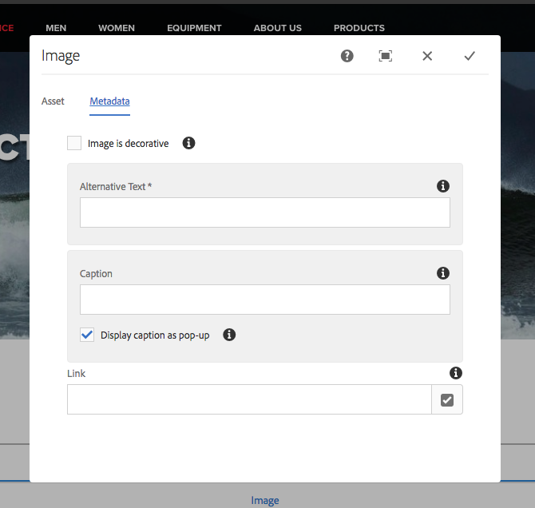
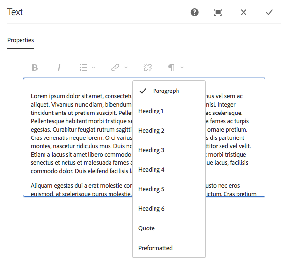
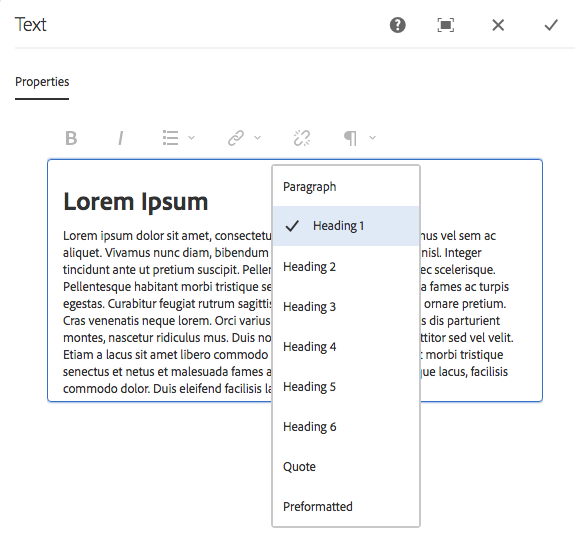
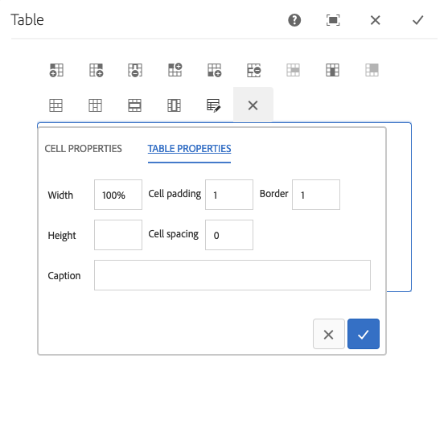
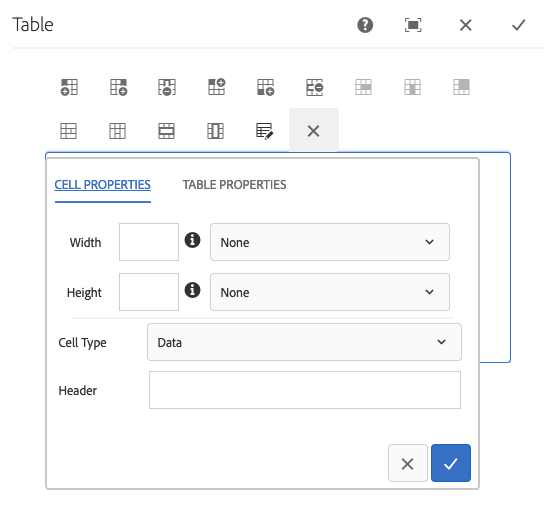
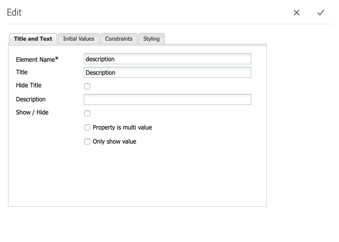
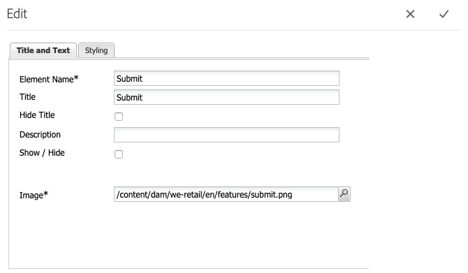
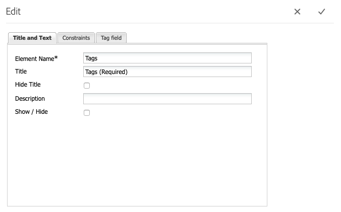

# 创建辅助内容（WCAG 2.0 符合性）{#creating-accessible-content-wcag-conformance}

WCAG 2.0 包含一系列非技术层面的准则及成功标准，旨在确保残障人士能够访问并使用 Web 内容。

>[!NOTE]
>
>另请参阅:
>
>* 我们的 [WCAG 2.0 快速指南](/help/managing/qg-wcag.md)，以进一步了解详细信息
>* [配置富文本编辑器以创建辅助内容](/help/sites-administering/rte-accessible-content.md)
>


Web 内容通常依据三个符合性级别进行分级：A 级（最低）、AA 级以及 AAA 级（最高）。以下是各个级别的简要定义：

* **A 级：**&#x200B;站点在辅助功能方面达到基本的最低等级。要达到这一等级，站点必须满足所有 A 级成功标准。
* **** AA级：这是您努力实现的理想辅助功能级别，站点的辅助功能级别更高，因此大多数情况下大多数人都可以使用大多数技术访问站点。要达到此级别，将满足所有A级和AA级成功标准。
* **AAA 级：**&#x200B;站点在辅助功能方面达到非常高的等级。要达到这一等级，站点必须符合所有 A 级、AA 级和 AAA 级成功标准。

在创建站点时，您应该大体上确定希望自己的站点符合哪个等级。

以下部分介绍 [WCAG 2.0 准则](https://www.w3.org/TR/WCAG20/#guidelines)以及[符合](https://www.w3.org/TR/UNDERSTANDING-WCAG20/conformance.html) A 级和 AA 级的相关成功标准。

>[!NOTE]
>
>鉴于某些类型的内容无法满足所有的 AAA 级成功标准，因此不建议将该级别作为整体策略目标。

>[!NOTE]
>
>在此文档中，我们将使用：
>
>* [WCAG 2.0 准则](https://www.w3.org/TR/WCAG20/#guidelines)的简称。
>* [WCAG 2.0 准则](https://www.w3.org/TR/WCAG20/#guidelines)中使用的编号，以便与 WCAG 网站进行交叉引用。
>


## 准则 1：可感知 {#principle-perceivable}

[准则 1：可感知 - 信息和用户界面组件必须以可感知的方式呈现给用户。](https://www.w3.org/TR/WCAG20/#perceivable)

### 替换文本 (1.1) {#text-alternatives}

[准则 1.1 替换文本：为所有非文本内容提供替换文本，以便使其可更改为人们需要的其他形式，如大印刷字体、盲文、语音、符号或更简单的语言。](https://www.w3.org/TR/WCAG20/#text-equiv)

### 非文本内容 (1.1.1) {#non-text-content}

* 成功标准 1.1.1
* A 级
* 非文本内容：呈现给用户的所有非文本内容都具有相同用途的替换文本，以下所列情况除外。

#### 用途 - 非文本内容 (1.1.1) {#purpose-non-text-content}

网页上的信息可以通过多种不同的非文本格式提供，例如图片、视频、动画、图表和图形。失明或患有严重视觉障碍的用户无法看到非文本内容，但是他们可以通过屏幕阅读器的朗读访问文本内容，也可以通过盲文显示设备以触觉形式获取内容。因此，通过为图形格式的内容提供替换文本，无法看到图形内容的用户便可以获取与该内容中提供的信息相对等的文本内容。

另外的一个实用好处是，替换文本使非文本内容能够通过搜索引擎技术建立索引。

#### 如何达到标准 - 非文本内容 (1.1.1) {#how-to-meet-non-text-content}

对于静态图形，基本的要求是为图形提供对等的替换文本。这可以在&#x200B;**替换文本**&#x200B;字段中完成：

>[!NOTE]
>
>一些现成的组件（例如&#x200B;**传送**&#x200B;和&#x200B;**幻灯片放映**）不提供为图像添加替换文本描述的方法。When implementing versions of these for your AEM instance, your development team will need to configure such components to support the `alt` attribute so that authors can add it to the content (see [Adding Support for Additional HTML Elements and Attributes](/help/sites-administering/rte-accessible-content.md#adding-support-for-additional-html-elements-and-attributes)).

**替换文本**&#x200B;字段位于&#x200B;**图像**&#x200B;组件对话框中的&#x200B;**元数据**&#x200B;选项卡上：



默认情况下，AEM 要求填写&#x200B;**替换文本**&#x200B;字段。如果图像是纯粹的装饰并且替换文本没有实际意义，则可以选中&#x200B;**图像具有装饰性**&#x200B;选项。

#### 创建有效的替换文本 {#creating-good-text-alternatives}

非文本内容的形式多种多样，因此替换文本的值取决于图形在网页中所起的作用。以下是一些需要遵循的一般经验法则：

* 替换文本应当既简洁明了，又能清晰地表达非文本内容所提供的基本信息。
* 应当避免使用冗长的描述（超过 100 个字符）。如果替换文本需要表达更多的详细信息，则可以通过以下方法来实现：

   * 在替换文本中提供简短的描述
   * 同时，在同一页面的其他位置或在一个单独的网页中提供更加详尽的描述文本。然后，为该图像创建一个链接，或者在图像附近放置一个文本链接，以便链接到该单独的描述。

* 替换文本不应复制同一页面邻近位置以文本形式提供的内容。请切记，许多图像的作用是解释说明页面文本中已涵盖的要点，因此详尽的替换文本可能已经存在。
* 如果非文本内容是指向另一页面或文档的链接，而且该链接没有任何其他的文本形式部分，则图像的替换文本必须指明链接的目标位置，而不是对图像进行描述。
* 如果按钮元素中包含非文本内容，而且该按钮没有任何文本形式部分，则图像的替换文本必须指明按钮的功能，而不是对图像进行描述。
* 为图像指定空(null)替代文本是完全可接受的，但前提是图像没有替代文本（例如，它是纯装饰性图形），或者页面文本中已存在对等文本。

[W3C 草案：用于提供实用替换文本的 HTML5 技术](https://dev.w3.org/html5/alt-techniques/)包含更多详细信息，以及为不同类型的图像提供相应的替换文本的示例。

以下特定类型的非文本内容可能需要替换文本：

* Illustrative photos:
These are images of people, objects or places. Think about the role of the photo in the page; an appropriate text equivalent is likely to be *Photo of[object ]*, but may be dependent on the surrounding text.
* 图标：
指传递特定信息的小图形符号（图形）。页面和站点上使用的图标必须保持一致。图标在页面或站点上出现的所有实例都应使用相同的简短替代文本，除非这样做会与相邻的文本产生不必要的重复情况。
* Charts and graphs:
These typically represent numerical data. So one option for providing a text alternative might be to include a brief summary of the main trends shown in the chart or graphic. If necessary, also provide a more detailed description in text using the **Description** field in the **Advanced** image properties tab. Additionally, you could provide the source data in tabular form elsewhere in the page or site.

   

   要为此图表示例提供替换文本，请先为图像本身添加简洁的 `alt` 文本，然后再在图像后面添加完整的替换文本。

   ```xml
   <p></p>
   <p> Figure 1. Distribution of Articles by Journal Category.
   Pie chart: Language=68%, Education=14% and Science=18%.</p>
   ```

   >[!NOTE]
   >
   >以上代码片段仅用于说明操作顺序。建议使用&#x200B;**图像**&#x200B;组件（而非上述示例所使用的 `img src` 引用）。

   在 AEM 中，可以结合使用 **Alt 文本**&#x200B;和图像配置对话框中的&#x200B;**描述**&#x200B;字段来实现这一点 - 请参阅[如何处理非文本内容 (1.1.1)](#how-to-meet-non-text-content)。

* Maps, diagrams, flowcharts:
For graphics providing spatial data (for example. to support describing relationships between objects or a process), ensure that the key message is provided in text format. For maps, providing a full text equivalent is likely to be impractical, but if the map is provided as a way of helping people find their way to a particular location, then the map image’s alternative text can briefly indicate *Map of X*, then provide directions to that location in text elsewhere in the page or through the **Description** field in the **Advanced** tab of the **Image** component.
* CAPTCHA：
CAPTCHA 是 *Completely Automated Public Turing test to tell Computers and Humans Apart*（全自动区分计算机和人类的图灵测试）的缩写。这是一项在网页中用于区分人类和恶意软件的安全检查，但同时也会妨碍网页的辅助功能。用户要想通过安全测试，必须按照要求描述自己所看到的这些图像。为这些图像提供替代文本显然是不可能的，因此需要思考出非图形的替代解决方案。
W3C 提供了许多建议，例如：（这些方法各有优缺点。）

   * 逻辑谜题
   * 使用声音输出替代图像
   * 限制使用帐户和垃圾邮件筛选器。

* 背景图像：这些是使用层叠样式表(CSS)而不是HTML实现的。这意味着无法指定替代文本值。因此，背景图像不应提供重要的文本信息——如果提供，则这些信息还必须在页面的文本中提供。但是，当无法显示图像时，必须显示替代背景。

   >[!NOTE]
   >
   >背景与前景文本之间应该有适当的对比度等级；这在[对比度（最小）(1.4.3)](#contrast-minimum) 中有更加详细的讨论。

#### 更多信息 - 非文本内容 (1.1.1) {#more-information-non-text-content}

* [了解成功标准 1.1.1](https://www.w3.org/TR/UNDERSTANDING-WCAG20/text-equiv-all.html)
* [如何达到成功标准 1.1.1](https://www.w3.org/WAI/WCAG20/quickref/#text-equiv)
* [W3C：用于提供实用替换文本的 HTML5 技术（草案）](https://dev.w3.org/html5/alt-techniques/)
* [CAPTCHA 的 W3C 解释和替代方法](https://www.w3.org/TR/turingtest/)

### 基于时间的媒体 (1.2) {#time-based-media}

[准则 1.2 基于时间的媒体：为基于时间的媒体提供替代内容。](https://www.w3.org/TR/WCAG20/#text-equiv)

此准则涉及&#x200B;*基于时间*&#x200B;的 Web 内容。这包括用户可以播放的内容（例如，视频、音频和动画内容），这些内容可以是预先录制的，也可以是实时流传输的。

### 纯音频和纯视频（预先录制）(1.2.1) {#audio-only-and-video-only-pre-recorded}

* 成功标准 1.2.1
* A 级
* 纯音频和纯视频（预先录制）：对于预先录制的纯音频媒体和预先录制的纯视频媒体，均存在以下情况，除非音频或视频就是文本的替代媒体 ，且明确进行了如下标记：

   * 预先录制的纯音频：对于预先录制的纯音频内容，提供了基于时间的媒体的替代内容，以呈现对等信息。
   * 预先录制的纯视频：对于预先录制的纯视频内容，要么提供了基于时间的媒体的替代内容，要么提供了音轨，以呈现对等信息。

#### 用途 - 纯音频和纯视频（预先录制）(1.2.1) {#purpose-audio-only-and-video-only-pre-recorded}

以下用户可能会遇到音频和视频的辅助功能问题：

* 患有视觉障碍的用户在没有音轨，或者音轨提供的信息不足以告知他们视频或动画中正在播放的内容时；
* 因患有听觉障碍或耳聋而无法听到音轨的用户；
* 可以听到音轨但无法理解所讲内容的用户（例如，因为语言不通而无法理解）。

如果用户使用的浏览器或设备不支持播放特定媒体格式（如 Adobe Flash）的内容，则这些用户可能也无法访问相关视频或音频。

如果以不同的格式提供这些信息，如使用文本（或者对于无音频的视频，使用音频），则无法访问原始内容的用户便可以访问这些信息。

#### 如何达到标准 - 纯音频和纯视频（预先录制）(1.2.1) {#how-to-meet-audio-only-and-video-only-pre-recorded}

* 如果内容是预先录制的不含视频的音频（如播客）：

   * 在紧靠内容之前或之后的位置提供一个链接，指向音频内容的文本记录。
这份记录应采用 HTML 页面的形式，其中包含所有讲话内容以及重要的非讲话内容的对等文本，还指出讲话者并描述讲话背景、声音表情及其他任何重要的音频。

* 如果内容是不含音频的动画或预先录制的不含音频的视频：

   * 在紧靠内容之前或之后的位置提供一个链接，指向与视频提供的信息对等的文本描述。
   * 或者，指向以常用的音频格式（如 MP3）呈现的对等音频描述。

>[!NOTE]
>
>如果音频或视频内容是作为替代内容提供的，且被它们替代的内容已经以其他格式存在于网页上，则无需遵循上述要求。例如，如果某段视频是用来介绍一系列文本说明的，那么就无需为这段视频提供替代内容，因为文本说明已经起到了替代视频的作用。

在 AEM 网页中插入多媒体（尤其是 Flash 内容）的方式与插入图像类似。但是，多媒体内容与静态图像相比还是更为复杂，而且在控制多媒体的播放方式时有各种不同的设置和选项。

>[!NOTE]
>
>在将多媒体与信息内容结合使用时，您还必须创建替代内容的链接。例如，要包含文本记录，请创建一个HTML页面以显示记录，然后在音频内容旁边或下方添加一个链接。

#### 更多信息 - 纯音频和纯视频（预先录制）(1.2.1) {#more-information-audio-only-and-video-only-pre-recorded}

* [了解成功标准 1.2.1](https://www.w3.org/TR/UNDERSTANDING-WCAG20/media-equiv-av-only-alt.html)
* [如何达到成功标准 1.2.1](https://www.w3.org/WAI/WCAG20/quickref/#media-equiv)

### 字幕（预先录制）(1.2.2) {#captions-pre-recorded}

* 成功标准 1.2.2
* A 级
* 字幕（预先录制）：为同步媒体中所有预先录制的音频内容提供了字幕，除非该媒体是文本的替代媒体，且明确进行了相应标记。

#### 用途 - 字幕（预先录制）(1.2.2) {#purpose-captions-pre-recorded}

耳聋或听力欠佳的用户无法或很难获取音频内容。字幕是讲话和非讲话音频的对等文本，在视频播放过程中会在相应的时间显示在屏幕上。这让无法听到音频的用户可以了解正在播放的内容。

>[!NOTE]
>
>如果视频或动画所在的页面包含合适的对等文本或非文本内容（提供直接对等的信息），则不需要字幕。

#### 如何达到标准 - 字幕（预先录制）(1.2.2) {#how-to-meet-captions-pre-recorded}

字幕有以下两种形式：

* 开放式：字幕在视频播放过程中始终可见
* 隐藏式：* *字幕可由用户打开或关闭

尽量使用隐藏式字幕，因为这样用户可以选择是否观看字幕。

对于隐藏式字幕，需要以适当的格式（如 [SMIL](https://www.w3.org/AudioVideo/)）为对应的视频文件创建并提供同步字幕文件（与此相关的详细操作说明不在本指南的范围之内，但是我们在[更多信息 - 字幕（预先录制）(1.2.2)](#more-information-captions-pre-recorded) 中提供了一些教程的链接）。应确保提供说明，让用户知晓视频提供有字幕。

如果必须使用开放式字幕，应将文本嵌入到视频轨道中。可以使用能够将字幕覆盖到视频上的视频编辑应用程序来完成嵌入。

#### 更多信息 - 字幕（预先录制）(1.2.2) {#more-information-captions-pre-recorded}

* [了解成功标准 1.2.2](https://www.w3.org/TR/UNDERSTANDING-WCAG20/media-equiv-captions.html)
* [如何达到成功标准 1.2.2](https://www.w3.org/WAI/WCAG20/quickref/#media-equiv)
* [W3C：同步的多媒体](https://www.w3.org/AudioVideo/)
* [字幕、记录和音频描述 - WebAIM 文章](https://webaim.org/techniques/captions/)

### 音频描述或替代媒体（预先录制）(1.2.3) {#audio-description-or-media-alternative-pre-recorded}

* 成功标准 1.2.3
* A 级
* 音频描述或替代媒体（预先录制）：对于同步的媒体，为预先录制的视频内容提供了基于时间的媒体的替代内容或音频描述，除非该媒体是文本的替代媒体，且明确进行了相应标记。

#### 用途 - 音频描述或替代媒体（预先录制）(1.2.3) {#purpose-audio-description-or-media-alternative-pre-recorded}

如果视频或动画中的信息仅以可视形式呈现，或者音轨提供的信息不足以让用户了解视频或动画中正在播放的内容，则失明或患有视觉障碍的用户将会遇到辅助功能问题。

#### 如何达到标准 - 音频描述或替代媒体（预先录制）(1.2.3) {#how-to-meet-audio-description-or-media-alternative-pre-recorded}

可以通过以下两种方式来达到该成功标准。任何一种方式都是可以接受的：

1. 为视频内容提供附加的音频描述。可以采用以下三种方式中的任何一种来实现：

   * 在现有对话暂停期间，提供有关场景变换的信息，该信息不作为现有音轨内容的一部分；
   * 提供一段附加的可选新音轨，其中不仅包含原始音轨，而且还包含有关场景变换的额外音频信息。

      * 这允许用户在现有音轨（*不含*&#x200B;音频描述）和新音轨（*含有*&#x200B;音频描述）之间进行切换。

      * 这可以避免妨碍到不需要附加描述的用户。
   * 为视频内容创建第二个版本，以便提供延长的音频描述。这样，通过在合适的时间点暂停音频和视频，便可降低在现有对话的间隙提供详细音频描述的难度。最终，在重新开始播放视频之前，便可以提供一个更长的音频描述。与上一种方式中所提到的一样，为了避免妨碍到不需要附加描述的用户，最好将此类音频描述作为可选的额外音轨来提供。


1. 为视频或动画中的音频和视觉元素提供适当的对等文本记录。文本中应当相应地指出讲话者，并描述讲话背景和声音表情。根据文本长度的不同，既可以将记录放置在视频或动画所在的页面上，也可以将其放置在单独的页面上；如果选择后者，则需要在视频或动画旁边提供记录的链接。

至于如何创建带有音频描述的视频，具体细节不在本指南的范围之内。创建视频和音频描述非常耗时，但是 Adobe 的其他产品可以帮助您完成这些任务。If you create content in Adobe Flash Professional, you should also create a script to prompt the user to download the appropriate plug-in, and provide a text alternative through the `<noscript>` element.

#### 更多信息 - 音频描述或替代媒体（预先录制）(1.2.3) {#more-information-audio-description-or-media-alternative-pre-recorded}

* [了解成功标准 1.2.3](https://www.w3.org/TR/UNDERSTANDING-WCAG20/media-equiv-audio-desc.html)
* [如何达到成功标准 1.2.3](https://www.w3.org/WAI/WCAG20/quickref/#qr-media-equiv-audio-desc)
* [Adobe Encore CS5](https://www.adobe.com/products/premiere/encore/)

### 字幕（实时）(1.2.4)  {#captions-live}

* 成功标准 1.2.4
* AA 级
* 字幕（实时）：为同步媒体中的所有实时音频内容提供了字幕 。

#### 用途 - 字幕（实时）(1.2.4) {#purpose-captions-live}

This success criterion is identical to [Captions (Pre-Recorded)](#captionsprerecorded) in that it addresses accessibility barriers experienced by people who are deaf or hearing-impaired, except that this success criterion deals with live presentations such as webcasts.

#### 如何达到标准 - 字幕（实时）(1.2.4) {#how-to-meet-captions-live}

Follow the guidance provided for [Captions (Pre-Recorded)](#captionsprerecorded) above. However, due to the live nature of the media, caption provision has to be created as quickly as possible and in response to what is happening. Therefore, you should consider using real time captioning or speech-to-text tools.

与此相关的详细说明不在本指南的范围之内，但是以下资源提供了有用的信息：

* [WebAIM：实时字幕](https://www.webaim.org/techniques/captions/realtime.php)
* [AccessIT（华盛顿大学）：能否利用语音识别技术自动生成字幕？](https://www.washington.edu/accessit/articles?1209)

#### 更多信息 - 字幕（实时）(1.2.4) {#more-information-captions-live}

* [了解成功标准 1.2.4](https://www.w3.org/TR/UNDERSTANDING-WCAG20/media-equiv-real-time-captions.html)
* [如何达到成功标准 1.2.4](https://www.w3.org/WAI/WCAG20/quickref/#qr-media-equiv-real-time-captions)

### 音频描述（预先录制）(1.2.5)  {#audio-description-pre-recorded}

* 成功标准 1.2.5
* AA 级
* 音频描述（预先录制）：为同步媒体中的所有预先录制的视频内容提供了音频描述 。

#### 用途 - 音频描述（预先录制）(1.2.5) {#purpose-audio-description-pre-recorded}

该成功标准与[音频描述或替代媒体（预先录制）](#audiodescriptionormediaalternativeprerecorded)的标准完全相同，不同之处在于作者必须提供更加详细的音频描述才能符合 AA 级标准。

#### 如何达到标准 - 音频描述（预先录制）(1.2.5) {#how-to-meet-audio-description-pre-recorded}

遵循[音频描述或替代媒体（预先录制）](#audiodescriptionormediaalternativeprerecorded)所提供的指南。

#### 更多信息 - 音频描述（预先录制）(1.2.5) {#more-information-audio-description-pre-recorded}

* [了解成功标准 1.2.5](https://www.w3.org/TR/UNDERSTANDING-WCAG20/media-equiv-audio-desc-only.html)
* [如何达到成功标准 1.2.5](https://www.w3.org/WAI/WCAG20/quickref/#qr-media-equiv-audio-desc-only)

### 适应性 (1.3) {#adaptable}

[准则 1.3 适应性：创建可用不同方式呈现的内容（例如更简单的布局），而不会丢失信息或结构。](https://www.w3.org/TR/WCAG20/#content-structure-separation)

该准则包含为支持以下用户而必须满足的要求：

* 可能无法访问作者在*标准*二维、多列、彩色网页布局中显示的信息

* 可能要使用纯音频内容或可视替代显示方式（如大文本或高对比度）的用户。

### 信息和关系 (1.3.1)  {#info-and-relationships}

* 成功标准 1.3.1
* A 级
* 信息和关系：通过呈现传递的信息、结构和关系，可以采用编程方式进行确定或在文本中提供。

#### 用途 - 信息和关系 (1.3.1) {#purpose-info-and-relationships}

残障人士使用的许多辅助型技术都依赖结构性信息才能有效地显示或输出内容。此类结构性信息有多种形式，如页面标题、表行标题和列标题以及列表类型。举例来说，屏幕阅读器可以让用户从页面的一个标题导航到另一个标题。但是，如果页面内容仅仅在可视样式而非基本 HTML 中具有结构，则辅助型技术便无法获取结构性信息，从而限制它们辅助用户轻松浏览的能力。

该成功标准旨在确保此类结构性信息通过 HTML 提供，这样浏览器和辅助型技术便可以访问并利用这些信息。

#### 如何达到标准 - 信息和关系 (1.3.1) {#how-to-meet-info-and-relationships}

AEM 允许轻松地使用相应的 HTML 元素构建网页。可在 RTE（一种文本组件）中打开页面内容，然后使用&#x200B;**段落格式**&#x200B;菜单（段落符号）指定相应的结构元素（例如，段落、标题等）。

下图显示了样式为段落的文本。



可以通过以下方式确保网页指定了合适的结构：

* **使用标题：**

   As long as you have the accessibility features of the RTE enabled (see [AEM and Accessibility](#adobeexperiencemanagerandaccessibility)), AEM offers 3 levels of page heading. You can use these to identify sections and subsections of content. Heading 1 is the highest level of heading, Heading 3 the lowest. The system administrator can configure the system to allow the use of more heading levels.

   下图显示了各类标题的示例。

   

* **强调文本**：

   使用 &lt;strong> 或 &lt;em> 元素表明要强调的内容。切勿在段落中使用标题突出显示文本。

   * 突出显示要强调的文本；
   * Click on the **B** icon (for &lt;strong>) or the **I** icon (for &lt;em>) shown within the **Properties** panel (make sure that HTML is selected).
   >[!NOTE]
   >
   >标准 AEM 安装中的 RTE（富文本编辑器）设置为：
   >
   >    * 使用 &lt;b> 表示 &lt;strong>
   * 使用 &lt;i> 表示 &lt;em>
   尽管两种形式效果相同，但是最好使用 &lt;strong> 和 &lt;em>，因为从语义上来讲，它们才是正确的 HTML 标记。开发团队在开发项目实例时，可以将 RTE 配置为使用 &lt;strong> 和 &lt;em>（而非 &lt;b> 和 &lt;i>）。

* **使用列表**：可以使用 HTML 指定三种不同类型的列表：

   * The `<ul>` element is used for *unordered* lists (bulleted) lists. Individual list items are identified using the `<li>` element.
在 RTE 中，使用**项目符号列表**&#x200B;图标。

   * The `<ol>` element is used for *numbered* lists*. *Individual list items are identified using the `<li>` element.
在 RTE 中，使用**编号列表**&#x200B;图标。
   如果您希望将现有内容更改为特定列表类型，可以突出显示相应的文本，然后选择相应的列表类型。正如上述示例中显示的段落文本输入方式一样，相应的列表元素会自动添加到 HTML。

   在全屏模式下，会显示单个&#x200B;**项目符号列表**&#x200B;和&#x200B;**编号列表**&#x200B;图标。如果不处于全屏模式，则这两个选项显示在单个&#x200B;**列表**&#x200B;图标的后面。

   

   >[!NOTE]
   `<dl>` 不受RTE支持。

* **使用表**：

   数据表必须使用 HTML 表元素进行标识：

   * one `<table>` element
   * a `<tr>` element for each row of the table
   * a `<th>` element for each row and column heading
   * a `<td>` element for every data cell
   >[!NOTE]
   In the classic UI, tables should be realized with the **Table** component.

   此外，辅助表会使用以下元素和属性：

   * The `<caption>` element is used to provide a visible caption for the table. 默认情况下，描述显示在表上方居中的位置，但是可以使用 CSS 相应地调整位置。描述采用编程方式与表相关联，因此这是一种提供内容简介的有用方法。
   * The `<summary>` element assists non-sighted users to more easily understand the information presented within a table, by providing a synopsis of what a sighted user can see. 当使用了复杂或非常规的表布局时，这种方法尤其有用（该属性不会显示在浏览器中，只会由辅助型技术读取）。
   * The `scope` attribute of the `<th>` element is used to indicate whether a cell represents a header for a particular row, or for a particular column. 在复杂的表中，即数据单元格可能与一个或多个标题相关联的情况下，类似的方法是使用标题和 id 属性。
   >[!NOTE]
   By default, these elements and attributes are not directly available, though it is possible for the system administrator to add support for these values in the **Table properties** dialog box (see [Adding Support for Additional HTML Elements and Attributes](/help/sites-administering/rte-accessible-content.md#adding-support-for-additional-html-elements-and-attributes)).

   添加&#x200B;**表**&#x200B;时，可以配置&#x200B;**表属性**；使用：

   

   要打开您可以在其中选择&#x200B;**表属性**&#x200B;选项卡的&#x200B;**表**&#x200B;对话框，请执行以下操作：

   * 定义相应的&#x200B;**描述**。
   * 最好将&#x200B;**宽度**、**高度**、**边框**、**单元格边距**&#x200B;和&#x200B;**单元格间距**&#x200B;的默认值全部删除，因为这些属性可以在全局样式表中设置。
   

   然后，您可以使用&#x200B;**单元格属性**&#x200B;来选择单元格是数据单元格还是标题单元格：

   

* **复杂数据表**:

   In some cases, where there are complex tables with two or more levels of headers, then the basic Table Properties may not be enough to provide all the structural information necessary. For these kinds of complex tables, direct relationships need to be created between the headers and their related cells using the **header** and **id** attributes. For example, in the table below headers and ids are matched to make a programmatic association for assistive technology users.

   >[!NOTE]
   现成的安装中没有 id 属性。可以通过在 RTE 中配置 HTML 规则和序列化器来启用该属性。

   >[!NOTE]
   In classic UI, tables should be realized with the **Table** component.

   ```xml
   <table>
      <tr>
        <th rowspan="2" id="h">Homework</th>
        <th colspan="3" id="e">Exams</th>
        <th colspan="3" id="p">Projects</th>
      </tr>
      <tr>
        <th id="e1" headers="e">1</th>
        <th id="e2" headers="e">2</th>
        <th id="ef" headers="e">Final</th>
        <th id="p1" headers="p">1</th>
        <th id="p2" headers="p">2</th>
        <th id="pf" headers="p">Final</th>
      </tr>
      <tr>
       <td headers="h">15%</td>
       <td headers="e e1">15%</td>
       <td headers="e e2">15%</td>
       <td headers="e ef">20%</td>
       <td headers="p p1">10%</td>
       <td headers="p p2">10%</td>
       <td headers="p pf">15%</td>
      </tr>
     </table>
   ```

   要在 AEM 中实现此操作，必须使用源代码编辑模式直接添加标记。

   >[!NOTE]
   该功能并非在标准安装中直接可用。它需要配置 RTE、HTML 规则和序列化器。

#### 更多信息 - 信息和关系 (1.3.1) {#more-information-info-and-relationships}

* [了解成功标准 1.3.1](https://www.w3.org/TR/UNDERSTANDING-WCAG20/content-structure-separation-programmatic.html)
* [如何达到成功标准 1.3.1](https://www.w3.org/WAI/WCAG20/quickref/#qr-content-structure-separation-programmatic)

### 感官特性 (1.3.3)  {#sensory-characteristics}

* 成功标准 1.3.3
* A 级
* 感官特性：为了解和使用内容而提供的说明不完全依赖于组件的感官特性，如形状、大小、可视位置、方向或声音。

#### 用途 - 感官特性 (1.3.3) {#purpose-sensory-characteristics}

设计者往往关注可视设计特征，如颜色、形状、文本样式，或者内容在展示信息时所在的绝对或相对位置。这些是在传递信息时采用的非常有效的设计技术，但是对于失明或患有视觉障碍的用户而言，可能无法获取此类信息，因为用户必须以可视方式来识别位置、颜色或形状等属性。

同样，如果用户在获取信息时必须辨认不同的声音（例如，男性或女性讲话的内容），而且音频内容没有反映在任何替换文本中，则患有听觉障碍的用户就会遇到辅助功能问题。

>[!NOTE]
有关颜色替代内容的要求，请参阅[使用颜色](#use-of-color)。

#### 如何达到标准 - 感官特性 (1.3.3) {#how-to-meet-sensory-characteristics}

确保那些依赖页面内容的可视特性传递的任何信息都同时以替代格式呈现。

* 切勿依赖可视位置来提供信息。例如，如果希望用户通过页面右侧的菜单访问更多信息，那么请不要只提及&#x200B;*右侧的菜单*；而是要为该菜单命名（例如，通过标题进行命名），然后以文本方式提及该名称。
* 切勿将文本样式（例如，粗体或斜体文本）作为传递信息的唯一方式。

>[!NOTE]
如果用户在非可视上下文中可以理解使用的描述性词语的含义，则可以使用描述性词语。例如，使用&#x200B;*上面*&#x200B;和&#x200B;*下面*&#x200B;通常是可以接受的，因为它们分别表示特定内容项之前和之后的内容；在朗读内容时，这也是可以接受的。

#### 更多信息 - 感官特性 (1.3.3) {#more-information-sensory-characteristics}

* [了解成功标准 1.3.3](https://www.w3.org/TR/UNDERSTANDING-WCAG20/content-structure-separation-understanding.html)
* [如何达到成功标准 1.3.3](https://www.w3.org/WAI/WCAG20/quickref/#qr-content-structure-separation-understanding)

### 可辨别性 (1.4) {#distinguishable}

[准则 1.4 可辨别性：使用户更容易看到和听到内容，包括将前景与背景分离开。](https://www.w3.org/TR/WCAG20/#visual-audio-contrast)

### 使用颜色 (1.4.1)  {#use-of-color}

* 成功标准 1.4.1
* A 级
* 使用颜色：颜色不用作传递信息、指示动作、提示响应或区分可视元素的唯一可视方式。

>[!NOTE]
此成功标准专门针对颜色感知。[适应性 (1.3)](#adaptable) 中涵盖其他形式的感知；包括以编程方式访问颜色和其他可视呈现编码。

#### 用途 - 使用颜色 (1.4.1) {#purpose-use-of-color}

颜色能够立竿见影地增强网页的美感，而且还有助于传递信息。但是，由于各种视觉障碍（从失明到色盲）的限制，部分用户无法辨认某些颜色。这就使颜色编码无法可靠地提供信息。

例如，一些患有红绿色盲症的用户无法辨认绿色和红色阴影。这些用户可能会将这两种颜色看成第三种颜色（如棕色），在这种情况下，他们就无法辨认红色、绿色和棕色。

此外，如果用户使用仅支持文本的浏览器、单色显示设备或查看黑白打印的页面，他们也无法感知到颜色。

#### 如何达到标准 - 使用颜色 (1.4.1) {#how-to-meet-use-of-color}

无论在何处使用颜色传递信息，都应确保无需看到颜色即可获取相应的信息。

例如，确保通过颜色传递的信息也明确地提供在文本中。下图显示了如何同时通过颜色和文本指示演出的座位空余情况：

<table>
 <tbody>
  <tr>
   <td><p><strong>演出</strong></p> </td>
   <td><p><strong>可用性</strong></p> </td>
  </tr>
  <tr>
   <td><p>3 月 16 日，星期二<sup> </sup></p> </td>
   <td><p>有余座</p> </td>
  </tr>
  <tr>
   <td><p>3 月 17 日，星期三</p> </td>
   <td><p>有余座</p> </td>
  </tr>
  <tr>
   <td><p>3 月 18 日，星期四<sup> </sup></p> </td>
   <td><p>已售罄</p> </td>
  </tr>
 </tbody>
</table>

如果颜色用作提供信息的线索，则还应该提供其他可视线索，例如更改样式（如粗体、斜体）或字体。这样可以帮助弱视或色盲的用户识别信息。但是，不能完全依赖这种方法，因为这对于根本无法看到页面的用户而言并无助益。

#### 更多信息 - 使用颜色 (1.4.1) {#more-information-use-of-color}

* [了解成功标准 1.4.1](https://www.w3.org/TR/2008/NOTE-WCAG20-TECHS-20081211/working-examples/G183/link-contrast.html)
* [如何达到成功标准 1.4.1](https://www.w3.org/TR/2008/NOTE-WCAG20-TECHS-20081211/working-examples/G183/link-contrast.html)
* [关于符合 3:1 对比度的指南（包含“Web 安全”颜色列表）](https://www.w3.org/TR/2008/NOTE-WCAG20-TECHS-20081211/working-examples/G183/link-contrast.html)

### 对比度（最小）(1.4.3) {#contrast-minimum}

* 成功标准 1.4.3
* AA 级
* 对比度（最小）：文本的可视呈现以及文本的图像至少要有 4.5:1 的对比度，以下内容除外：

   * 大文本：大号文本及其图像至少要有 3:1 的对比度。
   * 附属内容：文本或文本的图像是未激活的用户界面组件的一部分，只是纯粹的装饰，对任何人都不可见，或者只是包含其他重要可视内容的图片的一部分，对于此类文本或文本的图像，没有对比度要求。
   * 商标标志：文本是徽标或品牌名称的一部分，对于此类文本，没有最低对比度要求。

#### 用途 - 对比度（最小）(1.4.3) {#purpose-contrast-minimum}

患有某种视觉障碍的用户可能无法辨认某些对比度低的颜色对。如果出现以下任一情况，此类用户便可能遇到辅助功能问题：

* 文本与其背景颜色之间的对比度极低。
* 文本的颜色编码（例如链接文本和非链接文本）在辨认信息时起到重要作用。

>[!NOTE]
此成功标准不适用于仅起装饰作用的文本。

#### 如何达到标准 - 对比度（最小）(1.4.3) {#how-to-meet-contrast-minimum}

确保文本与其背景之间有明显的对比度。对比度取决于相关文本的大小和样式：

* 对于大小小于 18 点（或粗体为小于 14 点）的文本，文本中的文字/图像与背景之间的对比度至少应为 4.5:1。
* 对于大小至少为 18 点（或粗体至少为 14 点）的文本，对比度至少应为 3:1。
* 如果背景带有图案，则应将任何文本周围的背景变浅，以便将对比度维持在 4.5:1 或 3:1。

要检查对比度，可使用颜色对比度工具，例如 [Paciello Group Color Contrast Analyser](https://www.paciellogroup.com/resources/contrast-analyser.html) 或 [WebAIM Color Contrast Checker](https://www.webaim.org/resources/contrastchecker/)。这些工具可以用来检查颜色对，并报告任何对比度问题。

或者，如果您不太在意页面外观的指定，则可以选择不指定背景和前景文本颜色。在这种情况下，无需检查对比度，因为用户的浏览器将确定文本和背景的颜色。

如果页面无法达到建议的对比度级别，则将需要提供一个链接以指向该页面的对等替代版本（不存在颜色对比度问题），或者允许用户根据自己的要求调整页面颜色方案的对比度。

#### 更多信息 - 对比度（最小）(1.4.3) {#more-information-contrast-minimum}

* [了解成功标准 1.4.3](https://www.w3.org/TR/UNDERSTANDING-WCAG20/visual-audio-contrast-contrast.html)
* [如何达到成功标准 1.4.3](https://www.w3.org/WAI/WCAG20/quickref/#qr-visual-audio-contrast-contrast)

### 文本的图像 (1.4.5) {#images-of-text}

* 成功标准 1.4.5
* AA 级
* 文本的图像：如果使用的技术可以达到可视呈现效果，使用文本来传递信息而不使用文本的图像，以下情况除外：

   * 可自定义：文本的图像可根据用户的要求以可视方式进行自定义；
   * 必需：文本的特定呈现方式对要传递的信息而言是必需的。

>[!NOTE]
商标标志（属于徽标或品牌名称一部分的文本）被认为是必需的。

#### 用途 - 文本的图像 (1.4.5) {#purpose-images-of-text}

当需要文本的某种特定样式时，通常会使用文本的图像；例如，商标标志或从其他来源生成的文本（如纸质文档的扫描件）。但是，与以 HTML 呈现的文本和使用 CSS 设置格式的文本相比，文本的图像无法灵活地改变大小或外观，而这些改变可能正是患有视觉障碍或有阅读障碍的用户所必需的。

#### 如何达到标准 - 文本的图像 (1.4.5) {#how-to-meet-images-of-text}

如果必须使用文本的图像，应使用 CSS 将文本的图像替换为 HTML 形式的对等文本，这样就可以对文本进行自定义。有关如何实现这一操作的示例，请参阅 [C30：使用 CSS 将文本替换为文本的图像并提供用于切换的用户界面控件](https://www.w3.org/TR/2008/NOTE-WCAG20-TECHS-20081211/C30)。

#### 更多信息 - 文本的图像 (1.4.5) {#more-information-images-of-text}

* [了解成功标准 1.4.5](https://www.w3.org/TR/UNDERSTANDING-WCAG20/visual-audio-contrast-text-presentation.html)
* [如何达到成功标准 1.4.5](https://www.w3.org/WAI/WCAG20/quickref/#qr-visual-audio-contrast-text-presentation)

## 准则 2：可操作 {#principle-operable}

[准则 2：可操作 - 用户界面组件和导航必须可以操作。](https://www.w3.org/TR/WCAG20/#operable)

### 暂停、停止、隐藏 (2.2.2)  {#pause-stop-hide}

* 成功标准 2.2.2
* A 级
* 暂停、停止、隐藏：对于移动、闪烁、滚动或自动更新的信息，符合以下情况：

   * 移动、闪烁、滚动：对于任何 (a) 自动启动，(b) 持续时间超过 5 秒钟，并 (c) 与其他内容并行呈现的移动、闪烁或滚动信息，提供了一个机制来允许用户执行暂停、停止或隐藏操作，除非移动、闪烁或滚动是某种行为的必需部分；
   * 自动更新：对于任何 (a) 自动启动，并 (b) 与其他内容并行呈现的自动更新信息，提供了一个机制来允许用户执行暂停、停止或隐藏操作，或者控制更新的频率，除非自动更新是某种行为的必需部分。

注意要点：

1. 有关闪烁或闪光内容的要求，请参阅[切勿设计会导致癫痫发作的内容 (2.3)](#donotdesigncontentinawaythatisknowntocauseseizures23)。
1. 由于任何未达到此成功标准的内容会干涉用户使用整个页面的能力，因此网页上的所有内容（无论是否用来达到其他成功标准）必须达到此成功标准。请参阅[符合性要求 5：不干涉](https://www.w3.org/TR/WCAG20/#cc5)。
1. 通过软件定期更新或以流式传输至用户代理的内容，不需要保留或呈现在启动暂停和恢复呈现期间生成或收到的信息，因为这可能没有技术可行性，而且在许多情况下可能会误导这样做。
1. 对于在预加载阶段或类似情况下出现的动画，如果所有用户在该阶段都无法进行交互，并且如果不指示进度可能会让用户感到困惑，或导致他们认为内容冻结或中断，则可以将此类动画视为必需内容。

#### 用途 - 暂停、停止、隐藏 (2.2.2) {#purpose-pause-stop-hide}

某些用户可能会认为移动的内容会让人分心，而且难以将注意力集中在页面的其他部分。此外，如果用户无法跟上移动的文本，他们可能就很难阅读此类内容。

#### 如何达到标准 - 暂停、停止、隐藏 (2.2.2) {#how-to-meet-pause-stop-hide}

如果创建的网页包含移动、闪光或闪烁的内容，则可以采纳以下一项或多项建议，具体视内容的性质而定。

* 提供一种可使滚动的内容暂停的方法，以便让用户有充足的时间进行阅读。例如，新闻滚动条或自动更新文本。
* 确保闪烁的内容会在 5 秒钟后停止闪烁。
* 使用适当的技术来显示可由浏览器禁用的闪烁内容。例如，Graphics Interchange Format (GIF) 或 Animated Portable Network Graphics (APNG) 文件。
* 在网页上提供一个表单控件，让用户能够禁用页面上的所有闪烁内容。
* 如果以上建议均不可行，则可以提供一个链接，以指向包含所有内容但不含任何闪烁内容的页面。

#### 更多信息 - 暂停、停止、隐藏 (2.2.2) {#more-information-pause-stop-hide}

* [了解成功标准 2.2.2](https://www.w3.org/TR/UNDERSTANDING-WCAG20/time-limits-pause.html)
* [如何达到成功标准 2.2.2](https://www.w3.org/WAI/WCAG20/quickref/#qr-time-limits-pause)

### 癫痫发作 (2.3) {#seizures}

[准则 2.3 癫痫发作：切勿设计会导致癫痫发作的内容。](https://www.w3.org/TR/WCAG20/#seizure)

### 闪光三次或低于阈值 (2.3.1) {#three-flashes-or-below-threshold}

* 成功标准 2.3.1
* A 级
* 闪光三次或低于阈值：网页不包含在任何一秒内闪光超过 3 次，或闪光低于一般闪光和红色闪光阈值的内容。

>[!NOTE]
由于任何未达到此成功标准的内容会干涉用户使用整个页面的能力，因此网页上的所有内容（无论是否用来达到其他成功标准）必须达到此成功标准。请参阅[符合性要求 5：不干涉](https://www.w3.org/TR/WCAG20/#cc5)。

#### 用途 - 闪光三次或低于阈值 (2.3.1) {#purpose-three-flashes-or-below-threshold}

在某些情况下，闪光的内容会导致光敏性癫痫发作。此成功标准旨在让此类用户能够访问和体验所有内容，而无需担心闪光的内容。

#### 如何达到标准 - 闪光三次或低于阈值 (2.3.1) {#how-to-meet-three-flashes-or-below-threshold}

应采取措施确保应用以下技术：

* 确保组件在任何一秒内的闪光次数均不超过三次；
* If the above condition cannot be met, then display flashing content within a *small safe area* in pixels on the screen. This area is calculated using a complex formula, covered in [G176: Keeping the flashing area small enough](https://www.w3.org/TR/2008/NOTE-WCAG20-TECHS-20081211/G176), so this technique should only be followed if flashing content is *absolutely* necessary.

#### 更多信息 - 闪光三次或低于阈值 (2.3.1) {#more-information-three-flashes-or-below-threshold}

* [了解成功标准 2.3.1](https://www.w3.org/TR/UNDERSTANDING-WCAG20/seizure-does-not-violate.html)
* [如何达到成功标准 2.3.1](https://www.w3.org/WAI/WCAG20/quickref/#seizure)

### 页面带有标题 (2.4.2)  {#page-titled}

* 成功标准 2.4.2
* A 级
* 页面带有标题：网页带有标题，以描述主题或用途。

#### 用途 - 页面带有标题 (2.4.2) {#purpose-page-titled}

此成功标准旨在帮助每个人（无论是否患有任何特定障碍缺陷）无需阅读整个页面即可快速识别网页内容。当在不同的浏览器选项卡中打开了多个网页时，这种方法格外有用，因为页面标题会显示在选项卡中，从而可以快速定位。

#### 如何达到标准 - 页面带有标题 (2.4.2) {#how-to-meet-page-titled}

在 AEM 中创建新 HTML 页面时，可以指定页面标题。应确保标题能够充分描述页面内容，以便访客能够快速识别该页面的内容是否与自己的需求切实相关。

You can also edit the page title when editing a page, which is accessible by **Page Information** - **Properties.**

#### 更多信息 - 页面带有标题 (2.4.2) {#more-information-page-titled}

* [了解成功标准 2.4.2](https://www.w3.org/TR/UNDERSTANDING-WCAG20/navigation-mechanisms-title.html)
* [如何达到成功标准 2.4.2](https://www.w3.org/WAI/WCAG20/quickref/#qr-navigation-mechanisms-title)

### 链接目的（在上下文中）(2.4.4)  {#link-purpose-in-context}

* 成功标准 2.4.4
* A 级
* 链接目的（在上下文中）：每个链接的目的可以通过单独的链接文本确定，也可以通过链接文本与其以编程方式确定的链接上下文一起确定，除非链接的目的对一般用户而言模糊不清。

#### 用途 - 链接目的（在上下文中）(2.4.4) {#purpose-link-purpose-in-context}

对于所有用户（无论是否患有某方面的缺陷）而言，通过适当的链接文本清晰地指明链接方向至关重要。这有助于用户决定自己是否切实希望追踪某个链接。对于视力正常的用户而言，当页面上有多个链接时，有意义的链接文本极其有用（尤其当页面包含大量文本时），因为有意义的链接文本能够更加清晰地说明目标页面的功能。而对于使用辅助型技术的用户而言，由于此类技术能够在单个页面上生成包含所有链接的列表，因此这些用户可以更加轻松地在上下文中了解链接文本。

#### 如何达到标准 - 链接目的（在上下文中）(2.4.4) {#how-to-meet-link-purpose-in-context}

首先，确保链接文本清晰地描述了链接目的。

* 错误示例：

   * 文本内容：有关 2010 年秋季晚间课程的详细信息，请单击此处。
   * 原因分析：没有清晰明确地指明链接目标位置。

* 正确示例：

   * 文本：2010年秋季的晚间课程——详细信息。
   * 原因分析：通过稍微调整链接元素的文本和位置，可以改进链接文本。

Links should be phrased consistently across pages, especially for navigation bars. For example, if a link to a specific page is named **Publications** on one page, use that text on other pages to ensure consistency.

但是，在编写时，仍然有一些与标题的使用相关的问题：

* 通常情况下，只有使用鼠标的用户才可以在工具提示弹出框中看到标题属性中包含的文本，而无法使用键盘获取该文本。
* 屏幕阅读器可以朗读标题属性，但是这项功能可能默认未启用；因此用户可能意识不到标题属性的存在。
* 标题文本的外观很难更改，这就意味着一些用户可能很难或无法阅读该文本。

因此，尽管标题属性可用于为链接提供额外的上下文，但是应务必注意其限制，而且不要将其用作相应链接文本的替代内容。

Where the link is made up of an image, make sure that the alternative text for the image describes the destination of the link. For example, if an image of a bookshelf is set as a link to a person’s publications, the alternative text should read **John Smith’s publications** and not **Bookshelf**.

或者，如果链接锚包含的文本不仅描述了链接的目的，而且还说明了图像元素（这样文本就会显示在图像旁边），则可将图像的 alt 属性设置为空：

```xml
<a href="publications.html">

John Smith’s publications
</a>
```

>[!NOTE]
以上代码片段仅用于说明目的，建议使用&#x200B;**图像**&#x200B;组件。

虽然提供无需附加上下文即可标识链接目的的链接文本是一种可取的方法，但该方法并不认为始终可行。Context free links can be used in the following cases, HTML examples of which can be found in [How to Meet Success Criterion 2.4.4](https://www.w3.org/WAI/WCAG20/quickref/#qr-navigation-mechanisms-refs).

* 当链接文本是由紧密相关的链接组成的列表的一部分时，以及当链接周围的列表项提供了足够的上下文时。
* Where the purpose of a link can be clearly identified from the *preceding* (not the following) paragraph text.
* 当链接包含于数据表内，从而可以通过关联的标题清晰识别链接目的时。
* 当链接列表包含于一系列标题内且标题本身提供了合适的上下文时。
* 当链接列表包含于嵌套的链接内且嵌套链接上面的父列表项提供了合适的上下文时。

在某些情况下，一个页面上会有多个链接（其中每个链接都提供了复杂而又必要的链接方向详情），此时可以为该网页提供一个替代版本，使其显示完全相同的内容，只是其中的链接文本较为简洁。

Alternatively, scripts can be used so that a minimal amount of text is provided within the link itself, but on activating an appropriate control positioned towards the top of the page, the link text is *expanded* into further detail. A similar approach is to use CSS to *hide* the full link from sighted users, but still output it in full to screen reader users. This falls outside the scope of this document, but more information on how this can be achieved can be found in the [More Information - Link Purpose (In Context) (2.4.4)](#more-information-link-purpose-in-context) section.

#### 更多信息 - 链接目的（在上下文中）(2.4.4) {#more-information-link-purpose-in-context}

* [了解成功标准 2.4.4](https://www.w3.org/TR/UNDERSTANDING-WCAG20/navigation-mechanisms-refs.html)
* [如何达到成功标准 2.4.4](https://www.w3.org/WAI/WCAG20/quickref/#qr-navigation-mechanisms-refs)
* [C7：使用 CSS 隐藏部分链接文本](https://www.w3.org/TR/2008/NOTE-WCAG20-TECHS-20081211/C7)

## 准则 3：可理解 {#principle-understandable}

[准则 3：可理解 - 信息和用户界面操作必须可以理解。](https://www.w3.org/TR/WCAG20/#understandable)

### 使文本内容可读且可理解 (3.1) {#make-text-content-readable-and-understandable}

[准则 3.1 可读：使文本内容可读且可理解。](https://www.w3.org/TR/WCAG20/#meaning)

### 页面语言 (3.1.1) {#language-of-page}

* 成功标准 3.1.1
* A 级
* 页面语言：每个网页的默认人类语言都可以采用编程方式来确定。

#### 用途 - 页面语言 (3.1.1) {#purpose-language-of-page}

此成功标准旨在确保能够正确呈现文本和其他语言内容。对于屏幕阅读器用户而言，这意味着确保内容发音正确；而对于可视浏览器用户而言，这则更可能意味着确保正确显示某些字符集。

#### 如何达到标准 - 页面语言 (3.1.1) {#how-to-meet-language-of-page}

To meet this success criterion, the default language of a web page can be identified using the `lang` attribute within the `<html>` element at the top of the page. 例如：

* If a page is written in British English, the `<html>` element should read:
   `<html lang = “en-gb”>`

* 而要呈现为美国英语的页面应采用以下标准：
   `<html lang = “en-us”>`

**在AEM中，页面的默认语言是在创建页面时设置的，但在编辑页面时也可以更改，** Sidekick **-** Page **选项卡——页面**&#x200B;属性……-高级 **选项卡** 。

#### 更多信息 - 页面语言 (3.1.1) {#more-information-language-of-page}

* [了解成功标准 3.1.1](https://www.w3.org/TR/UNDERSTANDING-WCAG20/meaning-doc-lang-id.html)
* [如何达到成功标准 3.1.1](https://www.w3.org/WAI/WCAG20/quickref/#qr-meaning-doc-lang-id)
* 代码基于 ISO 639-1。[W3 Schools 站点](https://www.w3schools.com/tags/ref_language_codes.asp)提供了各种语言的更广泛代码列表。

### 局部语言 (3.1.2)  {#language-of-parts}

* 成功标准 3.1.2
* AA 级
* 局部语言：内容中每个段落或短语的人类语言可以采用编程方式来确定，但专有名词、术语、不确定语言的词语，以及周围文本的本地语言中包含的词语或短语除外。

#### 用途 - 局部语言 (3.1.2) {#purpose-language-of-parts}

此成功标准的用途与[页面语言](#languageofpage)的成功标准类似，不同之处在于此成功标准适用于在单个页面包含多语言内容的网页（例如，因为引用其他语言或者使用不常见的外来词而包含其他语言）。

应用此成功标准的页面允许：

* 盲文转换软件插入重音字符。
* 屏幕阅读器准确地朗读不属于默认语言的词语。
* Google Translate 等翻译工具准确地将内容从一种语言翻译成另外一种语言。

#### 如何达到标准 - 局部语言 (3.1.2) {#how-to-meet-language-of-parts}

`lang` 属性可用于标识内容语言的更改。例如，引用的德语（ISO 639-1 代码“de”）可以采用以下方式表示：

```xml
<blockquote cite = "John F. Kennedy" lang = "de">
     <p>Ich bin ein Berliner</p>
 </blockquote>
```

>[!NOTE]
现成的实例不支持 blockquote。可以开发支持该功能的自定义组件。

同样，如果通过以下方式使用 `span` 元素，则浏览器可以准确地呈现不常见的外来词或短语：

```xml
<p>The only French phrase I know is <span lang = “fr”>je ne sais quoi</code>.</p>
```

>[!NOTE]
如果包含使用不同语言的人名或城市，或者使用默认语言中常用的外来词或短语（如英语中的 *schadenfreude*），则不必遵循此成功标准。

要添加包含相应语言的 span 元素，可以在 RTE 的源代码编辑模式下手动编辑 HTML 标记，以将其写成如上显示的方式。Alternatively the `lang` attribute can be included in the RTE by a system administrator (see [Adding Support for Additional HTML Elements and Attributes](/help/sites-administering/rte-accessible-content.md#adding-support-for-additional-html-elements-and-attributes)).

#### 更多信息 - 局部语言 (3.1.2) {#more-information-language-of-parts}

* [了解成功标准 3.1.2](https://www.w3.org/TR/UNDERSTANDING-WCAG20/meaning-other-lang-id.htm)
* [如何达到成功标准 3.1.2](https://www.w3.org/WAI/WCAG20/quickref/#qr-meaning-other-lang-id)

### 帮助用户避免和更正错误 (3.3) {#help-users-avoid-and-correct-mistakes}

[准则 3.3 辅助输入：帮助用户避免和更正错误。](https://www.w3.org/TR/WCAG20/#minimize-error)

### 标签或说明 (3.3.2) {#labels-or-instructions}

* 成功标准 3.3.2
* A 级
* 标签或说明：当内容需要用户输入时，提供标签或说明。

#### 用途 - 标签或说明 (3.3.2) {#purpose-labels-or-instructions}

在提升界面易用性的最佳实践中，一种基本的做法是提供说明来帮助用户完成表单。这种做法对于患有视觉障碍或认知障碍的用户而言特别有用，否则这类用户可能难以理解表单的布局以及要在特定的表单字段中提供的数据种类。

在 AEM 中，当向页面添加表单组件（如&#x200B;**文本字段**）时，也会添加默认标签。此默认标题视组件类型而定，您也可以在该字段编辑对话框的&#x200B;**标题与文本**&#x200B;选项卡中添加自己的标题。应务必确保标签能够帮助用户理解与每个表单组件相关的数据。



此&#x200B;**标题**&#x200B;字段必须用于字段元素，因为该字段提供了适用于辅助型技术的标签。只在字段旁边用文本编写一个标签是不够的。

For some form components it is also possible to visually hide labels using the **Hide Title** checkbox. Labels hidden in this way are still available to assistive technology, but not displayed on the screen. While this can be a good approach in some situations it is usually best to include a visual label wherever possible, as some users may be looking at a very small section of the screen (one field at a time) and need the labels to identify the field correctly.

#### 图像按钮 {#image-buttons}

使用了图像按钮（如&#x200B;**图像按钮**&#x200B;组件）后，编辑对话框&#x200B;**标题与文本**&#x200B;选项卡中的&#x200B;**标题**&#x200B;字段实际上会为图像提供替换文本，而不是提供标签。So, in the example below, the image with the text `Submit` has alt text of `Submit`, added using the **Title** field in the edit dialog.



#### 表单字段组 {#groups-of-form-fields}

如果有一组相关的控件，例如&#x200B;**单选按钮组**，则可能需要为该组以及单个控件设置标题。当在 AEM 中添加一组单选按钮时，**标题**&#x200B;字段会为该组提供标题，而单个控件的标题则会在创建单选按钮（**项目**）时指定。


但是，组标题和单选按钮本身之间并没有编程关联。模板编辑器需要将标题包装在必需的 `fieldset` 和 `legend` 标记中，以便创建此关联，而且该操作只能通过编辑页面源代码来完成。或者，系统管理员也可以添加对这些元素的支持，以使它们显示在&#x200B;**字段属性**&#x200B;对话框中（请参阅[添加对其他 HTML 元素和属性的支持](/help/sites-administering/rte-accessible-content.md#adding-support-for-additional-html-elements-and-attributes)）。

#### 有关表单的其他考虑事项 {#additional-considerations-for-forms}

如果必须按照特定的格式输入数据，应在标签文本中予以清楚说明。例如，如果必须以 `DD-MM-YYYY` 格式输入日期，应在标签中特别指明这一点。这意味着当屏幕阅读器用户遇到此类字段时，阅读器会自动将标签以及与格式相关的其他信息一并读出。

如果某个表单字段是强制输入内容的字段，则应在标签中使用“必填”一词予以清楚说明。AEM adds an asterisk when a field is required, but it would be ideal to include the word `required`in the label itself (in the **Title** field in the edit dialog).



标签的位置也非常重要，因为它有助于用户找到对应的字段。当用户面对复杂的表单时，这显得尤为重要。应遵循以下约定：

* 复选框或单选按钮：
标签放在紧靠字段右侧的位置。
* 所有其他表单组件（例如，文本框和组合框）：
标签放在紧靠字段上方或左侧的位置。

In simple forms with very limited functionality, appropriately labelling a `Submit` button can act as a label for the adjacent field (for example `Search`). 当很难找到用于提供标签文本的空间时，这种方法非常有用。

#### 更多信息 - 标签或说明 (3.3.2) {#more-information-labels-or-instructions}

* [了解成功标准 3.3.2](https://www.w3.org/TR/UNDERSTANDING-WCAG20/minimize-error-cues.html)
* [如何达到成功标准 3.3.2](https://www.w3.org/WAI/WCAG20/quickref/#qr-minimize-error-cues)

