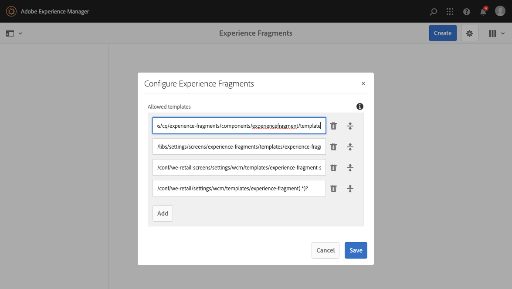
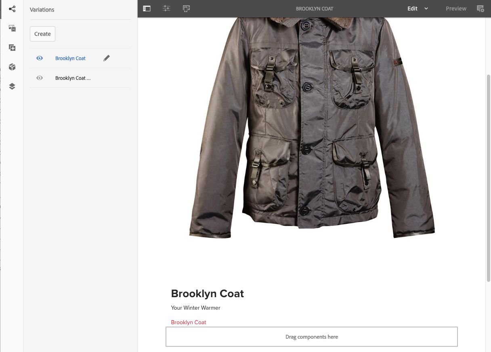

# 体验片段{#experience-fragments}

体验片段是由一个或多个组件构成的组件组，包括可在页面内引用的内容和布局。它们可包含任意组件。

体验片段：

* 体验的一部分（页面）。
* 可以跨多个页面使用。
* 基于模板（仅可编辑）来定义结构和组件。
* 由段落系统中的一个或多个的组件及布局构成。
* 可以包含其他体验片段。
* 可以与其他组件（包括其他体验片段）结合使用来构成完整的页面（体验）。
* 可以具有不同的变体，可共享内容和/或组件。
* 可以划分为可在片段的多个变体中使用的构建基块。

您可以使用体验片段：

* 如果作者希望重复使用页面的某些部分（某个体验片段），则需要复制并粘贴该片段。创建并维护这些复制/粘贴体验非常费时，而且容易导致用户错误。体验片段无需复制/粘贴。
* 支持无头 CMS 用例。作者希望仅将 AEM 用于创作，而不是用于提供给客户。第三方系统/触点会使用该体验，然后将其提供给最终用户。

>[!NOTE]
>
>对体验片段的写访问权限要求在组中注册用户帐户：
>
>    `experience-fragments-editors`
如果您遇到任何问题，请联系您的系统管理员。

## 应在何时使用体验片段？  {#when-should-you-use-experience-fragments}

体验片段应在以下时候使用：

* 当您需要重复使用体验时。

   * 将重复使用内容相同或相似的体验

* 当您使用 AEM 作为第三方的内容交付平台时。

   * 任何需要使用 AEM 作为内容交付平台的解决方案
   * 将内容嵌入第三方触点

* 当您有一个具有不同变体或呈现版本的体验时。

   * 特定于渠道或上下文的变体
   * 一些对组织有意义的体验（例如，在各渠道间具有不同体验的营销活动）

* 当您使用全渠道商业时。

   * 在[社交媒体](/help/sites-developing/experience-fragments.md#social-variations)渠道中大规模共享商业相关内容
   * 使触点具有事务性

## 组织您的体验片段 {#organizing-your-experience-fragments}

建议执行以下操作：
* 使用文件夹组织您的体验片段；

* [在这些文件夹中配置允许的模板](#configure-allowed-templates-folder)。

创建文件夹允许您：

* 为您的体验片段创建有意义的结构；例如，根据分类

   >[!NOTE]
   无需将体验片段的结构与站点的页面结构保持一致。

* [在文件夹级别分配允许的模板](#configure-allowed-templates-folder)

   >[!NOTE]
   您可以使用[模板编辑器](/help/sites-authoring/templates.md)创建自己的模板。

WKND 项目可根据 `Contributors` 构建一些体验片段。使用的结构还说明了如何使用其他功能，如多站点管理（包括语言副本）。

请参阅：

`http://localhost:4502/aem/experience-fragments.html/content/experience-fragments/wknd/language-masters/en/contributors/kumar-selveraj/master`

## 为体验片段创建和配置文件夹 {#creating-and-configuring-a-folder-for-your-experience-fragments}

要为体验片段创建和配置文件夹，建议执行以下操作：

1. [创建文件夹](/help/sites-authoring/managing-pages.md#creating-a-new-folder)。

1. [为该文件夹配置允许的体验片段模板](#configure-allowed-templates-folder)。

>[!NOTE]
也可以[为实例配置允许的模板](#configure-allowed-templates-instance)，但&#x200B;**不**&#x200B;建议使用此方法，因为升级时会覆盖这些值。

### 为文件夹配置允许的模板 {#configure-allowed-templates-folder}

>[!NOTE]
这是指定&#x200B;**允许的模板**&#x200B;的推荐方法，因为升级时不会覆盖这些值。

1. 导航到所需的&#x200B;**体验片段**&#x200B;文件夹。

1. 选择文件夹，然后选择&#x200B;**属性**。

1. 在&#x200B;**允许的模板**&#x200B;字段中指定用于检索所需模板的正则表达式。

   例如：
   `/conf/(.*)/settings/wcm/templates/experience-fragment(.*)?`

   请参阅：
   `http://localhost:4502/mnt/overlay/cq/experience-fragments/content/experience-fragments/folderproperties.html/content/experience-fragments/wknd`

   

   >[!NOTE]
   请参阅[体验片段的模板](/help/sites-developing/experience-fragments.md#templates-for-experience-fragments)，以进一步了解详细信息。

1. 选择&#x200B;**保存并关闭**。

### 为实例配置允许的模板 {#configure-allowed-templates-instance}

>[!CAUTION]
不建议使用此方法更改&#x200B;**允许的模板**，因为指定的模板在升级时会被覆盖。
此对话框仅供参考之用。

1. 导航到所需的&#x200B;**体验片段**&#x200B;控制台。

1. 选择&#x200B;**配置选项**：

   

1. 在&#x200B;**配置体验片段**&#x200B;对话框中指定所需的模板：

   

   >[!NOTE]
   请参阅[体验片段的模板](/help/sites-developing/experience-fragments.md#templates-for-experience-fragments)，以进一步了解详细信息。

1. 选择&#x200B;**保存**。

## 创建体验片段 {#creating-an-experience-fragment}

要创建体验片段，请执行以下操作：

1. 从全局导航中选择体验片段。

   

1. 导览至所需的文件夹，然后选择&#x200B;**创建**。

   

1. 选择&#x200B;**体验片段**，以打开&#x200B;**创建体验片段**&#x200B;向导。

   选择所需的&#x200B;**模板**，然后选择&#x200B;**下一步**：

   

1. 输入&#x200B;**体验片段**&#x200B;的&#x200B;**属性**。

   **标题**&#x200B;是必填项。如果&#x200B;**名称**&#x200B;留空，将从&#x200B;**标题**&#x200B;派生名称。

   

1. 单击&#x200B;**创建**。

   将显示一条消息。选择：

   * **完成**，可返回至控制台

   * **打开**，可打开片段编辑器

## 编辑您的体验片段 {#editing-your-experience-fragment}

体验片段编辑器提供了与普通页面编辑器类似的功能。

>[!NOTE]
请参阅[编辑页面内容](/help/sites-authoring/editing-content.md)以了解有关如何使用页面编辑器的更多信息。

以下示例过程说明了如何为产品创建 Teaser：

1. 在[组件浏览器](/help/sites-authoring/author-environment-tools.md#components-browser)中拖放 **Teaser**。

   

1. 从组件工具栏中选择&#x200B;**[配置](/help/sites-authoring/editing-content.md#edit-configure-copy-cut-delete-paste)**。
1. 添加&#x200B;**资产**，并根据需要定义&#x200B;**属性**。
1. 使用&#x200B;**完成**（勾选图标）确认定义。
1. 根据需要添加更多组件。

## 创建体验片段变体 {#creating-an-experience-fragment-variation}

您可以根据自己的需要创建体验片段的变体：

1. 打开您要进行[编辑](/help/sites-authoring/experience-fragments.md#editing-your-experience-fragment)的片段。
1. 打开&#x200B;**变体**&#x200B;选项卡。

   

1. **创建**&#x200B;使您能够创建：

   * **变量**
   * **live-copy 形式的变体**。

1. 定义所需属性：

   * **模板**
   * **标题**
   * **名称**；如果留空，将从“标题”派生名称
   * **描述**
   * **变体标记**

   

1. 使用&#x200B;**完成**（勾选图标）确认，新的变体将显示在面板中：

   

## 使用您的体验片段 {#using-your-experience-fragment}

您现在可以在创作页面时使用您的经验片段：

1. 打开要编辑的任何页面。

   例如：[https://localhost:4502/editor.html/content/we-retail/language-masters/en/products/men.html](https://localhost:4502/editor.html/content/we-retail/language-masters/en/products/men.html)

1. 通过将组件从组件浏览器拖动到页面段落系统来创建“体验片段”组件的实例：

   

1. 向组件实例添加实际的体验片段；通过：

   * 将所需片段从资产浏览器拖放到该组件上
   * 从组件工具栏中选择&#x200B;**配置**，指定要使用的片段，然后使用&#x200B;**完成**（勾选图标）确认

   

   >[!NOTE]
   组件工具栏中的“编辑”将用作在片段编辑器中打开片段的快捷方式。

## 构建基块 {#building-blocks}

您可以选择一个或多个组件来创建用于在片段中回收的构建基块：

### 创建构建基块 {#creating-a-building-block}

要创建构建基块，请执行以下操作：

1. 在体验片段编辑器中，选择要重复使用的组件：

   

1. 从组件工具栏中选择&#x200B;**转换为构建基块**：

   

1. 输入&#x200B;**构建基块**&#x200B;的名称，然后使用&#x200B;**转换**&#x200B;进行确认：

   

1. **构建基块**&#x200B;将显示在选项卡中，并可在段落系统中进行选择：

   

#### 管理构建基块 {#managing-a-building-block}

您的构建基块会显示在&#x200B;**构建基块**&#x200B;选项卡中。对于每个基块，可执行以下操作：

* 转至母版：在新选项卡中打开母版变体
* 重命名
* 删除

#### 使用构建基块 {#using-a-building-block}

您可以将构建基块拖动到任何片段的段落系统，就像对任何组件一样。

## 您的体验片段的详细信息 {#details-of-your-experience-fragment}

可以查看片段的详细信息：

1. 详细信息将显示在&#x200B;**体验片段**&#x200B;控制台的所有视图中，其中&#x200B;**列表视图**&#x200B;包含[导出到 Target](/help/sites-administering/experience-fragments-target.md) 的详细信息：

   

1. 在您打开体验片段的&#x200B;**属性**&#x200B;时：

   

   这些属性位于各种选项卡中：

   >[!CAUTION]
   当您从体验片段控制台中打开&#x200B;**属性**&#x200B;时，会显示这些选项卡。
   如果在编辑体验片段时&#x200B;**打开属性**，则会显示相应的[页面属性](/help/sites-authoring/editing-page-properties.md)。

   

   * **基本**

      * **标题** - 必填项

      * **描述**
      * **标记**
      * **变体总数** - 仅供参考

      * **Web 变体的数量** - 仅供参考
      * **非 Web 变体的数量** - **仅供参考**

      * **使用此片段的页数** - 仅供参考
   * **云服务**

      * **云配置**
      * **云服务配置**
      * **Facebook 页面 ID**
      * **Pinterest 钉板**
   * **引用**

      * 引用列表.
   * **社交媒体状态**

      * 社交媒体变体的详细信息。

## 纯 HTML 呈现版本 {#the-plain-html-rendition}

使用 URL 中的 `.plain.` 选择器，您可以从浏览器中访问纯 HTML 呈现版本。

>[!NOTE]
虽然这可以直接从浏览器获得，[但主要目的是允许其他应用程序（例如，第三方 Web 应用程序、自定义移动实现）仅使用 URL 直接访问体验片段的内容](/help/sites-developing/experience-fragments.md#the-plain-html-rendition)。

## 导出体验片段  {#exporting-experience-fragments}

默认情况下，将以 HTML 格式提供体验片段。这可以由 AEM 和相似的第三方渠道使用。

要导出到 Adobe Target，还可以使用 JSON。请参阅 [Target 与体验片段集成](/help/sites-administering/experience-fragments-target.md)，以获取完整信息。
